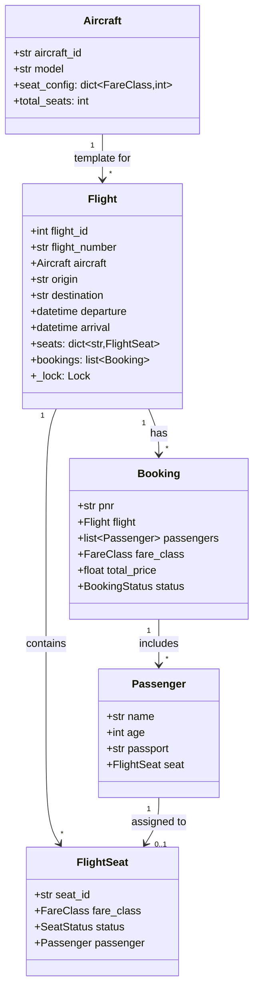

# ✈️ AIRLINE MANAGEMENT SYSTEM — Complete LLD Guide
## The Definitive 17-Section Edition — V2.0

---

## 📖 Table of Contents
1. [🎯 Problem Statement & Context](#-1-problem-statement--context)
2. [🗣️ Requirement Gathering](#-2-requirement-gathering)
3. [✅ Requirements (FR + NFR)](#-3-requirements)
4. [🧠 Key Insight: Aircraft vs Flight](#-4-key-insight)
5. [📐 Class Diagram & Entity Relationships](#-5-class-diagram)
6. [🔧 API Design (Public Interface)](#-6-api-design)
7. [🏗️ Complete Code Implementation](#-7-complete-code)
8. [📊 Data Structure Choices & Trade-offs](#-8-data-structure-choices)
9. [🔒 Concurrency & Thread Safety Deep Dive](#-9-concurrency-deep-dive)
10. [🧪 SOLID Principles Mapping](#-10-solid-principles)
11. [🎨 Design Patterns Used](#-11-design-patterns)
12. [💾 Database Schema (Production View)](#-12-database-schema)
13. [⚠️ Edge Cases & Error Handling](#-13-edge-cases)
14. [🎮 Full Working Demo](#-14-full-working-demo)
15. [🎤 Interviewer Follow-ups (15+)](#-15-interviewer-follow-ups)
16. [⏱️ Interview Strategy (45-min Plan)](#-16-interview-strategy)
17. [🧠 Quick Recall Cheat Sheet](#-17-quick-recall)

---

# 🎯 1. Problem Statement & Context

## What You're Designing

> Design an **Airline Management System** where passengers search flights by route, book tickets with PNR generation (supporting multiple passengers per booking), select seats by fare class, check in within a time window, and manage cancellations. Handle dynamic pricing as seats fill.

## Real-World Scale

| Metric | Indian Airlines |
|--------|----------------|
| Domestic flights/day | ~3,000 |
| Passengers/day | ~400,000 |
| Booking window | Up to 365 days in advance |
| Check-in window | 48h to 1h before departure |
| Fare classes | Economy, Premium Economy, Business, First |
| Aircraft per carrier | 100–300 |

## Why Interviewers Love This Problem

| What They Test | How This Tests It |
|---------------|-------------------|
| **Entity-Instance pattern** | Aircraft (template) vs Flight (instance) — same as Movie/Show |
| **PNR booking** | One booking = multiple passengers (group/family) |
| **Fare class pricing** | Different prices for same seat depending on class |
| **Dynamic pricing** | Price increases as seats fill — algorithmic thinking |
| **Check-in as state** | Time-windowed operation with seat assignment |
| **Cross-cutting** | Tests if you can recognize BookMyShow pattern in a different domain |

---

# 🗣️ 2. Requirement Gathering

## Must-Ask Questions

| # | Question | WHY You Ask | Design Impact |
|---|----------|-------------|---------------|
| 1 | "Is Aircraft the same as Flight?" | **THE most important distinction** | Aircraft = physical plane. Flight = scheduled trip |
| 2 | "One booking, multiple passengers?" | PNR design | Booking entity holds list of Passengers |
| 3 | "Fare classes?" | Pricing and seat segmentation | Economy/Business/First with different counts |
| 4 | "When can users check in?" | Time-windowed state transition | 48h to 1h before departure |
| 5 | "Seat selection at booking or check-in?" | Determines when seats are assigned | At booking (with auto-assign option) |
| 6 | "Connecting flights?" | Scope control | Mention as extension — single flight for core |
| 7 | "Dynamic pricing?" | Algorithmic challenge | Price multiplier based on fill rate |
| 8 | "Cancellation policy?" | Refund logic | Tiered by hours before departure |
| 9 | "Overbooking?" | Real airlines do this! | Mention as extension |
| 10 | "Baggage?" | Scope | Extension — per-class included weight |

### 🎯 The question that shows depth

> "Does the same physical aircraft fly multiple routes in a day? How do we model that?"

**Answer:** YES. Boeing 737 VT-ABC might fly DEL→BOM at 8AM, then BOM→BLR at 2PM. Each is a separate Flight entity sharing the same Aircraft template.

---

# ✅ 3. Requirements

## Functional Requirements

| Priority | ID | Requirement |
|----------|-----|-------------|
| **P0** | FR-1 | Add aircraft with seat configuration per class |
| **P0** | FR-2 | Create flights (aircraft + route + time + pricing) |
| **P0** | FR-3 | Search flights by route and date |
| **P0** | FR-4 | **Book with PNR (1+ passengers, fare class)** |
| **P0** | FR-5 | Seat assignment (auto or manual selection) |
| **P0** | FR-6 | **Check-in (48h – 1h window)** |
| **P1** | FR-7 | Dynamic pricing by fill rate |
| **P1** | FR-8 | Cancellation with tiered refund |
| **P2** | FR-9 | Boarding pass generation |

## Non-Functional Requirements

| ID | Requirement | Why |
|----|-------------|-----|
| NFR-1 | Thread safety on booking | Two users can't book the last seat |
| NFR-2 | Per-flight locking | Booking on Flight A shouldn't block Flight B |
| NFR-3 | PNR uniqueness | 6-char alphanumeric, globally unique |
| NFR-4 | Audit trail | Every booking and cancellation logged |

---

# 🧠 4. Key Insight: Aircraft ≠ Flight (The Entity-Instance Pattern AGAIN)

## 🤔 THINK: You have 5 Boeing 737s. Each flies 4 routes/day. How many "flights"? How many "aircraft"?

<details>
<summary>👀 Click to reveal — Pattern recognition is what they're testing</summary>

```
Aircraft: Boeing 737 VT-ABC (1 physical plane)
├── Flight AI-301: DEL → BOM, 8:00 AM  (150 economy seats — fresh for this flight)
├── Flight AI-302: BOM → BLR, 2:00 PM  (150 economy seats — independent!)
└── Flight AI-303: BLR → DEL, 8:00 PM  (150 economy seats — independent!)

Same plane, 3 different flights, 3 independent seat maps!
```

### The Cross-Problem Pattern

| Problem | Template Entity | Instance Entity | Status Lives On |
|---------|----------------|-----------------|-----------------|
| **Airline** | Aircraft (seat config) | Flight → FlightSeat | FlightSeat |
| **BookMyShow** | Screen (seat layout) | Show → ShowSeat | ShowSeat |
| **Library** | Book (metadata) | BookCopy | BookCopy |
| **Car Rental** | Vehicle Type | Vehicle + Reservation | Reservation |

**If you can explain this pattern, the interviewer knows you understand LLD deeply.**

### Why NOT put status on Aircraft?

```python
# ❌ WRONG: Status on Aircraft
class Aircraft:
    seat_A1_status = "BOOKED"  # For WHICH flight?!

# ✅ CORRECT: Status on FlightSeat
class FlightSeat:
    flight = "AI-301"        # Specific flight
    seat_id = "12A"          # Specific seat
    status = "AVAILABLE"     # Status FOR this flight
```

</details>

---

# 📐 5. Class Diagram & Entity Relationships

## Mermaid Class Diagram



## Entity Relationship Summary

```
Aircraft ──template──→ Flight ──contains──→ FlightSeat (AVAILABLE/BOOKED/CHECKED_IN)
                          │
                          └── bookings ──→ Booking (PNR) ──→ Passenger[] ──→ FlightSeat
```

---

# 🔧 6. API Design (Public Interface)

```python
class AirlineSystem:
    """Public API for the airline system."""
    
    # ── Fleet Management ──
    def add_aircraft(self, aircraft_id: str, model: str,
                     seat_config: dict) -> Aircraft: ...
    
    def create_flight(self, flight_number: str, aircraft_id: str,
                      origin: str, dest: str, departure: datetime,
                      arrival: datetime, prices: dict) -> Flight: ...
    
    # ── Search ──
    def search_flights(self, origin: str, dest: str,
                       travel_date: date = None) -> list[Flight]: ...
    
    # ── Booking ──
    def book(self, flight_id: int, 
             passengers: list[dict],  # [{"name": "Alice", "age": 30}]
             fare_class: FareClass) -> Booking:
        """
        Books seats for 1+ passengers. Generates PNR.
        ATOMIC: all passengers booked or none.
        Returns Booking with PNR.
        """
    
    # ── Check-in ──
    def check_in(self, pnr: str, passenger_name: str,
                 preferred_seat: str = None) -> bool:
        """
        Check in a passenger (48h – 1h before departure).
        Assign/change seat.
        """
    
    # ── Cancellation ──
    def cancel(self, pnr: str) -> float:
        """Cancel booking. Returns refund amount."""
```

---

# 🏗️ 7. Complete Code Implementation

## Enums

```python
from enum import Enum
from datetime import datetime, date, timedelta
import threading
import random
import string
import hashlib

class FareClass(Enum):
    ECONOMY = 1
    BUSINESS = 2
    FIRST = 3

class SeatStatus(Enum):
    AVAILABLE = 1
    BOOKED = 2
    CHECKED_IN = 3
    BLOCKED = 4

class BookingStatus(Enum):
    CONFIRMED = 1
    CHECKED_IN = 2
    CANCELLED = 3
    COMPLETED = 4
```

## Core Entities

### Aircraft — Template (NO status)

```python
class Aircraft:
    def __init__(self, aircraft_id: str, model: str,
                 seat_config: dict[FareClass, int]):
        self.aircraft_id = aircraft_id   # "VT-ABC"
        self.model = model               # "Boeing 737"
        self.seat_config = seat_config   # {ECONOMY: 150, BUSINESS: 20, FIRST: 6}
    
    @property
    def total_seats(self):
        return sum(self.seat_config.values())
    
    def __str__(self):
        return f"✈️ {self.model} [{self.aircraft_id}] ({self.total_seats} seats)"
```

### FlightSeat — Where Status Lives

```python
class FlightSeat:
    def __init__(self, seat_id: str, fare_class: FareClass):
        self.seat_id = seat_id
        self.fare_class = fare_class
        self.status = SeatStatus.AVAILABLE
        self.passenger: 'Passenger' = None
    
    def __str__(self):
        icons = {SeatStatus.AVAILABLE: "⬜", SeatStatus.BOOKED: "🟦",
                 SeatStatus.CHECKED_IN: "🟩", SeatStatus.BLOCKED: "🟥"}
        return f"{icons.get(self.status, '⬛')} {self.seat_id}"
```

### Flight — Instance with Own Seat Map

```python
class Flight:
    _counter = 0
    
    def __init__(self, flight_number: str, aircraft: Aircraft,
                 origin: str, destination: str,
                 departure: datetime, arrival: datetime,
                 base_prices: dict[FareClass, float]):
        Flight._counter += 1
        self.flight_id = Flight._counter
        self.flight_number = flight_number
        self.aircraft = aircraft
        self.origin = origin.upper()
        self.destination = destination.upper()
        self.departure = departure
        self.arrival = arrival
        self.base_prices = base_prices
        self.seats: dict[str, FlightSeat] = {}
        self.bookings: list['Booking'] = []
        self._lock = threading.Lock()
        self._initialize_seats()
    
    def _initialize_seats(self):
        """Create FlightSeat objects from aircraft config."""
        row = 1
        for fare_class, count in self.aircraft.seat_config.items():
            for i in range(count):
                col = chr(65 + (i % 6))  # A–F
                seat_id = f"{row}{col}"
                self.seats[seat_id] = FlightSeat(seat_id, fare_class)
                if (i + 1) % 6 == 0:
                    row += 1
            row += 1  # Gap between classes
    
    def available_seats(self, fare_class: FareClass = None) -> list[FlightSeat]:
        seats = [s for s in self.seats.values() if s.status == SeatStatus.AVAILABLE]
        if fare_class:
            seats = [s for s in seats if s.fare_class == fare_class]
        return seats
    
    @property
    def duration(self) -> str:
        delta = self.arrival - self.departure
        h, rem = divmod(int(delta.total_seconds()), 3600)
        m = rem // 60
        return f"{h}h {m}m"
    
    def fill_rate(self, fare_class: FareClass) -> float:
        total = len([s for s in self.seats.values() if s.fare_class == fare_class])
        booked = len([s for s in self.seats.values()
                      if s.fare_class == fare_class and s.status != SeatStatus.AVAILABLE])
        return (booked / total * 100) if total > 0 else 0
    
    def __str__(self):
        avail = len(self.available_seats())
        return (f"✈️ {self.flight_number}: {self.origin} → {self.destination} | "
                f"{self.departure.strftime('%b %d %H:%M')} → {self.arrival.strftime('%H:%M')} "
                f"({self.duration}) | {avail}/{self.aircraft.total_seats} avail")
```

### Passenger & Booking (PNR)

```python
class Passenger:
    def __init__(self, name: str, age: int, passport: str = ""):
        self.name = name
        self.age = age
        self.passport = passport
        self.seat: FlightSeat = None
    
    def __str__(self):
        seat_info = f"Seat {self.seat.seat_id}" if self.seat else "No seat"
        return f"👤 {self.name} ({seat_info})"


class Booking:
    def __init__(self, flight: Flight, passengers: list[Passenger],
                 fare_class: FareClass, total_price: float):
        self.pnr = self._generate_pnr()
        self.flight = flight
        self.passengers = passengers
        self.fare_class = fare_class
        self.total_price = total_price
        self.status = BookingStatus.CONFIRMED
        self.booked_at = datetime.now()
    
    @staticmethod
    def _generate_pnr() -> str:
        return ''.join(random.choices(string.ascii_uppercase + string.digits, k=6))
    
    def __str__(self):
        names = ", ".join(p.name for p in self.passengers)
        return (f"🎫 PNR: {self.pnr} | {self.flight.flight_number} | "
                f"{names} | {self.fare_class.name} | ₹{self.total_price:,.0f}")
```

---

# 📊 8. Data Structure Choices & Trade-offs

| Data Structure | Where | Why | Alternative | Why Not |
|---------------|-------|-----|-------------|---------|
| `dict[str, FlightSeat]` | Flight.seats | O(1) seat lookup by ID ("12A") | `list[FlightSeat]` | O(n) scan for seat selection |
| `dict[FareClass, int]` | Aircraft.seat_config | Clean mapping of class → count | Separate attributes | Not extensible for new classes |
| `list[Passenger]` | Booking.passengers | One PNR = ordered list of travelers | `set` | Need display order, may have duplicate names |
| `threading.Lock` | Per-flight lock | Two users booking last seat on same flight | Global lock | Per-flight = higher concurrency |
| `random + string` | PNR generation | Simple 6-char unique ID | UUID | PNR must be human-readable (6 chars) |
| `dict[FareClass, float]` | base_prices | Price per class per flight | Single price | Different classes = different prices |

---

# 🔒 9. Concurrency & Thread Safety Deep Dive

## The Race Condition

```
Timeline: Flight AI-302 has 1 Economy seat left
t=0: User A → available_seats(ECONOMY) = [12A]
t=1: User B → available_seats(ECONOMY) = [12A]  (still shows available!)
t=2: User A → book() → assigns 12A → BOOKED ✅
t=3: User B → book() → tries 12A → ALSO assigns! 💀

Fix: per-flight Lock around the check-and-assign
```

## Per-Flight Lock — NOT Global

```python
def book(self, flight_id, passengers, fare_class):
    flight = self.flights[flight_id]
    
    with flight._lock:  # Only this flight is locked!
        # Users booking AI-302 are serialized
        # Users booking AI-305 are NOT affected
        available = flight.available_seats(fare_class)
        if len(available) < len(passengers):
            return None  # Not enough seats
        
        # Assign seats atomically
        for i, p in enumerate(passengers):
            seat = available[i]
            seat.status = SeatStatus.BOOKED
            seat.passenger = p
            p.seat = seat
```

---

# 🧪 10. SOLID Principles Mapping

| Principle | How Applied |
|-----------|-------------|
| **S — Single Responsibility** | `Aircraft` = template. `Flight` = instance + seat map. `Booking` = reservation. `Passenger` = traveler data. |
| **O — Open/Closed** | New fare class (Premium Economy) = add enum value + pricing. Zero code changes. |
| **L — Liskov Substitution** | Any FareClass works in `book()` — no special cases per class. |
| **I — Interface Segregation** | `AirlineSystem` API is focused: search, book, check_in, cancel. |
| **D — Dependency Inversion** | System depends on abstractions (FareClass enum), not specifics. |

---

# 🎨 11. Design Patterns Used

| Pattern | Where | Why |
|---------|-------|-----|
| **Entity-Instance** ⭐ | Aircraft → Flight | Same plane, different flights with independent seats |
| **Singleton** | AirlineSystem | One system instance |
| **Factory** | Flight._initialize_seats() | Creates FlightSeats from aircraft config |
| **Strategy** | (Extension) PricingStrategy | Different pricing algorithms |
| **Observer** | (Extension) Notifications | Email on booking/check-in/cancellation |

### Cross-Problem Pattern Recognition

| Pattern Used | Airline | BookMyShow | Library |
|-------------|---------|-----------|---------|
| Entity-Instance | Aircraft→Flight | Movie→Show | Book→BookCopy |
| Per-instance Lock | Per-flight | Per-show | Per-library |
| Status on instance | FlightSeat | ShowSeat | BookCopy |
| Group booking | PNR (multiple passengers) | Single user | Single user |

---

# 💾 12. Database Schema (Production View)

```sql
CREATE TABLE aircraft (
    aircraft_id     VARCHAR(10) PRIMARY KEY,
    model           VARCHAR(50) NOT NULL,
    economy_seats   INTEGER,
    business_seats  INTEGER,
    first_seats     INTEGER
);

CREATE TABLE flights (
    flight_id       SERIAL PRIMARY KEY,
    flight_number   VARCHAR(10) NOT NULL,
    aircraft_id     VARCHAR(10) REFERENCES aircraft(aircraft_id),
    origin          CHAR(3) NOT NULL,         -- IATA code: DEL, BOM
    destination     CHAR(3) NOT NULL,
    departure       TIMESTAMP NOT NULL,
    arrival         TIMESTAMP NOT NULL,
    INDEX idx_route_date (origin, destination, departure)
);

CREATE TABLE flight_seats (
    id              SERIAL PRIMARY KEY,
    flight_id       INTEGER REFERENCES flights(flight_id),
    seat_id         VARCHAR(5) NOT NULL,
    fare_class      VARCHAR(20) NOT NULL,
    status          VARCHAR(20) DEFAULT 'AVAILABLE',
    passenger_id    INTEGER NULL,
    booking_pnr     VARCHAR(6) NULL,
    UNIQUE (flight_id, seat_id)
);

CREATE TABLE bookings (
    pnr             VARCHAR(6) PRIMARY KEY,
    flight_id       INTEGER REFERENCES flights(flight_id),
    fare_class      VARCHAR(20) NOT NULL,
    total_price     DECIMAL(10,2),
    status          VARCHAR(20) DEFAULT 'CONFIRMED',
    booked_at       TIMESTAMP DEFAULT NOW()
);

CREATE TABLE passengers (
    passenger_id    SERIAL PRIMARY KEY,
    pnr             VARCHAR(6) REFERENCES bookings(pnr),
    name            VARCHAR(100) NOT NULL,
    age             INTEGER,
    passport        VARCHAR(20),
    seat_id         VARCHAR(5)
);
```

### Key Queries

```sql
-- Search flights by route and date
SELECT * FROM flights 
WHERE origin = 'DEL' AND destination = 'BOM' 
AND DATE(departure) = '2024-06-15'
ORDER BY departure;

-- Atomic seat booking (PostgreSQL)
BEGIN;
SELECT * FROM flight_seats 
WHERE flight_id = 42 AND fare_class = 'ECONOMY' AND status = 'AVAILABLE'
LIMIT 3 FOR UPDATE;
-- Update status to BOOKED...
COMMIT;
```

---

# ⚠️ 13. Edge Cases & Error Handling

| # | Edge Case | Fix |
|---|-----------|-----|
| 1 | Book more passengers than available seats | Check count before assigning |
| 2 | Check-in too early (> 48h) | Validate time window |
| 3 | Check-in too late (< 1h) | Validate time window |
| 4 | Cancel already cancelled booking | Check status before cancelling |
| 5 | Book flight in the past | `departure > datetime.now()` |
| 6 | Duplicate PNR generation | While loop: regenerate if exists |
| 7 | Infant passenger (< 2 years) | No seat needed, add to parent's record |
| 8 | Seat already taken at check-in | Auto-assign different seat |
| 9 | Overbooking | If more bookings than seats → voluntary bump + compensation |
| 10 | Flight cancellation by airline | Notify all passengers, auto-rebook or refund |

---

# 🎮 14. Full Working Demo

```python
class AirlineSystem:
    _instance = None
    
    def __new__(cls):
        if cls._instance is None:
            cls._instance = super().__new__(cls)
            cls._instance._initialized = False
        return cls._instance
    
    def __init__(self):
        if self._initialized: return
        self._initialized = True
        self.aircraft: dict[str, Aircraft] = {}
        self.flights: dict[int, Flight] = {}
        self.bookings: dict[str, Booking] = {}
    
    def add_aircraft(self, aircraft_id, model, config):
        ac = Aircraft(aircraft_id, model, config)
        self.aircraft[aircraft_id] = ac
        return ac
    
    def create_flight(self, flight_number, aircraft_id, origin, dest,
                      departure, arrival, prices):
        ac = self.aircraft[aircraft_id]
        flight = Flight(flight_number, ac, origin, dest, departure, arrival, prices)
        self.flights[flight.flight_id] = flight
        print(f"   ✅ Created: {flight}")
        return flight
    
    def search_flights(self, origin, dest, travel_date=None):
        results = [f for f in self.flights.values()
                   if f.origin == origin.upper() and f.destination == dest.upper()]
        if travel_date:
            results = [f for f in results if f.departure.date() == travel_date]
        return sorted(results, key=lambda f: f.departure)
    
    def _get_price(self, flight, fare_class):
        """Dynamic pricing: multiplier based on fill rate."""
        base = flight.base_prices[fare_class]
        fill = flight.fill_rate(fare_class)
        if fill >= 90: return round(base * 2.5, 2)
        elif fill >= 70: return round(base * 1.8, 2)
        elif fill >= 50: return round(base * 1.3, 2)
        return base
    
    def book(self, flight_id, passenger_data, fare_class):
        flight = self.flights.get(flight_id)
        if not flight:
            print("   ❌ Flight not found!"); return None
        
        with flight._lock:
            available = flight.available_seats(fare_class)
            if len(available) < len(passenger_data):
                print(f"   ❌ Only {len(available)} {fare_class.name} seats left!")
                return None
            
            passengers = [Passenger(d["name"], d["age"], d.get("passport", ""))
                         for d in passenger_data]
            
            unit_price = self._get_price(flight, fare_class)
            total = round(unit_price * len(passengers), 2)
            
            booking = Booking(flight, passengers, fare_class, total)
            
            for i, p in enumerate(passengers):
                seat = available[i]
                seat.status = SeatStatus.BOOKED
                seat.passenger = p
                p.seat = seat
            
            self.bookings[booking.pnr] = booking
            flight.bookings.append(booking)
            
            print(f"   ✅ Booked! {booking}")
            for p in passengers:
                print(f"      {p}")
            return booking
    
    def check_in(self, pnr, passenger_name, preferred_seat=None):
        booking = self.bookings.get(pnr)
        if not booking or booking.status == BookingStatus.CANCELLED:
            print("   ❌ Invalid PNR!"); return False
        
        flight = booking.flight
        hours = (flight.departure - datetime.now()).total_seconds() / 3600
        
        if hours > 48:
            print("   ❌ Check-in opens 48h before departure!"); return False
        if hours < 1:
            print("   ❌ Check-in closed (1h before departure)!"); return False
        
        passenger = next((p for p in booking.passengers if p.name == passenger_name), None)
        if not passenger:
            print(f"   ❌ {passenger_name} not found!"); return False
        
        with flight._lock:
            if preferred_seat and preferred_seat in flight.seats:
                seat = flight.seats[preferred_seat]
                if seat.status == SeatStatus.AVAILABLE and seat.fare_class == booking.fare_class:
                    # Release old seat, assign new
                    if passenger.seat:
                        passenger.seat.status = SeatStatus.AVAILABLE
                        passenger.seat.passenger = None
                    seat.status = SeatStatus.CHECKED_IN
                    seat.passenger = passenger
                    passenger.seat = seat
                else:
                    print(f"   ⚠️ Preferred seat unavailable, keeping {passenger.seat.seat_id}")
            
            if passenger.seat:
                passenger.seat.status = SeatStatus.CHECKED_IN
        
        all_checked = all(p.seat and p.seat.status == SeatStatus.CHECKED_IN
                         for p in booking.passengers)
        if all_checked:
            booking.status = BookingStatus.CHECKED_IN
        
        print(f"   ✅ {passenger_name} checked in — Seat {passenger.seat.seat_id}")
        return True
    
    def cancel(self, pnr):
        booking = self.bookings.get(pnr)
        if not booking or booking.status not in (BookingStatus.CONFIRMED, BookingStatus.CHECKED_IN):
            print("   ❌ Cannot cancel!"); return 0
        
        hours = (booking.flight.departure - datetime.now()).total_seconds() / 3600
        if hours > 48: pct = 0.9
        elif hours > 24: pct = 0.5
        elif hours > 4: pct = 0.25
        else: pct = 0
        
        refund = round(booking.total_price * pct, 2)
        
        with booking.flight._lock:
            for p in booking.passengers:
                if p.seat:
                    p.seat.status = SeatStatus.AVAILABLE
                    p.seat.passenger = None
                    p.seat = None
        
        booking.status = BookingStatus.CANCELLED
        print(f"   🔄 PNR {pnr} cancelled. Refund: ₹{refund:,.0f} ({pct*100:.0f}%)")
        return refund


# ═══════ DEMO ═══════

if __name__ == "__main__":
    print("=" * 65)
    print("     AIRLINE SYSTEM — COMPLETE DEMO")
    print("=" * 65)
    
    airline = AirlineSystem()
    
    # Setup
    ac = airline.add_aircraft("VT-ABC", "Boeing 737", {
        FareClass.FIRST: 6, FareClass.BUSINESS: 18, FareClass.ECONOMY: 126
    })
    
    print("\n─── Create Flight ───")
    f1 = airline.create_flight(
        "AI-302", "VT-ABC", "Delhi", "Mumbai",
        datetime(2024, 6, 15, 8, 0), datetime(2024, 6, 15, 10, 15),
        {FareClass.ECONOMY: 3500, FareClass.BUSINESS: 12000, FareClass.FIRST: 25000}
    )
    
    print("\n─── Search ───")
    results = airline.search_flights("Delhi", "Mumbai")
    for r in results:
        print(f"   {r}")
    
    print("\n─── Book Family (3 Economy) ───")
    b1 = airline.book(f1.flight_id, [
        {"name": "Alice Patel", "age": 35, "passport": "A123"},
        {"name": "Bob Patel", "age": 37, "passport": "B456"},
        {"name": "Charlie Patel", "age": 8, "passport": "C789"},
    ], FareClass.ECONOMY)
    
    print("\n─── Book Business ───")
    b2 = airline.book(f1.flight_id, [
        {"name": "Diana CEO", "age": 45, "passport": "D111"}
    ], FareClass.BUSINESS)
    
    print(f"\n─── Flight Status ───")
    for fc in FareClass:
        avail = len(f1.available_seats(fc))
        total = len([s for s in f1.seats.values() if s.fare_class == fc])
        fill = f1.fill_rate(fc)
        price = airline._get_price(f1, fc)
        print(f"   {fc.name}: {avail}/{total} avail | {fill:.0f}% filled | ₹{price:,.0f}/person")
    
    print("\n─── Cancel Family Booking ───")
    airline.cancel(b1.pnr)
    
    print("\n" + "=" * 65)
    print("     ALL TESTS COMPLETE! ✅")
    print("=" * 65)
```

---

# 🎤 15. Interviewer Follow-ups (15+)

| Q | Question | Key Answer |
|---|----------|-----------|
| 1 | "Aircraft vs Flight — why separate?" | Same plane flies multiple routes. Status is per-flight, not per-plane |
| 2 | "PNR design?" | Random 6-char alphanumeric. One PNR = N passengers |
| 3 | "Dynamic pricing formula?" | Multiplier based on fill rate: 50%→1.3×, 70%→1.8×, 90%→2.5× |
| 4 | "Connecting flights?" | ConnectingBooking links two flights + min layover validation |
| 5 | "Overbooking?" | Book > capacity, handle with voluntary bump + compensation |
| 6 | "Check-in window?" | Opens 48h, closes 1h before departure |
| 7 | "Seat upgrade?" | Change fare class at check-in, pay difference |
| 8 | "Flight delay?" | Status update, notify passengers, auto-rebook |
| 9 | "Frequent flyer?" | Points per mile, tier-based benefits (Strategy pattern) |
| 10 | "Crew assignment?" | Crew entity, min requirements per flight |
| 11 | "Baggage?" | Per-class included weight, excess charged per kg |
| 12 | "Why per-flight lock?" | Users on different flights shouldn't block each other |
| 13 | "Compare with BookMyShow?" | Same Entity-Instance pattern. BMS = Show→ShowSeat. Airline = Flight→FlightSeat |
| 14 | "Boarding pass?" | Generated after check-in: gate, seat, barcode, departure |
| 15 | "How to handle infant?" | No seat, linked to parent passenger |
| 16 | "Waitlist?" | Queue per fare class; auto-book on cancellation |

---

# ⏱️ 16. Interview Strategy (45-min Plan)

| Time | Phase | What You Do |
|------|-------|-------------|
| **0–5** | Clarify | "Is Aircraft the same as Flight?" — THE key question |
| **5–8** | Key Insight | Draw Aircraft⟶Flight⟶FlightSeat. Mention BookMyShow parallel |
| **8–12** | Class Diagram | Aircraft, Flight, FlightSeat, Passenger, Booking |
| **12–15** | API | search, book (PNR), check_in (time window), cancel |
| **15–30** | Code | Flight._initialize_seats(), book() with lock, PNR generation |
| **30–38** | Extensions | Dynamic pricing, check-in window, overbooking mention |
| **38–45** | DB + Scale | SQL schema, SELECT FOR UPDATE, sharding by route |

## Golden Sentences

> **Opening:** "This is the Entity-Instance pattern — same as BookMyShow's Movie→Show. Here Aircraft is the template, Flight is the instance."

> **PNR:** "One PNR can have multiple passengers — think family booking. PNR is a 6-char alphanumeric that's human-readable, unlike UUIDs."

> **Check-in:** "This is a TIME-WINDOWED state transition. 48h to 1h before departure. Outside this window, the operation is rejected."

---

# 🧠 17. Quick Recall Cheat Sheet

## ⏱️ 30-Second Recall

> **Aircraft = template (seat config). Flight = instance (own seat map, own status).** PNR = 6-char booking for 1+ passengers. Book atomically with per-flight Lock. Dynamic pricing: base × multiplier (fill rate). Check-in: 48h–1h window.

## ⏱️ 2-Minute Recall

Add:
> **Entities:** Aircraft → Flight → FlightSeat → Passenger → Booking (PNR). Flight._initialize_seats() from aircraft config. Three fare classes with different counts and prices.
> **Concurrency:** Per-flight `threading.Lock`. Check available, then assign — inside lock.
> **Edge cases:** Overbooking, infant (no seat), check-in window, duplicate PNR.
> **Patterns:** Entity-Instance (core), Singleton (system), Factory (seat creation), Strategy (pricing extension).

## ⏱️ 5-Minute Recall

Add:
> **Cross-reference:** Aircraft→Flight = Movie→Show = Book→BookCopy. Status on instance, not template.
> **DB:** flights, flight_seats, bookings, passengers tables. `SELECT FOR UPDATE` for atomic booking.
> **Dynamic pricing:** fill >= 90% → 2.5×, >= 70% → 1.8×, >= 50% → 1.3×.
> **Cancel refund:** >48h = 90%, 24-48h = 50%, 4-24h = 25%, <4h = 0%.
> **SOLID:** OCP via new fare classes. SRP per entity.

---

## ✅ Pre-Implementation Checklist

- [ ] **FareClass**, SeatStatus, BookingStatus enums
- [ ] **Aircraft** (aircraft_id, model, seat_config per class)
- [ ] **FlightSeat** (seat_id, fare_class, status, passenger)
- [ ] **Flight** (number, aircraft, route, times, seats dict, per-flight Lock)
- [ ] **Flight._initialize_seats()** from aircraft config
- [ ] **Passenger** (name, age, passport, seat reference)
- [ ] **Booking** (PNR, flight, passengers[], fare_class, total, status)
- [ ] **PNR generation** — 6-char alphanumeric
- [ ] **search_flights()** — by route and date
- [ ] **book()** — per-flight lock, check availability, assign seats, PNR
- [ ] **check_in()** — 48h–1h window, seat assignment/change
- [ ] **cancel()** — tiered refund, release seats
- [ ] **Dynamic pricing** — multiplier based on fill rate
- [ ] **Demo:** create, search, family booking, business booking, cancel

---

*Version 2.0 — The Definitive 17-Section Edition*
