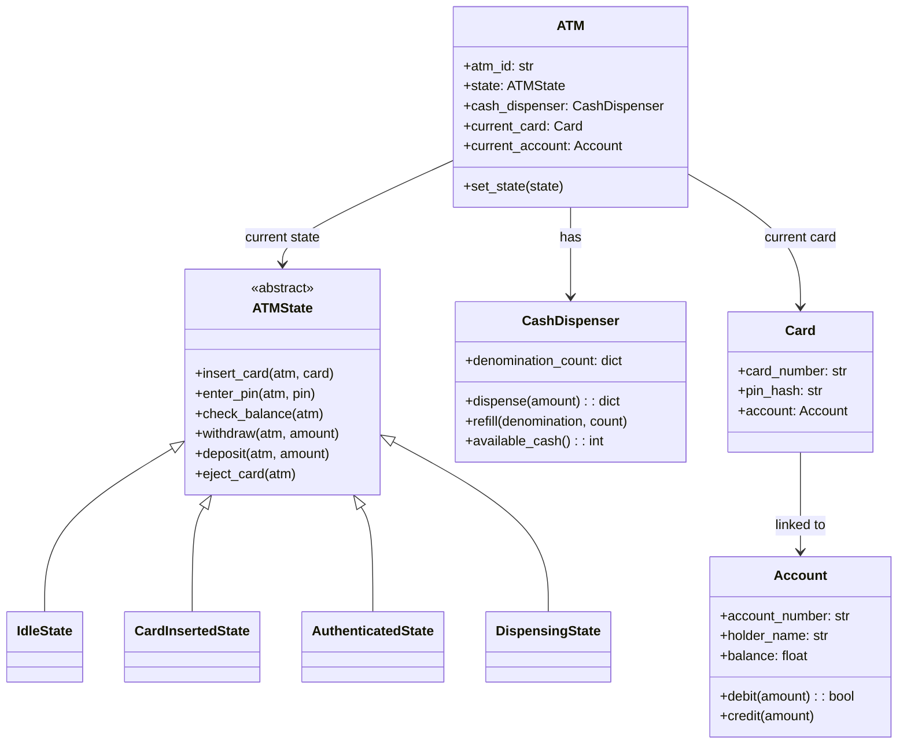

# 🏧 ATM — Complete LLD Guide
## The Definitive 17-Section Edition — V2.0

---

## 📖 Table of Contents
1. [🎯 Problem Statement & Context](#-1-problem-statement--context)
2. [🗣️ Requirement Gathering](#-2-requirement-gathering)
3. [✅ Requirements (FR + NFR)](#-3-requirements)
4. [🧠 Key Insight: State Pattern](#-4-key-insight)
5. [📐 Class Diagram & Entity Relationships](#-5-class-diagram)
6. [🔧 API Design (Public Interface)](#-6-api-design)
7. [🏗️ Complete Code Implementation](#-7-complete-code)
8. [📊 Data Structure Choices & Trade-offs](#-8-data-structure-choices)
9. [🔒 Concurrency & Thread Safety Deep Dive](#-9-concurrency-deep-dive)
10. [🧪 SOLID Principles Mapping](#-10-solid-principles)
11. [🎨 Design Patterns Used](#-11-design-patterns)
12. [💾 Database Schema (Production View)](#-12-database-schema)
13. [⚠️ Edge Cases & Error Handling](#-13-edge-cases)
14. [🎮 Full Working Demo](#-14-full-working-demo)
15. [🎤 Interviewer Follow-ups (15+)](#-15-interviewer-follow-ups)
16. [⏱️ Interview Strategy (45-min Plan)](#-16-interview-strategy)
17. [🧠 Quick Recall Cheat Sheet](#-17-quick-recall)

---

# 🎯 1. Problem Statement & Context

## What You're Designing

> Design an **ATM Machine** that allows card holders to authenticate, check balance, withdraw cash, deposit cash, and transfer money. Handle multi-denomination dispensing, concurrent access, and invalid operations at each state.

## Real-World Context

| Aspect | Real ATM |
|--------|----------|
| Transactions/day/ATM | ~150–200 |
| Denominations | ₹100, ₹200, ₹500, ₹2000 |
| Max withdrawal | ₹25,000/transaction, ₹1,00,000/day |
| Session timeout | 30 seconds inactivity |
| Hardware | Card reader, keypad, screen, cash dispenser, deposit slot |

## Why Interviewers Love This Problem

| What They're Testing | How This Problem Tests It |
|---------------------|--------------------------|
| **State Pattern** | Can you prevent "withdraw without inserting card"? |
| **State transitions** | Valid vs invalid operations at each state |
| **Cash dispensing** | Greedy algorithm for minimum notes |
| **Transaction atomicity** | Balance deducted but cash jammed — what now? |
| **Hardware abstraction** | Separate hardware interface from business logic |
| **Similar to Vending Machine** | Tests if you can recognize the same pattern |

---

# 🗣️ 2. Requirement Gathering

## Must-Ask Questions

| # | Question | WHY You Ask | Design Impact |
|---|----------|-------------|---------------|
| 1 | "What operations does the ATM support?" | Scope the state machine | Withdraw, Deposit, Balance, Transfer |
| 2 | "How does authentication work?" | State machine entry | Card insert → PIN entry → authenticated |
| 3 | "Can a user do multiple operations in one session?" | State transition after operation | Return to AUTHENTICATED after each op |
| 4 | "What denominations are available?" | Cash dispenser algorithm | Greedy: largest denomination first |
| 5 | "What if there aren't enough notes?" | Edge case: partial dispatch | Try to dispense, reject if impossible |
| 6 | "Daily withdrawal limit?" | Validation rule | Track per-card daily withdrawal |
| 7 | "What happens if cash gets jammed?" | Transaction rollback | Reverse balance deduction |
| 8 | "Multiple ATMs accessing same account?" | Concurrency | Bank-side locking, not ATM-side |

### 🎯 The BIG question that shows depth:

> "Is the ATM a **standalone** machine with its own accounts DB, or does it connect to a **bank server**?"

**Answer:** In an interview, treat the ATM as a self-contained system with in-memory accounts. Mention bank integration as a production consideration.

---

# ✅ 3. Requirements

## Functional Requirements

| Priority | ID | Requirement |
|----------|-----|-------------|
| **P0** | FR-1 | Insert card → authenticate via PIN |
| **P0** | FR-2 | Check balance |
| **P0** | FR-3 | **Withdraw cash** (multi-denomination dispensing) |
| **P0** | FR-4 | Eject card / end session |
| **P1** | FR-5 | Deposit cash |
| **P1** | FR-6 | Transfer to another account |
| **P2** | FR-7 | Transaction history |
| **P2** | FR-8 | Daily withdrawal limit |

## Non-Functional Requirements

| ID | Requirement | Why |
|----|-------------|-----|
| NFR-1 | **State validation** — reject invalid operations per state | Core correctness |
| NFR-2 | **Atomicity** — withdraw = debit + dispense must both succeed | Data integrity |
| NFR-3 | **Session timeout** — auto-eject after inactivity | Security |
| NFR-4 | **Audit trail** — log every operation | Compliance |

---

# 🧠 4. Key Insight: State Pattern — The ONLY Pattern That Matters Here

## 🤔 THINK: User hasn't inserted card yet. They press "Withdraw". What happens?

<details>
<summary>👀 Click to reveal — Why State Pattern is the STAR</summary>

**Without State Pattern:**
```python
# ❌ BAD: if-else spaghetti
def withdraw(self, amount):
    if self.state == "IDLE":
        print("Insert card first!")
    elif self.state == "CARD_INSERTED":
        print("Enter PIN first!")
    elif self.state == "AUTHENTICATED":
        # Actually process withdrawal
        ...
    elif self.state == "DISPENSING":
        print("Wait for current operation!")
```

Every method has the SAME if-else chain. Adding a new state = modify EVERY method. Violates OCP.

**With State Pattern:**
```python
# ✅ GOOD: Each state is a class that handles its own behavior
class IdleState(ATMState):
    def withdraw(self, atm, amount):
        print("❌ Insert card first!")   # Rejected!
    
    def insert_card(self, atm, card):
        atm.set_state(CardInsertedState())  # Valid transition

class AuthenticatedState(ATMState):
    def withdraw(self, atm, amount):
        # This is the ONLY state where withdrawal is valid
        if amount > atm.account.balance:
            print("❌ Insufficient balance!")
            return
        dispense_result = atm.cash_dispenser.dispense(amount)
        ...
```

**The beauty:** Each state class only knows about ITSELF. Adding a new state = add a new class. Zero changes to existing code!

### The State Machine

```
              insert_card()         enter_pin()
    IDLE ──────────────→ CARD_INSERTED ──────────────→ AUTHENTICATED
     ↑                       │                           │ │ │
     │                  eject_card()                      │ │ │
     │                       │              withdraw()   │ │ │
     │                       ↓              deposit()    │ │ │
     │                    (back to IDLE)     balance()    │ │ │
     │                                      transfer()   │ │ │
     │                                                   │ │ │
     │              ┌────────────────────────────────────┘ │ │
     │              │           DISPENSING                  │ │
     │              │        (cash comes out)               │ │
     │              └──→ back to AUTHENTICATED ←────────────┘ │
     │                                                        │
     └──── eject_card() / session_end ◄───────────────────────┘
```

### State × Operation Matrix (THE interview table)

| Operation | IDLE | CARD_INSERTED | AUTHENTICATED | DISPENSING |
|-----------|------|--------------|---------------|-----------|
| insert_card | ✅ → CARD_INSERTED | ❌ Card already in | ❌ | ❌ |
| enter_pin | ❌ | ✅ → AUTHENTICATED | ❌ Already auth'd | ❌ |
| check_balance | ❌ | ❌ | ✅ | ❌ |
| withdraw | ❌ | ❌ | ✅ → DISPENSING | ❌ |
| deposit | ❌ | ❌ | ✅ | ❌ |
| eject_card | ❌ | ✅ → IDLE | ✅ → IDLE | ❌ |

**Draw this table in the interview.** This is the clearest way to show you understand the state machine.

</details>

---

# 📐 5. Class Diagram & Entity Relationships

## Mermaid Class Diagram



## Entity Relationships

```
ATM ──has──→ CashDispenser (denominations + counts)
 │
 ├── current_state ──→ ATMState (ABC → 4 concrete states)
 │
 └── current_card ──→ Card ──→ Account (balance, transactions)
```

---

# 🔧 6. API Design (Public Interface)

```python
class ATM:
    """Public API — maps directly to ATM buttons."""
    
    def insert_card(self, card: Card) -> None:
        """User inserts card. Valid only in IDLE state."""
    
    def enter_pin(self, pin: str) -> bool:
        """Authenticate. Valid only in CARD_INSERTED state."""
    
    def check_balance(self) -> float:
        """Display balance. Valid only in AUTHENTICATED state."""
    
    def withdraw(self, amount: int) -> dict[int, int]:
        """
        Withdraw cash. Returns denomination breakdown.
        Valid only in AUTHENTICATED state.
        E.g., {500: 2, 100: 3} for ₹1300.
        """
    
    def deposit(self, amount: float) -> bool:
        """Deposit cash. Valid only in AUTHENTICATED state."""
    
    def eject_card(self) -> None:
        """End session. Valid in CARD_INSERTED or AUTHENTICATED."""
```

---

# 🏗️ 7. Complete Code Implementation

## Enums & Base Classes

```python
from abc import ABC, abstractmethod
from datetime import datetime
from enum import Enum
import threading
import hashlib

class TransactionType(Enum):
    WITHDRAWAL = 1
    DEPOSIT = 2
    BALANCE_CHECK = 3
    TRANSFER = 4
```

## Account & Card

```python
class Account:
    def __init__(self, account_number: str, holder_name: str, 
                 balance: float, pin: str):
        self.account_number = account_number
        self.holder_name = holder_name
        self.balance = balance
        self.pin_hash = hashlib.sha256(pin.encode()).hexdigest()
        self.transactions: list[dict] = []
        self._lock = threading.Lock()
    
    def verify_pin(self, pin: str) -> bool:
        return hashlib.sha256(pin.encode()).hexdigest() == self.pin_hash
    
    def debit(self, amount: float) -> bool:
        with self._lock:
            if self.balance >= amount:
                self.balance -= amount
                self._log(TransactionType.WITHDRAWAL, -amount)
                return True
            return False
    
    def credit(self, amount: float):
        with self._lock:
            self.balance += amount
            self._log(TransactionType.DEPOSIT, amount)
    
    def _log(self, txn_type, amount):
        self.transactions.append({
            "type": txn_type.name,
            "amount": amount,
            "balance_after": self.balance,
            "timestamp": datetime.now()
        })
    
    def __str__(self):
        return f"💳 {self.account_number} ({self.holder_name}) — ₹{self.balance:.0f}"


class Card:
    def __init__(self, card_number: str, account: Account):
        self.card_number = card_number
        self.account = account
    
    def __str__(self):
        return f"💳 ****{self.card_number[-4:]}"
```

## CashDispenser — Greedy Denomination Algorithm

```python
class CashDispenser:
    """
    Dispenses cash using greedy algorithm: largest denomination first.
    Tracks physical note counts per denomination.
    """
    def __init__(self):
        self.denominations: dict[int, int] = {
            2000: 10,
            500: 20,
            200: 20,
            100: 50,
        }
    
    def available_cash(self) -> int:
        return sum(denom * count for denom, count in self.denominations.items())
    
    def can_dispense(self, amount: int) -> bool:
        """Check if amount can be dispensed without modifying state."""
        if amount <= 0 or amount % 100 != 0:
            return False
        return self._calculate_breakdown(amount) is not None
    
    def dispense(self, amount: int) -> dict[int, int] | None:
        """
        Greedy: use largest denomination first.
        Returns {denomination: count} or None if impossible.
        """
        breakdown = self._calculate_breakdown(amount)
        if breakdown is None:
            return None
        
        # Deduct from inventory
        for denom, count in breakdown.items():
            self.denominations[denom] -= count
        
        return breakdown
    
    def _calculate_breakdown(self, amount: int) -> dict[int, int] | None:
        """
        Greedy algorithm: try to use fewest notes.
        
        Example: ₹3700
          2000 × 1 = 2000, remaining = 1700
          500 × 3  = 1500, remaining = 200
          200 × 1  = 200,  remaining = 0
          Result: {2000: 1, 500: 3, 200: 1} = 5 notes
        """
        remaining = amount
        breakdown = {}
        
        for denom in sorted(self.denominations.keys(), reverse=True):
            if remaining <= 0:
                break
            available = self.denominations[denom]
            needed = min(remaining // denom, available)
            if needed > 0:
                breakdown[denom] = needed
                remaining -= denom * needed
        
        if remaining > 0:
            return None  # Cannot dispense exact amount!
        
        return breakdown
    
    def refill(self, denomination: int, count: int):
        self.denominations[denomination] = self.denominations.get(denomination, 0) + count
    
    def display_inventory(self):
        print("\n   ┌──── CASH INVENTORY ────┐")
        for denom in sorted(self.denominations.keys(), reverse=True):
            count = self.denominations[denom]
            print(f"   │ ₹{denom:>5} × {count:>3} = ₹{denom * count:>8,} │")
        print(f"   │ {'Total':>14} = ₹{self.available_cash():>8,} │")
        print("   └─────────────────────────┘")
```

### 🤔 Why Greedy? When Does It Fail?

<details>
<summary>👀 Click to reveal</summary>

**Greedy works for standard denominations (100, 200, 500, 2000)** because they're designed so that greedy = optimal.

**Greedy FAILS for arbitrary denominations:**
```
Denominations: [1, 3, 4]
Amount: 6

Greedy: 4 + 1 + 1 = 3 coins
Optimal: 3 + 3   = 2 coins ← Greedy missed this!
```

**In an interview, say:** "Greedy works for standard currency. For arbitrary denominations, we'd need DP (coin change problem). But real ATMs use standard denominations, so greedy is correct and O(D) where D = number of denominations."

</details>

## ATM State Classes (The Core Pattern)

```python
class ATMState(ABC):
    """Base class for all ATM states."""
    
    def insert_card(self, atm: 'ATM', card: Card):
        print("   ❌ Invalid operation in current state!")
    
    def enter_pin(self, atm: 'ATM', pin: str) -> bool:
        print("   ❌ Invalid operation in current state!")
        return False
    
    def check_balance(self, atm: 'ATM'):
        print("   ❌ Invalid operation in current state!")
    
    def withdraw(self, atm: 'ATM', amount: int):
        print("   ❌ Invalid operation in current state!")
    
    def deposit(self, atm: 'ATM', amount: float):
        print("   ❌ Invalid operation in current state!")
    
    def eject_card(self, atm: 'ATM'):
        print("   ❌ Invalid operation in current state!")


class IdleState(ATMState):
    """Waiting for card insertion."""
    
    def insert_card(self, atm, card):
        atm.current_card = card
        atm.current_account = card.account
        print(f"   ✅ Card {card} inserted. Please enter your PIN.")
        atm.set_state(CardInsertedState())
    
    # All other operations → default "Invalid operation"


class CardInsertedState(ATMState):
    """Card is in, waiting for PIN."""
    MAX_ATTEMPTS = 3
    
    def __init__(self):
        self.attempts = 0
    
    def enter_pin(self, atm, pin):
        self.attempts += 1
        
        if atm.current_account.verify_pin(pin):
            print(f"   ✅ PIN verified. Welcome, {atm.current_account.holder_name}!")
            atm.set_state(AuthenticatedState())
            return True
        
        remaining = self.MAX_ATTEMPTS - self.attempts
        if remaining > 0:
            print(f"   ❌ Wrong PIN! {remaining} attempts remaining.")
        else:
            print("   🚫 Card blocked! Too many wrong attempts.")
            atm.eject_card()
        return False
    
    def eject_card(self, atm):
        print(f"   ⏏️ Card ejected.")
        atm.current_card = None
        atm.current_account = None
        atm.set_state(IdleState())


class AuthenticatedState(ATMState):
    """User is verified — can perform transactions."""
    
    def check_balance(self, atm):
        balance = atm.current_account.balance
        print(f"   💰 Balance: ₹{balance:,.0f}")
    
    def withdraw(self, atm, amount):
        account = atm.current_account
        
        # Validation chain
        if amount <= 0 or amount % 100 != 0:
            print("   ❌ Amount must be positive and multiple of ₹100!")
            return
        
        if amount > account.balance:
            print(f"   ❌ Insufficient balance! Available: ₹{account.balance:,.0f}")
            return
        
        if not atm.cash_dispenser.can_dispense(amount):
            print("   ❌ ATM cannot dispense this amount (insufficient notes)!")
            return
        
        # ── ATOMIC TRANSACTION START ──
        atm.set_state(DispensingState())
        
        # Step 1: Debit account
        if not account.debit(amount):
            print("   ❌ Debit failed!")
            atm.set_state(AuthenticatedState())
            return
        
        # Step 2: Dispense cash
        breakdown = atm.cash_dispenser.dispense(amount)
        if breakdown is None:
            # ROLLBACK: Cash dispense failed, credit back!
            account.credit(amount)
            print("   ❌ Cash dispense failed! Amount refunded.")
            atm.set_state(AuthenticatedState())
            return
        
        # Success!
        print(f"   💵 Dispensing ₹{amount:,}:")
        for denom in sorted(breakdown.keys(), reverse=True):
            print(f"      ₹{denom} × {breakdown[denom]}")
        print(f"   ✅ New balance: ₹{account.balance:,.0f}")
        
        atm.set_state(AuthenticatedState())
        # ── ATOMIC TRANSACTION END ──
    
    def deposit(self, atm, amount):
        if amount <= 0:
            print("   ❌ Invalid amount!"); return
        
        atm.current_account.credit(amount)
        print(f"   ✅ ₹{amount:,.0f} deposited. New balance: ₹{atm.current_account.balance:,.0f}")
    
    def eject_card(self, atm):
        print(f"   ⏏️ Card ejected. Thank you, {atm.current_account.holder_name}!")
        atm.current_card = None
        atm.current_account = None
        atm.set_state(IdleState())


class DispensingState(ATMState):
    """Cash is being dispensed — ALL operations blocked."""
    # Every method → default "Invalid operation" — user must wait!
    pass
```

## ATM (The Context)

```python
class ATM:
    """
    The ATM machine — delegates ALL operations to its current state.
    This is the 'Context' in State Pattern.
    """
    def __init__(self, atm_id: str):
        self.atm_id = atm_id
        self.state: ATMState = IdleState()
        self.cash_dispenser = CashDispenser()
        self.current_card: Card = None
        self.current_account: Account = None
    
    def set_state(self, state: ATMState):
        self.state = state
    
    # ── Public API: delegates to current state ──
    def insert_card(self, card):
        self.state.insert_card(self, card)
    
    def enter_pin(self, pin):
        return self.state.enter_pin(self, pin)
    
    def check_balance(self):
        self.state.check_balance(self)
    
    def withdraw(self, amount):
        self.state.withdraw(self, amount)
    
    def deposit(self, amount):
        self.state.deposit(self, amount)
    
    def eject_card(self):
        self.state.eject_card(self)
```

---

# 📊 8. Data Structure Choices & Trade-offs

| Data Structure | Where | Why | Alternative | Why Not |
|---------------|-------|-----|-------------|---------|
| `dict[int, int]` | CashDispenser.denominations | O(1) lookup by denomination | `list[Note]` objects | 10,000 notes = 10,000 objects vs 4 dict entries |
| `list[dict]` | Account.transactions | Append-only log, chronological | DB table | In-memory for LLD; mention DB for production |
| `ATMState` ABC | State classes | Polymorphism eliminates if-else | Enum + switch | Violates OCP, can't add states cleanly |
| `sha256` hash | PIN storage | Never store plaintext PINs | Plain string | Security breach risk |
| `threading.Lock` | Account._lock | Prevent concurrent balance corruption | No lock | Two ATMs same account = corrupted balance |

---

# 🔒 9. Concurrency & Thread Safety Deep Dive

## 🤔 THINK: Two ATMs, same account. Both withdraw ₹5000. Balance = ₹8000. What happens?

<details>
<summary>👀 Click to reveal</summary>

```
Timeline (WITHOUT lock):
t=0: ATM-A reads balance = ₹8,000
t=1: ATM-B reads balance = ₹8,000
t=2: ATM-A: balance >= 5000? YES → balance = 8000 - 5000 = 3000
t=3: ATM-B: balance >= 5000? YES → balance = 8000 - 5000 = 3000
Result: ₹10,000 withdrawn from ₹8,000 account! 💀

Timeline (WITH lock on Account.debit):
t=0: ATM-A acquires lock → reads ₹8,000 → debit ₹5,000 → balance = ₹3,000 → release
t=1: ATM-B acquires lock → reads ₹3,000 → 3000 < 5000 → REJECTS! ✅
```

The lock is on `Account`, not on `ATM`. Multiple ATMs can operate simultaneously — they only block when accessing the SAME account.

</details>

## What Gets Locked vs What Doesn't

| Operation | Needs Lock? | Why |
|-----------|-------------|-----|
| Insert card | ❌ | Physical operation, one user per ATM |
| Enter PIN | ❌ | Read-only (verify_pin) |
| Check balance | ❌ | Read-only (dirty read OK for display) |
| **Withdraw** | ✅ Account._lock | Debit = read-modify-write on balance |
| **Deposit** | ✅ Account._lock | Credit = read-modify-write on balance |
| **Transfer** | ✅ Both accounts | Must lock BOTH in consistent order to avoid deadlock |

### Deadlock Prevention in Transfer

```python
def transfer(self, from_account, to_account, amount):
    # Always lock accounts in consistent order (by account_number)
    # to prevent deadlock!
    first, second = sorted([from_account, to_account], 
                           key=lambda a: a.account_number)
    
    with first._lock:
        with second._lock:
            if from_account.balance >= amount:
                from_account.balance -= amount
                to_account.balance += amount
```

---

# 🧪 10. SOLID Principles Mapping

| Principle | How Applied | Code Example |
|-----------|-------------|-------------|
| **S — Single Responsibility** | `CashDispenser` only handles cash. `Account` only handles balance. `ATMState` only handles transitions. | Each class = one job |
| **O — Open/Closed** | New state = new class extending `ATMState`. Zero changes to `ATM` or existing states. | `class MaintenanceState(ATMState)` |
| **L — Liskov Substitution** | Any `ATMState` subclass works in `ATM.state`. `ATM` doesn't know which concrete state it's using. | `atm.state = AuthenticatedState()` |
| **I — Interface Segregation** | `ATMState` ABC has focused methods. Not bloated with unrelated operations. | 6 clear methods |
| **D — Dependency Inversion** | `ATM` depends on `ATMState` (abstraction), not `IdleState` (concrete). | Constructor injection |

---

# 🎨 11. Design Patterns Used

| Pattern | Where | Why | Alternative | Why Not |
|---------|-------|-----|-------------|---------|
| **State** ⭐ | ATMState hierarchy | Core pattern — prevents invalid operations per state | if-else per method | Violates OCP, unmaintainable |
| **Singleton** | ATM system (optional) | One ATM instance per physical machine | Multiple instances | Physical constraint |
| **Strategy** | (Extension) PIN verification | Different auth methods (PIN, biometric) | if-else | OCP violation |
| **Template Method** | ATMState default methods | Default = reject; concrete states override valid ops | Duplicate reject logic | DRY |
| **Command** | (Extension) Transaction logging | Each transaction = command object with undo | Direct execution | Audit trail needs history |

### Comparison: State Pattern Here vs Coffee Vending Machine

| Aspect | ATM | Coffee Vending |
|--------|-----|----------------|
| States | IDLE → CARD → AUTH → DISPENSING | IDLE → SELECTED → PAID → DISPENSING |
| Authentication | YES (PIN) | NO (walk-up) |
| Resource consumed | Cash notes | Coffee ingredients |
| Return to | AUTHENTICATED (multi-op) | IDLE (single drink) |
| Same pattern? | ✅ | ✅ |

---

# 💾 12. Database Schema (Production View)

```sql
CREATE TABLE accounts (
    account_number  VARCHAR(20) PRIMARY KEY,
    holder_name     VARCHAR(100) NOT NULL,
    balance         DECIMAL(12,2) NOT NULL DEFAULT 0,
    pin_hash        VARCHAR(64) NOT NULL,
    daily_limit     DECIMAL(10,2) DEFAULT 100000,
    status          VARCHAR(20) DEFAULT 'ACTIVE'  -- ACTIVE/FROZEN/CLOSED
);

CREATE TABLE cards (
    card_number     VARCHAR(16) PRIMARY KEY,
    account_number  VARCHAR(20) REFERENCES accounts(account_number),
    expiry_date     DATE NOT NULL,
    is_blocked      BOOLEAN DEFAULT FALSE,
    wrong_pin_count INTEGER DEFAULT 0
);

CREATE TABLE transactions (
    txn_id          SERIAL PRIMARY KEY,
    account_number  VARCHAR(20) REFERENCES accounts(account_number),
    txn_type        VARCHAR(20) NOT NULL,  -- WITHDRAWAL/DEPOSIT/TRANSFER
    amount          DECIMAL(10,2) NOT NULL,
    balance_after   DECIMAL(12,2) NOT NULL,
    atm_id          VARCHAR(20),
    created_at      TIMESTAMP DEFAULT NOW(),
    INDEX idx_account_date (account_number, created_at)
);

CREATE TABLE atm_cash_inventory (
    atm_id          VARCHAR(20),
    denomination    INTEGER NOT NULL,
    count           INTEGER NOT NULL DEFAULT 0,
    last_refilled   TIMESTAMP,
    PRIMARY KEY (atm_id, denomination)
);
```

### SQL for Atomic Withdrawal

```sql
BEGIN TRANSACTION;

-- Lock the row
SELECT balance FROM accounts 
WHERE account_number = 'ACC-001' FOR UPDATE;

-- Check and debit
UPDATE accounts 
SET balance = balance - 5000 
WHERE account_number = 'ACC-001' AND balance >= 5000;

-- If affected rows = 0 → insufficient balance
-- If affected rows = 1 → insert transaction log
INSERT INTO transactions (...) VALUES (...);

COMMIT;
```

---

# ⚠️ 13. Edge Cases & Error Handling

| # | Edge Case | What Goes Wrong | Fix |
|---|-----------|----------------|-----|
| 1 | Withdraw ₹300 (not multiple of 100) | Can't make change | Reject: must be × ₹100 |
| 2 | Withdraw ₹100 but only ₹500 notes left | Can't dispense | Check `can_dispense()` before debiting |
| 3 | **Debit succeeds, cash jam** | Money debited but not dispensed | **ROLLBACK: credit back to account** |
| 4 | 3 wrong PINs | Card should be blocked | Counter in `CardInsertedState` |
| 5 | Withdraw > daily limit | Regulatory violation | Track daily total per card |
| 6 | ATM empty | No cash at all | Show "Out of Service" |
| 7 | Negative amount | Logic error | Validate `amount > 0` |
| 8 | User walks away | Session stays open | Inactivity timeout → eject card |
| 9 | Transfer to self | Wasted operation | Validate `from ≠ to` |
| 10 | Power failure mid-transaction | Partial state | Transaction log + replay on restart |

### The Critical Edge Case: Cash Jam Rollback

```python
# In AuthenticatedState.withdraw():
# Step 1: Debit account
account.debit(amount)  # Balance reduced

# Step 2: Try to dispense
breakdown = atm.cash_dispenser.dispense(amount)
if breakdown is None:
    # ❌ CASH JAM or insufficient notes
    account.credit(amount)  # ← ROLLBACK!
    print("Amount refunded to your account.")
```

---

# 🎮 14. Full Working Demo

```python
if __name__ == "__main__":
    print("=" * 55)
    print("     ATM SYSTEM — COMPLETE DEMO")
    print("=" * 55)
    
    # Setup
    acc1 = Account("ACC-001", "Alice", 50000, "1234")
    acc2 = Account("ACC-002", "Bob", 15000, "5678")
    card1 = Card("4111222233334444", acc1)
    card2 = Card("5555666677778888", acc2)
    
    atm = ATM("ATM-001")
    
    # Test 1: Wrong state operation
    print("\n─── Test 1: Withdraw without card (should fail) ───")
    atm.withdraw(5000)
    
    # Test 2: Normal flow
    print("\n─── Test 2: Full withdrawal flow ───")
    atm.insert_card(card1)
    atm.enter_pin("1234")
    atm.check_balance()
    atm.withdraw(3700)
    atm.check_balance()
    
    # Test 3: Deposit
    print("\n─── Test 3: Deposit ───")
    atm.deposit(1000)
    atm.check_balance()
    
    # Test 4: Eject
    atm.eject_card()
    
    # Test 5: Wrong PIN
    print("\n─── Test 5: Wrong PIN (3 attempts) ───")
    atm.insert_card(card2)
    atm.enter_pin("0000")
    atm.enter_pin("1111")
    atm.enter_pin("9999")  # Card ejected
    
    # Test 6: Insufficient balance
    print("\n─── Test 6: Insufficient balance ───")
    atm.insert_card(card2)
    atm.enter_pin("5678")
    atm.withdraw(99999)
    atm.eject_card()
    
    # Cash inventory
    print("\n─── Cash Inventory ───")
    atm.cash_dispenser.display_inventory()
    
    print("\n" + "=" * 55)
    print("     ALL TESTS COMPLETE! ✅")
    print("=" * 55)
```

---

# 🎤 15. Interviewer Follow-ups (15+)

| Q | Question | Key Answer |
|---|----------|-----------|
| 1 | "Why State Pattern over if-else?" | OCP: add new state = new class. No changes to existing code |
| 2 | "Why default reject in ATMState base?" | Template Method: states only override VALID operations |
| 3 | "Greedy vs DP for cash dispensing?" | Greedy works for standard denominations. DP for arbitrary |
| 4 | "What if ATM runs out of one denomination?" | `can_dispense()` checks before debiting |
| 5 | "Cash jam — how to handle?" | Debit first, if dispense fails → credit back (rollback) |
| 6 | "Why lock on Account, not ATM?" | Multiple ATMs access same account. Lock the shared resource |
| 7 | "Deadlock in transfer?" | Always lock accounts in sorted order (by account_number) |
| 8 | "Daily withdrawal limit?" | Track daily sum per card, check before allowing |
| 9 | "Biometric auth?" | Strategy: `AuthStrategy` ABC → PINAuth, BiometricAuth |
| 10 | "Transaction history?" | Append to Account.transactions list (or DB table) |
| 11 | "Mini statement vs full statement?" | Last 5 vs paginated full history |
| 12 | "Compare with Coffee Vending?" | Same State Pattern. ATM: auth + cash. Vending: select + ingredients |
| 13 | "Admin operations?" | Refill cash, check inventory, maintenance mode |
| 14 | "PIN change?" | New operation in AuthenticatedState. Verify old, set new |
| 15 | "Cardless withdrawal?" | OTP-based: skip CARD_INSERTED state, go to AUTH via OTP |

---

# ⏱️ 16. Interview Strategy (45-min Plan)

| Time | Phase | What You Do |
|------|-------|-------------|
| **0–5** | Clarify | Ask questions, especially: "standalone or bank-connected?" |
| **5–8** | State Machine | **Draw the state diagram + operation matrix table** |
| **8–12** | Class Diagram | Draw ATMState ABC, 4 concrete states, ATM, CashDispenser, Account |
| **12–15** | API Design | 6 methods on ATM that delegate to state |
| **15–30** | Code | ATMState ABC, IdleState, AuthenticatedState.withdraw(), CashDispenser.dispense() |
| **30–38** | Edge Cases | Cash jam rollback, wrong PIN blocking, insufficient notes |
| **38–45** | Extensions | DB schema, concurrency, deadlock prevention in transfer |

## Golden Sentences

> **Opening:** "ATM is a classic State Pattern problem. The states are IDLE, CARD_INSERTED, AUTHENTICATED, DISPENSING."

> **Key:** "Each state class defines which operations are valid. Invalid ops return error by default — Template Method."

> **Cash:** "Greedy algorithm: largest denomination first. Works because standard denominations are designed for greedy optimality."

> **Critical edge case:** "Debit first, then try to dispense. If dispense fails → credit back. This is the only safe ordering."

---

# 🧠 17. Quick Recall Cheat Sheet

## ⏱️ 30-Second Recall

> **State Pattern with 4 states:** IDLE → CARD_INSERTED (PIN, 3 attempts) → AUTHENTICATED (balance, withdraw, deposit, eject) → DISPENSING (all blocked). ATM delegates to `self.state.method()`. CashDispenser uses **greedy** (largest denom first). Cash jam → **rollback** (credit back).

## ⏱️ 2-Minute Recall

Add:
> **Classes:** ATMState (ABC, default reject), IdleState, CardInsertedState (attempt counter), AuthenticatedState (all ops), DispensingState (all blocked). ATM (context, delegates). CashDispenser (denominations dict, greedy dispense). Account (balance, lock, debit/credit). Card → Account.
> **Concurrency:** Lock on Account (not ATM). Transfer: lock both in sorted order.
> **Edge cases:** PIN attempts, amount not × 100, cash jam rollback, insufficient notes.

## ⏱️ 5-Minute Recall

Add:
> **SOLID:** OCP via new states. SRP per class. DIP on ATMState abstraction.
> **DB:** accounts, cards, transactions tables. `SELECT FOR UPDATE` for atomic withdrawal.
> **Comparison:** Same as Coffee Vending Machine (State), same auth concept as Airline (check-in).
> **Greedy:** Works for standard denominations. Mention DP for arbitrary.

---

## ✅ Pre-Implementation Checklist

- [ ] **Account** (number, name, balance, pin_hash, debit, credit, lock)
- [ ] **Card** (card_number → Account)
- [ ] **CashDispenser** (denominations dict, greedy dispense, can_dispense, refill)
- [ ] **ATMState ABC** (default reject for all 6 operations)
- [ ] **IdleState** (only insert_card valid)
- [ ] **CardInsertedState** (enter_pin with 3 attempts, eject_card)
- [ ] **AuthenticatedState** (all ops: balance, withdraw, deposit, eject)
- [ ] **DispensingState** (everything blocked)
- [ ] **ATM** (context: delegates to state, holds card/account/dispenser)
- [ ] **Withdraw flow:** validate → debit → dispense → rollback if fail
- [ ] **Demo:** wrong state op, full flow, wrong PIN, insufficient balance, cash inventory

---

*Version 2.0 — The Definitive 17-Section Edition*
