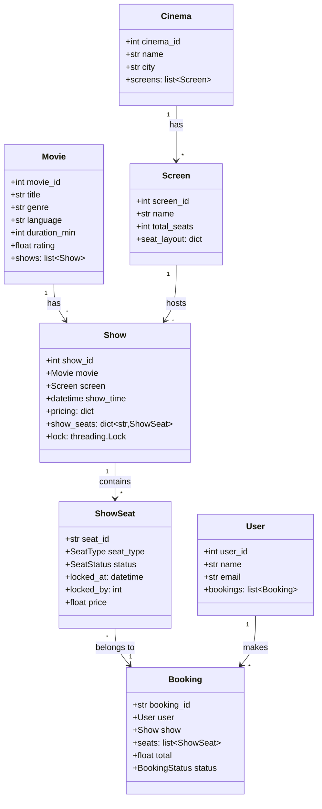

# 🎬 BOOKMYSHOW — Movie Ticket Booking System
## The Definitive LLD Guide — V2.0

---

## 📖 Table of Contents
1. [🎯 Problem Statement & Context](#-1-problem-statement--context)
2. [🗣️ Requirement Gathering](#-2-requirement-gathering)
3. [✅ Requirements (FR + NFR)](#-3-requirements)
4. [🧠 Key Insight: Movie vs Show vs Seat](#-4-key-insight)
5. [📐 Class Diagram & Entity Relationships](#-5-class-diagram)
6. [🔧 API Design (Public Interface)](#-6-api-design)
7. [🏗️ Complete Code Implementation](#-7-complete-code)
8. [📊 Data Structure Choices & Trade-offs](#-8-data-structure-choices)
9. [🔒 Concurrency & Thread Safety Deep Dive](#-9-concurrency-deep-dive)
10. [🧪 SOLID Principles Mapping](#-10-solid-principles)
11. [🎨 Design Patterns Used](#-11-design-patterns)
12. [💾 Database Schema (Production View)](#-12-database-schema)
13. [⚠️ Edge Cases & Error Handling](#-13-edge-cases)
14. [🎮 Full Working Demo](#-14-full-working-demo)
15. [🎤 Interviewer Follow-ups (15+)](#-15-interviewer-follow-ups)
16. [⏱️ Interview Strategy (45-min Plan)](#-16-interview-strategy)
17. [🧠 Quick Recall Cheat Sheet](#-17-quick-recall)

---

# 🎯 1. Problem Statement & Context

## What You're Designing

> Design a **Movie Ticket Booking System** like BookMyShow where users search movies, select a show (date + time + screen), pick seats from a seat map, and book — all while handling **thousands of concurrent users** trying to book the same popular show.

## Real-World Scale

| Metric | BookMyShow (Real) |
|--------|-------------------|
| Monthly users | 60M+ |
| Screens | 6,000+ |
| Cities | 650+ |
| Peak concurrent bookings | 50,000+ during big releases |
| Seat locking duration | 8–10 minutes |
| Revenue (2023) | ₹3,000+ Crore |

## Why Interviewers Love This Problem

| What They're Testing | How This Problem Tests It |
|---------------------|--------------------------|
| **Entity decomposition** | Can you separate Movie, Show, Screen, Seat correctly? |
| **Concurrency** | Can you handle 1000 users booking the same seat? |
| **State management** | AVAILABLE → LOCKED → BOOKED seat lifecycle |
| **Temporal data** | Same seat at different show times = independent entities |
| **Payment integration** | What happens when payment fails after seat lock? |
| **Scale thinking** | Lock expiry, timeout handling, distributed systems |

---

# 🗣️ 2. Requirement Gathering

## The Art of Clarifying Questions

In an interview, you should spend **5–7 minutes** asking questions. Here's every question, **why you ask it**, and what the answer tells you about the design:

### Must-Ask Questions

| # | Question | WHY You Ask | Design Impact |
|---|----------|-------------|---------------|
| 1 | "Is this a single cinema or a chain?" | Determines if you need `Cinema` entity | Need Cinema → Screen → Seat hierarchy |
| 2 | "Can a movie play on multiple screens simultaneously?" | Tests if you understand Show is independent of Movie | One Movie → Many Shows on different Screens |
| 3 | "Can two users select the same seat?" | **THE concurrency question** | Need seat locking mechanism |
| 4 | "How long should a seat be held during payment?" | Lock duration affects UX vs fairness | 8-10 min temp lock with auto-expiry |
| 5 | "What happens if payment fails?" | Rollback design | Release locked seats, return to AVAILABLE |
| 6 | "Different seat categories (Gold, Silver, Platinum)?" | Pricing complexity | SeatType enum with separate pricing |
| 7 | "Can user book multiple seats in one booking?" | Atomic transaction | Book N seats atomically — all or nothing |
| 8 | "Any offer/coupon system?" | Strategy pattern opportunity | DiscountStrategy applied to booking |
| 9 | "Search by which criteria?" | Determines search interface | Movie name, city, date, genre, language |
| 10 | "Cancellation and refund?" | Adds state transitions | BOOKED → CANCELLED with time-based refund |

### Questions That Show Depth (Bonus)

| # | Question | Shows You Think About... |
|---|----------|--------------------------|
| 11 | "Seat layout — is it always a grid?" | Edge cases (balcony, wheelchair, premium) |
| 12 | "International movies? Multi-language?" | Data model flexibility |
| 13 | "Are prices fixed or dynamic (surge)?" | Pricing strategy |
| 14 | "Food ordering during booking?" | Scope control — say "out of scope for now" |
| 15 | "Reviews and ratings?" | Scope control — separate module |

### 🎯 HOW to ask in interviews

> **DON'T:** "What are the requirements?"
> **DO:** "I want to understand the scope. Are we designing for a single cinema or a multi-city chain like BookMyShow?"

> **DON'T:** Assume things silently.
> **DO:** "I'll assume seat locking with a 10-minute window — does that sound reasonable?"

---

# ✅ 3. Requirements

## Functional Requirements

| Priority | ID | Requirement | Notes |
|----------|-----|-------------|-------|
| **P0** | FR-1 | List movies playing in a city | Filter by date, genre, language |
| **P0** | FR-2 | Show available shows for a movie (date/time/screen) | Core navigation |
| **P0** | FR-3 | Display seat map with availability | Color-coded: available/locked/booked |
| **P0** | FR-4 | **Lock selected seats temporarily** | 10-min hold during payment |
| **P0** | FR-5 | **Book seats atomically** (all-or-nothing) | No partial bookings |
| **P0** | FR-6 | Process payment | Strategy pattern |
| **P1** | FR-7 | Cancel booking with refund | Time-based refund % |
| **P1** | FR-8 | Different seat categories with pricing | Gold, Silver, Platinum |
| **P2** | FR-9 | Apply discount/coupon | Strategy pattern |
| **P2** | FR-10 | Show booking history | User profile |

## Non-Functional Requirements

| ID | Requirement | Target | Why It Matters |
|----|-------------|--------|----------------|
| NFR-1 | **Thread safety** | No double-booking | Core correctness |
| NFR-2 | **Lock expiry** | 10 min timeout | Prevent stale locks |
| NFR-3 | **Response time** | < 200ms for seat map | UX critical |
| NFR-4 | **Atomicity** | All seats or none | No partial state |
| NFR-5 | **Auditability** | Log all state changes | Debug + analytics |

---

# 🧠 4. Key Insight: Movie ≠ Show ≠ Seat

## 🤔 THINK: "Avengers" plays at 2pm on Screen 1, 5pm on Screen 2, and 2pm tomorrow on Screen 1. How many entities?

<details>
<summary>👀 Click to reveal — THE foundation of the entire design</summary>

```
Movie: "Avengers" (1 entity — metadata only)
├── Show 1: Screen 1, Today 2:00 PM  (unique seats: A1-J10)
├── Show 2: Screen 2, Today 5:00 PM  (unique seats: A1-H8)
└── Show 3: Screen 1, Tomorrow 2:00 PM (unique seats: A1-J10, all fresh!)

Key: Seat A1 in Show 1 is COMPLETELY INDEPENDENT from Seat A1 in Show 3,
     even though they're physically the same chair!
```

### The Three-Level Hierarchy

| Level | What It Represents | Has Status? | Example |
|-------|-------------------|-------------|---------|
| **Movie** | Abstract concept — just metadata | ❌ No status | "Avengers" with title, genre, duration |
| **Show** | Specific screening — time + screen | ❌ No own status | "Today 2PM on Screen 1" |
| **ShowSeat** | A seat FOR a particular show | ✅ **YES — has status** | "Seat A1 for today's 2PM show" = AVAILABLE |

### Why Status Lives on ShowSeat, Not Show or Screen

```python
# ❌ WRONG: Status on Show
class Show:
    status = "AVAILABLE"  # What does this mean? 50/100 seats gone?

# ❌ WRONG: Status on Screen
class Screen:
    seats = [Seat("A1", status="BOOKED")]  # But WHICH show?

# ✅ CORRECT: Status on ShowSeat
class ShowSeat:
    """This specific seat, for this specific show."""
    show = "Avengers 2PM Today"
    seat = "A1"
    status = BOOKED  # ← THIS is what we track
```

**The same physical chair (Screen 1, Row A, Seat 1) has DIFFERENT ShowSeat entities for different shows.** This is the core insight.

### Analogy with Other Problems

| Problem | Abstract Entity | Instance Entity | Status Lives On |
|---------|----------------|----------------|-----------------|
| **BookMyShow** | Movie | Show → ShowSeat | ShowSeat |
| **Library** | Book | BookCopy | BookCopy |
| **Airline** | Aircraft | Flight → FlightSeat | FlightSeat |
| **Car Rental** | Vehicle Type | Vehicle → Reservation | Reservation |

</details>

---

# 📐 5. Class Diagram & Entity Relationships

## Mermaid Class Diagram



## Entity Relationship Summary

```
Cinema ─────has────→ Screen ─────hosts────→ Show ←────for──── Movie
                                               │
                                               ├── contains → ShowSeat (AVAILABLE/LOCKED/BOOKED)
                                               │
                                               └── bookings → Booking ←── made by ── User
```

## Key Relationships

| Relationship | Type | Explanation |
|-------------|------|-------------|
| Movie → Show | 1:N | One movie, many screenings |
| Screen → Show | 1:N | One screen, many shows (different times) |
| Show → ShowSeat | 1:N | Each show creates its own seat map |
| User → Booking | 1:N | One user, many bookings |
| Booking → ShowSeat | 1:N | One booking can have multiple seats |

---

# 🔧 6. API Design (Public Interface)

## 🤔 THINK: Before writing ANY class, define the PUBLIC methods your system exposes.

This is what interviewers want to see FIRST — "interface-first" thinking.

```python
class BookingSystem:
    """Public API — what the outside world calls."""
    
    # ── Discovery ──
    def get_movies_by_city(self, city: str) -> list[Movie]:
        """Return all movies currently playing in a city."""
    
    def get_shows_for_movie(self, movie_id: int, city: str, 
                             date: date = None) -> list[Show]:
        """Return all shows for a movie, optionally filtered by date."""
    
    # ── Seat Selection ──
    def get_seat_map(self, show_id: int) -> dict[str, ShowSeat]:
        """Return complete seat map with current status for a show."""
    
    def lock_seats(self, show_id: int, seat_ids: list[str], 
                   user_id: int) -> bool:
        """
        Temporarily lock seats for a user (10-min hold).
        Returns False if ANY seat is not AVAILABLE.
        ATOMIC: locks ALL or NONE.
        """
    
    # ── Booking ──
    def confirm_booking(self, show_id: int, seat_ids: list[str],
                        user_id: int, payment: PaymentStrategy) -> Booking:
        """
        Confirm booking after payment.
        PRE-CONDITION: seats must be locked by this user.
        Transitions seats: LOCKED → BOOKED.
        """
    
    def cancel_booking(self, booking_id: str) -> float:
        """Cancel and return refund amount based on policy."""
    
    # ── Admin ──
    def add_movie(self, title: str, genre: str, ...) -> Movie: ...
    def add_show(self, movie_id: int, screen_id: int, ...) -> Show: ...
    def add_cinema(self, name: str, city: str) -> Cinema: ...
```

### Why API Design First?

| Benefit | Explanation |
|---------|-------------|
| **Scope clarity** | You know exactly what to build |
| **Test-driven thinking** | You can write tests before implementation |
| **Interview impression** | Shows you think "outside-in" |
| **Decoupling** | Implementation can change without affecting API |

---

# 🏗️ 7. Complete Code Implementation

## Enums

```python
from enum import Enum
from datetime import datetime, date, timedelta
import threading
import uuid

class SeatType(Enum):
    SILVER = 1
    GOLD = 2
    PLATINUM = 3

class SeatStatus(Enum):
    AVAILABLE = 1
    LOCKED = 2      # Temporarily held — auto-expires
    BOOKED = 3

class BookingStatus(Enum):
    CONFIRMED = 1
    CANCELLED = 2
```

## Core Entities

### Movie — Pure metadata, NO status

```python
class Movie:
    _counter = 0
    def __init__(self, title: str, genre: str, language: str,
                 duration_min: int, rating: float = 0):
        Movie._counter += 1
        self.movie_id = Movie._counter
        self.title = title
        self.genre = genre
        self.language = language
        self.duration_min = duration_min
        self.rating = rating
        self.shows: list['Show'] = []
    
    def __str__(self):
        return f"🎬 {self.title} ({self.language}) | {self.genre} | ⭐{self.rating}"
```

### Cinema & Screen — Physical infrastructure

```python
class Screen:
    _counter = 0
    def __init__(self, name: str, seat_layout: dict[SeatType, dict]):
        """
        seat_layout example:
        {
            SeatType.PLATINUM: {"rows": ["A", "B"], "seats_per_row": 10},
            SeatType.GOLD: {"rows": ["C", "D", "E"], "seats_per_row": 12},
            SeatType.SILVER: {"rows": ["F", "G", "H", "I"], "seats_per_row": 15},
        }
        """
        Screen._counter += 1
        self.screen_id = Screen._counter
        self.name = name
        self.seat_layout = seat_layout
    
    @property
    def total_seats(self):
        return sum(config["seats_per_row"] * len(config["rows"])
                   for config in self.seat_layout.values())
    
    def __str__(self):
        return f"🖥️ {self.name} ({self.total_seats} seats)"


class Cinema:
    _counter = 0
    def __init__(self, name: str, city: str):
        Cinema._counter += 1
        self.cinema_id = Cinema._counter
        self.name = name
        self.city = city.lower()
        self.screens: list[Screen] = []
    
    def add_screen(self, screen: Screen):
        self.screens.append(screen)
    
    def __str__(self):
        return f"🏢 {self.name}, {self.city} ({len(self.screens)} screens)"
```

### ShowSeat — Where status lives (THE core entity)

```python
class ShowSeat:
    """
    A specific seat for a specific show.
    This is WHERE booking status lives.
    Same physical seat has different ShowSeat objects for different shows.
    """
    def __init__(self, seat_id: str, seat_type: SeatType, price: float):
        self.seat_id = seat_id          # "A-5"
        self.seat_type = seat_type
        self.price = price
        self.status = SeatStatus.AVAILABLE
        self.locked_at: datetime = None  # When was it locked?
        self.locked_by: int = None       # Which user locked it?
        self.booking: 'Booking' = None   # Which booking owns it?
    
    def is_lock_expired(self, timeout_minutes: int = 10) -> bool:
        """Check if lock has expired (auto-release)."""
        if self.status != SeatStatus.LOCKED:
            return False
        if self.locked_at is None:
            return True
        elapsed = (datetime.now() - self.locked_at).total_seconds()
        return elapsed > timeout_minutes * 60
    
    def __str__(self):
        icons = {SeatStatus.AVAILABLE: "🟢", SeatStatus.LOCKED: "🟡", SeatStatus.BOOKED: "🔴"}
        return f"{icons[self.status]} {self.seat_id} ({self.seat_type.name})"
```

### Show — Time-specific screening

```python
class Show:
    _counter = 0
    LOCK_TIMEOUT_MINUTES = 10
    
    def __init__(self, movie: Movie, screen: Screen,
                 show_time: datetime, pricing: dict[SeatType, float]):
        """
        pricing: {SeatType.SILVER: 150, SeatType.GOLD: 250, SeatType.PLATINUM: 400}
        """
        Show._counter += 1
        self.show_id = Show._counter
        self.movie = movie
        self.screen = screen
        self.show_time = show_time
        self.show_seats: dict[str, ShowSeat] = {}
        self.bookings: list['Booking'] = []
        self._lock = threading.Lock()  # Per-show lock
        
        # Create ShowSeat objects from screen layout
        self._initialize_seats(pricing)
    
    def _initialize_seats(self, pricing: dict[SeatType, float]):
        """Create unique ShowSeat for every physical seat."""
        for seat_type, config in self.screen.seat_layout.items():
            price = pricing.get(seat_type, 0)
            for row in config["rows"]:
                for num in range(1, config["seats_per_row"] + 1):
                    seat_id = f"{row}-{num}"
                    self.show_seats[seat_id] = ShowSeat(seat_id, seat_type, price)
    
    def get_available_seats(self, seat_type: SeatType = None) -> list[ShowSeat]:
        """Get all available seats, optionally filtered by type."""
        self._release_expired_locks()
        seats = [s for s in self.show_seats.values() 
                 if s.status == SeatStatus.AVAILABLE]
        if seat_type:
            seats = [s for s in seats if s.seat_type == seat_type]
        return seats
    
    def _release_expired_locks(self):
        """Auto-release seats with expired locks."""
        for seat in self.show_seats.values():
            if seat.is_lock_expired(self.LOCK_TIMEOUT_MINUTES):
                seat.status = SeatStatus.AVAILABLE
                seat.locked_at = None
                seat.locked_by = None
    
    def __str__(self):
        avail = len(self.get_available_seats())
        total = len(self.show_seats)
        return (f"🎬 {self.movie.title} | {self.show_time.strftime('%b %d, %I:%M %p')} | "
                f"{self.screen.name} | {avail}/{total} seats")
```

### User

```python
class User:
    _counter = 0
    def __init__(self, name: str, email: str):
        User._counter += 1
        self.user_id = User._counter
        self.name = name
        self.email = email
        self.bookings: list['Booking'] = []
    
    def __str__(self):
        return f"👤 {self.name} ({len(self.bookings)} bookings)"
```

### Booking

```python
class Booking:
    def __init__(self, user: User, show: Show, seats: list[ShowSeat]):
        self.booking_id = f"BMS-{uuid.uuid4().hex[:8].upper()}"
        self.user = user
        self.show = show
        self.seats = seats
        self.total = round(sum(s.price for s in seats), 2)
        self.status = BookingStatus.CONFIRMED
        self.booked_at = datetime.now()
    
    def __str__(self):
        seat_str = ", ".join(s.seat_id for s in self.seats)
        return (f"🎫 {self.booking_id} | {self.show.movie.title} | "
                f"{self.show.show_time.strftime('%b %d %I:%M%p')} | "
                f"Seats: {seat_str} | ₹{self.total:.0f}")
```

### Payment — Strategy Pattern

```python
from abc import ABC, abstractmethod

class PaymentStrategy(ABC):
    @abstractmethod
    def pay(self, amount: float) -> bool:
        pass

class CreditCardPayment(PaymentStrategy):
    def __init__(self, card_number: str):
        self.card_number = card_number
    def pay(self, amount: float) -> bool:
        print(f"   💳 Charged ₹{amount:.0f} to card ****{self.card_number[-4:]}")
        return True

class UPIPayment(PaymentStrategy):
    def __init__(self, upi_id: str):
        self.upi_id = upi_id
    def pay(self, amount: float) -> bool:
        print(f"   📱 ₹{amount:.0f} paid via UPI: {self.upi_id}")
        return True
```

---

# 📊 8. Data Structure Choices & Trade-offs

## 🤔 THINK: Why are specific data structures chosen? This is what separates senior from junior.

| Data Structure | Where Used | Why This? | Alternative | Why Not Alternative? |
|---------------|-----------|-----------|-------------|---------------------|
| `dict[str, ShowSeat]` | Show.show_seats | **O(1) lookup** by seat_id when user clicks seat | `list[ShowSeat]` | O(n) scan to find seat by ID — too slow |
| `dict[int, Show]` | System.shows | O(1) lookup by show_id | `list[Show]` | Need random access for booking API |
| `threading.Lock` | Per-Show lock | Mutual exclusion for seat locking | Global lock | Per-show = higher concurrency — users on different shows don't block each other |
| `datetime` | ShowSeat.locked_at | Calculate elapsed time for lock expiry | `bool is_locked` | Can't do auto-expiry without timestamp |
| `list[ShowSeat]` | Booking.seats | One booking = multiple seats, ordered | `set` | Need display order (A-1, A-2, A-3) |
| `Enum` | SeatStatus, SeatType | Type safety, finite state set | `str` | "AVAILBLE" typo won't be caught |
| `uuid` | booking_id | Globally unique, no counter race | `int counter` | Counter needs locking; UUID is lock-free |

### Per-Show Lock vs Global Lock — Detailed Comparison

```python
# ❌ GLOBAL LOCK: One lock for entire system
class BookingSystem:
    _global_lock = threading.Lock()
    
    def lock_seats(self, show_id, seat_ids, user_id):
        with self._global_lock:  # ALL shows blocked!
            # User booking Avengers blocks user booking Spiderman
            ...

# ✅ PER-SHOW LOCK: One lock per show
class Show:
    def __init__(self):
        self._lock = threading.Lock()  # Only this show's seats are locked
    
# User 1 booking Avengers 2PM → only locks Avengers 2PM show
# User 2 booking Spiderman 5PM → can proceed simultaneously!
```

**Impact:** With 1000 shows and a global lock, throughput = 1 booking at a time.
With per-show locks, throughput = up to 1000 concurrent bookings (one per show).

---

# 🔒 9. Concurrency & Thread Safety Deep Dive

## The Race Condition — Visualized

```
Timeline:
t=0: User A sees Seat A-1 as AVAILABLE ✅
t=1: User B sees Seat A-1 as AVAILABLE ✅
t=2: User A clicks "Book Seat A-1"
t=3: User B clicks "Book Seat A-1" (simultaneously!)

WITHOUT locking:
  t=2: A sets A-1.status = BOOKED ← succeeds
  t=3: B sets A-1.status = BOOKED ← also succeeds! 💀 DOUBLE BOOKING!

WITH locking:
  t=2: A acquires lock → A-1.status = BOOKED → releases lock
  t=3: B acquires lock → sees A-1 is BOOKED → REJECTS! ✅
```

## The Lock-Book Two-Phase Protocol

### Phase 1: Lock (Temporary Hold)

```python
def lock_seats(self, show_id: int, seat_ids: list[str],
               user_id: int) -> bool:
    """
    ATOMIC lock: ALL seats or NONE.
    If any seat is unavailable, NO seats get locked.
    """
    show = self.shows[show_id]
    
    with show._lock:  # ── CRITICAL SECTION START ──
        # First pass: VALIDATE all seats
        for seat_id in seat_ids:
            seat = show.show_seats.get(seat_id)
            if not seat:
                print(f"   ❌ Seat {seat_id} doesn't exist!")
                return False
            
            # Auto-release expired locks before checking
            if seat.is_lock_expired(Show.LOCK_TIMEOUT_MINUTES):
                seat.status = SeatStatus.AVAILABLE
                seat.locked_at = None
                seat.locked_by = None
            
            if seat.status != SeatStatus.AVAILABLE:
                print(f"   ❌ Seat {seat_id} is {seat.status.name}!")
                return False
        
        # Second pass: LOCK all seats (only reached if ALL are available)
        for seat_id in seat_ids:
            seat = show.show_seats[seat_id]
            seat.status = SeatStatus.LOCKED
            seat.locked_at = datetime.now()
            seat.locked_by = user_id
        
        print(f"   🔒 Locked {len(seat_ids)} seats for {Show.LOCK_TIMEOUT_MINUTES} min")
        return True
    # ── CRITICAL SECTION END ──
```

### 🤔 Why Two Passes?

```
Scenario: User wants seats A-1, A-2, A-3
- A-1 is AVAILABLE
- A-2 is AVAILABLE  
- A-3 is BOOKED

Single pass (lock as you go):
  Lock A-1 ✅ → Lock A-2 ✅ → A-3 is BOOKED ❌
  Now A-1 and A-2 are locked but nobody will book them! 💀
  Must UNDO the locks = complex rollback code.

Two-pass approach:
  Pass 1: Check A-1 ✅, A-2 ✅, A-3 ❌ → REJECT immediately
  Pass 2: Never reached
  No locks were acquired → no rollback needed! ✅
```

### Phase 2: Confirm (Permanent Booking)

```python
def confirm_booking(self, show_id: int, seat_ids: list[str],
                    user_id: int, payment: PaymentStrategy) -> Booking:
    show = self.shows[show_id]
    
    with show._lock:
        # Verify seats are locked BY THIS USER
        seats_to_book = []
        for seat_id in seat_ids:
            seat = show.show_seats[seat_id]
            
            if seat.status != SeatStatus.LOCKED:
                print(f"   ❌ Seat {seat_id} is not locked!")
                return None
            if seat.locked_by != user_id:
                print(f"   ❌ Seat {seat_id} is locked by another user!")
                return None
            if seat.is_lock_expired(Show.LOCK_TIMEOUT_MINUTES):
                seat.status = SeatStatus.AVAILABLE
                print(f"   ❌ Lock expired on {seat_id}!")
                return None
            
            seats_to_book.append(seat)
        
        # Calculate total
        total = sum(s.price for s in seats_to_book)
        
        # Process payment
        if not payment.pay(total):
            # Payment failed → release locks
            for seat in seats_to_book:
                seat.status = SeatStatus.AVAILABLE
                seat.locked_at = None
                seat.locked_by = None
            print("   ❌ Payment failed! Seats released.")
            return None
        
        # Payment succeeded → finalize booking
        user = self.users[user_id]
        booking = Booking(user, show, seats_to_book)
        
        for seat in seats_to_book:
            seat.status = SeatStatus.BOOKED
            seat.locked_at = None
            seat.locked_by = None
            seat.booking = booking
        
        show.bookings.append(booking)
        user.bookings.append(booking)
        
        print(f"   ✅ BOOKED! {booking}")
        return booking
```

### Seat State Machine

```
                    ┌─────── lock_seats() ──────┐
                    │                           │
                ┌───▼───┐                  ┌────▼────┐
                │       │   10 min expiry  │         │
                │ AVAIL │ ◄──────────────  │ LOCKED  │
                │ ABLE  │   payment fail   │         │
                └───▲───┘ ◄──────────────  └────┬────┘
                    │                           │
                    │    cancel_booking()        │ confirm_booking()
                    │                           │
                ┌───┴───┐                  ┌────▼────┐
                │       │                  │         │
                │ (free)│ ◄──────────────  │ BOOKED  │
                │       │                  │         │
                └───────┘                  └─────────┘
```

### What Exactly Gets Locked?

| Operation | Lock Scope | Duration | Why |
|-----------|-----------|----------|-----|
| `lock_seats()` | Per-show `_lock` | Milliseconds (just state change) | Prevent double-lock |
| Seat hold | ShowSeat.status = LOCKED | 10 minutes (business rule) | Hold during payment |
| `confirm_booking()` | Per-show `_lock` | Milliseconds | Prevent double-confirm |

**Critical distinction:** The `threading.Lock` is held for milliseconds (just to change state). The business "lock" (LOCKED status) lasts 10 minutes. These are DIFFERENT things!

---

# 🧪 10. SOLID Principles Mapping

## How Each Principle Applies to This Design

| Principle | How We Apply It | Where in Code |
|-----------|----------------|---------------|
| **S — Single Responsibility** | `ShowSeat` only tracks seat status. `Booking` only tracks booking info. `Show` only manages showtimes. Payment in its own class. | Each class has ONE job |
| **O — Open/Closed** | New payment methods (Wallet, NetBanking) = new class extending `PaymentStrategy`. Zero changes to `BookingSystem`. | `PaymentStrategy` ABC |
| **L — Liskov Substitution** | Any `PaymentStrategy` subclass works in `confirm_booking()` — `CreditCardPayment`, `UPIPayment`, any future one. | Strategy interchangeability |
| **I — Interface Segregation** | `PaymentStrategy` has only `pay()`. Not bloated with unrelated methods like `refund()` or `getBalance()`. | Lean ABC interfaces |
| **D — Dependency Inversion** | `BookingSystem.confirm_booking()` depends on `PaymentStrategy` (abstraction), not `CreditCardPayment` (concrete). | Constructor injection |

### Deep Dive: Open/Closed in Action

```python
# Adding a new payment method — ZERO changes to BookingSystem:

class WalletPayment(PaymentStrategy):
    def __init__(self, wallet_id: str, balance: float):
        self.wallet_id = wallet_id
        self.balance = balance
    
    def pay(self, amount: float) -> bool:
        if self.balance >= amount:
            self.balance -= amount
            print(f"   👛 ₹{amount:.0f} deducted from wallet")
            return True
        print(f"   ❌ Insufficient wallet balance!")
        return False

# Works immediately — BookingSystem never changes:
# system.confirm_booking(show_id, seats, user_id, WalletPayment("W-123", 1000))
```

---

# 🎨 11. Design Patterns Used

| Pattern | Where | Why This Pattern | Alternative Considered | Why Not Alternative |
|---------|-------|-----------------|----------------------|-------------------|
| **Strategy** | PaymentStrategy | Multiple payment methods, swappable at runtime | if-else chain | Violates OCP — adding Wallet means modifying existing code |
| **Singleton** | BookingSystem | One system instance, shared state | Global variable | No encapsulation, no lazy init |
| **Factory** | Show._initialize_seats() | Creates ShowSeat from screen layout config | Manual creation | DRY — same creation logic for every show |
| **Observer** | (Extension) Notifications | Notify on booking/cancellation | Direct email call | Decouples booking from notification channel |
| **Template Method** | (Extension) RefundPolicy | Refund calculation varies by tier | if-else in cancel | Extensible, SRP |

### Why NOT Other Patterns?

| Pattern | Why It Doesn't Fit |
|---------|-------------------|
| **Builder** | No complex multi-step object construction needed |
| **Decorator** | Seats don't need dynamic wrapping of behavior |
| **Command** | No undo/redo requirement (no "undo booking" — it's "cancel") |
| **State Pattern** | ShowSeat states are simple enough for an enum + conditions. State pattern adds overhead for 3 states. |

---

# 💾 12. Database Schema (Production View)

## 🤔 THINK: If you were building this for real with PostgreSQL, what would the tables look like?

```sql
-- ═══════ CORE TABLES ═══════

CREATE TABLE movies (
    movie_id    SERIAL PRIMARY KEY,
    title       VARCHAR(200) NOT NULL,
    genre       VARCHAR(50),
    language    VARCHAR(30),
    duration_min INTEGER NOT NULL,
    rating      DECIMAL(2,1) DEFAULT 0,
    poster_url  TEXT,
    created_at  TIMESTAMP DEFAULT NOW()
);

CREATE TABLE cinemas (
    cinema_id   SERIAL PRIMARY KEY,
    name        VARCHAR(100) NOT NULL,
    city        VARCHAR(50) NOT NULL,
    address     TEXT,
    INDEX idx_city (city)         -- Fast city lookup
);

CREATE TABLE screens (
    screen_id   SERIAL PRIMARY KEY,
    cinema_id   INTEGER REFERENCES cinemas(cinema_id),
    name        VARCHAR(20) NOT NULL,
    total_seats INTEGER NOT NULL
);

CREATE TABLE shows (
    show_id     SERIAL PRIMARY KEY,
    movie_id    INTEGER REFERENCES movies(movie_id),
    screen_id   INTEGER REFERENCES screens(screen_id),
    show_time   TIMESTAMP NOT NULL,
    INDEX idx_movie_time (movie_id, show_time),  -- Search by movie+date
    INDEX idx_screen_time (screen_id, show_time)  -- Prevent overlapping shows
);

-- ═══════ THE CRITICAL TABLE ═══════

CREATE TABLE show_seats (
    show_seat_id SERIAL PRIMARY KEY,
    show_id      INTEGER REFERENCES shows(show_id),
    seat_id      VARCHAR(10) NOT NULL,     -- "A-5"
    seat_type    VARCHAR(20) NOT NULL,      -- SILVER/GOLD/PLATINUM
    price        DECIMAL(10,2) NOT NULL,
    status       VARCHAR(20) DEFAULT 'AVAILABLE',  -- AVAILABLE/LOCKED/BOOKED
    locked_at    TIMESTAMP NULL,
    locked_by    INTEGER NULL REFERENCES users(user_id),
    booking_id   VARCHAR(20) NULL REFERENCES bookings(booking_id),
    
    UNIQUE (show_id, seat_id),              -- One seat per show
    INDEX idx_show_status (show_id, status)  -- Fast seat map query
);

-- ═══════ BOOKING ═══════

CREATE TABLE users (
    user_id     SERIAL PRIMARY KEY,
    name        VARCHAR(100) NOT NULL,
    email       VARCHAR(200) UNIQUE NOT NULL,
    phone       VARCHAR(15)
);

CREATE TABLE bookings (
    booking_id  VARCHAR(20) PRIMARY KEY,   -- "BMS-A1B2C3D4"
    user_id     INTEGER REFERENCES users(user_id),
    show_id     INTEGER REFERENCES shows(show_id),
    total       DECIMAL(10,2) NOT NULL,
    status      VARCHAR(20) DEFAULT 'CONFIRMED',
    booked_at   TIMESTAMP DEFAULT NOW(),
    INDEX idx_user (user_id)
);
```

### Key Indexes and Why

| Index | Query It Speeds Up | Without Index |
|-------|-------------------|---------------|
| `idx_city` on cinemas | `WHERE city = 'mumbai'` | Full table scan |
| `idx_movie_time` on shows | "Show me showtimes for Avengers today" | Scan all shows |
| `idx_show_status` on show_seats | "Show available seats for this show" | Scan all seats |

### Concurrency in SQL — `SELECT FOR UPDATE`

```sql
-- Atomic seat locking in SQL:
BEGIN TRANSACTION;

SELECT * FROM show_seats 
WHERE show_id = 42 AND seat_id IN ('A-1', 'A-2', 'A-3')
AND status = 'AVAILABLE'
FOR UPDATE;  -- ← Row-level lock! Other transactions WAIT.

-- If all 3 available:
UPDATE show_seats 
SET status = 'LOCKED', locked_at = NOW(), locked_by = 123
WHERE show_id = 42 AND seat_id IN ('A-1', 'A-2', 'A-3');

COMMIT;
```

`FOR UPDATE` is the SQL equivalent of our `threading.Lock()` — it locks specific rows, not the whole table.

---

# ⚠️ 13. Edge Cases & Error Handling

## Common Bugs Table

| # | Edge Case | What Goes Wrong | The Fix |
|---|-----------|----------------|---------|
| 1 | **Double booking** | Two users book same seat simultaneously | Per-show `threading.Lock` on `lock_seats()` |
| 2 | **Stale lock** | User locks seats, never pays, leaves | `is_lock_expired()` with 10-min timeout |
| 3 | **Partial lock** | User wants 3 seats, seat 3 is taken. Seats 1-2 locked but unused | Two-pass: validate ALL first, then lock ALL |
| 4 | **Payment failure after lock** | Seats LOCKED, payment fails, stays locked | Explicitly release locks on payment failure |
| 5 | **Lock by User A, confirm by User B** | User B submits booking with User A's locked seats | Check `locked_by == user_id` in `confirm_booking()` |
| 6 | **Same user locks twice** | User opens two tabs, locks same seats | Check if already locked by same user (allow or reject) |
| 7 | **Show in the past** | User books seats for a show that already started | Check `show_time > datetime.now()` before locking |
| 8 | **Negative price** | Discount exceeds amount | `max(0, total - discount)` |
| 9 | **Empty seat selection** | User submits with 0 seats | Validate `len(seat_ids) > 0` |
| 10 | **Overlapping shows on same screen** | Admin creates two shows at same time on same screen | Validate no time overlap when adding show |

## How to Handle Each in Code

```python
def lock_seats(self, show_id, seat_ids, user_id):
    # Edge case 9: Empty selection
    if not seat_ids:
        print("   ❌ No seats selected!")
        return False
    
    show = self.shows.get(show_id)
    
    # Edge case: Invalid show
    if not show:
        print("   ❌ Show not found!")
        return False
    
    # Edge case 7: Show in past
    if show.show_time < datetime.now():
        print("   ❌ This show has already started!")
        return False
    
    with show._lock:
        # ... (two-pass validation + locking as shown in Section 9)
```

---

# 🎮 14. Full Working Demo

```python
class BookingSystem:
    """Complete system tying everything together."""
    _instance = None
    
    def __new__(cls):
        if cls._instance is None:
            cls._instance = super().__new__(cls)
            cls._instance._initialized = False
        return cls._instance
    
    def __init__(self):
        if self._initialized: return
        self._initialized = True
        self.cinemas: dict[int, Cinema] = {}
        self.movies: dict[int, Movie] = {}
        self.shows: dict[int, Show] = {}
        self.users: dict[int, User] = {}
        self.bookings: dict[str, Booking] = {}
    
    def get_movies_by_city(self, city):
        city = city.lower()
        movie_ids = set()
        for show in self.shows.values():
            cinema = next((c for c in self.cinemas.values()
                          for s in c.screens if s == show.screen), None)
            if cinema and cinema.city == city:
                movie_ids.add(show.movie.movie_id)
        return [self.movies[mid] for mid in movie_ids]
    
    def get_shows_for_movie(self, movie_id, city=None):
        results = [s for s in self.shows.values() if s.movie.movie_id == movie_id]
        return results
    
    def cancel_booking(self, booking_id):
        booking = self.bookings.get(booking_id)
        if not booking or booking.status != BookingStatus.CONFIRMED:
            print("   ❌ Cannot cancel!"); return 0
        
        hours_before = (booking.show.show_time - datetime.now()).total_seconds() / 3600
        if hours_before > 24: refund_pct = 1.0
        elif hours_before > 4: refund_pct = 0.5
        else: refund_pct = 0
        
        refund = round(booking.total * refund_pct, 2)
        
        with booking.show._lock:
            for seat in booking.seats:
                seat.status = SeatStatus.AVAILABLE
                seat.booking = None
        
        booking.status = BookingStatus.CANCELLED
        print(f"   🔄 Booking {booking_id} cancelled. Refund: ₹{refund:.0f}")
        return refund
    
    # lock_seats and confirm_booking as defined in Section 9


# ═══════════════════════════════════════
#              DEMO EXECUTION
# ═══════════════════════════════════════

if __name__ == "__main__":
    print("=" * 65)
    print("     BOOKMYSHOW — COMPLETE DEMO")
    print("=" * 65)
    
    system = BookingSystem()
    
    # ── Setup Cinema ──
    print("\n📌 SETUP")
    cinema = Cinema("PVR Phoenix", "mumbai")
    screen = Screen("Screen 1", {
        SeatType.PLATINUM: {"rows": ["A"], "seats_per_row": 5},
        SeatType.GOLD: {"rows": ["B", "C"], "seats_per_row": 6},
        SeatType.SILVER: {"rows": ["D", "E", "F"], "seats_per_row": 8},
    })
    cinema.add_screen(screen)
    system.cinemas[cinema.cinema_id] = cinema
    
    # ── Add Movie ──
    avengers = Movie("Avengers: Endgame", "Action", "English", 181, 8.4)
    system.movies[avengers.movie_id] = avengers
    
    # ── Add Show ──
    show = Show(avengers, screen, datetime(2024, 12, 25, 18, 30), {
        SeatType.PLATINUM: 400, SeatType.GOLD: 250, SeatType.SILVER: 150
    })
    system.shows[show.show_id] = show
    avengers.shows.append(show)
    
    # ── Register Users ──
    alice = User("Alice", "alice@mail.com")
    bob = User("Bob", "bob@mail.com")
    system.users[alice.user_id] = alice
    system.users[bob.user_id] = bob
    
    print(f"   🏢 {cinema}")
    print(f"   🎬 {avengers}")
    print(f"   🎬 {show}")
    
    # ── Test 1: Normal Booking Flow ──
    print(f"\n{'─'*65}")
    print("   TEST 1: Normal Booking (Alice books 2 Gold seats)")
    print(f"{'─'*65}")
    
    locked = system.lock_seats(show.show_id, ["B-1", "B-2"], alice.user_id)
    if locked:
        booking = system.confirm_booking(
            show.show_id, ["B-1", "B-2"], alice.user_id,
            CreditCardPayment("4111111111111111")
        )
    
    # ── Test 2: Concurrent Conflict ──
    print(f"\n{'─'*65}")
    print("   TEST 2: Bob tries to book same seats (should FAIL)")
    print(f"{'─'*65}")
    
    system.lock_seats(show.show_id, ["B-1", "B-3"], bob.user_id)
    
    # ── Test 3: Bob books different seats ──
    print(f"\n{'─'*65}")
    print("   TEST 3: Bob books different seats (should pass)")
    print(f"{'─'*65}")
    
    locked = system.lock_seats(show.show_id, ["B-3", "B-4"], bob.user_id)
    if locked:
        booking2 = system.confirm_booking(
            show.show_id, ["B-3", "B-4"], bob.user_id,
            UPIPayment("bob@upi")
        )
    
    # ── Test 4: Seat Map ──
    print(f"\n{'─'*65}")
    print("   TEST 4: Current Seat Map")
    print(f"{'─'*65}")
    
    print("\n   PLATINUM (₹400):")
    for s in sorted(show.show_seats.values(), key=lambda x: x.seat_id):
        if s.seat_type == SeatType.PLATINUM:
            print(f"   {s}", end="  ")
    print("\n\n   GOLD (₹250):")
    for s in sorted(show.show_seats.values(), key=lambda x: x.seat_id):
        if s.seat_type == SeatType.GOLD:
            print(f"   {s}", end="  ")
    print("\n\n   SILVER (₹150):")
    avail = len(show.get_available_seats(SeatType.SILVER))
    total = len([s for s in show.show_seats.values() if s.seat_type == SeatType.SILVER])
    print(f"   {avail}/{total} available")
    
    # ── Test 5: Cancellation ──
    print(f"\n{'─'*65}")
    print("   TEST 5: Alice cancels booking")
    print(f"{'─'*65}")
    
    system.cancel_booking(booking.booking_id)
    
    print(f"\n{'─'*65}")
    print(f"   ✅ ALL 5 TESTS COMPLETE!")
    print(f"{'─'*65}")
```

---

# 🎤 15. Interviewer Follow-ups (15+)

### Q1: "How would you implement seat locking that auto-expires?"

<details>
<summary>👀 Click to reveal</summary>

**In our code:** `ShowSeat.locked_at = datetime.now()` at lock time. Before any operation, check `is_lock_expired()`. This is **lazy expiry** — we don't need a background thread.

**In production:** Use Redis with TTL:
```python
redis.setex(f"lock:{show_id}:{seat_id}", 600, user_id)  # 600s = 10min, auto-deletes
```
Redis handles expiry automatically, no polling needed.

</details>

### Q2: "How to handle payment taking longer than 10 minutes?"

<details>
<summary>👀 Click to reveal</summary>

**Option A:** Extend lock when payment is in progress (heartbeat from frontend)
**Option B:** Payment gateway has its own timeout (typically 5 min) < lock timeout (10 min)
**Option C:** Separate "payment_in_progress" status that has longer timeout

</details>

### Q3: "How to scale to millions of concurrent users?"

<details>
<summary>👀 Click to reveal</summary>

| Layer | Solution |
|-------|----------|
| **Seat locking** | Redis distributed locks (not in-memory threading.Lock) |
| **Database** | Shard by city/cinema. Read replicas for browsing |
| **Search** | Elasticsearch for movie/show discovery |
| **Queue** | Kafka for booking events → notification → analytics |
| **CDN** | Seat map images cached at edge |
| **Rate limiting** | Per-user API throttling to prevent bots |

</details>

### Q4-15

| Q | Question | Key Answer |
|---|----------|-----------|
| 4 | "Discount system?" | DiscountStrategy ABC: PercentDiscount, FlatDiscount, BOGO |
| 5 | "Partial cancellation (cancel 1 of 3 seats)?" | Remove seat from booking, recalculate total, update status |
| 6 | "Waitlist for sold-out shows?" | Queue per show; on cancellation, notify first in queue |
| 7 | "Food ordering with booking?" | CartItem entity, added to Booking.add_ons |
| 8 | "Show timing overlap on same screen?" | Validate: new_show_end < existing_show_start (with buffer) |
| 9 | "Review/rating system?" | Review entity: user + movie + score + text (after booking) |
| 10 | "Multi-city deployment?" | Shard by city. Each city = independent service |
| 11 | "Booking history & recommendations?" | User.bookings[] → genres → suggest similar movies |
| 12 | "Why UUID for booking_id?" | No counter contention across distributed servers |
| 13 | "How to test concurrency?" | Spawn N threads, all try to lock same seat, assert only 1 succeeds |
| 14 | "Wheelchair-accessible seats?" | `is_accessible: bool` on ShowSeat, filter in UI |
| 15 | "Compare with Concert Booking?" | Concert adds GA (counter-based). BMS = all assigned seats. |
| 16 | "Notification on booking?" | Observer: BookingCreated → EmailNotifier, SMSNotifier, PushNotifier |

---

# ⏱️ 16. Interview Strategy (45-min Plan)

## Minute-by-Minute Breakdown

| Time | Phase | What You Do | What You Say |
|------|-------|-------------|-------------|
| **0–5** | **Clarify** | Ask 5-7 questions from Section 2 | "Let me understand the scope..." |
| **5–8** | **Requirements** | List FR/NFR on whiteboard | "Core FRs: search movies, select show, book seats atomically..." |
| **8–12** | **Key Insight** | Draw Movie → Show → ShowSeat | "The key insight: status lives on ShowSeat, not Show or Movie" |
| **12–15** | **API Design** | Write public method signatures | "Here are the 5 APIs the system exposes..." |
| **15–20** | **Class Diagram** | Draw entities + relationships | "6 entities: Movie, Cinema, Screen, Show, ShowSeat, Booking" |
| **20–35** | **Code** | Write ShowSeat, Show, lock_seats, confirm_booking | Focus on the two-phase lock + concurrency |
| **35–40** | **Edge Cases** | Walk through race condition, payment failure | "What if payment fails? What if lock expires?" |
| **40–45** | **Extensions** | Mention patterns, DB schema, scale | "For production: Redis locks, Kafka events, PostgreSQL..." |

## What to Prioritize If Running Out of Time

| Priority | Must Show | Can Skip |
|----------|-----------|----------|
| **Always** | Movie/Show/ShowSeat hierarchy + insight | Full code for Cinema/Screen |
| **Always** | lock_seats() with two-pass | Payment implementation |
| **Always** | Race condition explanation | Database schema |
| **If time** | confirm_booking() with payment failure | Cancellation flow |
| **If time** | State machine diagram | Full demo |

## Golden Sentences for Each Phase

> **Opening:** "This is fundamentally a resource booking problem where the core challenge is concurrent seat locking."

> **Key insight:** "The status doesn't live on Movie or Show — it lives on ShowSeat, which is a unique entity per seat per show."

> **Concurrency:** "I use a two-phase approach: lock-then-book, with per-show mutex for the locking operation and a time-based expiry for the business lock."

> **Patterns:** "Strategy for payment, Singleton for the system, and the Entity-Instance pattern that's identical to Library's Book-BookCopy."

---

# 🧠 17. Quick Recall Cheat Sheet

## ⏱️ 30-Second Recall

> **Movie = metadata. Show = time+screen. ShowSeat = WHERE STATUS LIVES.** Two-phase: `lock_seats()` with per-show Lock (validate all first, then lock all) → `confirm_booking()` (verify locked by this user, pay, finalize). Lock expires in 10 min. Payment failure → release. `dict[seat_id, ShowSeat]` for O(1).

## ⏱️ 2-Minute Recall

Add to above:
> **Entities:** Cinema → Screen → Show ← Movie. ShowSeat per show. User → Booking → ShowSeats.
> **Concurrency:** Per-show `threading.Lock` (not global). Two-pass in lock: validate ALL, then lock ALL — no partial locks.
> **Edge cases:** Double booking (lock), stale lock (expiry), partial lock (two-pass), payment fail (release), past show (time check).
> **Patterns:** Strategy (payment), Singleton (system), Entity-Instance (Movie/Show).
> **DB:** `show_seats` table with `status`, `locked_at`, `locked_by`. `SELECT FOR UPDATE` for row-level lock.

## ⏱️ 5-Minute Recall

Add to above:
> **SOLID:** SRP per class. OCP via PaymentStrategy. DIP — depend on ABC not concrete.
> **Data structures:** dict for O(1) seat lookup. Enum for type safety. UUID for distributed booking IDs. Per-show lock for concurrency.
> **API:** `get_movies_by_city()`, `get_shows_for_movie()`, `get_seat_map()`, `lock_seats()`, `confirm_booking()`, `cancel_booking()`.
> **Scale:** Redis for distributed locks. Kafka for events. Elasticsearch for search. Shard by city.

---

## ✅ Pre-Implementation Checklist

- [ ] **Enums:** SeatType (SILVER/GOLD/PLATINUM), SeatStatus (AVAILABLE/LOCKED/BOOKED), BookingStatus
- [ ] **Movie** (movie_id, title, genre, language, duration, rating)
- [ ] **Cinema** (cinema_id, name, city, screens[])
- [ ] **Screen** (screen_id, name, seat_layout: dict)
- [ ] **ShowSeat** (seat_id, seat_type, price, **status**, locked_at, locked_by)
- [ ] **Show** (show_id, movie, screen, show_time, show_seats: dict, **per-show Lock**)
- [ ] **Show._initialize_seats()** from screen layout
- [ ] **Show._release_expired_locks()** lazy expiry
- [ ] **User** (user_id, name, email, bookings[])
- [ ] **Booking** (booking_id=UUID, user, show, seats, total, status)
- [ ] **PaymentStrategy** ABC → CreditCard, UPI
- [ ] **lock_seats()** — two-pass: validate all → lock all. Per-show lock. Atomic.
- [ ] **confirm_booking()** — verify locked_by user, pay, BOOKED on success, release on fail
- [ ] **cancel_booking()** — time-based refund, release seats
- [ ] **Demo:** normal flow, conflict, different seats, seat map, cancellation

---

*Version 2.0 — The Definitive 17-Section Edition*
