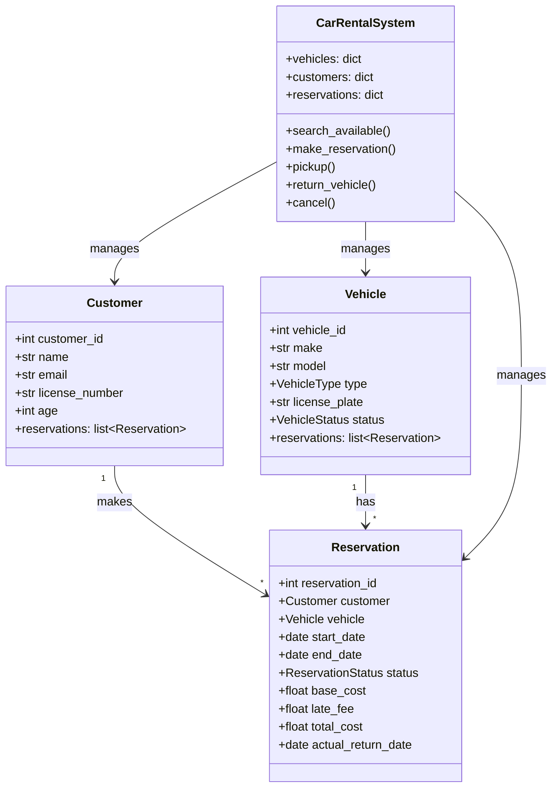

# 🚗 CAR RENTAL SYSTEM — Complete LLD Guide
## The Definitive 17-Section Edition — V2.0

---

## 📖 Table of Contents
1. [🎯 Problem Statement & Context](#-1-problem-statement--context)
2. [🗣️ Requirement Gathering](#-2-requirement-gathering)
3. [✅ Requirements (FR + NFR)](#-3-requirements)
4. [🧠 Key Insight: Date Range Overlap](#-4-key-insight)
5. [📐 Class Diagram & Entity Relationships](#-5-class-diagram)
6. [🔧 API Design (Public Interface)](#-6-api-design)
7. [🏗️ Complete Code Implementation](#-7-complete-code)
8. [📊 Data Structure Choices & Trade-offs](#-8-data-structure-choices)
9. [🔒 Concurrency & Thread Safety Deep Dive](#-9-concurrency-deep-dive)
10. [🧪 SOLID Principles Mapping](#-10-solid-principles)
11. [🎨 Design Patterns Used](#-11-design-patterns)
12. [💾 Database Schema (Production View)](#-12-database-schema)
13. [⚠️ Edge Cases & Error Handling](#-13-edge-cases)
14. [🎮 Full Working Demo](#-14-full-working-demo)
15. [🎤 Interviewer Follow-ups (15+)](#-15-interviewer-follow-ups)
16. [⏱️ Interview Strategy (45-min Plan)](#-16-interview-strategy)
17. [🧠 Quick Recall Cheat Sheet](#-17-quick-recall)

---

# 🎯 1. Problem Statement & Context

## What You're Designing

> Design a **Car Rental System** where customers search for available vehicles by type and date range, make reservations, pick up cars, return them (with late fee calculation), and manage cancellations. Handle multiple vehicle types, tiered pricing, and concurrent booking.

## Real-World Context

| Metric | Real Car Rental (Zoomcar/Avis) |
|--------|-------------------------------|
| Fleet size | 5,000–50,000 vehicles |
| Booking window | Up to 90 days in advance |
| Vehicle types | 4–8 categories |
| Late return rate | ~15% of rentals |
| Avg rental duration | 3–5 days |
| Peak demand | Weekends, holidays, festivals |

## Why Interviewers Love This Problem

| What They Test | How This Tests It |
|---------------|-------------------|
| **Date range overlap** | Can you correctly determine vehicle availability? |
| **Reservation lifecycle** | CONFIRMED → ACTIVE → COMPLETED state machine |
| **Time-based pricing** | Weekly/monthly discounts, late penalties |
| **Different from Parking Lot** | Parking = point-in-time. Rental = date RANGE. |
| **Different from BookMyShow** | BMS = fixed time slot. Rental = flexible date range. |

---

# 🗣️ 2. Requirement Gathering

## Must-Ask Questions

| # | Question | WHY You Ask | Design Impact |
|---|----------|-------------|---------------|
| 1 | "How is availability determined?" | **THE core algorithm** — date range overlap | Need overlap check for each reservation |
| 2 | "Vehicle types?" | Pricing and filter strategy | Enum: Hatchback, Sedan, SUV, Luxury |
| 3 | "Multiple branches?" | Scope control | Single location for core; multi-branch = extension |
| 4 | "Late return policy?" | Penalty calculation | 1.5× daily rate per extra day |
| 5 | "Early return?" | Refund policy | Charge only actual days (less than planned) |
| 6 | "Cancellation policy?" | State transition + refund | Tiered: >7days=100%, 3-7=75%, 1-3=50%, <1=0% |
| 7 | "Insurance?" | Strategy pattern add-on | Basic (5%), Premium (15%) of base cost |
| 8 | "Age restriction?" | Validation rule | 21+ to rent, 25+ for luxury |
| 9 | "One-way rental?" | Different pickup/return location | Extension — relocation surcharge |
| 10 | "Fuel policy?" | Return condition | Return at same fuel level or pay diff |

### 🎯 THE question that shows depth

> "How is this different from a Parking Lot system?"

**Critical answer:**
- **Parking Lot:** Spot is FREE or OCCUPIED **right now** (point-in-time boolean)
- **Car Rental:** Vehicle is available **for a date range** — it can be available Jan 5-10 but NOT Jan 8-15 because of an overlap

This date-range vs point-in-time distinction is the CORE of this problem.

---

# ✅ 3. Requirements

## Functional Requirements

| Priority | ID | Requirement |
|----------|-----|-------------|
| **P0** | FR-1 | Register vehicles by type |
| **P0** | FR-2 | **Search available vehicles for a date range** |
| **P0** | FR-3 | Make reservation (customer + vehicle + dates) |
| **P0** | FR-4 | Pick up vehicle (activate reservation) |
| **P0** | FR-5 | Return vehicle (calculate charges) |
| **P0** | FR-6 | Late return penalties (1.5× per extra day) |
| **P1** | FR-7 | Early return credit |
| **P1** | FR-8 | Cancellation with tiered refund |
| **P1** | FR-9 | Weekly (10%) / monthly (25%) discounts |
| **P2** | FR-10 | Insurance add-on |

## Non-Functional Requirements

| ID | Requirement | Why |
|----|-------------|-----|
| NFR-1 | Thread safety on reservation | Two users booking last available SUV |
| NFR-2 | Accurate date overlap detection | Core correctness |
| NFR-3 | Atomicity | Reservation = check availability + create — must be atomic |
| NFR-4 | Audit trail | Track all state changes |

---

# 🧠 4. Key Insight: Date Range Overlap Algorithm

## 🤔 THINK: A car has reservations Jan 5-10 and Jan 15-20. Is it available Jan 8-12?

<details>
<summary>👀 Click to reveal — THE core algorithm (memorize this!)</summary>

### The Overlap Formula

```
Two ranges [S1, E1] and [S2, E2] OVERLAP if and only if:
    S1 < E2  AND  S2 < E1
```

### Visual Proof

```
Case 1: NO overlap — A ends before B starts
A: |─────|
B:           |─────|
   s1   e1   s2   e2
   Test: s1 < e2? YES. s2 < e1? NO (s2 ≥ e1) → NO OVERLAP ✅

Case 2: OVERLAP — A extends into B
A: |──────────|
B:       |──────────|
   s1    s2   e1    e2
   Test: s1 < e2? YES. s2 < e1? YES → OVERLAP! ✅

Case 3: OVERLAP — A contains B
A: |──────────────────|
B:       |──────|
   s1    s2    e2    e1
   Test: s1 < e2? YES. s2 < e1? YES → OVERLAP! ✅

Case 4: Touch at boundary — Return day = next pickup day
A: |─────|
B:       |─────|
   s1   e1=s2   e2
   Test: s1 < e2? YES. s2 < e1? s2 == e1 → NO → NO OVERLAP ✅
   (Return morning, next customer picks up evening — ALLOWED!)
```

### Step-by-Step Example

```
Existing reservations for Car#1:
  R1: Jan 5–10
  R2: Jan 15–20

Requested: Jan 8–12

Check R1 (Jan 5–10):
  Jan 8 < Jan 10? YES    (s2 < e1)
  Jan 5 < Jan 12? YES    (s1 < e2)
  → OVERLAP! ❌ Car is NOT available!

What about Jan 11–14?
Check R1 (Jan 5–10):
  Jan 11 < Jan 10? NO → Skip
Check R2 (Jan 15–20):
  Jan 11 < Jan 20? YES
  Jan 15 < Jan 14? NO → Skip
→ No overlaps! ✅ Car IS available!
```

### The Availability Function

```python
def _is_available(self, vehicle: Vehicle, start_date: date, end_date: date) -> bool:
    """Check that NO active reservation overlaps with requested dates."""
    if vehicle.status == VehicleStatus.MAINTENANCE:
        return False
    
    for reservation in vehicle.reservations:
        if reservation.status in (ReservationStatus.CONFIRMED, ReservationStatus.ACTIVE):
            # THE overlap formula!
            if start_date < reservation.end_date and reservation.start_date < end_date:
                return False  # OVERLAP found
    
    return True  # No overlaps → available!
```

### 🤔 Why `<` and not `<=`?

If Alice returns the car on Jan 10 and Bob picks it up on Jan 10, is that OK?

**YES** — Alice returns in the morning, Bob picks up in the afternoon. Same-day handoff is fine. That's why we use **strict less than** (`<`), not `<=`.

If your business requires a 1-day buffer between rentals (for cleaning/inspection):
```python
# Add buffer: reservation effectively extends by 1 day
if start_date < (reservation.end_date + timedelta(days=1)):
```

</details>

---

# 📐 5. Class Diagram & Entity Relationships

## Mermaid Class Diagram



## Entity Relationships

```
Customer ──makes──→ Reservation ←──for──→ Vehicle
                       │
                       ├── start_date, end_date (date range)
                       ├── status (CONFIRMED → ACTIVE → COMPLETED)
                       └── costs (base + late_fee = total)
```

### Why No "RentalInstance" Separate from Vehicle?

Unlike BookMyShow (Show ≠ Movie) or Airlines (Flight ≠ Aircraft), here the **Vehicle IS the instance**. Each physical car is unique (license plate). The **Reservation** bridges Customer and Vehicle for a date range. There's no "template" entity.

| System | Template | Instance | Bridge |
|--------|----------|----------|--------|
| BookMyShow | Movie | Show → ShowSeat | Booking |
| Airline | Aircraft | Flight → FlightSeat | Booking |
| Library | Book | BookCopy | Borrow record |
| **Car Rental** | VehicleType (enum) | Vehicle | **Reservation** |

---

# 🔧 6. API Design (Public Interface)

```python
class CarRentalSystem:
    """Public API for the car rental system."""
    
    # ── Vehicle Management ──
    def add_vehicle(self, make: str, model: str, 
                    vehicle_type: VehicleType, plate: str, year: int) -> Vehicle: ...
    
    # ── Search ──
    def search_available(self, vehicle_type: VehicleType,
                         start_date: date, end_date: date) -> list[Vehicle]:
        """
        Find all vehicles of given type available for the ENTIRE date range.
        Uses date overlap check against all active reservations.
        """
    
    # ── Reservation ──
    def make_reservation(self, customer_id: int, vehicle_id: int,
                         start_date: date, end_date: date) -> Reservation:
        """
        Create reservation. Check availability with overlap formula.
        Calculate base cost with tiered discounts.
        ATOMIC: availability check + reservation creation.
        """
    
    # ── Lifecycle ──
    def pickup(self, reservation_id: int) -> bool:
        """Activate reservation. CONFIRMED → ACTIVE."""
    
    def return_vehicle(self, reservation_id: int, 
                       return_date: date = None) -> float:
        """
        Return vehicle. Calculate charges:
        - On time: base cost
        - Late: base + 1.5× per extra day
        - Early: charge only actual days used
        """
    
    def cancel_reservation(self, reservation_id: int) -> float:
        """Cancel. Tiered refund based on days before pickup."""
```

---

# 🏗️ 7. Complete Code Implementation

## Enums

```python
from enum import Enum
from datetime import date, timedelta, datetime
import threading

class VehicleType(Enum):
    HATCHBACK = 1
    SEDAN = 2
    SUV = 3
    LUXURY = 4

class VehicleStatus(Enum):
    AVAILABLE = 1
    RENTED = 2       # Currently with customer
    MAINTENANCE = 3

class ReservationStatus(Enum):
    CONFIRMED = 1    # Booked but not picked up
    ACTIVE = 2       # Car picked up, in use
    COMPLETED = 3    # Car returned
    CANCELLED = 4
```

## Daily Rates & Pricing

```python
DAILY_RATES = {
    VehicleType.HATCHBACK: 500,
    VehicleType.SEDAN: 800,
    VehicleType.SUV: 1200,
    VehicleType.LUXURY: 3000,
}

def calculate_base_cost(vehicle_type: VehicleType, days: int) -> float:
    """Base cost with tiered discounts for longer rentals."""
    daily_rate = DAILY_RATES[vehicle_type]
    base = daily_rate * days
    
    if days >= 30:
        discount = 0.25   # 25% off for monthly
    elif days >= 7:
        discount = 0.10   # 10% off for weekly
    else:
        discount = 0
    
    return round(base * (1 - discount), 2)

def calculate_late_fee(vehicle_type: VehicleType, extra_days: int) -> float:
    """Late returns: 1.5× daily rate per extra day."""
    return round(DAILY_RATES[vehicle_type] * 1.5 * extra_days, 2)
```

## Core Entities

### Vehicle

```python
class Vehicle:
    _counter = 0
    def __init__(self, make: str, model: str, vehicle_type: VehicleType,
                 license_plate: str, year: int):
        Vehicle._counter += 1
        self.vehicle_id = Vehicle._counter
        self.make = make
        self.model = model
        self.vehicle_type = vehicle_type
        self.license_plate = license_plate
        self.year = year
        self.status = VehicleStatus.AVAILABLE
        self.mileage = 0
        self.reservations: list['Reservation'] = []
    
    def __str__(self):
        return (f"🚗 {self.make} {self.model} ({self.vehicle_type.name}) "
                f"[{self.license_plate}]")
```

### Customer

```python
class Customer:
    _counter = 0
    def __init__(self, name: str, email: str, license_number: str, age: int):
        Customer._counter += 1
        self.customer_id = Customer._counter
        self.name = name
        self.email = email
        self.license_number = license_number
        self.age = age
        self.reservations: list['Reservation'] = []
    
    def __str__(self):
        return f"👤 {self.name} (DL: {self.license_number})"
```

### Reservation

```python
class Reservation:
    _counter = 0
    def __init__(self, customer: Customer, vehicle: Vehicle,
                 start_date: date, end_date: date):
        Reservation._counter += 1
        self.reservation_id = Reservation._counter
        self.customer = customer
        self.vehicle = vehicle
        self.start_date = start_date
        self.end_date = end_date
        self.status = ReservationStatus.CONFIRMED
        self.actual_return_date: date = None
        self.base_cost = 0.0
        self.late_fee = 0.0
        self.total_cost = 0.0
        self.created_at = datetime.now()
    
    @property
    def planned_days(self) -> int:
        return max(1, (self.end_date - self.start_date).days)
    
    def __str__(self):
        return (f"📋 R#{self.reservation_id}: {self.customer.name} → "
                f"{self.vehicle.make} {self.vehicle.model} | "
                f"{self.start_date} to {self.end_date} | {self.status.name}")
```

## The Full System

```python
class CarRentalSystem:
    _instance = None
    
    def __new__(cls):
        if cls._instance is None:
            cls._instance = super().__new__(cls)
            cls._instance._initialized = False
        return cls._instance
    
    def __init__(self):
        if self._initialized: return
        self._initialized = True
        self.vehicles: dict[int, Vehicle] = {}
        self.customers: dict[int, Customer] = {}
        self.reservations: dict[int, Reservation] = {}
        self._lock = threading.Lock()
    
    def add_vehicle(self, make, model, vehicle_type, plate, year):
        v = Vehicle(make, model, vehicle_type, plate, year)
        self.vehicles[v.vehicle_id] = v
        print(f"   ✅ Added: {v}")
        return v
    
    def register_customer(self, name, email, license_no, age):
        if age < 21:
            print("   ❌ Must be 21+ to rent!"); return None
        c = Customer(name, email, license_no, age)
        self.customers[c.customer_id] = c
        return c
    
    # ── Availability Check (THE core method) ──
    def _is_available(self, vehicle, start_date, end_date):
        if vehicle.status == VehicleStatus.MAINTENANCE:
            return False
        for res in vehicle.reservations:
            if res.status in (ReservationStatus.CONFIRMED, ReservationStatus.ACTIVE):
                if start_date < res.end_date and res.start_date < end_date:
                    return False  # OVERLAP!
        return True
    
    # ── Search ──
    def search_available(self, vehicle_type, start_date, end_date):
        results = []
        for v in self.vehicles.values():
            if v.vehicle_type == vehicle_type and self._is_available(v, start_date, end_date):
                results.append(v)
        return results
    
    # ── Reserve ──
    def make_reservation(self, customer_id, vehicle_id, start_date, end_date):
        with self._lock:
            customer = self.customers.get(customer_id)
            vehicle = self.vehicles.get(vehicle_id)
            if not customer or not vehicle:
                print("   ❌ Invalid customer/vehicle!"); return None
            if start_date >= end_date:
                print("   ❌ End date must be after start date!"); return None
            
            if not self._is_available(vehicle, start_date, end_date):
                print(f"   ❌ {vehicle.make} {vehicle.model} not available!")
                return None
            
            res = Reservation(customer, vehicle, start_date, end_date)
            res.base_cost = calculate_base_cost(vehicle.vehicle_type, res.planned_days)
            res.total_cost = res.base_cost
            
            vehicle.reservations.append(res)
            customer.reservations.append(res)
            self.reservations[res.reservation_id] = res
            
            print(f"   ✅ Reserved! {res}")
            print(f"   💰 Cost: ₹{res.base_cost:,.0f} ({res.planned_days} days × "
                  f"₹{DAILY_RATES[vehicle.vehicle_type]}/day)")
            return res
    
    # ── Pickup ──
    def pickup(self, reservation_id):
        res = self.reservations.get(reservation_id)
        if not res or res.status != ReservationStatus.CONFIRMED:
            print("   ❌ Invalid reservation!"); return False
        
        res.status = ReservationStatus.ACTIVE
        res.vehicle.status = VehicleStatus.RENTED
        print(f"   🔑 {res.customer.name} picked up {res.vehicle.make} {res.vehicle.model}")
        print(f"   📅 Due back: {res.end_date}")
        return True
    
    # ── Return ──
    def return_vehicle(self, reservation_id, return_date=None):
        res = self.reservations.get(reservation_id)
        if not res or res.status != ReservationStatus.ACTIVE:
            print("   ❌ Invalid return!"); return 0
        
        return_date = return_date or date.today()
        res.actual_return_date = return_date
        
        if return_date > res.end_date:
            # LATE RETURN
            extra_days = (return_date - res.end_date).days
            res.late_fee = calculate_late_fee(res.vehicle.vehicle_type, extra_days)
            res.total_cost = round(res.base_cost + res.late_fee, 2)
            print(f"   ⚠️ Late by {extra_days} days! Late fee: ₹{res.late_fee:,.0f}")
        elif return_date < res.end_date:
            # EARLY RETURN — charge only actual days used
            actual_days = max(1, (return_date - res.start_date).days)
            res.total_cost = calculate_base_cost(res.vehicle.vehicle_type, actual_days)
            saved = res.base_cost - res.total_cost
            print(f"   🎉 Early return! Saved ₹{saved:,.0f}")
        
        res.status = ReservationStatus.COMPLETED
        res.vehicle.status = VehicleStatus.AVAILABLE
        print(f"   🚗 Returned. Total charge: ₹{res.total_cost:,.0f}")
        return res.total_cost
    
    # ── Cancel ──
    def cancel_reservation(self, reservation_id):
        res = self.reservations.get(reservation_id)
        if not res or res.status != ReservationStatus.CONFIRMED:
            print("   ❌ Cannot cancel!"); return 0
        
        days_before = (res.start_date - date.today()).days
        if days_before > 7: pct = 1.0
        elif days_before > 3: pct = 0.75
        elif days_before > 1: pct = 0.50
        else: pct = 0
        
        refund = round(res.base_cost * pct, 2)
        res.status = ReservationStatus.CANCELLED
        print(f"   🔄 Cancelled. Refund: ₹{refund:,.0f} ({pct*100:.0f}%)")
        return refund
```

---

# 📊 8. Data Structure Choices & Trade-offs

| Data Structure | Where | Why | Alternative | Why Not |
|---------------|-------|-----|-------------|---------|
| `list[Reservation]` | Vehicle.reservations | Need to scan all active reservations for overlap | `dict[date, Reservation]` | Reservations span RANGES, not single dates |
| `dict[int, Vehicle]` | System.vehicles | O(1) lookup by vehicle_id | `list[Vehicle]` | Need random access for booking API |
| `threading.Lock` | System-level lock | Prevent two users booking the same vehicle for overlapping dates | Per-vehicle lock | Fewer vehicles than shows; system lock is simpler |
| `Enum` | VehicleType, Status | Type safety, bounded values | `str` | Typo-prone, no type checking |
| `dict[VehicleType, int]` | DAILY_RATES | O(1) rate lookup per type | if-else chain | OCP violation, harder to maintain |

### Why System-Level Lock Here (Not Per-Vehicle like BookMyShow)?

```python
# BookMyShow: 1000s of shows, users book different shows → per-show lock (high concurrency)
# Car Rental: 10s-100s of vehicles, searches scan ALL vehicles → system lock (simpler)

# The search operation itself reads across all vehicles:
def search_available(self, vehicle_type, start, end):
    for v in self.vehicles.values():  # Scans ALL vehicles
        if self._is_available(v, start, end):
            ...

# If we used per-vehicle locks, we'd need to acquire ALL locks during search.
# System lock is simpler and sufficient for expected concurrency.
```

For production with 50,000+ vehicles: use per-vehicle locks or optimistic locking in DB.

---

# 🔒 9. Concurrency & Thread Safety Deep Dive

## The Race Condition

```
Timeline: Only 1 SUV available for Jan 5-10
t=0: User A → search("SUV", Jan 5, Jan 10) → finds SUV#1 ✅
t=1: User B → search("SUV", Jan 5, Jan 10) → finds SUV#1 ✅
t=2: User A → make_reservation(SUV#1, Jan 5, Jan 10) → SUCCESS
t=3: User B → make_reservation(SUV#1, Jan 5, Jan 10) → SHOULD FAIL!

Without lock: Both succeed → DOUBLE BOOKING! 💀
With lock: B's reservation finds overlap → REJECTED ✅
```

## Where the Lock Goes

```python
def make_reservation(self, customer_id, vehicle_id, start, end):
    with self._lock:  # ── CRITICAL SECTION ──
        # 1. Check availability (READ)
        if not self._is_available(vehicle, start, end):
            return None
        
        # 2. Create reservation (WRITE)
        res = Reservation(customer, vehicle, start, end)
        vehicle.reservations.append(res)
        # ── END CRITICAL SECTION ──
```

The lock must cover BOTH the check AND the create. If only the check is locked, between the check and create, another thread can sneak in.

## Reservation Lifecycle State Machine

```
    make_reservation()       pickup()           return_vehicle()
CONFIRMED ─────────→ ACTIVE ─────────→ COMPLETED
     │                                    
     │ cancel_reservation()              
     ▼                                   
 CANCELLED                              
```

---

# 🧪 10. SOLID Principles Mapping

| Principle | How Applied |
|-----------|-------------|
| **S — Single Responsibility** | `Vehicle` = car data. `Reservation` = booking data. `CarRentalSystem` = orchestration. Pricing is a separate function. |
| **O — Open/Closed** | New vehicle type = add enum value + daily rate entry. Zero code change. New insurance = new Strategy class. |
| **L — Liskov Substitution** | Any VehicleType works in `search_available()` — no special-case handling per type. |
| **I — Interface Segregation** | System API has focused methods: search, reserve, pickup, return, cancel. |
| **D — Dependency Inversion** | (Extension) System depends on `InsuranceStrategy` ABC, not concrete `BasicInsurance`. |

### OCP in Action: Adding a New Vehicle Type

```python
# Step 1: Add to enum
class VehicleType(Enum):
    HATCHBACK = 1
    SEDAN = 2
    SUV = 3
    LUXURY = 4
    ELECTRIC = 5  # ← NEW!

# Step 2: Add to rates
DAILY_RATES[VehicleType.ELECTRIC] = 1500

# DONE! Zero changes to search, reserve, return, or cancel logic.
```

---

# 🎨 11. Design Patterns Used

| Pattern | Where | Why | Alternative | Why Not |
|---------|-------|-----|-------------|---------|
| **Singleton** | CarRentalSystem | One system instance, shared state | Global | No encapsulation |
| **Strategy** | (Extension) InsuranceStrategy | Different insurance add-ons | if-else | OCP violation |
| **Observer** | (Extension) Notifications | Email on booking/return/late | Direct call | Decouples booking from notification |
| **Factory** | (Extension) VehicleFactory | Create vehicles with validation | Direct constructor | Validation logic centralized |

### Why NOT State Pattern for Reservation?

Unlike ATM (4 states with complex rules), Reservation has a simple linear lifecycle:
```
CONFIRMED → ACTIVE → COMPLETED
     └─→ CANCELLED
```
State Pattern adds overhead (4 classes) for what's effectively 2 if-checks. Enum + status field is cleaner.

**Rule of thumb:** Use State Pattern when each state has **different valid operations**. Use Enum when transitions are simple and linear.

---

# 💾 12. Database Schema (Production View)

```sql
CREATE TABLE vehicles (
    vehicle_id      SERIAL PRIMARY KEY,
    make            VARCHAR(50) NOT NULL,
    model           VARCHAR(50) NOT NULL,
    vehicle_type    VARCHAR(20) NOT NULL,
    license_plate   VARCHAR(15) UNIQUE NOT NULL,
    year            INTEGER,
    status          VARCHAR(20) DEFAULT 'AVAILABLE',
    mileage         INTEGER DEFAULT 0,
    INDEX idx_type_status (vehicle_type, status)
);

CREATE TABLE customers (
    customer_id     SERIAL PRIMARY KEY,
    name            VARCHAR(100) NOT NULL,
    email           VARCHAR(200) UNIQUE NOT NULL,
    license_number  VARCHAR(20) NOT NULL,
    age             INTEGER NOT NULL CHECK (age >= 21)
);

CREATE TABLE reservations (
    reservation_id  SERIAL PRIMARY KEY,
    customer_id     INTEGER REFERENCES customers(customer_id),
    vehicle_id      INTEGER REFERENCES vehicles(vehicle_id),
    start_date      DATE NOT NULL,
    end_date        DATE NOT NULL,
    status          VARCHAR(20) DEFAULT 'CONFIRMED',
    base_cost       DECIMAL(10,2),
    late_fee        DECIMAL(10,2) DEFAULT 0,
    total_cost      DECIMAL(10,2),
    actual_return   DATE NULL,
    created_at      TIMESTAMP DEFAULT NOW(),
    
    CHECK (end_date > start_date),
    INDEX idx_vehicle_dates (vehicle_id, start_date, end_date),
    INDEX idx_status (status)
);
```

### SQL for Availability Check — Date Overlap

```sql
-- Find available sedans for Jan 5-10:
SELECT v.* FROM vehicles v
WHERE v.vehicle_type = 'SEDAN'
  AND v.status != 'MAINTENANCE'
  AND v.vehicle_id NOT IN (
      SELECT r.vehicle_id FROM reservations r
      WHERE r.status IN ('CONFIRMED', 'ACTIVE')
        AND r.start_date < '2024-01-10'   -- S1 < E2
        AND '2024-01-05' < r.end_date     -- S2 < E1
  );
```

This is the SQL translation of our overlap formula. The `NOT IN` subquery finds vehicles that DON'T have overlapping reservations.

### Row-Level Locking for Concurrent Booking

```sql
BEGIN;
-- Lock the vehicle row to prevent concurrent booking
SELECT * FROM vehicles WHERE vehicle_id = 42 FOR UPDATE;

-- Check for overlapping reservations
SELECT COUNT(*) FROM reservations
WHERE vehicle_id = 42 AND status IN ('CONFIRMED', 'ACTIVE')
AND start_date < '2024-01-10' AND '2024-01-05' < end_date;

-- If count = 0, insert new reservation
INSERT INTO reservations (...) VALUES (...);
COMMIT;
```

---

# ⚠️ 13. Edge Cases & Error Handling

| # | Edge Case | What Goes Wrong | Fix |
|---|-----------|----------------|-----|
| 1 | **Overlapping reservation** | Same car booked for overlapping dates | Date overlap check in `_is_available()` |
| 2 | **Late return** | Customer returns 3 days late | 1.5× daily rate per extra day |
| 3 | **Early return** | Customer returns 2 days early | Charge only actual days, refund difference |
| 4 | **start_date == end_date** | 0-day rental | `planned_days = max(1, ...)` — minimum 1 day |
| 5 | **end_date before start_date** | Negative duration | Validate `start_date < end_date` |
| 6 | **Cancel after pickup** | Can't cancel active rental | Check `status != CONFIRMED` |
| 7 | **Under-age customer** | 19-year-old renting | `age >= 21` check |
| 8 | **Luxury + young driver** | 22-year-old renting luxury | `age >= 25` for luxury |
| 9 | **Vehicle in maintenance** | Booked but can't be picked up | Check status in `_is_available()` |
| 10 | **Return date in the future** | Return hasn't happened yet | Validate `return_date <= today` |
| 11 | **Booking in the past** | Reserve for yesterday | Validate `start_date >= today` |

---

# 🎮 14. Full Working Demo

```python
if __name__ == "__main__":
    print("=" * 60)
    print("     CAR RENTAL SYSTEM — COMPLETE DEMO")
    print("=" * 60)
    
    system = CarRentalSystem()
    
    # Add vehicles
    print("\n─── Add Vehicles ───")
    v1 = system.add_vehicle("Toyota", "Corolla", VehicleType.SEDAN, "KA-01-1234", 2023)
    v2 = system.add_vehicle("Honda", "City", VehicleType.SEDAN, "KA-01-5678", 2024)
    v3 = system.add_vehicle("BMW", "X5", VehicleType.SUV, "KA-01-9999", 2024)
    
    # Register customers
    alice = system.register_customer("Alice", "alice@mail.com", "DL-123", 25)
    bob = system.register_customer("Bob", "bob@mail.com", "DL-456", 30)
    
    # Test 1: Search + Book
    print("\n─── Test 1: Search & Book ───")
    available = system.search_available(VehicleType.SEDAN, date(2024,3,1), date(2024,3,8))
    print(f"   Available sedans (Mar 1-8): {len(available)}")
    
    r1 = system.make_reservation(alice.customer_id, v1.vehicle_id,
                                  date(2024,3,1), date(2024,3,8))
    
    # Test 2: Overlap check
    print("\n─── Test 2: Overlapping Dates (should FAIL) ───")
    system.make_reservation(bob.customer_id, v1.vehicle_id,
                            date(2024,3,5), date(2024,3,12))
    
    # Test 3: Non-overlapping (after Alice's dates)
    print("\n─── Test 3: Non-Overlapping (should pass) ───")
    r2 = system.make_reservation(bob.customer_id, v1.vehicle_id,
                                  date(2024,3,10), date(2024,3,15))
    
    # Test 4: Pickup + Late Return
    print("\n─── Test 4: Pickup + Late Return ───")
    system.pickup(r1.reservation_id)
    system.return_vehicle(r1.reservation_id, date(2024,3,10))  # 2 days late!
    
    # Test 5: Early Return
    print("\n─── Test 5: Pickup + Early Return ───")
    system.pickup(r2.reservation_id)
    system.return_vehicle(r2.reservation_id, date(2024,3,12))  # 3 days early!
    
    # Test 6: Cancel
    print("\n─── Test 6: Cancel ───")
    r3 = system.make_reservation(alice.customer_id, v3.vehicle_id,
                                  date(2024,6,1), date(2024,6,10))
    system.cancel_reservation(r3.reservation_id)
    
    print(f"\n{'─'*60}")
    print(f"   ✅ ALL 6 TESTS COMPLETE!")
    print(f"{'─'*60}")
```

---

# 🎤 15. Interviewer Follow-ups (15+)

| Q | Question | Key Answer |
|---|----------|-----------|
| 1 | "Date overlap formula?" | `S1 < E2 AND S2 < E1` — memorize this! |
| 2 | "Why `<` not `<=`?" | Same-day return + pickup allowed (morning/evening) |
| 3 | "Multiple branches?" | Branch entity, vehicles belong to branches. Cross-branch = relocation fee |
| 4 | "One-way rental?" | Different pickup/dropoff → relocation surcharge |
| 5 | "Insurance options?" | `InsuranceStrategy` ABC: BasicInsurance(5%), PremiumInsurance(15%) |
| 6 | "GPS tracking?" | Device entity per vehicle, periodic location updates |
| 7 | "Fuel policy?" | Track fuel at pickup/return, charge difference × rate |
| 8 | "Damage inspection?" | Inspection entity on return, photo evidence, damage charges |
| 9 | "Loyalty program?" | Points per rental day, tier-based discounts |
| 10 | "Seasonal pricing?" | Multiplier map: `{December: 1.5, July: 1.3}` |
| 11 | "Maintenance scheduling?" | Block vehicle date range, check mileage thresholds |
| 12 | "Why system-level lock?" | Fewer vehicles than shows; search scans all vehicles |
| 13 | "Compare with Parking Lot?" | Parking = spot FREE/OCCUPIED now. Rental = date RANGE check |
| 14 | "Compare with BookMyShow?" | BMS = fixed time slot. Rental = date range with overlap |
| 15 | "Driver add-on?" | `driver_fee_per_day`, add to total cost |
| 16 | "Age verification?" | 21+ for standard, 25+ for luxury, surcharge under 25 |

---

# ⏱️ 16. Interview Strategy (45-min Plan)

| Time | Phase | What You Do |
|------|-------|-------------|
| **0–5** | Clarify | Ask: "How is availability determined?" → date range overlap! |
| **5–8** | Key Insight | Draw overlap formula with 4 visual cases. Compare with Parking Lot |
| **8–12** | Class Diagram | Vehicle, Customer, Reservation, CarRentalSystem |
| **12–15** | API | search, reserve, pickup, return, cancel — 5 methods |
| **15–30** | Code | `_is_available()`, `make_reservation()`, `return_vehicle()` with late/early |
| **30–38** | Edge Cases | Late return calc, early return credit, cancellation tiers |
| **38–45** | Extensions | Insurance (Strategy), DB schema with overlap SQL, multi-branch |

## Golden Sentences

> **Opening:** "This is fundamentally a date-range availability problem, unlike Parking Lot which is point-in-time."

> **Core algorithm:** "Two date ranges [S1,E1] and [S2,E2] overlap if and only if S1 < E2 AND S2 < E1."

> **Return logic:** "Three cases: on-time (base cost), late (1.5× per extra day), early (charge actual days only)."

> **Comparison:** "In BookMyShow, a seat is available for a fixed show time. Here, a vehicle is available for a date RANGE — we must check against ALL active reservations for overlap."

---

# 🧠 17. Quick Recall Cheat Sheet

## ⏱️ 30-Second Recall

> **Date overlap: `S1 < E2 AND S2 < E1`**. Scan all active reservations per vehicle. Reservation lifecycle: CONFIRMED → ACTIVE (pickup) → COMPLETED (return). Late = 1.5× daily per extra day. Early = charge actual days only. Cancel: >7d=100%, 3-7d=75%, 1-3d=50%.

## ⏱️ 2-Minute Recall

Add:
> **Entities:** Vehicle (type, plate, status), Customer (name, age≥21), Reservation (dates, costs, status). No template/instance pattern — Vehicle IS the instance, Reservation is the bridge.
> **Pricing:** DAILY_RATES per type. Tiered discounts: weekly 10%, monthly 25%.
> **Concurrency:** System-level lock covers check+create atomically.
> **Edge cases:** Overlap, late/early return, start≥end, underage, vehicle in maintenance.

## ⏱️ 5-Minute Recall

Add:
> **DB:** `reservations` table with `start_date`, `end_date`, `vehicle_id`. Availability = `NOT IN (overlapping reservations)` subquery. `FOR UPDATE` on vehicle row for concurrent booking.
> **SOLID:** OCP via VehicleType enum + DAILY_RATES dict. SRP per entity.
> **Compare:** Parking = boolean spot. BMS = fixed timeslot. Car Rental = date range overlap.
> **Extensions:** Insurance (Strategy), GPS tracking, fuel policy, one-way rental, seasonal pricing.

---

## ✅ Pre-Implementation Checklist

- [ ] **VehicleType**, VehicleStatus, ReservationStatus enums
- [ ] **DAILY_RATES** dict per vehicle type
- [ ] **Vehicle** (make, model, type, plate, status, reservations[])
- [ ] **Customer** (name, license, age≥21)
- [ ] **Reservation** (customer, vehicle, start_date, end_date, costs, status)
- [ ] **`_is_available()`** — date overlap: `S1 < E2 AND S2 < E1`
- [ ] **`search_available()`** — filter by type + availability
- [ ] **`make_reservation()`** — locked: check + create atomically
- [ ] **`pickup()`** — CONFIRMED → ACTIVE
- [ ] **`return_vehicle()`** — late fee (1.5×), early credit, on-time
- [ ] **`cancel_reservation()`** — tiered refund (100/75/50/0%)
- [ ] **`calculate_base_cost()`** — tiered discounts (weekly/monthly)
- [ ] **Demo:** search, book, overlap block, pickup, late return, early return, cancel

---

*Version 2.0 — The Definitive 17-Section Edition*
