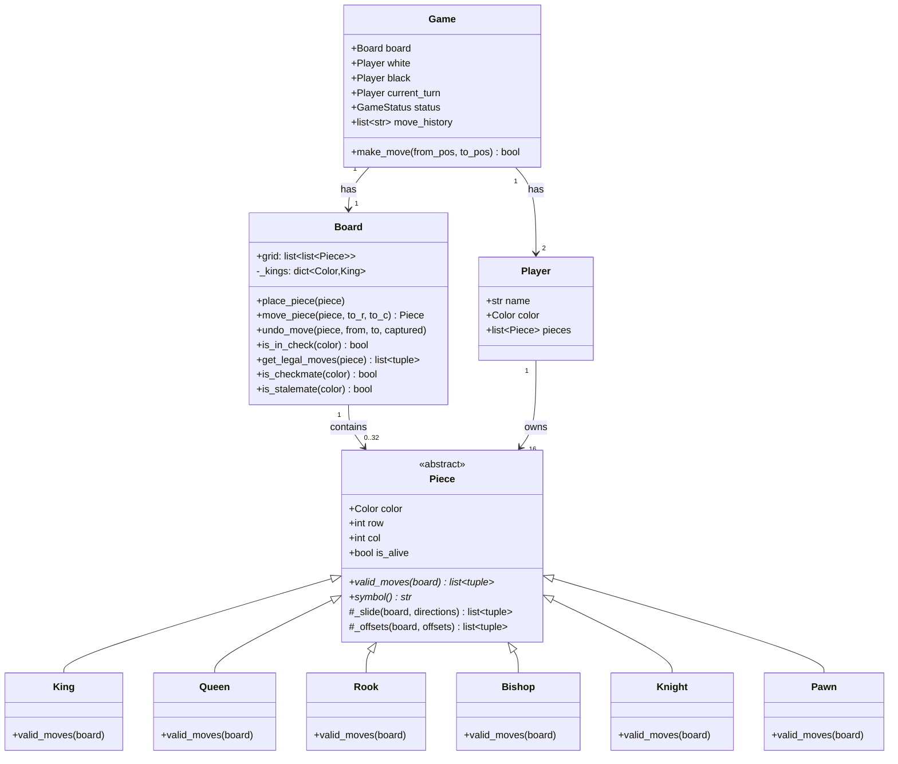

# ♟️ CHESS — Complete LLD Guide
## The Definitive 17-Section Edition — V2.0

---

## 📖 Table of Contents
1. [🎯 Problem Statement & Context](#-1-problem-statement--context)
2. [🗣️ Requirement Gathering](#-2-requirement-gathering)
3. [✅ Requirements (FR + NFR)](#-3-requirements)
4. [🧠 Key Insight: Piece ABC + `_slide()`](#-4-key-insight)
5. [📐 Class Diagram & Entity Relationships](#-5-class-diagram)
6. [🔧 API Design (Public Interface)](#-6-api-design)
7. [🏗️ Complete Code Implementation](#-7-complete-code)
8. [📊 Data Structure Choices & Trade-offs](#-8-data-structure-choices)
9. [🔒 Concurrency & Thread Safety Deep Dive](#-9-concurrency-deep-dive)
10. [🧪 SOLID Principles Mapping](#-10-solid-principles)
11. [🎨 Design Patterns Used](#-11-design-patterns)
12. [💾 Database Schema (Production View)](#-12-database-schema)
13. [⚠️ Edge Cases & Error Handling](#-13-edge-cases)
14. [🎮 Full Working Demo](#-14-full-working-demo)
15. [🎤 Interviewer Follow-ups (15+)](#-15-interviewer-follow-ups)
16. [⏱️ Interview Strategy (45-min Plan)](#-16-interview-strategy)
17. [🧠 Quick Recall Cheat Sheet](#-17-quick-recall)

---

# 🎯 1. Problem Statement & Context

## What You're Designing

> Design a **Chess Game** for two players with complete piece movement validation, capture logic, turn alternation, and check/checkmate detection. Support all 6 piece types (King, Queen, Rook, Bishop, Knight, Pawn), each with unique movement rules.

## Real-World Context

| Aspect | Detail |
|--------|--------|
| Board | 8×8 grid (64 squares) |
| Pieces per player | 16 (1K, 1Q, 2R, 2B, 2N, 8P) |
| Total starting pieces | 32 |
| Possible games | ~10^120 (Shannon number) |
| Online chess users | 150M+ (chess.com + lichess) |

## Why Interviewers Love This Problem

| What They're Testing | How This Problem Tests It |
|---------------------|--------------------------|
| **ABC / Polymorphism** | 6 piece types with DIFFERENT `valid_moves()` — pure OOP |
| **Template Method** | Can you spot that Rook, Bishop, Queen share `_slide()` logic? |
| **Move simulation** | To check if a move is legal, you must SIMULATE it and verify king safety |
| **State validation** | Can't move into check, pinned pieces can't move freely |
| **Board representation** | 2D grid with O(1) access — fundamental data structure choice |
| **Complex game logic** | Check detection, checkmate (∀ moves still in check), stalemate |

---

# 🗣️ 2. Requirement Gathering

## Must-Ask Questions

In an interview, spend **5 minutes** scoping this problem. It's MASSIVE — you must narrow it down.

| # | Question | WHY You Ask | Design Impact |
|---|----------|-------------|---------------|
| 1 | "Standard 8×8 chess with all 6 piece types?" | Board dimensions + piece count | Fixed 8×8 grid, 6 subclasses of `Piece` |
| 2 | "Do we need check and checkmate detection?" | **THE hard part** — most candidates skip this | Need move simulation: try move → is king safe? → undo |
| 3 | "Castling, en passant, pawn promotion?" | These are COMPLEX special moves | **Scope control: say "extension"** — focus on core 6 pieces |
| 4 | "Two human players or AI opponent?" | Strategy pattern for AI | Core = two humans, AI = extension |
| 5 | "Move timer / chess clock?" | Threading for timer | Extension — out of core scope |
| 6 | "Move history and undo?" | Command pattern | Extension — mention design possibility |
| 7 | "Draw conditions (stalemate, 50-move, threefold)?" | Game end alternatives | Stalemate in core, others = extension |
| 8 | "Console UI or GUI?" | Display complexity | Console with Unicode pieces for LLD |

### 🎯 HOW to scope in interviews

> **SAY:** "For the core design, I'll implement all 6 pieces with standard moves, check/checkmate detection, and turn alternation. Castling, en passant, and pawn promotion I'll mention as extensions that follow naturally from the base design."

This shows you understand the FULL problem but can prioritize.

### Questions That Show DEPTH

| # | Question | Shows You Think About... |
|---|----------|--------------------------|
| 9 | "Should invalid moves be silently rejected or raise errors?" | Error handling strategy |
| 10 | "Is the board coordinate (0,0) top-left or bottom-left?" | Implementation detail that causes bugs |
| 11 | "Can a piece move to protect the king from check?" | Understanding of legal move filtering |

---

# ✅ 3. Requirements

## Functional Requirements

| Priority | ID | Requirement | Complexity |
|----------|-----|-------------|-----------|
| **P0** | FR-1 | Initialize 8×8 board with 32 pieces in standard positions | Medium |
| **P0** | FR-2 | Validate moves per piece-specific movement rules | High |
| **P0** | FR-3 | Turn alternation (White → Black → White...) | Low |
| **P0** | FR-4 | Capture opponent pieces | Medium |
| **P0** | FR-5 | **Check detection** — is king currently threatened? | High |
| **P0** | FR-6 | **Checkmate detection** — no legal moves AND in check | Very High |
| **P1** | FR-7 | **Stalemate detection** — no legal moves but NOT in check | High |
| **P1** | FR-8 | Display board with Unicode pieces | Low |
| **P2** | FR-9 | Move history tracking | Low |
| **P2** | FR-10 | Castling, en passant, pawn promotion | Very High |

## Non-Functional Requirements

| ID | Requirement | Why |
|----|-------------|-----|
| NFR-1 | O(1) piece access by position | Board lookup speed |
| NFR-2 | Move validation < 10ms | Responsive gameplay |
| NFR-3 | Legal move calculation handles all edge cases | Correctness |

---

# 🧠 4. Key Insight: Piece ABC & the `_slide()` Template Method

## 🤔 THINK: Rook moves horizontally/vertically ANY distance. Bishop moves diagonally ANY distance. Queen does BOTH. How do you avoid writing the same sliding logic 3 times?

<details>
<summary>👀 Click to reveal — THE trick that saves 50% of movement code</summary>

### The Problem: Code Duplication in Sliding Pieces

Without `_slide()`, you'd write this for EACH sliding piece:

```python
# ❌ BAD: Rook has 4 direction loops
class Rook(Piece):
    def valid_moves(self, board):
        moves = []
        # NORTH: go up until blocked
        for r in range(self.row - 1, -1, -1):
            cell = board.grid[r][self.col]
            if cell is None:
                moves.append((r, self.col))
            elif cell.color != self.color:
                moves.append((r, self.col))  # Capture
                break
            else:
                break  # Own piece blocks
        # SOUTH: copy-paste with different range
        # EAST: copy-paste with column variation
        # WEST: copy-paste...
        return moves

# Bishop: EXACT same pattern, just diagonal directions
# Queen: EXACT same pattern, ALL 8 directions
# Total: ~120 lines of nearly identical code 💀
```

### The Solution: `_slide()` as a Shared Helper

```python
class Piece(ABC):
    def _slide(self, board, directions: list[tuple[int,int]]) -> list[tuple]:
        """
        Slide in each direction until blocked.
        Works for any number of directions.
        
        Algorithm:
        1. For each direction (dr, dc):
        2.   Start from current position
        3.   Move one step at a time in that direction
        4.   If empty square: add to moves, keep going
        5.   If enemy piece: add to moves (capture!), STOP
        6.   If own piece: STOP (can't capture own)
        7.   If off board: STOP
        """
        moves = []
        for dr, dc in directions:
            r, c = self.row + dr, self.col + dc
            while 0 <= r < 8 and 0 <= c < 8:
                target = board.grid[r][c]
                if target is None:
                    moves.append((r, c))       # Empty — keep sliding
                elif target.color != self.color:
                    moves.append((r, c))       # Enemy — capture and stop
                    break
                else:
                    break                       # Own piece — blocked
                r += dr
                c += dc
        return moves
```

### Now Each Piece is ONE Line

```python
class Rook(Piece):
    DIRECTIONS = [(-1,0), (1,0), (0,-1), (0,1)]    # ↑ ↓ ← →
    def valid_moves(self, board):
        return self._slide(board, self.DIRECTIONS)

class Bishop(Piece):
    DIRECTIONS = [(-1,-1), (-1,1), (1,-1), (1,1)]  # ↗ ↖ ↘ ↙
    def valid_moves(self, board):
        return self._slide(board, self.DIRECTIONS)

class Queen(Piece):
    def valid_moves(self, board):
        # Queen = Rook + Bishop — inherits BOTH direction sets!
        return self._slide(board, Rook.DIRECTIONS + Bishop.DIRECTIONS)
```

**Queen = Rook + Bishop.** No code duplication!

### Visual: Direction Vectors

```
        Bishop Dirs        Rook Dirs           Queen Dirs (ALL 8)
        
      ↖ . ↗             . ↑ .              ↖ ↑ ↗
      . B .              ← R →              ← Q →
      ↙ . ↘             . ↓ .              ↙ ↓ ↘

   (-1,-1) (-1,+1)     (-1,0)           ALL 8 combined
   (+1,-1) (+1,+1)     (0,-1) (0,+1)
                         (+1,0)
```

### What About King and Knight?

They DON'T slide — they jump to fixed offsets. So we use `_offsets()`:

```python
class Piece(ABC):
    def _offsets(self, board, offsets: list[tuple]) -> list[tuple]:
        """For pieces that move to fixed positions (King, Knight)."""
        moves = []
        for dr, dc in offsets:
            r, c = self.row + dr, self.col + dc
            if 0 <= r < 8 and 0 <= c < 8:
                target = board.grid[r][c]
                if target is None or target.color != self.color:
                    moves.append((r, c))
        return moves

class King(Piece):
    def valid_moves(self, board):
        return self._offsets(board, [
            (-1,-1),(-1,0),(-1,1),(0,-1),(0,1),(1,-1),(1,0),(1,1)
        ])  # All 8 adjacent squares, but only 1 step

class Knight(Piece):
    def valid_moves(self, board):
        return self._offsets(board, [
            (-2,-1),(-2,1),(-1,-2),(-1,2),(1,-2),(1,2),(2,-1),(2,1)
        ])  # L-shape: 2 squares one way, 1 square perpendicular
```

### Complete Movement Summary

| Piece | Method | Directions/Offsets | Slides? | Special |
|-------|--------|-------------------|---------|---------|
| **King** | `_offsets()` | 8 adjacent | ❌ 1 step only | Can't move into check |
| **Queen** | `_slide()` | 8 directions | ✅ Any distance | = Rook + Bishop |
| **Rook** | `_slide()` | 4 orthogonal | ✅ Any distance | Castling (ext) |
| **Bishop** | `_slide()` | 4 diagonal | ✅ Any distance | — |
| **Knight** | `_offsets()` | 8 L-shapes | ❌ Jumps over | Only piece that jumps |
| **Pawn** | Custom | Direction-dependent | ❌ 1-2 steps | Capture ≠ Move direction! |

### 🤔 Why is Pawn Special?

Pawn is the ONLY piece where **movement direction ≠ capture direction**:
- **Moves** forward (vertical)
- **Captures** diagonally
- Can move **2 squares** from starting position but only **1 square** otherwise
- Direction depends on color (White goes UP, Black goes DOWN)

This means Pawn can't use `_slide()` or `_offsets()` — it needs custom logic.

</details>

---

# 📐 5. Class Diagram & Entity Relationships

## Mermaid Class Diagram



## Entity Relationships

```
Game
├── Board (8×8 grid)
│   ├── Piece (ABC) ──→ 6 concrete subclasses
│   │   ├── Sliding: Rook, Bishop, Queen (use _slide)
│   │   ├── Jumping: King, Knight (use _offsets)  
│   │   └── Special: Pawn (custom logic)
│   └── _kings dict for O(1) check detection
├── Player (White)
│   └── 16 Piece references
└── Player (Black)
    └── 16 Piece references
```

### Key Relationships

| Relationship | Type | Why |
|-------------|------|-----|
| Board → Piece | Composition | Board owns pieces on the grid |
| Player → Piece | Association | Player tracks their pieces (for display) |
| Game → Board | Composition | Game owns one board |
| Game → Player | Aggregation | Game has exactly 2 players |
| Piece → Board | Dependency | Pieces need board context for `valid_moves()` |

---

# 🔧 6. API Design (Public Interface)

## 🤔 THINK: What does the external world (players, UI) need to call?

```python
class Game:
    """Public API — what the players interact with."""
    
    def make_move(self, from_pos: tuple[int,int], 
                  to_pos: tuple[int,int]) -> bool:
        """
        Move piece from (row, col) to (row, col).
        
        Validates:
        1. There IS a piece at from_pos
        2. The piece belongs to the current player
        3. The move is in the piece's valid_moves()
        4. The move doesn't leave OWN king in check
        
        After move:
        - Checks if opponent is now in check/checkmate/stalemate
        - Switches turn
        - Updates move history
        
        Returns True if move executed, False if invalid.
        """
    
    def get_legal_moves(self, row: int, col: int) -> list[tuple]:
        """
        All legal moves for pieace at (row, col).
        'Legal' = valid_moves filtered by: doesn't leave king in check.
        Used by UI to highlight available squares.
        """
    
    def get_board_display(self) -> str:
        """Render current board state as ASCII/Unicode."""
    
    def is_game_over(self) -> bool:
        """True if status is not ACTIVE."""

class Board:
    """Internal API — used by Game, not by players directly."""
    
    def is_in_check(self, color: Color) -> bool:
        """Can ANY opponent piece reach this color's King?"""
    
    def get_legal_moves(self, piece: Piece) -> list[tuple]:
        """
        THE most important method.
        For each raw valid_move:
          1. Simulate the move on the board
          2. Check if our own king is in check
          3. Undo the move
          4. Only keep moves where king is safe
        """
    
    def is_checkmate(self, color: Color) -> bool:
        """In check AND no legal moves exist for any piece."""
    
    def is_stalemate(self, color: Color) -> bool:
        """NOT in check AND no legal moves exist."""
```

### Why This API Separation?

| Layer | Responsibility | Who Calls It |
|-------|---------------|-------------|
| `Game` | Turn validation, game flow, history | Players / UI |
| `Board` | Move mechanics, check detection, legal move filtering | Game (internally) |
| `Piece` | Raw movement rules (no check awareness) | Board (internally) |

This is **Layered Architecture**: Players → Game → Board → Piece

---

# 🏗️ 7. Complete Code Implementation

## Enums

```python
from abc import ABC, abstractmethod
from enum import Enum

class Color(Enum):
    WHITE = "WHITE"
    BLACK = "BLACK"
    
    @property
    def opponent(self):
        return Color.BLACK if self == Color.WHITE else Color.WHITE

class GameStatus(Enum):
    ACTIVE = 1
    WHITE_WINS = 2
    BLACK_WINS = 3
    STALEMATE = 4
```

## Piece ABC (The Core Abstraction)

```python
class Piece(ABC):
    """
    Abstract base for all chess pieces.
    
    Key design decisions:
    1. valid_moves() returns RAW moves — no check filtering
    2. _slide() is shared by Rook, Bishop, Queen
    3. _offsets() is shared by King, Knight
    4. Position (row, col) is stored ON the piece — not just on the board
       This makes it easy to compute moves without scanning the grid
    """
    def __init__(self, color: Color, row: int, col: int):
        self.color = color
        self.row = row
        self.col = col
        self.is_alive = True
    
    @abstractmethod
    def valid_moves(self, board: 'Board') -> list[tuple[int, int]]:
        """
        Return all squares this piece could potentially move to.
        Does NOT check if the move leaves own king in check.
        That filtering happens in Board.get_legal_moves().
        """
        pass
    
    @abstractmethod
    def symbol(self) -> str:
        """Unicode symbol for display (♔♕♖♗♘♙ / ♚♛♜♝♞♟)."""
        pass
    
    def _slide(self, board: 'Board', directions: list[tuple[int,int]]) -> list[tuple]:
        """
        Slide along each direction until hitting boundary, own piece, or enemy.
        
        Used by: Rook (4 dirs), Bishop (4 dirs), Queen (8 dirs)
        
        How it works for ONE direction (e.g., North = (-1, 0)):
            Start at piece position (4, 3)
            Step 1: (3, 3) — empty? Add to moves, keep going
            Step 2: (2, 3) — empty? Add to moves, keep going  
            Step 3: (1, 3) — enemy? Add to moves (capture!), STOP
            
            OR
            Step 3: (1, 3) — own piece? DON'T add, STOP (blocked)
        """
        moves = []
        for dr, dc in directions:
            r, c = self.row + dr, self.col + dc
            while 0 <= r < 8 and 0 <= c < 8:
                target = board.grid[r][c]
                if target is None:
                    moves.append((r, c))         # Empty square — keep sliding
                elif target.color != self.color:
                    moves.append((r, c))         # Enemy piece — capture and stop
                    break
                else:
                    break                         # Own piece — blocked, stop
                r += dr
                c += dc
        return moves
    
    def _offsets(self, board: 'Board', offsets: list[tuple[int,int]]) -> list[tuple]:
        """
        Check fixed offsets from current position.
        Used by: King (8 adjacent), Knight (8 L-shapes)
        
        Unlike _slide(), these are ONE-STEP moves — no looping.
        """
        moves = []
        for dr, dc in offsets:
            r, c = self.row + dr, self.col + dc
            if 0 <= r < 8 and 0 <= c < 8:
                target = board.grid[r][c]
                if target is None or target.color != self.color:
                    moves.append((r, c))
        return moves
```

## All 6 Piece Types

```python
class King(Piece):
    """Moves 1 square in any direction. Cannot move into check (filtered by Board)."""
    def valid_moves(self, board):
        return self._offsets(board, [
            (-1,-1), (-1,0), (-1,1),
            ( 0,-1),         ( 0,1),
            ( 1,-1), ( 1,0), ( 1,1),
        ])
    def symbol(self):
        return "♔" if self.color == Color.WHITE else "♚"


class Queen(Piece):
    """Slides in all 8 directions. Most powerful piece."""
    def valid_moves(self, board):
        return self._slide(board, [
            (-1,0), (1,0), (0,-1), (0,1),       # Rook directions
            (-1,-1), (-1,1), (1,-1), (1,1),       # Bishop directions
        ])
    def symbol(self):
        return "♕" if self.color == Color.WHITE else "♛"


class Rook(Piece):
    """Slides horizontally and vertically."""
    DIRECTIONS = [(-1,0), (1,0), (0,-1), (0,1)]
    def valid_moves(self, board):
        return self._slide(board, self.DIRECTIONS)
    def symbol(self):
        return "♖" if self.color == Color.WHITE else "♜"


class Bishop(Piece):
    """Slides diagonally."""
    DIRECTIONS = [(-1,-1), (-1,1), (1,-1), (1,1)]
    def valid_moves(self, board):
        return self._slide(board, self.DIRECTIONS)
    def symbol(self):
        return "♗" if self.color == Color.WHITE else "♝"


class Knight(Piece):
    """
    L-shaped jump: 2 squares in one direction, 1 in perpendicular.
    ONLY piece that can jump over other pieces.
    """
    def valid_moves(self, board):
        return self._offsets(board, [
            (-2,-1), (-2,1),   # 2 up, 1 left/right
            (-1,-2), (-1,2),   # 1 up, 2 left/right
            ( 1,-2), ( 1,2),   # 1 down, 2 left/right
            ( 2,-1), ( 2,1),   # 2 down, 1 left/right
        ])
    def symbol(self):
        return "♘" if self.color == Color.WHITE else "♞"


class Pawn(Piece):
    """
    Most complex piece despite being the weakest:
    - Moves FORWARD (direction depends on color)
    - Captures DIAGONALLY (different from move direction!)
    - Can move 2 squares from starting row
    - Cannot move backward
    """
    def valid_moves(self, board):
        moves = []
        # White moves UP (row decreases), Black moves DOWN (row increases)
        direction = -1 if self.color == Color.WHITE else 1
        start_row = 6 if self.color == Color.WHITE else 1
        
        # ── Forward 1 (only if empty — pawn can't capture forward!) ──
        r = self.row + direction
        if 0 <= r < 8 and board.grid[r][self.col] is None:
            moves.append((r, self.col))
            
            # ── Forward 2 from starting row (only if BOTH squares empty) ──
            r2 = r + direction
            if self.row == start_row and 0 <= r2 < 8 and board.grid[r2][self.col] is None:
                moves.append((r2, self.col))
        
        # ── Diagonal capture (only if enemy piece present!) ──
        for dc in [-1, 1]:
            r, c = self.row + direction, self.col + dc
            if 0 <= r < 8 and 0 <= c < 8:
                target = board.grid[r][c]
                if target is not None and target.color != self.color:
                    moves.append((r, c))
        
        return moves
    
    def symbol(self):
        return "♙" if self.color == Color.WHITE else "♟"
```

## Board — Grid + Check Detection

```python
class Board:
    """
    The chess board — 8×8 grid with move mechanics and check detection.
    
    Key design decisions:
    1. grid[0][0] = top-left (Black's back rank, a8)
    2. _kings dict for O(1) king lookup (needed on EVERY move)
    3. move_piece + undo_move for simulation without copying board
    """
    def __init__(self):
        self.grid: list[list[Piece | None]] = [[None]*8 for _ in range(8)]
        self._kings: dict[Color, King] = {}  # O(1) king access
    
    def place_piece(self, piece: Piece):
        """Place a piece on the board. Track kings separately."""
        self.grid[piece.row][piece.col] = piece
        if isinstance(piece, King):
            self._kings[piece.color] = piece
    
    def move_piece(self, piece: Piece, to_r: int, to_c: int) -> Piece | None:
        """
        Move piece to target square. Returns captured piece (if any).
        MUTATES the board — use undo_move() to reverse.
        """
        captured = self.grid[to_r][to_c]
        if captured:
            captured.is_alive = False
        
        # Clear old position
        self.grid[piece.row][piece.col] = None
        # Update piece coordinates
        piece.row, piece.col = to_r, to_c
        # Place at new position
        self.grid[to_r][to_c] = piece
        
        return captured
    
    def undo_move(self, piece: Piece, from_r: int, from_c: int,
                  to_r: int, to_c: int, captured: Piece | None):
        """
        Reverse a move. Essential for check simulation.
        
        Why not just copy the board?
        - Copying 8×8 grid + 32 pieces = expensive
        - We simulate EVERY candidate move for EVERY piece
        - That's up to ~100 simulations per turn
        - Undo is O(1), copy is O(64 + pieces)
        """
        # Restore captured piece (if any)
        self.grid[to_r][to_c] = captured
        if captured:
            captured.is_alive = True
        
        # Move piece back
        piece.row, piece.col = from_r, from_c
        self.grid[from_r][from_c] = piece
    
    def is_in_check(self, color: Color) -> bool:
        """
        Is the king of 'color' currently under attack?
        
        Algorithm:
        1. Find our King (O(1) via _kings dict)
        2. For EVERY opponent piece still alive:
        3.   Can it reach our King's position?
        4. If ANY can → we're in check
        
        Time: O(P × M) where P = opponent pieces, M = max moves per piece
        """
        king = self._kings[color]
        opponent_color = color.opponent
        
        for row in self.grid:
            for piece in row:
                if piece and piece.color == opponent_color and piece.is_alive:
                    # Check if this opponent piece can reach our King
                    if (king.row, king.col) in piece.valid_moves(self):
                        return True
        return False
    
    def get_legal_moves(self, piece: Piece) -> list[tuple[int, int]]:
        """
        THE most critical method in the entire system.
        
        Returns only moves that DON'T leave our own King in check.
        
        Algorithm (Simulation + Undo):
        For each candidate move from piece.valid_moves():
          1. EXECUTE the move on the real board
          2. CHECK: is our King still safe?
          3. UNDO the move (restore board)
          4. If King was safe → this move is LEGAL
          
        Why simulate-then-undo instead of copy?
        - We may need to check 20+ candidate moves per piece
        - Copy = O(64) per simulation
        - Undo = O(1) per simulation
        - 20 moves × O(1) undo = O(20) vs 20 × O(64) copy = O(1280)
        
        This method handles ALL edge cases automatically:
        - Pinned pieces: moving them exposes King → filtered out
        - King moving into check: destination square attacked → filtered
        - Blocking check: only moves that block the attack line survive
        """
        legal = []
        from_r, from_c = piece.row, piece.col
        
        for to_r, to_c in piece.valid_moves(self):
            # Step 1: Execute the move
            captured = self.move_piece(piece, to_r, to_c)
            
            # Step 2: Is our king safe after this move?
            if not self.is_in_check(piece.color):
                legal.append((to_r, to_c))  # SAFE — keep this move
            
            # Step 3: Undo the move (regardless of whether it was legal)
            self.undo_move(piece, from_r, from_c, to_r, to_c, captured)
        
        return legal
    
    def is_checkmate(self, color: Color) -> bool:
        """
        Checkmate = in check AND no legal moves for ANY piece.
        
        Three ways to escape check:
        1. MOVE the King to a safe square
        2. CAPTURE the attacking piece
        3. BLOCK the attack line (only for sliding pieces)
        
        If NONE of these work → checkmate.
        
        Our get_legal_moves() simulation handles all three automatically!
        """
        if not self.is_in_check(color):
            return False  # Not in check → can't be checkmate
        return self._has_no_legal_moves(color)
    
    def is_stalemate(self, color: Color) -> bool:
        """
        Stalemate = NOT in check AND no legal moves.
        Result: DRAW (not a win for either side).
        
        Example: King in corner, not threatened, but every adjacent
        square is attacked. No other pieces alive.
        """
        if self.is_in_check(color):
            return False  # In check → could be checkmate, not stalemate
        return self._has_no_legal_moves(color)
    
    def _has_no_legal_moves(self, color: Color) -> bool:
        """Check if ANY piece of this color has at least one legal move."""
        for row in self.grid:
            for piece in row:
                if piece and piece.color == color and piece.is_alive:
                    if self.get_legal_moves(piece):
                        return False  # Found at least one legal move
        return True  # No legal moves exist
    
    def display(self):
        """Render board with coordinates and Unicode pieces."""
        print("\n     a   b   c   d   e   f   g   h")
        print("   ┌───┬───┬───┬───┬───┬───┬───┬───┐")
        for r in range(8):
            row_str = f" {8-r} │"
            for c in range(8):
                piece = self.grid[r][c]
                sym = f" {piece.symbol()} " if piece else "   "
                row_str += sym + "│"
            print(row_str + f" {8-r}")
            if r < 7:
                print("   ├───┼───┼───┼───┼───┼───┼───┼───┤")
        print("   └───┴───┴───┴───┴───┴───┴───┴───┘")
        print("     a   b   c   d   e   f   g   h\n")
```

## Player & Game

```python
class Player:
    def __init__(self, name: str, color: Color):
        self.name = name
        self.color = color
        self.pieces: list[Piece] = []
    
    def __str__(self):
        alive = sum(1 for p in self.pieces if p.is_alive)
        return f"{'⬜' if self.color == Color.WHITE else '⬛'} {self.name} ({alive} pieces)"


class Game:
    """
    The game controller — validates turns, executes moves, detects game end.
    
    Flow per turn:
    1. Validate: is it this player's piece?
    2. Get legal moves (filtered for check)
    3. Execute the move
    4. Check game state (check, checkmate, stalemate)
    5. Switch turn
    """
    def __init__(self, white_name: str = "White", black_name: str = "Black"):
        self.board = Board()
        self.white = Player(white_name, Color.WHITE)
        self.black = Player(black_name, Color.BLACK)
        self.current_turn = self.white
        self.status = GameStatus.ACTIVE
        self.move_history: list[str] = []
        self.move_count = 0
        self._setup_board()
    
    def _setup_board(self):
        """
        Standard starting position:
        Row 0 (rank 8): Black back rank  [♜♞♝♛♚♝♞♜]
        Row 1 (rank 7): Black pawns      [♟♟♟♟♟♟♟♟]
        Row 2-5:        Empty
        Row 6 (rank 2): White pawns      [♙♙♙♙♙♙♙♙]
        Row 7 (rank 1): White back rank  [♖♘♗♕♔♗♘♖]
        """
        back_rank = [Rook, Knight, Bishop, Queen, King, Bishop, Knight, Rook]
        
        for i, PieceCls in enumerate(back_rank):
            # Black back rank (row 0)
            bp = PieceCls(Color.BLACK, 0, i)
            self.black.pieces.append(bp)
            self.board.place_piece(bp)
            
            # White back rank (row 7)
            wp = PieceCls(Color.WHITE, 7, i)
            self.white.pieces.append(wp)
            self.board.place_piece(wp)
        
        for i in range(8):
            # Black pawns (row 1)
            bp = Pawn(Color.BLACK, 1, i)
            self.black.pieces.append(bp)
            self.board.place_piece(bp)
            
            # White pawns (row 6)
            wp = Pawn(Color.WHITE, 6, i)
            self.white.pieces.append(wp)
            self.board.place_piece(wp)
    
    def make_move(self, from_pos: tuple, to_pos: tuple) -> bool:
        """
        Execute a move with full validation.
        
        Validation order:
        1. Game must be active
        2. There must be a piece at from_pos
        3. Piece must belong to current player
        4. Move must be in legal moves (handles check filtering)
        
        After successful move:
        - Update move history
        - Check for check/checkmate/stalemate
        - Switch turn
        """
        if self.status != GameStatus.ACTIVE:
            print("   ❌ Game is over!"); return False
        
        fr, fc = from_pos
        tr, tc = to_pos
        
        # Validation 1: Piece exists?
        piece = self.board.grid[fr][fc]
        if not piece:
            print(f"   ❌ No piece at ({fr},{fc})!"); return False
        
        # Validation 2: Correct color?
        if piece.color != self.current_turn.color:
            print(f"   ❌ Not your piece! It's {self.current_turn.name}'s turn.")
            return False
        
        # Validation 3: Legal move?
        legal_moves = self.board.get_legal_moves(piece)
        if (tr, tc) not in legal_moves:
            print(f"   ❌ Illegal move for {piece.symbol()} at ({fr},{fc})!")
            if self.board.is_in_check(piece.color):
                print("   ⚠️ Your King is in CHECK — you must escape it!")
            return False
        
        # Execute move
        captured = self.board.move_piece(piece, tr, tc)
        self.move_count += 1
        
        # Record move in notation
        col_letters = "abcdefgh"
        notation = f"{self.move_count}. {piece.symbol()} {col_letters[fc]}{8-fr}→{col_letters[tc]}{8-tr}"
        if captured:
            notation += f" ×{captured.symbol()}"
        
        # Check game state for OPPONENT
        opponent_color = self.current_turn.color.opponent
        
        if self.board.is_checkmate(opponent_color):
            winner = self.current_turn.name
            self.status = (GameStatus.WHITE_WINS if opponent_color == Color.BLACK 
                          else GameStatus.BLACK_WINS)
            notation += "#"  # Checkmate symbol
            print(f"   {notation}")
            print(f"\n   ♚♚♚ CHECKMATE! {winner} WINS! ♚♚♚")
        elif self.board.is_stalemate(opponent_color):
            self.status = GameStatus.STALEMATE
            notation += " (stalemate)"
            print(f"   {notation}")
            print(f"\n   🤝 STALEMATE — It's a DRAW!")
        elif self.board.is_in_check(opponent_color):
            notation += "+"  # Check symbol
            print(f"   {notation}")
            print(f"   ⚠️ CHECK!")
        else:
            print(f"   {notation}")
        
        self.move_history.append(notation)
        
        # Switch turn
        self.current_turn = self.black if self.current_turn == self.white else self.white
        return True
```

---

# 📊 8. Data Structure Choices & Trade-offs

## 🤔 THINK: Why these specific data structures? This is what separates senior from junior.

| Data Structure | Where | Why This? | Alternative | Why Not? |
|---------------|-------|-----------|-------------|----------|
| `list[list[Piece]]` 8×8 | Board.grid | **O(1) access** by (row, col). Dense grid — every cell used | `dict[(r,c): Piece]` | Grid is always 8×8, list is more cache-friendly. Dict has overhead for 64 entries |
| `dict[Color, King]` | Board._kings | **O(1) king lookup** for check detection — called on EVERY move | Scan grid for King | check detection runs ~100x per turn during move simulation |
| `list[Piece]` | Player.pieces | Track all pieces for a color. Need for captured display | Scan grid | O(32) scan vs O(16) stored |
| `list[str]` | Game.move_history | Append-only log, chronological | Stack | Need full history (not just last move) for replay |
| `list[tuple]` | valid_moves return | Ordered list of (row, col) pairs | set | Need deterministic ordering for consistent behavior |

### Why Store Position ON the Piece?

```python
# ❌ Position only on board — piece must search for itself
class Piece:
    def valid_moves(self, board):
        # WHERE AM I? Must scan 64 squares to find myself! O(64) 💀
        for r in range(8):
            for c in range(8):
                if board.grid[r][c] is self:
                    my_row, my_col = r, c
        # Now compute moves from (my_row, my_col)

# ✅ Position stored on piece — O(1) access
class Piece:
    def __init__(self, color, row, col):
        self.row = row  # Always knows where it is
        self.col = col
    
    def valid_moves(self, board):
        # Immediately use self.row, self.col — O(1)
```

The cost is maintaining consistency: `move_piece()` and `undo_move()` must update BOTH `board.grid` AND `piece.row, piece.col`.

---

# 🔒 9. Concurrency & Thread Safety Deep Dive

## Chess is Inherently Sequential — But Online Chess is NOT

### Local Two-Player: No Concurrency

```
Turn 1: White thinks → White moves → Validate → Switch
Turn 2: Black thinks → Black moves → Validate → Switch
Strictly sequential — no race conditions possible.
```

### Online Chess: Server Must Handle Concurrent Messages

```
Timeline: Both players send moves via WebSocket

t=0: White sends "e2→e4" (valid — White's turn)
t=1: Black sends "e7→e5" (arrives while server processes White's move!)

WITHOUT synchronization:
  Server processes both simultaneously → corrupted board state! 💀

WITH per-game lock:
  t=0: White's message acquires game lock → processes e2→e4 → switches turn → releases
  t=1: Black's message acquires game lock → it IS Black's turn now → processes e7→e5 → releases ✅
```

```python
# Online chess server:
class OnlineGame:
    def __init__(self):
        self.game = Game()
        self._lock = threading.Lock()
    
    def handle_move(self, player_id: int, from_pos: tuple, to_pos: tuple):
        with self._lock:
            # Validate it's this player's turn
            if player_id != self._current_player_id():
                return {"error": "Not your turn!"}
            
            success = self.game.make_move(from_pos, to_pos)
            if success:
                return {"status": "ok", "board": self.game.board.serialize()}
            else:
                return {"error": "Illegal move!"}
```

### AI Computation: Background Thread

```python
# AI thinks while keeping UI responsive:
import threading

def ai_move(game):
    """Run in background thread."""
    # Minimax with alpha-beta may take seconds
    best_move = minimax(game.board, depth=5)
    
    # Back on main thread — apply the move
    game.make_move(best_move.from_pos, best_move.to_pos)

# Start AI computation without blocking UI:
thread = threading.Thread(target=ai_move, args=(game,))
thread.start()
```

### Move Timer: Separate Thread

```python
class ChessTimer:
    def __init__(self, time_per_player: float):
        self.remaining = {Color.WHITE: time_per_player, Color.BLACK: time_per_player}
        self._running = False
        self._current_color = Color.WHITE
    
    def start(self):
        self._running = True
        self._tick()
    
    def _tick(self):
        while self._running:
            time.sleep(0.1)
            self.remaining[self._current_color] -= 0.1
            if self.remaining[self._current_color] <= 0:
                print(f"   ⏰ {self._current_color.name} ran out of time!")
                self._running = False
```

---

# 🧪 10. SOLID Principles Mapping

## 🤔 THINK: Where does each SOLID principle appear in the Chess design?

| Principle | Where Applied | Detailed Explanation |
|-----------|--------------|---------------------|
| **S — Single Responsibility** | Each class has ONE job | `Piece` = movement rules only. `Board` = grid management + check detection. `Game` = turn flow + game state. Player = identity. None of them does two things. |
| **O — Open/Closed** ⭐ | Piece hierarchy | Adding a new piece type (e.g., custom variant like "Archbishop" = Bishop + Knight) = new subclass. **ZERO changes** to Board, Game, or existing pieces. Board calls `piece.valid_moves()` polymorphically. |
| **L — Liskov Substitution** | Board processes ALL pieces identically | `Board.get_legal_moves(piece)` works for ANY Piece subclass. Board never checks `isinstance(piece, Rook)`. Every piece is substitutable. |
| **I — Interface Segregation** | Piece ABC is minimal | Only 2 abstract methods: `valid_moves()` and `symbol()`. No bloat. Not every piece needs `can_castle()` or `can_promote()` — those stay in specific subclasses. |
| **D — Dependency Inversion** | Board depends on Piece ABC | Board never imports `Rook`, `Knight`, etc. It only knows `Piece`. This means `game.py` can import `Board` without knowing which concrete pieces exist. |

### OCP Deep Dive: Adding "Archbishop" (Custom Piece)

```python
# Archbishop = Bishop + Knight movement (used in some chess variants)
class Archbishop(Piece):
    def valid_moves(self, board):
        # Combine both movement types — reuse existing helpers!
        bishop_moves = self._slide(board, Bishop.DIRECTIONS)
        knight_moves = self._offsets(board, [
            (-2,-1),(-2,1),(-1,-2),(-1,2),(1,-2),(1,2),(2,-1),(2,1)
        ])
        return bishop_moves + knight_moves
    
    def symbol(self):
        return "⛪" if self.color == Color.WHITE else "🏛️"

# Place on board — ZERO changes to Board or Game:
ab = Archbishop(Color.WHITE, 7, 4)
board.place_piece(ab)  # Just works! Board treats it as a Piece.
```

---

# 🎨 11. Design Patterns Used

| Pattern | Where | Why This Pattern | Alternative | Why Not The Alternative |
|---------|-------|-----------------|-------------|------------------------|
| **ABC / Polymorphism** ⭐ | Piece hierarchy | 6 types with DIFFERENT moves — must dispatch dynamically | if-elif chain | Adding piece = modify 5+ methods. Violates OCP |
| **Template Method** ⭐ | `_slide()` in Piece | Rook/Bishop/Queen share sliding logic, differ only in directions | Copy-paste per piece | 3× code duplication, 3× bug surface |
| **Strategy** | (Extension) AI player | MinimaxStrategy, AlphaBetaStrategy, RandomStrategy | Hard-coded AI | Can't swap/compare algorithms |
| **Command** | (Extension) Move undo | Each move = object with execute()/undo() methods | Direct board mutation | No undo, no replay, no move log |
| **Observer** | (Extension) UI update | Board change → notify display, clock, server | Direct coupling | Board shouldn't know about WebSocket |
| **Flyweight** | (Extension) Move caching | Share common move patterns across instances | Recompute every time | Knight always has same offset pattern |

### Pattern Comparison Across LLD Problems

| Pattern | Chess | ATM | Vending Machine |
|---------|-------|-----|----------------|
| **State Pattern** | ❌ Not needed (turns are simple) | ⭐ Core pattern (4 states) | ⭐ Core pattern (3 states) |
| **ABC / Polymorphism** | ⭐ Core (6 piece types) | ❌ | ❌ |
| **Template Method** | ⭐ `_slide()` | ⭐ Default reject | ⭐ Default reject |
| **Strategy** | Extension (AI) | Extension (auth) | Extension (payment) |
| **Command** | Extension (undo) | ❌ | ❌ |

### Why State Pattern is NOT Needed for Chess

In ATM and Vending Machine, **different states allow different operations** (can't withdraw without inserting card). The State Pattern prevents invalid transitions.

Chess doesn't have this problem:
- There's only ONE operation per turn: `make_move()`
- The "state" is just whose turn it is — a simple boolean/toggle
- There's no "INSERT_CARD → ENTER_PIN → SELECT_OPERATION" flow

**Rule of thumb:** Use State Pattern when each state has **different valid operations**. Use simple turn alternation when every turn has the **same operation**.

---

# 💾 12. Database Schema (Production View)

```sql
-- For online chess (chess.com / lichess style)

CREATE TABLE users (
    user_id     SERIAL PRIMARY KEY,
    username    VARCHAR(50) UNIQUE NOT NULL,
    elo_rating  INTEGER DEFAULT 1200,  -- Standard ELO rating
    games_won   INTEGER DEFAULT 0,
    games_lost  INTEGER DEFAULT 0,
    games_drawn INTEGER DEFAULT 0,
    created_at  TIMESTAMP DEFAULT NOW()
);

CREATE TABLE games (
    game_id     SERIAL PRIMARY KEY,
    white_id    INTEGER REFERENCES users(user_id),
    black_id    INTEGER REFERENCES users(user_id),
    status      VARCHAR(20) DEFAULT 'ACTIVE',
    result      VARCHAR(20),        -- WHITE_WINS, BLACK_WINS, DRAW
    result_type VARCHAR(20),        -- CHECKMATE, STALEMATE, RESIGN, TIMEOUT
    time_control VARCHAR(10),       -- "5+3" (5 min + 3 sec increment)
    started_at  TIMESTAMP DEFAULT NOW(),
    ended_at    TIMESTAMP,
    INDEX idx_white (white_id),
    INDEX idx_black (black_id)
);

CREATE TABLE moves (
    move_id     SERIAL PRIMARY KEY,
    game_id     INTEGER REFERENCES games(game_id),
    move_number INTEGER NOT NULL,    -- 1, 2, 3...
    color       VARCHAR(5) NOT NULL, -- WHITE/BLACK
    from_pos    CHAR(2) NOT NULL,    -- "e2" (algebraic notation)
    to_pos      CHAR(2) NOT NULL,    -- "e4"
    piece_type  VARCHAR(10),         -- "Pawn", "Knight"
    captured    VARCHAR(10),         -- "Bishop" or NULL
    notation    VARCHAR(10),         -- Standard: "e4", "Nf3", "Qxd7+"
    is_check    BOOLEAN DEFAULT FALSE,
    is_capture  BOOLEAN DEFAULT FALSE,
    timestamp   TIMESTAMP DEFAULT NOW(),
    INDEX idx_game_moves (game_id, move_number)
);
```

### Key Queries

```sql
-- Replay a game: get all moves in order
SELECT move_number, color, notation
FROM moves WHERE game_id = 42 ORDER BY move_number;

-- Player's recent games with results
SELECT g.*, u.username as opponent
FROM games g JOIN users u ON (
    CASE WHEN g.white_id = 123 THEN g.black_id ELSE g.white_id END = u.user_id
)
WHERE g.white_id = 123 OR g.black_id = 123
ORDER BY g.ended_at DESC LIMIT 10;

-- ELO leaderboard
SELECT username, elo_rating, games_won, games_lost
FROM users ORDER BY elo_rating DESC LIMIT 100;
```

### Why Store Moves, Not Board States?

| Approach | Storage | Replay | Trade-off |
|----------|---------|--------|-----------|
| Store moves | ~40 rows per game | Replay from start | Compact but slow replay |
| Store board per move | ~40 × 64 cells per game | Instant position access | 64× more storage |
| **PGN format** | Single text field | Parse to replay | Most compact, industry standard |

**Production answer:** Store moves in standard PGN (Portable Game Notation) format. This is what chess.com and lichess do.

---

# ⚠️ 13. Edge Cases & Error Handling

## 🤔 THINK: What can go wrong? (This section shows you think defensively)

| # | Edge Case | What Goes Wrong | How It's Handled |
|---|-----------|----------------|-----------------|
| 1 | **Move INTO check** | King moves to an attacked square | `get_legal_moves()` simulates the move → king still in check → filtered out |
| 2 | **Pinned piece** | Moving a piece exposes king to attack | Simulation catches it: move piece → check king → undo. Pinned piece has 0 legal moves |
| 3 | **Must escape check** | Player tries a random move while in check | Only moves that resolve check survive `get_legal_moves()` filtering |
| 4 | **Stalemate ≠ Checkmate** | Game incorrectly declared won vs drawn | `is_checkmate()` = in check + no moves. `is_stalemate()` = NOT in check + no moves |
| 5 | **Moving wrong color** | Player tries to move opponent's piece | `piece.color != current_turn.color` → rejected |
| 6 | **Empty source square** | Click on empty square | `board.grid[r][c] is None` → "No piece!" |
| 7 | **Capturing own piece** | Move to square occupied by own color | `_slide()` and `_offsets()` skip own-color squares |
| 8 | **Pawn direction** | White pawn moves down, Black pawn moves up | `direction = -1 if WHITE else 1` — flipped correctly |
| 9 | **Pawn captures forward** | Pawn tries to capture by moving straight | Pawn forward move checks `target is None` — can only capture diagonally |
| 10 | **King captures into check** | King takes a piece but an adjacent enemy attacks that square | Simulation handles it: move king → is this square attacked? → undo if yes |
| 11 | **Knight jumping** | Knight blocked by pieces between start and end | Knight uses `_offsets()` not `_slide()` — jumps directly, no path blocking |
| 12 | **Pawn at last rank** | Pawn reaches rank 1/8 without promotion | Extension: must promote to Q/R/B/N. For core, treat as reaching edge |

### Detailed Edge Case: Pinned Piece

```
Board situation: Black Rook threatens White King through White Bishop

    . . . . . . . .
    . . . . . . . .
    . . . . . . . .
    ♜ . . ♗ . ♔ . .    ← Black Rook, White Bishop, White King on same row
    . . . . . . . .

White Bishop at (3,3) CANNOT move because it would expose King!

How get_legal_moves() handles this:
1. Bishop.valid_moves() returns many squares (diagonals)
2. For each candidate: simulate Bishop moving away
3. Check: is White King in check? YES (Rook now has clear line!)
4. Undo the simulation
5. Result: ALL bishop moves filtered out → 0 legal moves

The Bishop is PINNED. No code specifically checks for pins —
the simulation handles it automatically! This is the beauty of the design.
```

---

# 🎮 14. Full Working Demo

## Scholar's Mate — Checkmate in 4 Moves

```python
if __name__ == "__main__":
    print("=" * 60)
    print("     ♟ CHESS — SCHOLAR'S MATE DEMO ♟")
    print("     (Checkmate in 4 moves!)")
    print("=" * 60)
    
    game = Game("Alice", "Bob")
    game.board.display()
    
    # Scholar's Mate is the fastest common checkmate:
    # White attacks f7 (weakest square — only defended by King)
    
    moves = [
        # Move 1: White e4 (open center, free Bishop and Queen)
        ((6, 4), (4, 4)),   # White Pawn e2 → e4
        # Move 1: Black e5 (mirror)
        ((1, 4), (3, 4)),   # Black Pawn e7 → e5
        
        # Move 2: White Bc4 (Bishop targets f7!)
        ((7, 5), (4, 2)),   # White Bishop f1 → c4
        # Move 2: Black Nc6 (reasonable but doesn't defend f7)
        ((0, 1), (2, 2)),   # Black Knight b8 → c6
        
        # Move 3: White Qh5 (Queen joins attack on f7!)
        ((7, 3), (3, 7)),   # White Queen d1 → h5
        # Move 3: Black Nf6?? (THE BLUNDER — doesn't see Qxf7#)
        ((0, 6), (2, 5)),   # Black Knight g8 → f6 (blocks check but...)
        
        # Move 4: White Qxf7# CHECKMATE!
        # Queen captures f7 pawn, protected by Bishop on c4
        # Black King has NO escape: e8 blocked, d7/d8 blocked
        ((3, 7), (1, 5)),   # White Queen h5 → f7 (captures pawn)
    ]
    
    for i, (from_pos, to_pos) in enumerate(moves):
        color = "White" if i % 2 == 0 else "Black"
        move_num = i // 2 + 1
        print(f"\n{'─'*40}")
        print(f"  Move {move_num} ({color})")
        print(f"{'─'*40}")
        game.make_move(from_pos, to_pos)
    
    print(f"\n{'═'*60}")
    game.board.display()
    print(f"  Result: {game.status.name}")
    print(f"  Moves: {len(game.move_history)}")
    for m in game.move_history:
        print(f"    {m}")
    print(f"{'═'*60}")
    
    # ─── Bonus: Demonstrate legal move filtering ───
    print("\n─── BONUS: Legal Moves Demo ───")
    game2 = Game("Test1", "Test2")
    
    # Get legal moves for White's e2 pawn
    pawn = game2.board.grid[6][4]  # White pawn at e2
    legal = game2.board.get_legal_moves(pawn)
    print(f"  White Pawn at e2 has {len(legal)} legal moves: {legal}")
    # Should be [(5,4), (4,4)] — forward 1 and forward 2
    
    # Get legal moves for White's Knight at b1
    knight = game2.board.grid[7][1]  # White knight at b1
    legal = game2.board.get_legal_moves(knight)
    print(f"  White Knight at b1 has {len(legal)} legal moves: {legal}")
    # Should be [(5,0), (5,2)] — Na3 and Nc3
    
    # Get legal moves for White's Rook at a1 (blocked by own pieces!)
    rook = game2.board.grid[7][0]  # White rook at a1
    legal = game2.board.get_legal_moves(rook)
    print(f"  White Rook at a1 has {len(legal)} legal moves: {legal}")
    # Should be [] — completely blocked by own pawn and knight
    
    print("\n  ✅ ALL DEMOS COMPLETE!")
```

### Expected Output Explanation

```
Scholar's Mate sequence:
1. ♙ e2→e4        (Pawn opens center)
2. ♟ e7→e5        (Black mirrors)
3. ♗ f1→c4        (Bishop targets f7)
4. ♞ b8→c6        (Knight develops)
5. ♕ d1→h5        (Queen aims at f7 — now TWO pieces attack it!)
6. ♞ g8→f6        (Blunder! Doesn't defend f7)
7. ♕ h5→f7 ×♟#    (Queen takes f7, CHECKMATE!)

Why checking?
- f7 is protected by Bishop on c4
- Black King can't capture Queen (Bishop defends)
- King can't move to d7 (Queen controls)
- King can't move to e7 (Queen controls)
- King can't stay on e8 (Queen gives check)
→ No escape! CHECKMATE!
```

---

# 🎤 15. Interviewer Follow-ups (15+)

| Q | Question | Key Answer | Depth |
|---|----------|-----------|-------|
| 1 | "Why ABC for Piece?" | 6 types with different `valid_moves()`. Polymorphism lets Board call `piece.valid_moves()` without knowing which piece type. | Shows OOP mastery |
| 2 | "Explain `_slide()`" | Template Method: parameterized by direction vectors. Rook = 4 orthogonal, Bishop = 4 diagonal, Queen = all 8. Eliminates code duplication. | Shows DRY thinking |
| 3 | "How does check detection work?" | Scan ALL opponent pieces, check if any's valid_moves includes our King's position. O(pieces × moves). | Core algorithm |
| 4 | "Checkmate vs stalemate?" | Both = no legal moves. Checkmate = ALSO in check (opponent wins). Stalemate = NOT in check (draw). | Common confusion |
| 5 | "Why simulate-then-undo, not copy board?" | 100+ simulations per turn. Undo = O(1) each. Copy = O(64 grid + pieces) each. 100× O(1) << 100× O(64). | Performance thinking |
| 6 | "How are pinned pieces handled?" | No special code! Simulation catches it: move pinned piece → king exposed → move rejected. | Emergent behavior |
| 7 | "Implement castling" | Conditions: King + Rook haven't moved, no pieces between, King not in check, doesn't pass through check. Track `has_moved` boolean. | Complex extension |
| 8 | "Implement en passant" | Track last pawn double-move. If adjacent opponent pawn, can capture diagonally behind it. Expires after one turn. | Tricky rule |
| 9 | "Pawn promotion" | When pawn reaches rank 8 (row 0 for white): replace Pawn object with chosen piece (Q/R/B/N) on same square. | State change |
| 10 | "How would you add AI?" | Strategy pattern: `AIStrategy` ABC → `MinimaxStrategy(depth)`, `RandomStrategy`. Board evaluation = material score (Q=9, R=5, B/N=3, P=1). | Extension |
| 11 | "Alpha-beta pruning?" | Optimization on Minimax: if a branch can't possibly improve the best found so far, skip it. Reduces from O(b^d) to O(b^(d/2)). | Advanced |
| 12 | "Move timer?" | Separate `threading.Timer` per player. Decrement active player's clock. On timeout → game over. Needs synchronization with move execution. | Threading |
| 13 | "Online multiplayer?" | WebSocket for real-time. Server validates ALL moves (don't trust client). Per-game lock for concurrent message handling. Message = `{from, to}`. | Architecture |
| 14 | "Draw by repetition?" | Hash board state. Track state history. If same position appears 3 times → draw. Zobrist hashing for efficient board hashing. | Data structure |
| 15 | "Insufficient material?" | King vs King = draw. King+Bishop vs King = draw. King+Knight vs King = draw. Check remaining pieces after each capture. | Edge case |
| 16 | "Rate `_offsets` vs `_slide`?" | `_offsets` = O(k) where k = offsets (8 for King, 8 for Knight). `_slide` = O(8 × 7) = O(56) worst case for Queen. Both are fast. | Complexity |

---

# ⏱️ 16. Interview Strategy (45-min Plan)

| Time | Phase | What You Do | What to DRAW |
|------|-------|-------------|-------------|
| **0–5** | Clarify | Scope: 6 pieces, check/checkmate, 2 players. Extensions: castling, en passant, AI | — |
| **5–10** | Key Insight | Explain `_slide()` trick: Rook(4dirs), Bishop(4dirs), Queen(8dirs). Show direction vectors | Direction vector diagram |
| **10–15** | Class Diagram | Piece ABC with 6 subclasses, Board, Player, Game | UML class diagram |
| **15–20** | API | Game.make_move(), Board.get_legal_moves(), Board.is_in_check() | Method signatures |
| **20–35** | Code | Piece ABC + `_slide()` + `_offsets()`, Pawn special logic, Board.get_legal_moves() (simulate+undo), is_in_check() | Annotated code |
| **35–40** | Demo | Walk through Scholar's Mate: 7 moves to checkmate, explain f7 weakness | Board positions |
| **40–45** | Extensions | Castling conditions, AI (Minimax), online (WebSocket), DB schema | High-level design |

## Golden Sentences

> **Opening:** "Chess is a classic OOP/polymorphism problem. The core is a Piece ABC with 6 subclasses, each implementing `valid_moves()` with unique movement rules."

> **Key trick:** "`_slide()` is a Template Method parameterized by direction vectors. Rook passes 4 orthogonal directions, Bishop passes 4 diagonals, and Queen passes all 8 — combining Rook and Bishop logic. Zero code duplication."

> **Check detection:** "To determine check: scan all opponent pieces and check if any can reach our King. For legal move filtering: simulate each candidate move on the real board, check if our King is safe, then undo. This automatically handles pins, blocking, and king movement."

> **Performance:** "Why undo instead of copy? We simulate ~100 moves per turn. Undo is O(1), copy is O(64). That's 100x savings."

---

# 🧠 17. Quick Recall Cheat Sheet

## ⏱️ 30-Second Recall

> **Piece ABC** with `valid_moves()`. 6 subclasses. **`_slide(dirs)`** shared by Rook(4), Bishop(4), Queen(8). **`_offsets()`** for King(8) and Knight(8). **Pawn** = custom (forward move ≠ diagonal capture). **Check** = any opponent piece reaches King. **Legal moves** = simulate each → is king safe? → undo. **Checkmate** = in check + no legal moves. **Stalemate** = NOT in check + no legal moves.

## ⏱️ 2-Minute Recall

Add:
> **Board:** 8×8 `list[list[Piece]]` grid. `_kings` dict for O(1) king lookup. `move_piece()` + `undo_move()` for simulation (O(1) each). 
> **Game:** Turn alternation via `current_turn` pointer. Validates: piece exists, correct color, legal move. After move: check for check/checkmate/stalemate on opponent. Move history with algebraic notation.
> **Pawn quirks:** Direction depends on color (`-1` for White, `+1` for Black). Forward 2 only from start row. Captures diagonally ONLY if enemy present. Cannot capture forward.

## ⏱️ 5-Minute Recall

Add:
> **SOLID:** OCP via new piece subclass (Archbishop = Bishop + Knight). SRP: Piece=movement, Board=state+check, Game=flow. DIP: Board depends on Piece ABC.
> **Patterns:** ABC+Polymorphism (core), Template Method (`_slide`), Strategy (AI extension), Command (undo extension).
> **Edge cases:** Pinned pieces (simulation catches automatically — no special code!), stalemate vs checkmate (both = no legal moves, differ only in check status).
> **NOT State Pattern:** Chess has one operation per turn (`make_move`). State Pattern needed when different states allow different operations (ATM, Vending).
> **DB:** games + moves tables. Store moves in PGN format. ELO rating system for matchmaking.
> **Online:** WebSocket + per-game lock + server-side move validation.

---

## ✅ Pre-Implementation Checklist

- [ ] **Color**, GameStatus enums
- [ ] **Piece ABC** (`color`, `row`, `col`, `valid_moves()`, `symbol()`, `_slide()`, `_offsets()`)
- [ ] **King** (8 adjacent offsets via `_offsets()`)
- [ ] **Queen** (8 sliding directions via `_slide()` = Rook + Bishop combined)
- [ ] **Rook** (4 orthogonal sliding)
- [ ] **Bishop** (4 diagonal sliding)
- [ ] **Knight** (8 L-shape offsets, jumps over pieces)
- [ ] **Pawn** (custom: forward 1/2, diagonal capture, direction by color)
- [ ] **Board** (8×8 grid, `_kings` dict for O(1) king access)
- [ ] **Board.move_piece()** + **undo_move()** (simulate without copying)
- [ ] **Board.is_in_check()** — scan opponent pieces for king threat
- [ ] **Board.get_legal_moves()** — simulate each candidate → check king safety → undo
- [ ] **Board.is_checkmate()** — `is_in_check() AND _has_no_legal_moves()`
- [ ] **Board.is_stalemate()** — `NOT is_in_check() AND _has_no_legal_moves()`
- [ ] **Board.display()** — Unicode pieces, coordinates
- [ ] **Player** (name, color, pieces list)
- [ ] **Game** (setup 32 pieces, turn alternation, validate + execute moves, detect game end)
- [ ] **Demo** — Scholar's Mate (7 moves to checkmate) + legal moves display

---

*Version 2.0 — The Definitive 17-Section Edition (Gold Standard)*
