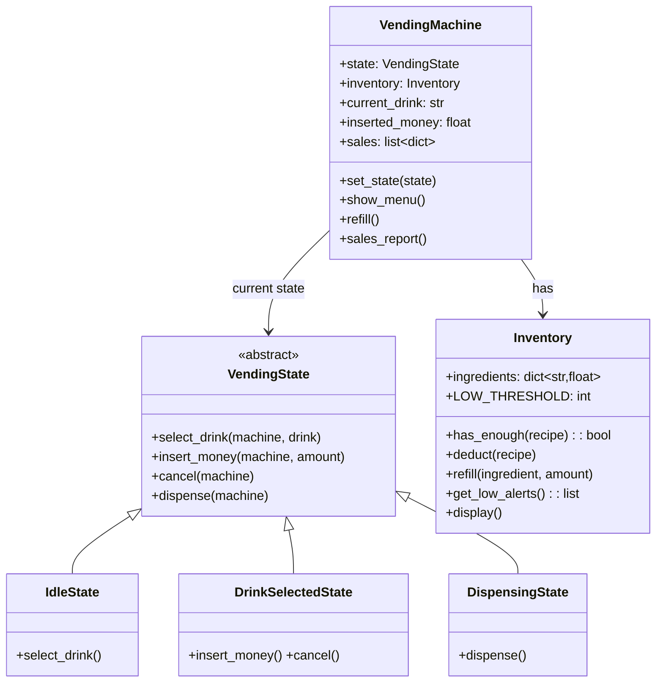

# ☕ COFFEE VENDING MACHINE — Complete LLD Guide
## The Definitive 17-Section Edition — V2.0

---

## 📖 Table of Contents
1. [🎯 Problem Statement & Context](#-1-problem-statement--context)
2. [🗣️ Requirement Gathering](#-2-requirement-gathering)
3. [✅ Requirements (FR + NFR)](#-3-requirements)
4. [🧠 Key Insight: State Pattern + Recipe Composition](#-4-key-insight)
5. [📐 Class Diagram & Entity Relationships](#-5-class-diagram)
6. [🔧 API Design (Public Interface)](#-6-api-design)
7. [🏗️ Complete Code Implementation](#-7-complete-code)
8. [📊 Data Structure Choices & Trade-offs](#-8-data-structure-choices)
9. [🔒 Concurrency & Thread Safety Deep Dive](#-9-concurrency-deep-dive)
10. [🧪 SOLID Principles Mapping](#-10-solid-principles)
11. [🎨 Design Patterns Used](#-11-design-patterns)
12. [💾 Database Schema (Production View)](#-12-database-schema)
13. [⚠️ Edge Cases & Error Handling](#-13-edge-cases)
14. [🎮 Full Working Demo](#-14-full-working-demo)
15. [🎤 Interviewer Follow-ups (15+)](#-15-interviewer-follow-ups)
16. [⏱️ Interview Strategy (45-min Plan)](#-16-interview-strategy)
17. [🧠 Quick Recall Cheat Sheet](#-17-quick-recall)

---

# 🎯 1. Problem Statement & Context

## What You're Designing

> Design a **Coffee Vending Machine** that manages ingredient inventory, allows users to select drinks, accept payment, dispense beverages, return change, and handle admin operations (refill, sales report). Support multiple drink types with different recipes.

## Real-World Context

| Metric | Real Machine |
|--------|-------------|
| Drinks per day | ~100–300 |
| Drink types | 6–12 |
| Ingredients tracked | 5–10 (coffee, water, milk, sugar, chocolate, foam) |
| Transaction time | ~15 seconds |
| Fill frequency | Every 1–3 days |
| Fleet size (corporate) | 50–500 machines |

## Why Interviewers Love This Problem

| What They Test | How This Tests It |
|---------------|-------------------|
| **State Pattern** | Can't dispense without selecting + paying first |
| **Recipe Composition (OCP)** | Adding a new drink shouldn't modify existing code |
| **Inventory management** | Track + deduct multiple ingredients per drink |
| **State Machine** | IDLE → SELECTED → DISPENSING → IDLE |
| **Comparison with ATM** | Same State Pattern, different domain — pattern recognition |
| **SOLID deep dive** | OCP is the STAR pattern here — recipes as data, not code |

---

# 🗣️ 2. Requirement Gathering

## Must-Ask Questions

In an interview, you MUST scope this before coding. Here are the questions and WHY each matters:

| # | Question | WHY You Ask | Design Impact |
|---|----------|-------------|---------------|
| 1 | "What drinks are available?" | Need menu definition | Config-driven MENU dict |
| 2 | "How are drinks defined? Hard-coded or configurable?" | **THE OCP question** | Recipe as data (dict), not code (class) |
| 3 | "Can new drinks be added without code change?" | Tests if you know OCP | New drink = new dict entry, zero code change |
| 4 | "Multiple drink sizes?" | Pricing/recipe multiplier | Size enum with quantity multipliers |
| 5 | "Payment types?" | Coins, bills, card, UPI? | For LLD: simple cash model. Mention Strategy for extension |
| 6 | "What if ingredient runs out mid-transaction?" | Availability edge case | Check BEFORE accepting payment, guard again at dispense |
| 7 | "Admin operations?" | Refill, inventory check, sales report | Separate admin interface or methods |
| 8 | "Low inventory alerts?" | Threshold monitoring | Alert when ingredient < configured threshold |
| 9 | "Change-making?" | Coin dispenser complexity | Keep simple: return `inserted - price` |
| 10 | "One drink per session?" | Session management | Yes — IDLE → select → pay → dispense → back to IDLE |

### 🎯 THE question that shows cross-problem thinking

> "This sounds a lot like an ATM. Is it the same State Pattern with different operations?"

**YES!** Both have: IDLE → user interaction → payment/auth → dispense → IDLE. If you mention this, the interviewer knows you see patterns, not just individual problems.

### Questions That Show DEPTH

| # | Question | Shows You Think About... |
|---|----------|--------------------------|
| 11 | "Should the machine reject drinks when ingredient is low, or show a warning?" | Availability UX strategy |
| 12 | "Can a user change their selection after selecting but before paying?" | State transition: SELECTED → IDLE (cancel) |
| 13 | "Should we track which ingredients are running low proactively?" | Observer pattern for fleet monitoring |

---

# ✅ 3. Requirements

## Functional Requirements

| Priority | ID | Requirement | Complexity |
|----------|-----|-------------|-----------|
| **P0** | FR-1 | Display drink menu with prices and availability | Low |
| **P0** | FR-2 | Select a drink (validate availability) | Medium |
| **P0** | FR-3 | Accept payment and accumulate (may need multiple insertions) | Medium |
| **P0** | FR-4 | **Check ingredient availability** before allowing selection | Medium |
| **P0** | FR-5 | **Dispense drink** (deduct all recipe ingredients atomically) | High |
| **P0** | FR-6 | Calculate and return change | Low |
| **P0** | FR-7 | Return to idle after dispensing | Low |
| **P1** | FR-8 | Cancel at any point before dispensing → refund | Medium |
| **P1** | FR-9 | Admin: refill specific ingredients | Low |
| **P1** | FR-10 | Admin: view sales report (count + revenue per drink) | Low |
| **P2** | FR-11 | Low ingredient alerts (configurable threshold) | Low |
| **P2** | FR-12 | Customizations (extra sugar, no milk) | Medium |

## Non-Functional Requirements

| ID | Requirement | Why |
|----|-------------|-----|
| NFR-1 | **Extensibility** — adding drinks = data change only | OCP — the core of this problem |
| NFR-2 | **State validation** — reject invalid operations per state | Correctness |
| NFR-3 | **Atomicity** — deduct ALL ingredients or NONE | Data integrity |
| NFR-4 | **Audit trail** — log every sale | Operations |

---

# 🧠 4. Key Insight: State Pattern + Recipe Composition (TWO Insights, Not One)

## 🤔 THINK: How do you add "Mocha" to the menu without changing ANY existing code?

<details>
<summary>👀 Click to reveal — The TWO design decisions that make or break this problem</summary>

### Design Decision 1: State Pattern (Same as ATM!)

```
            select_drink()         insert_money()       [enough money]
    IDLE ──────────────→ DRINK_SELECTED ──────────────→ DISPENSING
     ↑                       │                              │
     │                  cancel()                            │
     │                       │                         dispense()
     │                       ▼                              │
     └──── return ◄──────── IDLE ◄──────────────────────────┘
```

### State × Operation Matrix (Draw This in Interview!)

| Operation | IDLE | DRINK_SELECTED | DISPENSING |
|-----------|------|---------------|-----------|
| show_menu | ✅ Read-only | ✅ Read-only | ❌ |
| select_drink | ✅ → SELECTED | ❌ Already selected | ❌ |
| insert_money | ❌ Select first! | ✅ Accumulate | ❌ |
| cancel | ❌ Nothing to cancel | ✅ → IDLE (refund) | ❌ |
| dispense | ❌ | ❌ Not paid | ✅ → IDLE |

### Side-by-Side: ATM vs Vending Machine States

```
ATM:                              VENDING MACHINE:
IDLE                              IDLE
  │ insert_card()                   │ select_drink()
  ▼                                 ▼
CARD_INSERTED                     DRINK_SELECTED
  │ enter_pin()                     │ insert_money() (accumulate)
  ▼                                 │ [enough money]
AUTHENTICATED                       ▼
  │ withdraw()                    DISPENSING
  ▼                                 │ dispense()
DISPENSING                          ▼
  │ complete()                    IDLE
  ▼
AUTHENTICATED (multi-op!)

Key difference: ATM returns to AUTHENTICATED (multiple operations per session).
              Vending returns to IDLE (one drink, then next customer).
```

### Design Decision 2: Recipe Composition (THE OCP Showcase)

This is where this problem DIFFERS from ATM. ATM tests State Pattern. Vending tests **State Pattern + OCP**.

```python
# ❌ BAD: Hard-coded drinks (Closed for extension)
class VendingMachine:
    def make_drink(self, drink_name):
        if drink_name == "Espresso":
            self.use(coffee=18, water=30)
        elif drink_name == "Latte":
            self.use(coffee=18, water=30, milk=200)
        elif drink_name == "Mocha":           # ← MODIFYING existing code!
            self.use(coffee=18, water=30, milk=200, chocolate=20)
        # Every new drink = modify this method. OCP VIOLATION!

# ✅ GOOD: Recipe as data (Open for extension, Closed for modification)
MENU = {
    "Espresso":    {"price": 50,  "recipe": {"coffee": 18, "water": 30}},
    "Latte":       {"price": 80,  "recipe": {"coffee": 18, "water": 30, "milk": 200}},
    "Cappuccino":  {"price": 80,  "recipe": {"coffee": 18, "water": 30, "milk": 150, "foam": 50}},
    "Hot Chocolate":{"price": 70, "recipe": {"chocolate": 30, "milk": 250, "water": 20}},
    "Americano":   {"price": 60,  "recipe": {"coffee": 24, "water": 200}},
}

# Adding Mocha: ZERO code change! Just add data entry:
MENU["Mocha"] = {"price": 90, "recipe": {"coffee": 18, "water": 30, "milk": 200, "chocolate": 20}}
```

**WHY this works:** The dispense logic iterates over `recipe.items()`:
```python
def deduct(self, recipe):
    for ingredient, qty in recipe.items():  # Works for ANY recipe!
        self.ingredients[ingredient] -= qty
```

It doesn't know or care whether it's Espresso (2 ingredients) or Mocha (4 ingredients). The recipe IS the instruction set.

### Why NOT a Class Per Drink?

```python
# ❌ OVER-ENGINEERED: 
class Espresso(Drink):
    def make(self, inv): inv.use(coffee=18, water=30)
class Latte(Drink):
    def make(self, inv): inv.use(coffee=18, water=30, milk=200)
class Mocha(Drink):
    def make(self, inv): inv.use(coffee=18, water=30, milk=200, chocolate=20)
# 20 drinks = 20 classes! Each does basically the same thing: deduct ingredients.
```

**Rule of thumb:** Use classes when entities have **different behavior**. Use dicts when entities are **different data, same behavior** (all recipes do the same thing: deduct ingredients, just with different quantities).

</details>

---

# 📐 5. Class Diagram & Entity Relationships



## Entity Relationships

```
VendingMachine (Context)
├── state ──→ VendingState (ABC) ──→ 3 concrete states
│       ├── IdleState          (select_drink valid)
│       ├── DrinkSelectedState (insert_money, cancel valid)
│       └── DispensingState    (dispense valid)
├── inventory ──→ Inventory (ingredient levels)
├── current_drink ──→ MENU[drink_name] (recipe + price)
├── inserted_money (accumulated cash)
└── sales[] (log of completed transactions)
```

### Key Relationships Explained

| Relationship | Type | Notes |
|-------------|------|-------|
| Machine → State | Strategy-like | Delegates all operations to current state |
| Machine → Inventory | Composition | Machine owns its inventory |
| Machine → MENU | Configuration dependency | MENU is external config, not owned by machine |
| State → Machine | Back-reference | State methods receive `machine` to modify its properties |

---

# 🔧 6. API Design (Public Interface)

## 🤔 THINK: Map each API method to a physical button on the machine

```python
class VendingMachine:
    """
    Public API — maps to physical buttons/interactions on the machine.
    Each method delegates to self.state (State Pattern).
    """
    
    # ── User-facing (mapped to physical buttons) ──
    
    def show_menu(self) -> None:
        """
        Display all drinks with price and availability.
        Available in ANY state (read-only, no state change).
        Shows ✅ if ingredients sufficient, ❌ if not.
        """
    
    def select_drink(self, drink_name: str) -> None:
        """
        User presses a drink button. Valid only in IDLE state.
        Validates: drink exists in MENU AND ingredients available.
        Transitions: IDLE → DRINK_SELECTED.
        """
    
    def insert_money(self, amount: float) -> None:
        """
        User inserts cash. Valid only in DRINK_SELECTED state.
        Accumulates (user may insert multiple times).
        When total >= price → auto-transitions to DISPENSING.
        """
    
    def cancel(self) -> float:
        """
        User presses cancel. Valid in DRINK_SELECTED state.
        Returns all inserted money. Transitions → IDLE.
        """
    
    # ── Admin Operations (separate access) ──
    
    def refill(self, ingredient: str, amount: float) -> None:
        """Admin: Add inventory for a specific ingredient."""
    
    def sales_report(self) -> None:
        """Admin: Display sales count and revenue per drink."""
```

### Why These Methods?

| Method | Maps To | State Transition |
|--------|---------|-----------------|
| `show_menu()` | Display screen | None (read-only) |
| `select_drink()` | Drink buttons | IDLE → SELECTED |
| `insert_money()` | Bill/coin slot | SELECTED → SELECTED (accumulate) or → DISPENSING |
| `cancel()` | Cancel button | SELECTED → IDLE |
| `refill()` | Admin panel | None (admin) |
| `sales_report()` | Admin report | None (admin) |

---

# 🏗️ 7. Complete Code Implementation

## Menu Configuration (THE OCP Heart)

```python
from abc import ABC, abstractmethod
from datetime import datetime
import threading

# ═══════════════════════════════════════════════════════
#  THE MENU — Recipe Composition
#  Adding a drink = adding one entry here. NOTHING ELSE.
#  This is the Open/Closed Principle in action.
# ═══════════════════════════════════════════════════════
MENU = {
    "Espresso":      {"price": 50,  "recipe": {"coffee": 18, "water": 30}},
    "Latte":         {"price": 80,  "recipe": {"coffee": 18, "water": 30, "milk": 200}},
    "Cappuccino":    {"price": 80,  "recipe": {"coffee": 18, "water": 30, "milk": 150, "foam": 50}},
    "Hot Chocolate":{"price": 70,  "recipe": {"chocolate": 30, "milk": 250, "water": 20}},
    "Americano":     {"price": 60,  "recipe": {"coffee": 24, "water": 200}},
}
```

## Inventory Manager

```python
class Inventory:
    """
    Manages ingredient levels. Responsible for:
    1. Checking if a recipe CAN be made (has_enough)
    2. Deducting ingredients after successful dispense
    3. Tracking low inventory alerts
    
    Design decision: dict[str, float] — not Ingredient objects.
    WHY? Ingredients are pure data (name → quantity). No behavior.
    Using objects would be over-engineering.
    """
    LOW_THRESHOLD = 100  # grams/ml — alert when below this
    
    def __init__(self):
        self.ingredients: dict[str, float] = {
            "coffee": 500,       # grams
            "water": 5000,       # ml
            "milk": 3000,        # ml
            "chocolate": 300,    # grams
            "foam": 500,         # ml
        }
    
    def has_enough(self, recipe: dict[str, float]) -> bool:
        """
        Check if ALL ingredients are available for the recipe.
        Must check ALL — a Latte needs coffee AND water AND milk.
        If any one is insufficient, the whole drink is unavailable.
        """
        for ingredient, needed in recipe.items():
            available = self.ingredients.get(ingredient, 0)
            if available < needed:
                return False
        return True
    
    def deduct(self, recipe: dict[str, float]):
        """
        Deduct ingredients after successful dispense.
        PRECONDITION: has_enough() returned True.
        
        This is atomic within a single thread — all ingredients
        are deducted in sequence. For multi-threaded scenarios,
        the caller (DispensingState) should hold a lock.
        """
        for ingredient, amount in recipe.items():
            self.ingredients[ingredient] -= amount
    
    def refill(self, ingredient: str, amount: float):
        """Admin: add inventory. Creates ingredient if new."""
        self.ingredients[ingredient] = self.ingredients.get(ingredient, 0) + amount
    
    def get_low_alerts(self) -> list[str]:
        """Return ingredients below threshold for proactive maintenance."""
        return [name for name, qty in self.ingredients.items()
                if qty < self.LOW_THRESHOLD]
    
    def display(self):
        """Visual inventory display with bar charts and alerts."""
        print("\n   ┌──── INGREDIENT INVENTORY ────────────┐")
        for name in sorted(self.ingredients.keys()):
            qty = self.ingredients[name]
            bar_len = min(10, int(qty / 100))
            bar = "█" * bar_len + "░" * (10 - bar_len)
            alert = " ⚠️LOW" if qty < self.LOW_THRESHOLD else ""
            unit = "g" if name in ("coffee", "chocolate") else "ml"
            print(f"   │ {name:>12}: {qty:>5.0f}{unit} {bar}{alert:>6} │")
        print("   └─────────────────────────────────────┘")
```

## State Pattern — Three States + ABC

```python
class VendingState(ABC):
    """
    Base state — all operations are REJECTED by default.
    
    This is the Template Method pattern:
    - Base class provides default "reject" behavior
    - Concrete states OVERRIDE only their valid operations
    - Invalid operations automatically return error (no code needed!)
    
    Same design as ATM's ATMState. If you know ATM, you know this.
    """
    def select_drink(self, machine: 'VendingMachine', drink_name: str):
        print("   ❌ Can't select a drink right now!")
    
    def insert_money(self, machine: 'VendingMachine', amount: float):
        print("   ❌ Select a drink first!")
    
    def cancel(self, machine: 'VendingMachine'):
        print("   ❌ Nothing to cancel!")
    
    def dispense(self, machine: 'VendingMachine'):
        print("   ❌ Can't dispense right now!")


class IdleState(VendingState):
    """
    Machine is waiting. Only select_drink() is valid.
    
    On select_drink():
    1. Validate drink exists in MENU
    2. Check ingredient availability
    3. Set current_drink and transition → DRINK_SELECTED
    """
    def select_drink(self, machine, drink_name):
        # Validation 1: Is this drink on the menu?
        if drink_name not in MENU:
            print(f"   ❌ '{drink_name}' is not on the menu!")
            return
        
        # Validation 2: Do we have enough ingredients?
        recipe = MENU[drink_name]["recipe"]
        if not machine.inventory.has_enough(recipe):
            missing = []
            for ing, needed in recipe.items():
                available = machine.inventory.ingredients.get(ing, 0)
                if available < needed:
                    missing.append(f"{ing} (need {needed}, have {available:.0f})")
            print(f"   ❌ '{drink_name}' unavailable! Low ingredients: {', '.join(missing)}")
            return
        
        # All good — select this drink
        price = MENU[drink_name]["price"]
        machine.current_drink = drink_name
        machine.inserted_money = 0
        print(f"   ☕ Selected: {drink_name} — ₹{price}")
        print(f"   💰 Please insert ₹{price}")
        machine.set_state(DrinkSelectedState())


class DrinkSelectedState(VendingState):
    """
    Drink selected, waiting for payment.
    
    Valid operations:
    - insert_money(): accumulate cash, auto-dispense when enough
    - cancel(): refund all inserted money, return to IDLE
    """
    def insert_money(self, machine, amount):
        if amount <= 0:
            print("   ❌ Invalid amount! Must be positive."); return
        
        machine.inserted_money += amount
        price = MENU[machine.current_drink]["price"]
        remaining = price - machine.inserted_money
        
        if remaining > 0:
            print(f"   💰 Inserted: ₹{amount}. Total: ₹{machine.inserted_money}. "
                  f"Remaining: ₹{remaining}")
        else:
            # Payment complete! Auto-transition to dispensing
            print(f"   💰 Inserted: ₹{amount}. Payment complete!")
            machine.set_state(DispensingState())
            machine.state.dispense(machine)  # Auto-dispense!
    
    def cancel(self, machine):
        refund = machine.inserted_money
        drink = machine.current_drink
        
        # Reset machine state
        machine.current_drink = None
        machine.inserted_money = 0
        machine.set_state(IdleState())
        
        print(f"   🔄 Cancelled '{drink}'. Refund: ₹{refund:.0f}")
        return refund


class DispensingState(VendingState):
    """
    Dispensing the drink. ALL user operations blocked.
    
    On dispense():
    1. Double-check ingredients (guard against race condition)
    2. Deduct ingredients atomically
    3. Calculate change
    4. Log the sale
    5. Alert on low inventory
    6. Reset machine → IDLE
    
    If ingredients ran out between selection and payment
    (e.g., admin removed some, or concurrent machine):
    → FULL REFUND and return to IDLE.
    """
    def dispense(self, machine):
        drink_name = machine.current_drink
        drink_info = MENU[drink_name]
        price = drink_info["price"]
        recipe = drink_info["recipe"]
        
        # ── GUARD: Double-check ingredients ──
        # Why? Between select (checked) and now, inventory may have changed
        # (admin removed ingredient, another thread used it, etc.)
        if not machine.inventory.has_enough(recipe):
            print(f"   ❌ Sorry! Ingredients for '{drink_name}' ran out!")
            print(f"   💰 Full refund: ₹{machine.inserted_money:.0f}")
            machine.current_drink = None
            machine.inserted_money = 0
            machine.set_state(IdleState())
            return
        
        # ── DEDUCT ingredients (atomic within thread) ──
        machine.inventory.deduct(recipe)
        
        # ── CALCULATE change ──
        change = machine.inserted_money - price
        
        # ── LOG the sale ──
        machine.sales.append({
            "drink": drink_name,
            "price": price,
            "paid": machine.inserted_money,
            "change": change,
            "time": datetime.now(),
        })
        
        # ── DISPENSE! ──
        print(f"\n   ╔════════════════════════════════╗")
        print(f"   ║   ☕ Dispensing {drink_name}...   ║")
        print(f"   ╚════════════════════════════════╝")
        print(f"   Ingredients used:")
        for ingredient, qty in recipe.items():
            unit = "g" if ingredient in ("coffee", "chocolate") else "ml"
            print(f"      • {ingredient}: {qty}{unit}")
        if change > 0:
            print(f"   💰 Change returned: ₹{change:.0f}")
        print(f"   ✅ Enjoy your {drink_name}!")
        
        # ── LOW INVENTORY alerts ──
        alerts = machine.inventory.get_low_alerts()
        if alerts:
            print(f"\n   ⚠️ LOW STOCK ALERT: {', '.join(alerts)}")
            print(f"   📱 (Admin notification sent)")
        
        # ── RESET machine ──
        machine.current_drink = None
        machine.inserted_money = 0
        machine.set_state(IdleState())
```

## VendingMachine — The Context

```python
class VendingMachine:
    """
    The machine itself — delegates ALL user operations to current state.
    This is the 'Context' in the State Pattern, identical to ATM.
    
    Machine holds the mutable data:
    - current_drink: what's been selected
    - inserted_money: accumulated payment
    - sales: transaction log
    - inventory: ingredient levels
    
    Machine does NOT hold business logic for handling operations.
    That's in the State classes.
    """
    def __init__(self, machine_id: str = "VM-001"):
        self.machine_id = machine_id
        self.state: VendingState = IdleState()
        self.inventory = Inventory()
        self.current_drink: str = None
        self.inserted_money: float = 0
        self.sales: list[dict] = []
    
    def set_state(self, state: VendingState):
        self.state = state
    
    # ── User Operations (delegate to state) ──
    def select_drink(self, drink_name: str):
        self.state.select_drink(self, drink_name)
    
    def insert_money(self, amount: float):
        self.state.insert_money(self, amount)
    
    def cancel(self):
        self.state.cancel(self)
    
    def dispense(self):
        self.state.dispense(self)
    
    # ── Read-Only Operations (always available) ──
    def show_menu(self):
        """Display menu with availability status."""
        print(f"\n   ╔═══════════ MENU ({self.machine_id}) ═══════════╗")
        for drink, info in MENU.items():
            available = self.inventory.has_enough(info["recipe"])
            icon = "✅" if available else "❌"
            print(f"   ║ {icon} {drink:<16} ₹{info['price']:>3} ║")
        print(f"   ╚═══════════════════════════════════╝")
    
    # ── Admin Operations ──
    def refill(self, ingredient: str, amount: float):
        self.inventory.refill(ingredient, amount)
        print(f"   🔄 Refilled {ingredient}: +{amount}g/ml")
    
    def sales_report(self):
        """Display sales summary with counts and revenue."""
        print(f"\n   ╔══════ SALES REPORT ({self.machine_id}) ══════╗")
        if not self.sales:
            print("   ║   No sales yet.                     ║")
        else:
            # Aggregate by drink
            counts: dict[str, int] = {}
            revenue: dict[str, float] = {}
            for sale in self.sales:
                name = sale["drink"]
                counts[name] = counts.get(name, 0) + 1
                revenue[name] = revenue.get(name, 0) + sale["price"]
            
            total_rev = sum(revenue.values())
            total_count = sum(counts.values())
            
            for drink in sorted(counts.keys()):
                c = counts[drink]
                r = revenue[drink]
                print(f"   ║ {drink:<14} ×{c:<3} ₹{r:>5,.0f} ║")
            print(f"   ║{'─'*35}║")
            print(f"   ║ {'TOTAL':<14} ×{total_count:<3} ₹{total_rev:>5,.0f} ║")
        print(f"   ╚═══════════════════════════════════╝")
```

---

# 📊 8. Data Structure Choices & Trade-offs

## 🤔 THINK: Why these specific data structures? This separates senior from junior answers.

| Data Structure | Where | Why This? | Alternative | Why Not? |
|---------------|-------|-----------|-------------|----------|
| `dict[str, dict]` | MENU | O(1) drink lookup. Recipe is structured data (price + ingredients). Easy to extend. | `list[Drink]` classes | Over-engineering: all drinks do the same thing (deduct ingredients). 20 classes vs 20 dict entries |
| `dict[str, float]` | Inventory.ingredients | O(1) lookup per ingredient. Simple name→quantity mapping | `list[Ingredient]` objects | Ingredient has no behavior — it's pure data. Object overhead for no benefit |
| `dict[str, float]` | recipe in MENU | Maps ingredient→quantity. Iterable for deduction | `list[(str, float)]` | Dict prevents duplicate ingredients, allows O(1) lookup |
| `list[dict]` | VendingMachine.sales | Append-only log. Chronological. Each entry = transaction metadata | Database table | In-memory for LLD. Mention DB for production |
| `VendingState` ABC | State classes | Polymorphism eliminates if-else chain. OCP for new states | Enum + switch-case | Violates OCP. Each new state = modify every method |

### Why Recipe as Dict, Not Class? (Deep Dive)

```python
# All recipes do the SAME thing: iterate ingredients and deduct quantities.
# The ONLY difference is WHICH ingredients and HOW MUCH.
# That's DATA variation, not BEHAVIOR variation.

# Data variation → use dictionaries
# Behavior variation → use classes (polymorphism)

# Compare with Chess pieces:
# Each piece has DIFFERENT movement LOGIC (behavior variation)
# → Classes are correct (Rook._slide vs Knight._offsets)

# Drinks have SAME deduction LOGIC, just different quantities (data variation)
# → Dicts are correct ({coffee: 18, water: 30})
```

---

# 🔒 9. Concurrency & Thread Safety Deep Dive

## When Does Concurrency Matter?

A physical vending machine has **one user at a time** — no concurrency issue for user operations. But consider these scenarios:

### Scenario 1: Admin Refill During User Transaction

```
Timeline: User buying Latte while admin refills coffee

t=0: User selects Latte (has_enough = True ✅)
t=1: Admin drains coffee for maintenance → sets to 0
t=2: User inserts ₹80 → payment complete → DispensingState
t=3: Dispense tries to deduct coffee=18 → inventory goes NEGATIVE! 💀

Fix: DispensingState.dispense() double-checks has_enough() before deducting.
     This is already in our implementation:
     
     if not machine.inventory.has_enough(recipe):
         # ROLLBACK: full refund!
         ...
```

### Scenario 2: Fleet Management — Central Server

```
Architecture: 100 vending machines, 1 central inventory server

Machine-A: needs 18g coffee → sends request
Machine-B: needs 24g coffee → sends request (concurrent!)

Central server inventory: coffee = 30g

Without lock: Both read 30 → both deduct → coffee = -12g 💀
With lock: A acquires → deducts 18 → 12g left → releases
           B acquires → 12 < 24 → REJECTS! ✅
```

```python
# For fleet management — lock on shared inventory:
class FleetInventoryService:
    def __init__(self):
        self._lock = threading.Lock()
        self.machines: dict[str, Inventory] = {}
    
    def deduct_for_machine(self, machine_id: str, recipe: dict):
        with self._lock:
            inv = self.machines[machine_id]
            if not inv.has_enough(recipe):
                return False
            inv.deduct(recipe)
            return True
```

### Scenario 3: Concurrent Admin Operations

```python
# Admin refilling while machine is dispensing — safe because:
# 1. refill() only ADDS to quantities (never causes negative)
# 2. deduct() only SUBTRACTS
# 3. Python's GIL protects single operations
# 4. For production: add per-ingredient lock or optimistic locking
```

---

# 🧪 10. SOLID Principles Mapping

## 🤔 THINK: OCP is the STAR of this problem. Know it cold!

| Principle | Where Applied | Detailed Explanation |
|-----------|--------------|---------------------|
| **S — Single Responsibility** | Clean separation | `Inventory` = ingredient tracking only. `VendingState` = transition logic only. `VendingMachine` = orchestration only. MENU = configuration only. |
| **O — Open/Closed** ⭐⭐⭐ | **THE star** | Adding "Matcha Latte" = add ONE dict entry to MENU. ZERO changes to Inventory, States, or Machine. Production: load MENU from JSON/DB config file → fully extensible without recompilation. |
| **L — Liskov Substitution** | State hierarchy | ANY `VendingState` subclass works in `VendingMachine.state`. Machine calls `self.state.select_drink(self, name)` without knowing if it's IdleState or DrinkSelectedState. |
| **I — Interface Segregation** | VendingState ABC | Only 4 operations: select, insert_money, cancel, dispense. Minimal and focused. No `refill()` or `sales_report()` in state (those are admin-only, always available). |
| **D — Dependency Inversion** | Machine → State ABC | Machine depends on `VendingState` (abstraction), never on `IdleState` (concrete). Can add `MaintenanceState` without touching Machine. |

### OCP: The Complete Story

```python
# ── Step 1: Adding a drink ──
MENU["Matcha Latte"] = {"price": 100, "recipe": {"matcha": 10, "milk": 250, "water": 30}}

# ── Step 2: Adding matcha to inventory ──
machine.inventory.ingredients["matcha"] = 200

# ── That's IT. Now test it: ──
machine.show_menu()          # Shows "✅ Matcha Latte ₹100"
machine.select_drink("Matcha Latte")  # Works!
machine.insert_money(100)    # Auto-dispenses!
# Inventory deducted: matcha -= 10, milk -= 250, water -= 30

# ZERO code changes to:
# - IdleState.select_drink() ← iterates recipe.items() generically
# - DrinkSelectedState.insert_money() ← reads price from MENU
# - DispensingState.dispense() ← deducts recipe.items() generically
# - Inventory.has_enough() ← checks recipe.items() generically
# - Inventory.deduct() ← deducts recipe.items() generically
```

**In production:** Load MENU from a JSON config file or database. Updating the menu = updating a config file, not deploying new code.

---

# 🎨 11. Design Patterns Used

| Pattern | Where | Why This Pattern | Alternative | Why Not |
|---------|-------|-----------------|-------------|---------|
| **State** ⭐ | VendingState hierarchy | Prevents invalid ops per state. Clean state transitions. | if-else chain | Violates OCP. Adding new state = modify every method |
| **Template Method** | Default reject in VendingState | States only override VALID operations. Invalid = auto-reject | Duplicate reject logic | DRY — write "Invalid!" once in base class |
| **Singleton** | (Optional) Machine itself | One physical machine = one instance | Regular class | Fine for fleet of machines |
| **Strategy** | (Extension) PaymentStrategy | CashPayment, CardPayment, UPIPayment | if-else in payment | OCP for payment methods |
| **Observer** | (Extension) Alerts | Low stock → notify admin, fleet server, maintenance app | Direct call | Decouples inventory from notification |
| **Factory** | (Extension) DrinkFactory | Create recipe variants (sizes, customizations) | Direct construction | Centralized validation |

### Cross-Problem Pattern Comparison

| Aspect | ATM | Coffee Vending | Both |
|--------|-----|----------------|------|
| **Core Pattern** | State Pattern ✅ | State Pattern ✅ | ✅ |
| **States** | IDLE → CARD → AUTH → DISPENSING (4) | IDLE → SELECTED → DISPENSING (3) | IDLE is common |
| **Authentication** | YES (card + PIN = 2 states) | NO (walk-up) | — |
| **Multi-operation** | YES (back to AUTH for next op) | NO (back to IDLE) | Key difference |
| **Resource dispensed** | Cash notes | Ingredients | Physical resource |
| **Dispensing algo** | **Greedy** (largest denom first) | **Recipe** deduction (iterate dict) | Both have dispensing logic |
| **OCP showcase** | Not primary | ⭐ **PRIMARY** (recipe composition) | Coffee's unique value |
| **Default reject** | Template Method ✅ | Template Method ✅ | ✅ |

**Interview insight:** "ATM and Vending Machine share the State Pattern core. ATM's unique challenge is the greedy cash algorithm. Vending Machine's unique challenge is Recipe Composition for OCP."

---

# 💾 12. Database Schema (Production View)

```sql
-- ═══ For a fleet of machines with central management ═══

CREATE TABLE machines (
    machine_id      VARCHAR(20) PRIMARY KEY,
    location        VARCHAR(200) NOT NULL,
    status          VARCHAR(20) DEFAULT 'ACTIVE',  -- ACTIVE/MAINTENANCE/OFFLINE
    last_heartbeat  TIMESTAMP,           -- For health monitoring
    installed_at    TIMESTAMP DEFAULT NOW()
);

CREATE TABLE ingredients (
    machine_id  VARCHAR(20) REFERENCES machines(machine_id),
    ingredient  VARCHAR(50) NOT NULL,
    quantity    DECIMAL(10,2) NOT NULL DEFAULT 0,
    threshold   DECIMAL(10,2) DEFAULT 100,  -- Alert when below
    PRIMARY KEY (machine_id, ingredient)
);

CREATE TABLE menu_items (
    drink_name  VARCHAR(50) PRIMARY KEY,
    price       DECIMAL(6,2) NOT NULL,
    is_active   BOOLEAN DEFAULT TRUE
);

CREATE TABLE recipes (
    drink_name  VARCHAR(50) REFERENCES menu_items(drink_name),
    ingredient  VARCHAR(50) NOT NULL,
    quantity    DECIMAL(10,2) NOT NULL,      -- Amount needed per drink
    PRIMARY KEY (drink_name, ingredient)
);

CREATE TABLE sales (
    sale_id     SERIAL PRIMARY KEY,
    machine_id  VARCHAR(20) REFERENCES machines(machine_id),
    drink_name  VARCHAR(50) REFERENCES menu_items(drink_name),
    price       DECIMAL(6,2) NOT NULL,
    paid        DECIMAL(6,2) NOT NULL,
    change_given DECIMAL(6,2) DEFAULT 0,
    sold_at     TIMESTAMP DEFAULT NOW(),
    INDEX idx_machine_date (machine_id, sold_at)
);
```

### Key Queries

```sql
-- Daily revenue per machine
SELECT machine_id, COUNT(*) as drinks_sold, SUM(price) as revenue
FROM sales
WHERE DATE(sold_at) = CURRENT_DATE
GROUP BY machine_id
ORDER BY revenue DESC;

-- Most popular drinks across fleet
SELECT drink_name, COUNT(*) as total_sold, SUM(price) as total_revenue
FROM sales
GROUP BY drink_name
ORDER BY total_sold DESC;

-- ⚠️ Low inventory alerts across fleet (admin dashboard)
SELECT m.machine_id, m.location, i.ingredient, i.quantity, i.threshold
FROM ingredients i
JOIN machines m ON i.machine_id = m.machine_id
WHERE i.quantity < i.threshold
ORDER BY i.quantity ASC;

-- Recipe lookup (dynamically load menu)
SELECT mi.drink_name, mi.price, r.ingredient, r.quantity
FROM menu_items mi
JOIN recipes r ON mi.drink_name = r.drink_name
WHERE mi.is_active = TRUE
ORDER BY mi.drink_name;
```

---

# ⚠️ 13. Edge Cases & Error Handling

## 🤔 THINK: What can go wrong at EACH step of the flow?

| # | Edge Case | Step | What Goes Wrong | Fix |
|---|-----------|------|----------------|-----|
| 1 | **Ingredient runs out after selection** | Between select and dispense | User paid but can't get drink | Guard in DispensingState: double-check `has_enough()`, full refund if not |
| 2 | **Drink not on menu** | select_drink | Invalid input | Validate `drink_name in MENU` |
| 3 | **Negative money inserted** | insert_money | Logic error | Validate `amount > 0` |
| 4 | **Insert money in IDLE state** | insert_money before select | No drink chosen | State rejects: "Select a drink first!" |
| 5 | **Partial payment then cancel** | User inserts ₹30 for ₹80 drink | Must refund partial | `cancel()` returns `machine.inserted_money` |
| 6 | **Overpayment** | User inserts ₹100 for ₹50 drink | Must return change | `change = inserted_money - price` |
| 7 | **Admin refill of unknown ingredient** | New ingredient added | Ingredient not in dict | `dict.get(ingredient, 0) + amount` — auto-creates |
| 8 | **Zero sales report** | First time viewing report | Empty list | Handle with "No sales yet" message |
| 9 | **Same drink selected twice** | Select in DRINK_SELECTED state | Already in wrong state | State rejects: "Already selected a drink!" |
| 10 | **Machine off mid-transaction** | Power failure during dispense | Ingredients deducted, drink not dispensed | (Production) Transaction log + recovery on restart |
| 11 | **All ingredients empty** | All drinks unavailable | Menu shows all ❌ | `show_menu()` shows status. select_drink() rejects with reason |
| 12 | **Exact payment** | Insert exactly ₹80 for ₹80 | Change = ₹0 | Don't print change line if change == 0 |

### The Critical Edge Case: Ingredient Depletion Between Selection and Dispense

```
Timeline:
t=0: User selects Latte → has_enough() = True ✅ → DRINK_SELECTED
t=1: ← Meanwhile, admin runs maintenance: removes all milk →
t=2: User inserts ₹80 → Payment complete → DISPENSING
t=3: DispensingState.dispense() called

WITHOUT guard: deduct() makes milk go NEGATIVE! 💀
WITH guard (our implementation):
    if not machine.inventory.has_enough(recipe):
        "Sorry! Ingredients ran out! Full refund: ₹80"
        → Back to IDLE ✅
```

This is WHY we check twice — once at selection (optimistic), once at dispense (definitive).

---

# 🎮 14. Full Working Demo

```python
if __name__ == "__main__":
    print("=" * 60)
    print("     ☕ COFFEE VENDING MACHINE — COMPLETE DEMO ☕")
    print("=" * 60)
    
    machine = VendingMachine("VM-OFFICE-01")
    
    # ─── Test 1: Show Menu ───
    print("\n─── Test 1: Menu Display ───")
    machine.show_menu()
    
    # ─── Test 2: Normal Purchase ───
    print("\n─── Test 2: Buy Espresso (₹50) with exact change ───")
    machine.select_drink("Espresso")
    machine.insert_money(50)  # Exact payment → auto-dispense
    
    # ─── Test 3: Multiple Insertions + Overpayment ───
    print("\n─── Test 3: Buy Latte (₹80) with ₹100 (change due) ───")
    machine.select_drink("Latte")
    machine.insert_money(30)   # Partial...
    machine.insert_money(70)   # Overpay! → auto-dispense with change
    
    # ─── Test 4: Invalid State Operation ───
    print("\n─── Test 4: Insert money without selecting (should fail) ───")
    machine.insert_money(50)   # ❌ IDLE state rejects
    
    # ─── Test 5: Cancel and Refund ───
    print("\n─── Test 5: Select, insert partial, then cancel ───")
    machine.select_drink("Cappuccino")
    machine.insert_money(30)   # ₹30 of ₹80
    machine.cancel()           # Refund ₹30
    
    # ─── Test 6: Unavailable Drink ───
    print("\n─── Test 6: Drain chocolate, try Hot Chocolate ───")
    machine.inventory.ingredients["chocolate"] = 5  # Simulate depletion
    machine.select_drink("Hot Chocolate")  # ❌ Should fail with details
    
    # ─── Test 7: Admin Operations ───
    print("\n─── Test 7: Admin refill + sales report ───")
    machine.refill("chocolate", 300)
    machine.sales_report()
    machine.inventory.display()
    
    # ─── Test 8: OCP SHOWCASE — Add new drink with ZERO code change ───
    print("\n─── Test 8: Add 'Mocha' to menu (OCP demo) ───")
    print("   Adding MENU entry... (zero code change)")
    MENU["Mocha"] = {
        "price": 90,
        "recipe": {"coffee": 18, "milk": 200, "chocolate": 20, "water": 30}
    }
    machine.show_menu()
    machine.select_drink("Mocha")
    machine.insert_money(100)  # Change = ₹10
    
    # ─── Final Report ───
    print("\n─── Final State ───")
    machine.sales_report()
    machine.inventory.display()
    
    print(f"\n{'='*60}")
    print("     ✅ ALL 8 TESTS COMPLETE!")
    print(f"{'='*60}")
```

### Expected Output Highlights

```
Test 2: Espresso — exact payment → dispenses, no change
Test 3: Latte — overpay ₹100 → dispenses + ₹20 change
Test 4: Insert before select → "Select a drink first!" (State rejects)
Test 5: Cancel → refunds partial ₹30
Test 6: Low chocolate → "Unavailable! Low: chocolate (need 30, have 5)"
Test 7: Admin refill + report → 2 sales totaling ₹130
Test 8: OCP — Mocha added at runtime → menu updated → dispensed!
```

---

# 🎤 15. Interviewer Follow-ups (15+)

| Q | Question | Key Answer | Why They Ask |
|---|----------|-----------|-------------|
| 1 | "Why State Pattern here?" | Prevents invalid ops: can't dispense without paying, can't insert money without selecting. Each state class handles its own valid operations. | Core design validation |
| 2 | "How is this different from ATM?" | Same State Pattern core. ATM has auth (4 states), multi-op sessions, greedy cash algo. Vending has no auth (3 states), single-drink sessions, recipe composition for OCP | Pattern recognition |
| 3 | "How to add a new drink?" | Add entry to MENU dict. Zero code changes. For production: load MENU from JSON/DB. | OCP understanding |
| 4 | "Why recipe as dict, not class?" | Recipes have same behavior (deduct), different data (quantities). Data variation → dict. Behavior variation → class (like Chess pieces). | Design judgement |
| 5 | "What if ingredients run low between select and dispense?" | Guard in DispensingState: double-check has_enough() before deducting. Full refund if unavailable. | Defensive programming |
| 6 | "Multiple drink sizes?" | Size multiplier: `recipe = {k: v * multiplier for k, v in base_recipe.items()}`. Small=0.5x, Regular=1x, Large=1.5x | Extension thinking |
| 7 | "Card payment?" | `PaymentStrategy` ABC: CashPayment, CardPayment, UPIPayment. Strategy pattern extends payment without modifying states. | Pattern extension |
| 8 | "Ingredient substitution?" | "Out of milk? Substitute oat milk?" → Recipe variant with replacement map: `{"milk": "oat_milk"}` | Real-world complexity |
| 9 | "Fleet management for 100 machines?" | Central server. Each machine reports inventory + sales via REST API. Server aggregates for admin dashboard. | Architecture |
| 10 | "Revenue analytics?" | SQL: `GROUP BY drink_name, DATE(sold_at)`. Popular drinks, peak hours, revenue trends | Product thinking |
| 11 | "Why not class per drink?" | 20 drinks = 20 classes, all doing the same thing (deduct ingredients). Over-engineering. Dict = 20 data entries. | Simplicity vs over-design |
| 12 | "Concurrency?" | Physical machine = sequential. Fleet = per-machine lock. Admin refill during use = guard in dispense. | Production thinking |
| 13 | "Customizations (extra sugar)?" | Add-on dict: `{"sugar": 5}` merged with base recipe at selection time. Extra price = sum of add-on costs. | Extension |
| 14 | "How to test?" | Unit: each state transition. Integration: full flow (select → pay → dispense). Edge: insufficient ingredients, cancel, overpay. | Testing |
| 15 | "Machine health monitoring?" | Heartbeat every 60s. If no heartbeat for 5 min → flag as OFFLINE. Central dashboard shows machine status. | DevOps |
| 16 | "Compare with Parking Lot?" | Parking uses Strategy for pricing. Vending uses State for flow + Recipe for OCP. Different patterns entirely | Cross-problem |

---

# ⏱️ 16. Interview Strategy (45-min Plan)

| Time | Phase | What You Do | What to DRAW |
|------|-------|-------------|-------------|
| **0–5** | Clarify | Ask about drinks, payment, admin ops. Mention ATM similarity | — |
| **5–8** | State Machine | Draw IDLE → SELECTED → DISPENSING with state×operation matrix | State diagram + matrix |
| **8–12** | OCP Insight | Show MENU as dict. "Adding drink = adding data. Zero code change." | MENU + deduct loop |
| **12–15** | Class Diagram | VendingState ABC (3 states), Inventory, VendingMachine | UML diagram |
| **15–30** | Code | IdleState.select_drink(), DrinkSelectedState.insert_money(), DispensingState.dispense() with guard, Inventory | Annotated code |
| **30–38** | Demo + Edge Cases | Normal flow, cancel+refund, unavailable drink, OCP demo (add Mocha) | Output trace |
| **38–45** | Extensions | Fleet management, PaymentStrategy, sizes, customizations, DB schema | Architecture diagram |

## Golden Sentences

> **Opening:** "This is a State Pattern problem, structurally identical to ATM. The unique twist here is Recipe Composition for OCP — adding drinks without code changes."

> **OCP:** "A recipe is just a dict of ingredient→quantity. The deduction logic iterates recipe.items() generically. Adding Mocha = adding one dict entry. Zero code change to any state, inventory, or machine class."

> **Recipe as data vs class:** "Recipes have same behavior, different data. That's dict territory. Compare with Chess: pieces have different behavior — that's class territory."

> **ATM Comparison:** "ATM has 4 states (extra auth step), supports multiple operations per session, and has a greedy cash dispensing algorithm. Vending has 3 states, one-drink sessions, and recipe-based dispensing. Same State Pattern core, different complexity layers."

---

# 🧠 17. Quick Recall Cheat Sheet

## ⏱️ 30-Second Recall

> **State Pattern: IDLE → SELECTED → DISPENSING → IDLE.** Recipe as dict (OCP — new drink = new dict entry, ZERO code change). Inventory checks `has_enough()` at selection AND at dispense (double guard). Cancel → refund `inserted_money`. Default reject in base state (Template Method). Same pattern as ATM, minus auth.

## ⏱️ 2-Minute Recall

Add:
> **Entities:** VendingState ABC (3 concrete states with default reject), Inventory (ingredients dict + threshold alerts), VendingMachine (context, delegates to state). MENU dict = `{drink: {price, recipe: {ingredient: qty}}}`.
> **Edge cases:** Ingredient depleted between select and dispense (double-check in DispensingState → full refund). Overpayment (change calculation). Partial payment cancel (refund accumulated amount). Invalid state ops (default reject).
> **Admin:** `refill(ingredient, amount)`, `sales_report()` (count + revenue per drink), `inventory.display()`.
> **OCP test:** Add Mocha = `MENU["Mocha"] = {...}` + `inventory.ingredients["mocha"] = 200`. Done.

## ⏱️ 5-Minute Recall

Add:
> **SOLID:** OCP is the STAR — recipe composition. SRP per class (Inventory, State, Machine, MENU). DIP: Machine depends on VendingState ABC.
> **Patterns:** State (core), Template Method (default reject), Strategy (payment extension), Observer (fleet alerts).
> **DB:** machines, ingredients, menu_items, recipes, sales tables. Low-stock query: `WHERE quantity < threshold`.
> **Compare ATM:** Same State Pattern. ATM: 4 states, auth, multi-op, greedy cash. Vending: 3 states, no auth, single-op, recipe deduction.
> **Compare Chess:** Chess uses ABC/Polymorphism (behavior varies per piece). Vending uses dict composition (data varies per drink, behavior same).
> **Concurrency:** Physical machine = sequential. Fleet = per-machine lock. Admin refill concurrent with user = guard in dispense.

---

## ✅ Pre-Implementation Checklist

- [ ] **MENU dict** — `{drink_name: {price, recipe: {ingredient: quantity}}}`
- [ ] **Inventory** (`ingredients` dict, `has_enough()`, `deduct()`, `refill()`, `get_low_alerts()`, `display()`)
- [ ] **VendingState ABC** (default reject for all 4 operations — Template Method)
- [ ] **IdleState** (only `select_drink` valid: validate menu + ingredients → SELECTED)
- [ ] **DrinkSelectedState** (`insert_money`: accumulate + auto-dispense. `cancel`: refund → IDLE)
- [ ] **DispensingState** (`dispense`: double-check ingredients, deduct, change, log sale, alerts → IDLE)
- [ ] **VendingMachine** (context: delegates to state, show_menu, admin ops)
- [ ] **Sales tracking** (list of `{drink, price, paid, change, time}`)
- [ ] **Demo:** normal buy, overpay (change), cancel+refund, unavailable drink, admin refill, OCP new drink
- [ ] **OCP proof:** add Mocha at runtime, show it works with zero code change

---

*Version 2.0 — The Definitive 17-Section Edition (Gold Standard)*
