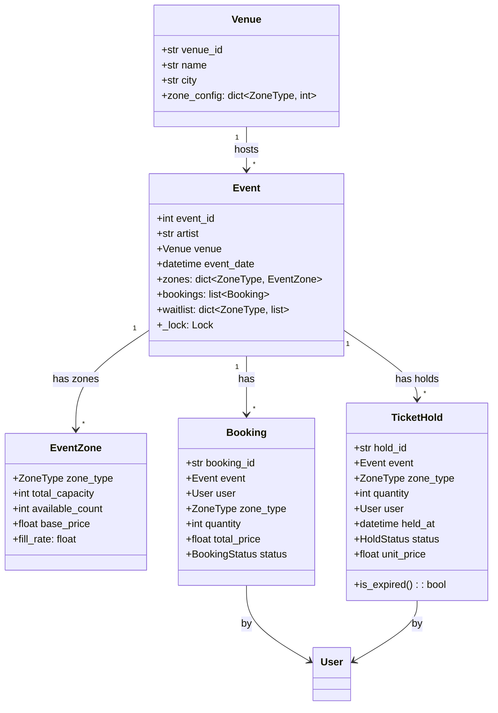

# 🎵 CONCERT TICKET BOOKING SYSTEM — Complete LLD Guide
## The Definitive 17-Section Edition — V2.0

---

## 📖 Table of Contents
1. [🎯 Problem Statement & Context](#-1-problem-statement--context)
2. [🗣️ Requirement Gathering](#-2-requirement-gathering)
3. [✅ Requirements (FR + NFR)](#-3-requirements)
4. [🧠 Key Insight: Zone-Based Seating + Surge Pricing](#-4-key-insight)
5. [📐 Class Diagram & Entity Relationships](#-5-class-diagram)
6. [🔧 API Design (Public Interface)](#-6-api-design)
7. [🏗️ Complete Code Implementation](#-7-complete-code)
8. [📊 Data Structure Choices & Trade-offs](#-8-data-structure-choices)
9. [🔒 Concurrency & Thread Safety Deep Dive](#-9-concurrency-deep-dive)
10. [🧪 SOLID Principles Mapping](#-10-solid-principles)
11. [🎨 Design Patterns Used](#-11-design-patterns)
12. [💾 Database Schema (Production View)](#-12-database-schema)
13. [⚠️ Edge Cases & Error Handling](#-13-edge-cases)
14. [🎮 Full Working Demo](#-14-full-working-demo)
15. [🎤 Interviewer Follow-ups (15+)](#-15-interviewer-follow-ups)
16. [⏱️ Interview Strategy (45-min Plan)](#-16-interview-strategy)
17. [🧠 Quick Recall Cheat Sheet](#-17-quick-recall)

---

# 🎯 1. Problem Statement & Context

## What You're Designing

> Design a **Concert Ticket Booking System** where users search events by artist/venue/date, book tickets across different zones (VIP, Gold, Silver), handle temporary seat holds with auto-expiry, process payments, and manage cancellations. Support surge pricing as zones fill up and handle the extreme concurrency of thousands of users trying to book simultaneously.

## Real-World Context

| Metric | Real System (BookMyShow/Ticketmaster) |
|--------|---------------------------------------|
| Concurrent users at sale open | 100K–1M+ (Taylor Swift, BTS) |
| Time to sell out | Minutes (top acts) |
| Ticket types | 3–5 zones per venue |
| Booking timeout | 10–15 minutes hold |
| Scalpers | ~30% of tickets (major problem!) |
| Dynamic pricing | 1.5× – 3× as zones fill |

## Why Interviewers Love This Problem

| What They Test | How This Tests It |
|---------------|-------------------|
| **Same Entity-Instance as BookMyShow** | Venue → Event → EventSeat (not Concert → Seat!) |
| **Extreme concurrency** | 50,000 users hitting "Book" simultaneously |
| **Temporary holds with expiry** | HOLD → BOOKED or HOLD → EXPIRED |
| **Surge pricing** | Price changes dynamically based on fill rate |
| **Queue/waitlist** | When sold out, add to waitlist → auto-assign on cancel |
| **Scalper prevention** | Rate limiting, CAPTCHA, one-booking-per-user |

### How is This DIFFERENT from BookMyShow?

| Aspect | BookMyShow (Cinema) | Concert Booking |
|--------|-------------------|-----------------|
| Seat assignment | Exact seat (12A, 12B) | **Zone-based** (VIP, Gold, Silver) — no exact seat |
| Capacity | ~300 per screen | ~10,000–80,000 per concert |
| Concurrency | Moderate | **EXTREME** (sell-out in minutes) |
| Pricing | Fixed per class | **Surge pricing** as zones fill |
| Scalping concern | Low | **HIGH** — need prevention |
| Waitlist | No (next show) | **YES** (one-time event!) |

---

# 🗣️ 2. Requirement Gathering

## Must-Ask Questions

| # | Question | WHY You Ask | Design Impact |
|---|----------|-------------|---------------|
| 1 | "Are seats numbered or zone-based?" | **THE key difference from BMS** | Zone-based: VIP/Gold/Silver with capacity count |
| 2 | "How many concurrent users?" | Concurrency architecture | Per-event lock, queueing, rate limiting |
| 3 | "Temporary hold before payment?" | Hold-expiry pattern | HOLD with timestamp, background cleanup |
| 4 | "Dynamic pricing?" | Pricing algorithm | Surge multiplier based on zone fill rate |
| 5 | "Scalper prevention?" | Validation rules | Max tickets per user, rate limiting |
| 6 | "Waitlist when sold out?" | Queue design | FIFO waitlist per zone, auto-assign on cancel |
| 7 | "Multiple events at same venue?" | Entity-Instance pattern | Venue → Event → EventZone → tickets |
| 8 | "Cancellation and refund?" | Refund tiered by time | >7d=90%, 3-7d=50%, <3d=0% |
| 9 | "Multi-ticket booking?" | Atomicity | All-or-nothing: 4 tickets → all 4 or fail |
| 10 | "Transfer tickets to another person?" | Extension | Name change on ticket with fee |

### 🎯 THE question that shows you understand scale

> "When Taylor Swift tickets go on sale, 500K users click 'Book' within 60 seconds. How do we handle that without corrupting state?"

**Answer:** "Per-event lock for the booking operation, queue incoming requests, rate limit per user, and use temporary HOLD with auto-expiry to prevent abandoned bookings from blocking inventory."

---

# ✅ 3. Requirements

## Functional Requirements

| Priority | ID | Requirement | Complexity |
|----------|-----|-------------|-----------|
| **P0** | FR-1 | Add venues with zone configuration | Low |
| **P0** | FR-2 | Create events (artist + venue + date + pricing per zone) | Medium |
| **P0** | FR-3 | Search events by artist, venue, or date | Low |
| **P0** | FR-4 | **Hold tickets (temporary lock with 10-min expiry)** | High |
| **P0** | FR-5 | **Confirm booking (HOLD → BOOKED with payment)** | High |
| **P0** | FR-6 | Auto-release expired holds | Medium |
| **P1** | FR-7 | **Surge pricing** (multiplier based on fill rate) | Medium |
| **P1** | FR-8 | Cancellation with tiered refund | Medium |
| **P1** | FR-9 | Waitlist (queue per zone, auto-assign on cancel) | High |
| **P2** | FR-10 | Scalper prevention (max 4 tickets per user per event) | Low |

## Non-Functional Requirements

| ID | Requirement | Why |
|----|-------------|-----|
| NFR-1 | **Per-event locking** — booking on Event A shouldn't block Event B | Concurrency isolation |
| NFR-2 | **Atomicity** — multi-ticket hold is all-or-nothing | Data integrity |
| NFR-3 | **Hold expiry < 15 min** — prevent inventory hoarding | Fairness |
| NFR-4 | **Rate limiting** — max 5 requests/min per user | Scalper prevention |

---

# 🧠 4. Key Insight: Zone-Based Seating + Hold-Expiry + Surge Pricing

## 🤔 THINK: Unlike BMS where Seat 12A is unique, here it's "2 VIP tickets" — how do we model that?

<details>
<summary>👀 Click to reveal — THREE design decisions that differentiate from BookMyShow</summary>

### Design Decision 1: Zone-Based, NOT Seat-Based

```python
# BookMyShow: Each physical seat is an entity
class ShowSeat:
    seat_id = "12A"              # Unique seat
    status = SeatStatus.AVAILABLE

# Concert: Zone has a CAPACITY COUNT, no individual seats
class EventZone:
    zone_type = ZoneType.VIP
    total_capacity = 500
    available_count = 500        # Decrement on hold/book
    # No list of 500 individual seat objects — wasteful!
```

**WHY?** A stadium with 80,000 seats doesn't need 80,000 `Seat` objects. VIP has 2,000 capacity — we just track the COUNT.

### Design Decision 2: Temporary Hold with Auto-Expiry

```
User clicks "Book 2 VIP" → 2 tickets HELD (count -= 2) → 10 min timer starts
                                     │
                           ┌─────────┴──────────┐
                           ▼                      ▼
                     User PAYS within 10 min   Timer EXPIRES
                     → HOLD → BOOKED ✅         → HOLD released (count += 2)
                                                 → Tickets available again
```

This prevents the scenario where someone grabs 4 tickets, goes to lunch, and blocks everyone else. 10-minute hold forces action.

```python
class TicketHold:
    """Temporary hold on tickets with auto-expiry."""
    HOLD_TIMEOUT_MINUTES = 10
    
    def __init__(self, event, zone_type, quantity, user):
        self.held_at = datetime.now()
        self.quantity = quantity
        self.zone_type = zone_type
        self.status = HoldStatus.ACTIVE
    
    def is_expired(self) -> bool:
        elapsed = (datetime.now() - self.held_at).total_seconds()
        return elapsed > self.HOLD_TIMEOUT_MINUTES * 60
```

### Design Decision 3: Surge Pricing by Fill Rate

```python
def get_surge_price(base_price: float, zone: EventZone) -> float:
    """
    Price increases as zone fills up.
    
    Fill Rate    Multiplier    Example (base ₹5000 VIP)
    ─────────    ──────────    ─────────────────────────
    0–50%        1.0×          ₹5,000 (base price)
    50–70%       1.3×          ₹6,500
    70–85%       1.6×          ₹8,000
    85–95%       2.0×          ₹10,000
    95–100%      2.5×          ₹12,500 (frenzy pricing!)
    """
    fill = zone.fill_rate
    if fill >= 95: return round(base_price * 2.5, 2)
    elif fill >= 85: return round(base_price * 2.0, 2)
    elif fill >= 70: return round(base_price * 1.6, 2)
    elif fill >= 50: return round(base_price * 1.3, 2)
    return base_price
```

**Why is surge pricing fair?** Early buyers get better prices. Late buyers pay a premium. This incentivizes quick decisions and reflects real market demand. Airlines and Uber use the same model.

</details>

---

# 📐 5. Class Diagram & Entity Relationships



## Entity Relationships

```
Venue ──template──→ Event ──has──→ EventZone (capacity + pricing)
                      │
                      ├── holds[] ──→ TicketHold (temp, expires)
                      ├── bookings[] ──→ Booking (confirmed)
                      └── waitlist[] ──→ per-zone FIFO queue
```

### Cross-Problem Pattern

| System | Template | Instance | Status Entity |
|--------|----------|----------|---------------|
| **BookMyShow** | Screen (layout) | Show → ShowSeat | ShowSeat |
| **Concert** | Venue (zone config) | Event → EventZone | EventZone (count) |
| **Airline** | Aircraft | Flight → FlightSeat | FlightSeat |

---

# 🔧 6. API Design (Public Interface)

```python
class ConcertBookingSystem:
    """Public API — what customer-facing app calls."""
    
    def search_events(self, artist: str = None, city: str = None,
                      date_from: date = None) -> list[Event]: ...
    
    def get_event_availability(self, event_id: int) -> dict:
        """Returns zone availability + current (surge) prices."""
    
    def hold_tickets(self, event_id: int, zone_type: ZoneType,
                     quantity: int, user_id: int) -> TicketHold:
        """
        Temporarily hold tickets (10-min expiry).
        ATOMIC: check availability + decrement count.
        Max 4 tickets per user per event (scalper prevention).
        Price locked at time of hold (not at confirmation).
        """
    
    def confirm_booking(self, hold_id: str, payment: PaymentStrategy) -> Booking:
        """Convert active hold to confirmed booking. Must pay within hold window."""
    
    def cancel_booking(self, booking_id: str) -> float:
        """Cancel with tiered refund. Released tickets go to waitlist first."""
    
    def join_waitlist(self, event_id: int, zone_type: ZoneType,
                      quantity: int, user_id: int) -> int:
        """Join waitlist when sold out. Returns position in queue."""
```

---

# 🏗️ 7. Complete Code Implementation

## Enums

```python
from enum import Enum
from datetime import datetime, date, timedelta
from abc import ABC, abstractmethod
import threading
import uuid

class ZoneType(Enum):
    VIP = 1
    GOLD = 2
    SILVER = 3
    GENERAL = 4

class HoldStatus(Enum):
    ACTIVE = 1
    CONFIRMED = 2
    EXPIRED = 3
    RELEASED = 4

class BookingStatus(Enum):
    CONFIRMED = 1
    CANCELLED = 2
    COMPLETED = 3
```

## Payment Strategy

```python
class PaymentStrategy(ABC):
    @abstractmethod
    def pay(self, amount: float) -> bool:
        pass

class CreditCardPayment(PaymentStrategy):
    def __init__(self, card_number: str):
        self.card_number = card_number
    def pay(self, amount):
        print(f"      💳 Charged ₹{amount:,.0f} to card ****{self.card_number[-4:]}")
        return True

class UPIPayment(PaymentStrategy):
    def __init__(self, upi_id: str):
        self.upi_id = upi_id
    def pay(self, amount):
        print(f"      📱 UPI ₹{amount:,.0f} from {self.upi_id}")
        return True
```

## Core Entities

```python
class User:
    _counter = 0
    def __init__(self, name: str, email: str):
        User._counter += 1
        self.user_id = User._counter
        self.name = name
        self.email = email
        self.bookings: list['Booking'] = []


class Venue:
    def __init__(self, venue_id: str, name: str, city: str,
                 zone_config: dict[ZoneType, int]):
        """zone_config: {VIP: 500, GOLD: 2000, SILVER: 5000, GENERAL: 10000}"""
        self.venue_id = venue_id
        self.name = name
        self.city = city
        self.zone_config = zone_config
    
    @property
    def total_capacity(self):
        return sum(self.zone_config.values())
    
    def __str__(self):
        return f"🏟️ {self.name}, {self.city} ({self.total_capacity:,} seats)"


class EventZone:
    """
    A specific zone for a specific event.
    Tracks capacity COUNT, not individual seats.
    
    WHY count-based, not seat-based?
    - Concert VIP = 2000 people. Creating 2000 Seat objects is wasteful.
    - We don't assign specific seats — just zone access.
    - Counter is O(1) to check + decrement vs O(N) to scan seat list.
    """
    def __init__(self, zone_type: ZoneType, capacity: int, base_price: float):
        self.zone_type = zone_type
        self.total_capacity = capacity
        self.available_count = capacity
        self.base_price = base_price
        self.held_count = 0  # Currently held (not yet booked)
    
    @property
    def fill_rate(self) -> float:
        used = self.total_capacity - self.available_count
        return (used / self.total_capacity * 100) if self.total_capacity > 0 else 0
    
    @property
    def truly_available(self) -> int:
        """Available minus held (holds haven't been confirmed yet)."""
        return self.available_count
    
    def __str__(self):
        return (f"   {self.zone_type.name}: {self.available_count}/{self.total_capacity} "
                f"({self.fill_rate:.0f}% filled)")


class Event:
    _counter = 0
    def __init__(self, artist: str, venue: Venue, event_date: datetime,
                 pricing: dict[ZoneType, float]):
        Event._counter += 1
        self.event_id = Event._counter
        self.artist = artist
        self.venue = venue
        self.event_date = event_date
        self.zones: dict[ZoneType, EventZone] = {}
        self.holds: dict[str, 'TicketHold'] = {}
        self.bookings: list['Booking'] = []
        self.waitlist: dict[ZoneType, list] = {zt: [] for zt in ZoneType}
        self._lock = threading.Lock()  # Per-event lock
        
        # Create zones from venue config + pricing
        for zone_type, capacity in venue.zone_config.items():
            if zone_type in pricing:
                self.zones[zone_type] = EventZone(zone_type, capacity, pricing[zone_type])
    
    def __str__(self):
        total_avail = sum(z.available_count for z in self.zones.values())
        total_cap = sum(z.total_capacity for z in self.zones.values())
        return (f"🎵 {self.artist} @ {self.venue.name} | "
                f"{self.event_date.strftime('%b %d, %Y %I:%M %p')} | "
                f"{total_avail:,}/{total_cap:,} available")


class TicketHold:
    """
    Temporary hold on tickets. Auto-expires after HOLD_TIMEOUT_MINUTES.
    
    Lifecycle:
    ACTIVE → CONFIRMED (user pays)
    ACTIVE → EXPIRED (timeout, count restored)
    ACTIVE → RELEASED (user cancels hold)
    """
    HOLD_TIMEOUT_MINUTES = 10
    
    def __init__(self, event: Event, zone_type: ZoneType,
                 quantity: int, user: User, unit_price: float):
        self.hold_id = str(uuid.uuid4())[:8].upper()
        self.event = event
        self.zone_type = zone_type
        self.quantity = quantity
        self.user = user
        self.unit_price = unit_price  # Price locked at hold time!
        self.total_price = round(unit_price * quantity, 2)
        self.held_at = datetime.now()
        self.status = HoldStatus.ACTIVE
    
    def is_expired(self) -> bool:
        if self.status != HoldStatus.ACTIVE:
            return False
        elapsed = (datetime.now() - self.held_at).total_seconds()
        return elapsed > self.HOLD_TIMEOUT_MINUTES * 60
    
    @property
    def remaining_seconds(self) -> int:
        elapsed = (datetime.now() - self.held_at).total_seconds()
        return max(0, int(self.HOLD_TIMEOUT_MINUTES * 60 - elapsed))
    
    def __str__(self):
        return (f"🔒 Hold {self.hold_id}: {self.quantity}× {self.zone_type.name} "
                f"for {self.user.name} | ₹{self.total_price:,.0f} | "
                f"{self.remaining_seconds}s remaining")


class Booking:
    _counter = 0
    def __init__(self, event: Event, user: User, zone_type: ZoneType,
                 quantity: int, total_price: float):
        Booking._counter += 1
        self.booking_id = f"BK-{Booking._counter:05d}"
        self.event = event
        self.user = user
        self.zone_type = zone_type
        self.quantity = quantity
        self.total_price = total_price
        self.status = BookingStatus.CONFIRMED
        self.booked_at = datetime.now()
    
    def __str__(self):
        return (f"🎫 {self.booking_id}: {self.quantity}× {self.zone_type.name} "
                f"for {self.user.name} | {self.event.artist} | ₹{self.total_price:,.0f}")
```

## The Full System

```python
class ConcertBookingSystem:
    """
    Central system — manages events, holds, bookings, waitlists.
    Surge pricing computed per-zone based on fill rate.
    """
    _instance = None
    MAX_TICKETS_PER_USER = 4  # Scalper prevention
    
    def __new__(cls):
        if cls._instance is None:
            cls._instance = super().__new__(cls)
            cls._instance._initialized = False
        return cls._instance
    
    def __init__(self):
        if self._initialized: return
        self._initialized = True
        self.venues: dict[str, Venue] = {}
        self.events: dict[int, Event] = {}
        self.users: dict[int, User] = {}
    
    def add_venue(self, venue_id, name, city, zone_config):
        v = Venue(venue_id, name, city, zone_config)
        self.venues[venue_id] = v
        return v
    
    def register_user(self, name, email):
        u = User(name, email)
        self.users[u.user_id] = u
        return u
    
    def create_event(self, artist, venue_id, event_date, pricing):
        venue = self.venues[venue_id]
        event = Event(artist, venue, event_date, pricing)
        self.events[event.event_id] = event
        print(f"   ✅ Created: {event}")
        return event
    
    def search_events(self, artist=None, city=None):
        results = list(self.events.values())
        if artist:
            results = [e for e in results if artist.lower() in e.artist.lower()]
        if city:
            results = [e for e in results if city.lower() in e.venue.city.lower()]
        return results
    
    # ── Surge Pricing ──
    def _get_surge_price(self, zone: EventZone) -> float:
        """Dynamic pricing based on zone fill rate."""
        fill = zone.fill_rate
        base = zone.base_price
        if fill >= 95: return round(base * 2.5, 2)
        elif fill >= 85: return round(base * 2.0, 2)
        elif fill >= 70: return round(base * 1.6, 2)
        elif fill >= 50: return round(base * 1.3, 2)
        return base
    
    def get_availability(self, event_id):
        """Show zone availability with current surge prices."""
        event = self.events[event_id]
        print(f"\n   {event}")
        for zone in event.zones.values():
            surge = self._get_surge_price(zone)
            surge_label = f" (SURGE {surge/zone.base_price:.1f}×)" if surge > zone.base_price else ""
            print(f"   {zone.zone_type.name:>8}: {zone.available_count:>5}/{zone.total_capacity:>5} "
                  f"avail | ₹{surge:>8,.0f}/ticket{surge_label}")
    
    # ── Hold Tickets ──
    def _cleanup_expired_holds(self, event: Event):
        """Release expired holds — restore availability count."""
        for hold_id, hold in list(event.holds.items()):
            if hold.status == HoldStatus.ACTIVE and hold.is_expired():
                zone = event.zones[hold.zone_type]
                zone.available_count += hold.quantity
                hold.status = HoldStatus.EXPIRED
                print(f"   ⏰ Hold {hold.hold_id} expired! "
                      f"{hold.quantity}× {hold.zone_type.name} released")
    
    def hold_tickets(self, event_id, zone_type, quantity, user_id):
        event = self.events[event_id]
        user = self.users[user_id]
        
        with event._lock:  # ── CRITICAL SECTION ──
            # Cleanup expired holds first
            self._cleanup_expired_holds(event)
            
            zone = event.zones.get(zone_type)
            if not zone:
                print(f"   ❌ Zone {zone_type.name} not available!"); return None
            
            # Scalper check: max tickets per user per event
            user_tickets = sum(
                b.quantity for b in event.bookings
                if b.user.user_id == user_id and b.status == BookingStatus.CONFIRMED
            ) + sum(
                h.quantity for h in event.holds.values()
                if h.user.user_id == user_id and h.status == HoldStatus.ACTIVE
            )
            if user_tickets + quantity > self.MAX_TICKETS_PER_USER:
                remaining = self.MAX_TICKETS_PER_USER - user_tickets
                print(f"   ❌ Max {self.MAX_TICKETS_PER_USER} tickets per user! "
                      f"You can book {remaining} more.")
                return None
            
            # Availability check
            if zone.available_count < quantity:
                print(f"   ❌ Only {zone.available_count} {zone_type.name} tickets left!")
                if event.waitlist[zone_type] is not None:
                    print(f"   💡 Consider joining the waitlist!")
                return None
            
            # Lock in surge price at hold time
            unit_price = self._get_surge_price(zone)
            
            # Decrement available count
            zone.available_count -= quantity
            
            # Create hold
            hold = TicketHold(event, zone_type, quantity, user, unit_price)
            event.holds[hold.hold_id] = hold
            
            print(f"   🔒 HELD! {hold}")
            print(f"   💰 Price locked at ₹{unit_price:,.0f}/ticket "
                  f"(₹{hold.total_price:,.0f} total)")
            print(f"   ⏰ Complete payment within {TicketHold.HOLD_TIMEOUT_MINUTES} minutes!")
            return hold
    
    # ── Confirm Booking ──
    def confirm_booking(self, hold_id, payment):
        # Find the hold across events
        hold = None
        for event in self.events.values():
            if hold_id in event.holds:
                hold = event.holds[hold_id]
                break
        
        if not hold:
            print(f"   ❌ Hold {hold_id} not found!"); return None
        
        event = hold.event
        with event._lock:
            if hold.status != HoldStatus.ACTIVE:
                print(f"   ❌ Hold is {hold.status.name}!"); return None
            
            if hold.is_expired():
                zone = event.zones[hold.zone_type]
                zone.available_count += hold.quantity
                hold.status = HoldStatus.EXPIRED
                print(f"   ❌ Hold expired! Tickets released."); return None
            
            # Process payment
            if not payment.pay(hold.total_price):
                zone = event.zones[hold.zone_type]
                zone.available_count += hold.quantity
                hold.status = HoldStatus.RELEASED
                print("   ❌ Payment failed! Tickets released."); return None
            
            # Confirm!
            hold.status = HoldStatus.CONFIRMED
            booking = Booking(event, hold.user, hold.zone_type,
                            hold.quantity, hold.total_price)
            event.bookings.append(booking)
            hold.user.bookings.append(booking)
            
            print(f"   ✅ BOOKED! {booking}")
            return booking
    
    # ── Cancel Booking ──
    def cancel_booking(self, booking_id):
        booking = None
        for event in self.events.values():
            booking = next((b for b in event.bookings if b.booking_id == booking_id), None)
            if booking: break
        
        if not booking or booking.status != BookingStatus.CONFIRMED:
            print("   ❌ Cannot cancel!"); return 0
        
        event = booking.event
        hours = (event.event_date - datetime.now()).total_seconds() / 3600
        if hours > 168: pct = 0.9       # >7 days
        elif hours > 72: pct = 0.5      # 3-7 days
        else: pct = 0                    # <3 days
        
        refund = round(booking.total_price * pct, 2)
        
        with event._lock:
            booking.status = BookingStatus.CANCELLED
            zone = event.zones[booking.zone_type]
            
            # Check waitlist FIRST before releasing to general pool
            waitlist = event.waitlist[booking.zone_type]
            if waitlist:
                waiter = waitlist.pop(0)
                print(f"   📋 Waitlist: auto-notifying {waiter['user'].name} "
                      f"({booking.quantity}× {booking.zone_type.name} available)")
            else:
                zone.available_count += booking.quantity
            
            print(f"   🔄 Cancelled! Refund: ₹{refund:,.0f} ({pct*100:.0f}%)")
            return refund
    
    # ── Waitlist ──
    def join_waitlist(self, event_id, zone_type, quantity, user_id):
        event = self.events[event_id]
        user = self.users[user_id]
        entry = {"user": user, "quantity": quantity, "joined_at": datetime.now()}
        event.waitlist[zone_type].append(entry)
        pos = len(event.waitlist[zone_type])
        print(f"   📋 {user.name} joined waitlist for {zone_type.name}. Position: #{pos}")
        return pos
```

---

# 📊 8. Data Structure Choices & Trade-offs

| Data Structure | Where | Why | Alternative | Why Not |
|---------------|-------|-----|-------------|---------|
| `int available_count` | EventZone | O(1) check + decrement. 80,000 seats = 1 integer, not 80,000 objects | `list[Seat]` | Creating 80K objects is wasteful for zone-based (no seat assignment) |
| `dict[str, TicketHold]` | Event.holds | O(1) lookup by hold_id (UUID) | `list[TicketHold]` | Need fast lookup for confirm/cancel by hold_id |
| `list[dict]` | Event.waitlist per zone | FIFO queue — first come, first served | `deque` | List is fine for interview. Mention deque for O(1) popleft |
| `threading.Lock` | Per-event | Booking on Event A shouldn't block Event B | Global lock | 100 concurrent events blocked by 1 lock = terrible |
| `dict[ZoneType, EventZone]` | Event.zones | O(1) zone lookup by type | `list[EventZone]` | Need direct access: "give me VIP zone" |

### Why NOT Individual Seat Objects?

```python
# ❌ BookMyShow approach (works for cinemas, NOT concerts)
class ConcertSeat:
    def __init__(self, seat_id: str):
        self.seat_id = seat_id  # "VIP-0001"
        self.status = SeatStatus.AVAILABLE
# Creating 80,000 of these! Memory: ~80K × 200 bytes = ~16 MB per event 💀

# ✅ Zone-based approach (correct for concerts)
class EventZone:
    available_count = 80000  # Just one integer! 8 bytes.
    # 2,000,000× less memory
```

---

# 🔒 9. Concurrency & Thread Safety Deep Dive

## 🤔 THINK: 50,000 users click "Book VIP" at the same time. Only 500 VIP tickets. What happens?

<details>
<summary>👀 Click to reveal — This is the HARDEST concurrency scenario in LLD interviews</summary>

### The Race Condition (Without Lock)

```
Timeline: VIP available = 2

t=0: User A → available = 2 → 2 >= 1 → YES
t=1: User B → available = 2 → 2 >= 1 → YES
t=2: User A → available -= 1 → available = 1
t=3: User B → available -= 1 → available = 0
Result: Both got tickets ✅ (lucky this time)

But what if available = 1?
t=0: User A → available = 1 → 1 >= 1 → YES
t=1: User B → available = 1 → 1 >= 1 → YES
t=2: User A → available -= 1 → available = 0
t=3: User B → available -= 1 → available = -1 💀 OVERSOLD!
```

### The Fix: Per-Event Lock

```python
def hold_tickets(self, event_id, zone_type, quantity, user_id):
    event = self.events[event_id]
    
    with event._lock:  # ── All of this is atomic ──
        zone = event.zones[zone_type]
        
        # READ: check availability
        if zone.available_count < quantity:
            return None  # Rejected ✅
        
        # WRITE: decrement count
        zone.available_count -= quantity
        
        # Create hold
        hold = TicketHold(event, zone_type, quantity, user, price)
        return hold
    # ── Lock released ──
```

### Why Per-Event Lock, Not Global?

```
Scenario: User A books Taylor Swift VIP. User B books Coldplay GOLD.

Global lock:
  User A acquires global lock → books Taylor Swift → releases
  User B WAITS for global lock → then books Coldplay
  200ms wasted waiting! At 50K users, this creates a MASSIVE queue.

Per-event lock:
  User A acquires Taylor Swift lock → books → releases
  User B acquires Coldplay lock → books → releases (PARALLEL!)
  ZERO waiting! Different events don't interfere.
```

### Production-Scale: Beyond Locking

| Approach | Scale | When |
|----------|-------|------|
| `threading.Lock` | Single server | Interview / small apps |
| **Redis DECR** | Multi-server | `DECR vip_count` is atomic, distributed |
| **Message queue** | 100K+ concurrent | Queue requests, process sequentially |
| **Optimistic locking** | Database | `UPDATE ... WHERE count >= quantity` |

```python
# Redis approach (mention in interview):
# DECR is atomic — no lock needed!
remaining = redis.decrby(f"event:{event_id}:vip:count", quantity)
if remaining < 0:
    # Oversold! Rollback
    redis.incrby(f"event:{event_id}:vip:count", quantity)
    return "SOLD OUT"
```

</details>

---

# 🧪 10. SOLID Principles Mapping

| Principle | Where Applied | Explanation |
|-----------|--------------|-------------|
| **S** | Clean separation | `EventZone` = capacity tracking. `TicketHold` = temporary lock. `Booking` = confirmed order. System = orchestration. |
| **O** | Zone types + pricing | New zone (PLATINUM) = add enum + pricing. Zero code change in hold/confirm logic. Surge pricing formula can be swapped via Strategy. |
| **L** | PaymentStrategy | `CreditCardPayment` and `UPIPayment` both work in `confirm_booking()`. System doesn't know which. |
| **I** | Focused APIs | Hold, confirm, cancel are separate methods — not one monolithic `book()`. |
| **D** | Payment abstraction | System depends on `PaymentStrategy` ABC, not concrete `CreditCardPayment`. |

---

# 🎨 11. Design Patterns Used

| Pattern | Where | Why |
|---------|-------|-----|
| **Entity-Instance** ⭐ | Venue → Event → EventZone | Same venue hosts different events with independent availability |
| **Strategy** | PaymentStrategy | Credit card, UPI, net banking — swappable |
| **Singleton** | ConcertBookingSystem | One system instance |
| **Observer** | (Extension) Waitlist notify | Auto-email when waitlisted tickets become available |
| **Factory** | (Extension) TicketFactory | Generate tickets with QR codes, e-tickets |

### Cross-Problem: Hold + Expiry Pattern

| System | What's Held | Timeout | On Expiry |
|--------|------------|---------|-----------|
| **Concert** | Zone count | 10 min | Count restored |
| **BookMyShow** | ShowSeat | 10 min | Seat → AVAILABLE |
| **Shopping cart** | Inventory | 15 min | Stock restored |
| Same pattern everywhere!

---

# 💾 12. Database Schema (Production View)

```sql
CREATE TABLE venues (
    venue_id    VARCHAR(20) PRIMARY KEY,
    name        VARCHAR(100) NOT NULL,
    city        VARCHAR(50) NOT NULL
);

CREATE TABLE venue_zones (
    venue_id    VARCHAR(20) REFERENCES venues(venue_id),
    zone_type   VARCHAR(20) NOT NULL,
    capacity    INTEGER NOT NULL,
    PRIMARY KEY (venue_id, zone_type)
);

CREATE TABLE events (
    event_id    SERIAL PRIMARY KEY,
    artist      VARCHAR(100) NOT NULL,
    venue_id    VARCHAR(20) REFERENCES venues(venue_id),
    event_date  TIMESTAMP NOT NULL,
    INDEX idx_artist (artist),
    INDEX idx_date (event_date)
);

CREATE TABLE event_zones (
    event_id    INTEGER REFERENCES events(event_id),
    zone_type   VARCHAR(20) NOT NULL,
    total_cap   INTEGER NOT NULL,
    available   INTEGER NOT NULL,
    base_price  DECIMAL(10,2) NOT NULL,
    PRIMARY KEY (event_id, zone_type)
);

CREATE TABLE bookings (
    booking_id  VARCHAR(20) PRIMARY KEY,
    event_id    INTEGER REFERENCES events(event_id),
    user_id     INTEGER REFERENCES users(user_id),
    zone_type   VARCHAR(20) NOT NULL,
    quantity    INTEGER NOT NULL,
    total_price DECIMAL(10,2) NOT NULL,
    status      VARCHAR(20) DEFAULT 'CONFIRMED',
    booked_at   TIMESTAMP DEFAULT NOW()
);

-- Atomic booking with optimistic locking:
UPDATE event_zones
SET available = available - 2
WHERE event_id = 42 AND zone_type = 'VIP' AND available >= 2;
-- If affected_rows = 0 → SOLD OUT (atomic check-and-decrement!)
```

---

# ⚠️ 13. Edge Cases & Error Handling

| # | Edge Case | What Goes Wrong | Fix |
|---|-----------|----------------|-----|
| 1 | **Hold expires before payment** | User took too long | Auto-release: count += quantity, hold → EXPIRED |
| 2 | **Payment fails after hold** | Card declined | Release hold: count += quantity, hold → RELEASED |
| 3 | **Scalper buys 100 tickets** | Unfair monopoly | Max 4 per user per event. Check existing holds + bookings |
| 4 | **Cancel → waitlist notification** | Released tickets should go to waitlist first | Check waitlist before restoring to general pool |
| 5 | **Surge price changes during hold** | Price went up between hold and confirm | Price LOCKED at hold time (held in TicketHold.unit_price) |
| 6 | **0 tickets requested** | Logic error | Validate quantity > 0 |
| 7 | **Event in the past** | Booking for yesterday | Validate event_date > now() |
| 8 | **Multiple holds by same user** | Circumvent max limit | Check BOTH bookings AND active holds against limit |
| 9 | **Concurrent expired hold cleanup** | Double-release | Cleanup inside lock, check status before releasing |
| 10 | **All zones sold out** | Empty event | Show "SOLD OUT" with waitlist option |

---

# 🎮 14. Full Working Demo

```python
if __name__ == "__main__":
    print("=" * 65)
    print("     🎵 CONCERT TICKET BOOKING — COMPLETE DEMO")
    print("=" * 65)
    
    system = ConcertBookingSystem()
    
    # Setup
    venue = system.add_venue("NSCI", "NSCI Dome", "Mumbai", {
        ZoneType.VIP: 500, ZoneType.GOLD: 2000,
        ZoneType.SILVER: 5000, ZoneType.GENERAL: 10000
    })
    
    event = system.create_event("Coldplay", "NSCI",
        datetime(2024, 3, 15, 19, 0),
        {ZoneType.VIP: 15000, ZoneType.GOLD: 8000,
         ZoneType.SILVER: 4000, ZoneType.GENERAL: 1500})
    
    alice = system.register_user("Alice", "alice@mail.com")
    bob = system.register_user("Bob", "bob@mail.com")
    
    # Test 1: Search
    print("\n─── Test 1: Search Events ───")
    for e in system.search_events(artist="Coldplay"):
        print(f"   {e}")
    
    # Test 2: Availability + Surge Pricing
    print("\n─── Test 2: Availability ───")
    system.get_availability(event.event_id)
    
    # Test 3: Hold + Confirm
    print("\n─── Test 3: Alice holds 2 VIP ───")
    hold1 = system.hold_tickets(event.event_id, ZoneType.VIP, 2, alice.user_id)
    
    print("\n─── Test 4: Confirm booking ───")
    booking = system.confirm_booking(hold1.hold_id, CreditCardPayment("4111222233334444"))
    
    # Test 5: Scalper check
    print("\n─── Test 5: Alice tries 4 more VIP (should hit limit) ───")
    system.hold_tickets(event.event_id, ZoneType.VIP, 4, alice.user_id)
    
    # Test 6: Bob buys Gold
    print("\n─── Test 6: Bob holds 3 Gold ───")
    hold2 = system.hold_tickets(event.event_id, ZoneType.GOLD, 3, bob.user_id)
    system.confirm_booking(hold2.hold_id, UPIPayment("bob@paytm"))
    
    # Test 7: Cancel + refund
    print("\n─── Test 7: Alice cancels ───")
    system.cancel_booking(booking.booking_id)
    
    # Final availability
    print("\n─── Final Availability ───")
    system.get_availability(event.event_id)
    
    print(f"\n{'='*65}")
    print("     ✅ ALL TESTS COMPLETE!")
    print(f"{'='*65}")
```

---

# 🎤 15. Interviewer Follow-ups (15+)

| Q | Question | Key Answer |
|---|----------|-----------|
| 1 | "Zone-based vs seat-based?" | Concerts = zone (count). Cinema = seat (individual). Zone is O(1) count vs O(N) seat objects |
| 2 | "Why hold before confirm?" | Prevents abandoned carts blocking inventory. 10-min expiry ensures tickets return to pool |
| 3 | "Surge pricing formula?" | Multiplier by fill rate: 50%→1.3×, 70%→1.6×, 85%→2×, 95%→2.5× |
| 4 | "Price at hold or confirm time?" | HOLD time — price locked. User shouldn't pay more because they took 5 min to confirm |
| 5 | "Scalper prevention?" | Max 4 tickets per user per event, check both active holds + confirmed bookings |
| 6 | "Waitlist design?" | FIFO per zone. On cancel, check waitlist BEFORE releasing to general pool |
| 7 | "50K concurrent users?" | Per-event lock (interview). Redis DECR (production). Message queue (extreme scale) |
| 8 | "Compare with BookMyShow?" | BMS = seat-based, fixed price, moderate concurrency. Concert = zone-based, surge pricing, extreme concurrency |
| 9 | "Redis for availability?" | `DECR event:vip:count` is atomic, distributed. If result < 0, INCR to rollback |
| 10 | "E-ticket generation?" | QR code with booking_id + hash. Verify at gate scan |
| 11 | "Transfer tickets?" | Update user_id on booking + fee. Prevent multiple transfers (money laundering) |
| 12 | "Multi-event pass (festival)?" | Bundle: list of events as one booking. Discount for bundle |
| 13 | "Refund policy?" | Tiered: >7d=90%, 3-7d=50%, <3d=0%. Within hold = free cancel |
| 14 | "Analytics?" | Popular artists, zone fill rates, revenue by venue, peak booking times |
| 15 | "Notification system?" | Booking confirm, hold expiry warning (5 min), waitlist availability |

---

# ⏱️ 16. Interview Strategy (45-min Plan)

| Time | Phase | What You Do |
|------|-------|-------------|
| **0–5** | Clarify | "Zone-based or seat-based?" + concurrency level |
| **5–8** | Key Insight | Zone count vs seat objects. Hold-expiry lifecycle. Surge pricing formula |
| **8–12** | Class Diagram | Venue, Event, EventZone, TicketHold, Booking |
| **12–15** | API | hold_tickets, confirm_booking, cancel_booking, waitlist |
| **15–30** | Code | EventZone (count), hold_tickets with lock + scalper check, confirm with expiry guard |
| **30–38** | Concurrency | Race condition trace, per-event lock, Redis DECR for scale |
| **38–45** | Extensions | Waitlist, surge pricing, DB with atomic UPDATE, e-tickets |

## Golden Sentences

> **Opening:** "Concert booking is structurally similar to BookMyShow but with three key differences: zone-based capacity (not individual seats), surge pricing, and extreme concurrency."

> **Zone vs Seat:** "A stadium with 80,000 seats doesn't need 80K objects. Zone = integer counter. O(1) check vs O(N) scan."

> **Hold-Expiry:** "HOLD with 10-minute timeout prevents inventory hoarding. On expiry, count is restored. Price is locked at hold time."

---

# 🧠 17. Quick Recall Cheat Sheet

## ⏱️ 30-Second Recall

> **Zone-based (count), NOT seat-based.** Hold with 10-min expiry (price locked at hold). Surge pricing by fill rate (50%→1.3×, 70%→1.6×, 85%→2×, 95%→2.5×). Scalper prevention: max 4/user. Per-event lock. Cancel → check waitlist FIRST, then release to pool.

## ⏱️ 2-Minute Recall

Add:
> **Entities:** Venue → Event → EventZone (count, not seats). TicketHold (temp, expires). Booking (confirmed). Waitlist (FIFO per zone).
> **Lifecycle:** hold_tickets → (active hold, 10 min) → confirm_booking (pay) → BOOKED. OR hold expires → count restored.
> **Concurrency:** Per-event `threading.Lock` for hold+confirm. Production: Redis DECR (atomic).
> **Compare BMS:** BMS = seat-based, fixed price, ShowSeat. Concert = zone-based, surge, EventZone count.

## ⏱️ 5-Minute Recall

Add:
> **SOLID:** OCP — new zone type = add enum + pricing. Strategy = payment methods. SRP = zone tracks count, hold tracks expiry, booking tracks order.
> **DB:** `event_zones` table with `available` column. Atomic: `UPDATE SET available = available - N WHERE available >= N`.
> **Cancel:** Tiered refund (>7d=90%, 3-7d=50%, <3d=0%). Released tickets → waitlist first, then general pool.
> **Scalper:** Check `SUM(holds + bookings)` per user per event against MAX_TICKETS_PER_USER.

---

## ✅ Pre-Implementation Checklist

- [ ] **ZoneType**, HoldStatus, BookingStatus enums
- [ ] **Venue** (venue_id, name, city, zone_config)
- [ ] **EventZone** (zone_type, total_capacity, available_count, base_price, fill_rate)
- [ ] **Event** (artist, venue, date, zones dict, holds dict, bookings, waitlist, per-event Lock)
- [ ] **TicketHold** (hold_id, event, zone, quantity, user, unit_price, held_at, is_expired)
- [ ] **Booking** (booking_id, event, user, zone, quantity, total_price, status)
- [ ] **Surge pricing** (multiplier by zone fill rate)
- [ ] **hold_tickets()** — lock, cleanup expired, scalper check, availability, create hold
- [ ] **confirm_booking()** — expiry check, payment, HOLD → BOOKED
- [ ] **cancel_booking()** — tiered refund, check waitlist before release
- [ ] **join_waitlist()** — FIFO per zone
- [ ] **Demo:** search, availability, hold+confirm, scalper check, cancel, surge pricing

---

*Version 2.0 — The Definitive 17-Section Edition (Gold Standard)*
