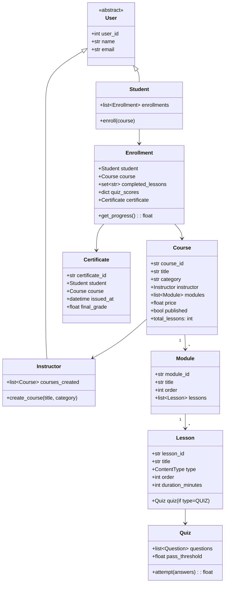

# 🎓 COURSERA — Online Learning Platform — Complete LLD Guide
## The Definitive 17-Section Edition — V2.0

---

## 📖 Table of Contents
1. [🎯 Problem Statement & Context](#-1-problem-statement--context)
2. [🗣️ Requirement Gathering](#-2-requirement-gathering)
3. [✅ Requirements (FR + NFR)](#-3-requirements)
4. [🧠 Key Insight: Composite Pattern + Progress Tracking](#-4-key-insight)
5. [📐 Class Diagram & Entity Relationships](#-5-class-diagram)
6. [🔧 API Design (Public Interface)](#-6-api-design)
7. [🏗️ Complete Code Implementation](#-7-complete-code)
8. [📊 Data Structure Choices & Trade-offs](#-8-data-structure-choices)
9. [🔒 Concurrency & Thread Safety Deep Dive](#-9-concurrency-deep-dive)
10. [🧪 SOLID Principles Mapping](#-10-solid-principles)
11. [🎨 Design Patterns Used](#-11-design-patterns)
12. [💾 Database Schema (Production View)](#-12-database-schema)
13. [⚠️ Edge Cases & Error Handling](#-13-edge-cases)
14. [🎮 Full Working Demo](#-14-full-working-demo)
15. [🎤 Interviewer Follow-ups (15+)](#-15-interviewer-follow-ups)
16. [⏱️ Interview Strategy (45-min Plan)](#-16-interview-strategy)
17. [🧠 Quick Recall Cheat Sheet](#-17-quick-recall)

---

# 🎯 1. Problem Statement & Context

## What You're Designing

> Design an **Online Learning Platform (Coursera-like)** where instructors create courses with modules and lessons (videos, articles, quizzes), students enroll, track progress through course content, complete quizzes for grading, and receive certificates on course completion.

## Real-World Context

| Metric | Real System (Coursera/Udemy) |
|--------|------------------------------|
| Total courses | 10,000+ |
| Active users | 100M+ |
| Content types | Video, Article, Quiz, Assignment |
| Course structure | Course → Module → Lesson (Composite!) |
| Completion rate | ~15% of enrolled students |
| Certificates | Issued on 100% completion + quiz pass |

## Why Interviewers Love This Problem

| What They Test | How This Tests It |
|---------------|-------------------|
| **Composite Pattern** | Course → Module → Lesson is a TREE structure |
| **Progress tracking** | Per-student × per-lesson = many-to-many with state |
| **Quiz grading** | Strategy for different grading policies |
| **Certificate generation** | Triggered by progress + grade threshold |
| **Role-based access** | Instructor vs Student — different operations |
| **Content hierarchy** | Tree traversal for "next lesson", progress % |

---

# 🗣️ 2. Requirement Gathering

## Must-Ask Questions

| # | Question | WHY You Ask | Design Impact |
|---|----------|-------------|---------------|
| 1 | "What content types? Video, article, quiz?" | Content ABC/enum | ContentType enum or Lesson ABC |
| 2 | "Course → Module → Lesson hierarchy?" | **Composite Pattern** | Tree structure: Course contains Modules contains Lessons |
| 3 | "How is progress tracked?" | Per-student per-lesson | Enrollment with per-lesson completion map |
| 4 | "Quiz grading — fixed pass mark or curve?" | Grading strategy | Strategy pattern for different policies |
| 5 | "Certificate criteria?" | Completion trigger | All lessons done + quiz average ≥ threshold |
| 6 | "Can instructors update published courses?" | Versioning | For LLD: allow updates. Production: version control |
| 7 | "Free vs paid courses?" | Pricing model | Base attribute on Course |
| 8 | "Rating and reviews?" | Feedback system | Extension |
| 9 | "Max enrollment? Waitlist?" | Capacity | Extension for cohort-based |
| 10 | "Discussion forums per course?" | Community | Extension |

### 🎯 THE question that shows depth

> "Is Course content a flat list of lessons, or a tree (Course → Module → Lesson)? Because that changes whether I use a list or the Composite Pattern."

**Always a tree.** Courses have Modules, Modules have Lessons. This is the Composite Pattern.

---

# ✅ 3. Requirements

## Functional Requirements

| Priority | ID | Requirement | Complexity |
|----------|-----|-------------|-----------|
| **P0** | FR-1 | Instructor creates course with modules and lessons | Medium |
| **P0** | FR-2 | Student enrolls in a course | Low |
| **P0** | FR-3 | Student starts/completes individual lessons | Medium |
| **P0** | FR-4 | **Track progress** — per-student, per-lesson, aggregate to module/course % | High |
| **P0** | FR-5 | **Quiz system** — questions, answers, grading | High |
| **P0** | FR-6 | **Certificate** — issued when ALL lessons done + quiz avg ≥ 70% | Medium |
| **P1** | FR-7 | View course catalog with search (by title, category) | Low |
| **P1** | FR-8 | Course ratings and reviews | Low |
| **P2** | FR-9 | Discussion forums | Medium |
| **P2** | FR-10 | Prerequisites (must complete Course A before Course B) | Medium |

---

# 🧠 4. Key Insight: Composite Pattern + Per-User Progress

## 🤔 THINK: How do you compute "75% course complete" when a course has modules, each with multiple lessons?

<details>
<summary>👀 Click to reveal — The Composite traversal that makes progress tracking elegant</summary>

### The Problem: Course is a TREE, not a flat list

```
Course: "Python Mastery"
├── Module 1: "Basics"
│   ├── Lesson 1.1: "Variables" (Video)    ← student completed ✅
│   ├── Lesson 1.2: "Loops" (Video)        ← student completed ✅
│   └── Lesson 1.3: "Quiz: Basics" (Quiz)  ← NOT done ❌
├── Module 2: "OOP"
│   ├── Lesson 2.1: "Classes" (Article)     ← NOT done ❌
│   └── Lesson 2.2: "Inheritance" (Video)   ← NOT done ❌
└── Module 3: "Projects"
    └── Lesson 3.1: "Final Project" (Assignment) ← NOT done ❌

How to calculate progress?
• Module 1: 2/3 = 66.7% ✅
• Module 2: 0/2 = 0% ❌
• Module 3: 0/1 = 0% ❌
• COURSE: 2/6 = 33.3% total progress
```

### The Solution: Recursive Progress Computation

```python
class Enrollment:
    def __init__(self, student, course):
        self.student = student
        self.course = course
        # Per-lesson tracking: lesson_id → completed?
        self.completed_lessons: set[str] = set()
    
    def get_progress(self) -> float:
        """
        Progress = completed_lessons / total_lessons × 100
        Total lessons = sum of all lessons across all modules.
        """
        total = sum(len(m.lessons) for m in self.course.modules)
        if total == 0: return 0.0
        return len(self.completed_lessons) / total * 100
    
    def get_module_progress(self, module) -> float:
        """Progress for a single module."""
        total = len(module.lessons)
        if total == 0: return 0.0
        completed = sum(1 for l in module.lessons
                       if l.lesson_id in self.completed_lessons)
        return completed / total * 100
```

### Content Type: Enum vs ABC?

```python
# Option A: Lesson type as enum (simpler — CORRECT for this problem)
class ContentType(Enum):
    VIDEO = 1      # Has duration_minutes
    ARTICLE = 2    # Has reading_time
    QUIZ = 3       # Has questions + grading
    ASSIGNMENT = 4 # Has submission + rubric

# Option B: Lesson ABC with subclasses (over-engineered)
class VideoLesson(Lesson): ...     # Has duration
class ArticleLesson(Lesson): ...   # Has content
class QuizLesson(Lesson): ...      # Has questions

# WHY Option A? Lessons don't have DIFFERENT behavior that requires
# polymorphism. The content type is DATA, not behavior.
# The ONLY piece with different behavior is Quiz (grading logic),
# and that's handled by the Quiz class, not Lesson subclass.
```

</details>

---

# 📐 5. Class Diagram & Entity Relationships



## Entity Relationships

```
Instructor ──creates──→ Course ──has──→ Module[] ──has──→ Lesson[]
                          │                                  │
                          │                          Quiz (if lesson is quiz type)
                          │                          ├── Question[]
                          │                          └── pass_threshold
                          │
Student ──enrolls──→ Enrollment
                      ├── completed_lessons: set[lesson_id]
                      ├── quiz_scores: dict[lesson_id → score]
                      └── certificate (awarded on completion)
```

---

# 🔧 6. API Design (Public Interface)

```python
class LearningPlatform:
    """Public API — what app/web frontend calls."""
    
    # ── Instructor APIs ──
    def create_course(self, instructor_id, title, category, price=0) -> Course: ...
    def add_module(self, course_id, title) -> Module: ...
    def add_lesson(self, module_id, title, content_type, duration=0) -> Lesson: ...
    def add_quiz(self, lesson_id, questions, pass_threshold=70) -> Quiz: ...
    def publish_course(self, course_id) -> bool: ...
    
    # ── Student APIs ──
    def enroll(self, student_id, course_id) -> Enrollment: ...
    def complete_lesson(self, student_id, course_id, lesson_id) -> float:
        """Mark lesson done. Returns updated progress %."""
    def attempt_quiz(self, student_id, course_id, lesson_id,
                     answers: dict) -> float:
        """Submit quiz answers. Returns score. Auto-completes lesson if pass."""
    
    # ── Read APIs ──
    def get_progress(self, student_id, course_id) -> dict: ...
    def search_courses(self, keyword=None, category=None) -> list[Course]: ...
    def get_certificate(self, student_id, course_id) -> Certificate: ...
```

---

# 🏗️ 7. Complete Code Implementation

## Enums & Base Classes

```python
from enum import Enum
from datetime import datetime
from abc import ABC, abstractmethod
import uuid
import threading

class ContentType(Enum):
    VIDEO = "VIDEO"
    ARTICLE = "ARTICLE"
    QUIZ = "QUIZ"
    ASSIGNMENT = "ASSIGNMENT"

class User(ABC):
    _counter = 0
    def __init__(self, name, email, role):
        User._counter += 1
        self.user_id = User._counter
        self.name = name
        self.email = email
        self.role = role

class Instructor(User):
    def __init__(self, name, email):
        super().__init__(name, email, "INSTRUCTOR")
        self.courses_created: list['Course'] = []
    def __str__(self):
        return f"👨‍🏫 {self.name} ({len(self.courses_created)} courses)"

class Student(User):
    def __init__(self, name, email):
        super().__init__(name, email, "STUDENT")
        self.enrollments: dict[str, 'Enrollment'] = {}  # course_id → Enrollment
    def __str__(self):
        return f"🎓 {self.name} ({len(self.enrollments)} enrolled)"
```

## Course Structure (Composite Tree)

```python
class Lesson:
    """
    Leaf node in the Course → Module → Lesson tree.
    content_type determines what the student sees (video/article/quiz).
    
    WHY not subclass per type?
    Lessons don't have different BEHAVIOR per type.
    The only special one is Quiz, which gets its own Quiz object attached.
    """
    _counter = 0
    def __init__(self, title, content_type: ContentType, duration_minutes=0):
        Lesson._counter += 1
        self.lesson_id = f"L-{Lesson._counter:04d}"
        self.title = title
        self.content_type = content_type
        self.duration_minutes = duration_minutes
        self.quiz: 'Quiz' = None  # Attached only if type == QUIZ
        self.order = 0
    
    def __str__(self):
        icon = {"VIDEO": "🎥", "ARTICLE": "📄", "QUIZ": "📝", "ASSIGNMENT": "📋"}
        return f"  {icon.get(self.content_type.value, '📌')} {self.title} ({self.content_type.value})"


class Module:
    """
    Branch node in the tree. Contains ordered Lessons.
    """
    _counter = 0
    def __init__(self, title):
        Module._counter += 1
        self.module_id = f"M-{Module._counter:04d}"
        self.title = title
        self.lessons: list[Lesson] = []
        self.order = 0
    
    def add_lesson(self, lesson: Lesson):
        lesson.order = len(self.lessons) + 1
        self.lessons.append(lesson)
        return lesson
    
    def __str__(self):
        return f"📁 {self.title} ({len(self.lessons)} lessons)"


class Course:
    """
    Root node. Course → Module[] → Lesson[].
    
    total_lessons traverses the tree to count all leaves.
    This is the Composite Pattern — you don't need to track a flat list.
    """
    _counter = 0
    def __init__(self, title, category, instructor: Instructor, price=0):
        Course._counter += 1
        self.course_id = f"C-{Course._counter:04d}"
        self.title = title
        self.category = category
        self.instructor = instructor
        self.price = price
        self.modules: list[Module] = []
        self.published = False
        self.created_at = datetime.now()
        self.enrollments: list['Enrollment'] = []
        self._lock = threading.Lock()
    
    def add_module(self, module: Module):
        module.order = len(self.modules) + 1
        self.modules.append(module)
        return module
    
    @property
    def total_lessons(self) -> int:
        """Traverse tree: sum of lessons across all modules."""
        return sum(len(m.lessons) for m in self.modules)
    
    @property
    def total_duration_minutes(self) -> int:
        return sum(l.duration_minutes for m in self.modules for l in m.lessons)
    
    def get_all_lessons(self) -> list[Lesson]:
        """Flatten the tree — all lessons in order."""
        return [l for m in self.modules for l in m.lessons]
    
    def __str__(self):
        status = "✅ Published" if self.published else "📝 Draft"
        return (f"📚 {self.title} | {self.category} | "
                f"{len(self.modules)} modules, {self.total_lessons} lessons | "
                f"₹{self.price:,.0f} | {status}")
```

## Quiz & Grading

```python
class Question:
    """Multiple choice question with one correct answer."""
    def __init__(self, text, options: list[str], correct_index: int):
        self.text = text
        self.options = options
        self.correct_index = correct_index
    
    def is_correct(self, answer_index: int) -> bool:
        return answer_index == self.correct_index


class Quiz:
    """
    Quiz attached to a QUIZ-type Lesson.
    Grading: % of correct answers.
    Pass threshold: configurable (default 70%).
    """
    def __init__(self, questions: list[Question], pass_threshold=70.0):
        self.questions = questions
        self.pass_threshold = pass_threshold
    
    def attempt(self, answers: dict[int, int]) -> float:
        """
        answers: {question_index: selected_option_index}
        Returns: score as percentage (0–100)
        """
        correct = 0
        for q_idx, a_idx in answers.items():
            if 0 <= q_idx < len(self.questions):
                if self.questions[q_idx].is_correct(a_idx):
                    correct += 1
        score = (correct / len(self.questions)) * 100
        return round(score, 1)
    
    def passed(self, score: float) -> bool:
        return score >= self.pass_threshold
```

## Enrollment & Progress Tracking

```python
class Certificate:
    def __init__(self, student: Student, course: Course, final_grade: float):
        self.certificate_id = str(uuid.uuid4())[:8].upper()
        self.student = student
        self.course = course
        self.final_grade = final_grade
        self.issued_at = datetime.now()
    
    def __str__(self):
        return (f"🏆 Certificate {self.certificate_id}: {self.student.name} | "
                f"{self.course.title} | Grade: {self.final_grade:.0f}% | "
                f"{self.issued_at.strftime('%b %d, %Y')}")


class Enrollment:
    """
    The HEART of the system — tracks per-student, per-course progress.
    
    Key data:
    - completed_lessons: set of lesson_ids → O(1) check
    - quiz_scores: dict of lesson_id → best score
    - certificate: issued when progress == 100% AND quiz avg ≥ 70%
    
    This is a many-to-many relationship with STATE:
    Student ←→ Course with progress data.
    """
    def __init__(self, student: Student, course: Course):
        self.student = student
        self.course = course
        self.completed_lessons: set[str] = set()
        self.quiz_scores: dict[str, float] = {}  # lesson_id → best score
        self.certificate: Certificate = None
        self.enrolled_at = datetime.now()
    
    def complete_lesson(self, lesson_id: str) -> bool:
        """Mark a lesson as completed. Returns True if newly completed."""
        if lesson_id in self.completed_lessons:
            return False  # Already completed
        self.completed_lessons.add(lesson_id)
        return True
    
    def record_quiz_score(self, lesson_id: str, score: float):
        """Record quiz score. Keep best score."""
        current_best = self.quiz_scores.get(lesson_id, 0)
        self.quiz_scores[lesson_id] = max(current_best, score)
    
    @property
    def progress(self) -> float:
        """Overall progress: completed / total × 100."""
        total = self.course.total_lessons
        if total == 0: return 0.0
        return round(len(self.completed_lessons) / total * 100, 1)
    
    def get_module_progress(self, module: Module) -> float:
        total = len(module.lessons)
        if total == 0: return 0.0
        done = sum(1 for l in module.lessons if l.lesson_id in self.completed_lessons)
        return round(done / total * 100, 1)
    
    @property
    def quiz_average(self) -> float:
        """Average of best quiz scores."""
        if not self.quiz_scores: return 0.0
        return round(sum(self.quiz_scores.values()) / len(self.quiz_scores), 1)
    
    @property
    def is_eligible_for_certificate(self) -> bool:
        """100% lessons done AND quiz average ≥ 70%."""
        if self.progress < 100:
            return False
        # Need all quizzes passed
        quiz_lessons = [l for l in self.course.get_all_lessons()
                       if l.content_type == ContentType.QUIZ]
        if quiz_lessons:
            for ql in quiz_lessons:
                score = self.quiz_scores.get(ql.lesson_id, 0)
                if score < ql.quiz.pass_threshold:
                    return False
        return True
    
    def issue_certificate(self) -> Certificate:
        if self.certificate:
            return self.certificate  # Already issued
        if not self.is_eligible_for_certificate:
            return None
        grade = self.quiz_average if self.quiz_scores else 100.0
        self.certificate = Certificate(self.student, self.course, grade)
        return self.certificate
    
    def display_progress(self):
        print(f"\n   📊 Progress: {self.student.name} → {self.course.title}")
        print(f"   Overall: {self.progress:.0f}% ({len(self.completed_lessons)}/{self.course.total_lessons})")
        for mod in self.course.modules:
            mp = self.get_module_progress(mod)
            bar = "█" * int(mp / 10) + "░" * (10 - int(mp / 10))
            print(f"   {mod.title}: {bar} {mp:.0f}%")
            for l in mod.lessons:
                done = "✅" if l.lesson_id in self.completed_lessons else "⬜"
                extra = ""
                if l.content_type == ContentType.QUIZ and l.lesson_id in self.quiz_scores:
                    extra = f" (Score: {self.quiz_scores[l.lesson_id]:.0f}%)"
                print(f"      {done} {l.title}{extra}")
        if self.certificate:
            print(f"   {self.certificate}")
```

## The Learning Platform

```python
class LearningPlatform:
    """
    Central system — manages courses, enrollments, progress, certificates.
    """
    _instance = None
    
    def __new__(cls):
        if cls._instance is None:
            cls._instance = super().__new__(cls)
            cls._instance._initialized = False
        return cls._instance
    
    def __init__(self):
        if self._initialized: return
        self._initialized = True
        self.courses: dict[str, Course] = {}
        self.users: dict[int, User] = {}
    
    def register_instructor(self, name, email):
        inst = Instructor(name, email)
        self.users[inst.user_id] = inst
        return inst
    
    def register_student(self, name, email):
        s = Student(name, email)
        self.users[s.user_id] = s
        return s
    
    # ── Course Building ──
    def create_course(self, instructor_id, title, category, price=0):
        inst = self.users[instructor_id]
        course = Course(title, category, inst, price)
        inst.courses_created.append(course)
        self.courses[course.course_id] = course
        print(f"   ✅ Created: {course}")
        return course
    
    def add_module(self, course_id, title):
        course = self.courses[course_id]
        mod = Module(title)
        course.add_module(mod)
        return mod
    
    def add_lesson(self, module: Module, title, content_type, duration=0):
        lesson = Lesson(title, content_type, duration)
        module.add_lesson(lesson)
        return lesson
    
    def add_quiz_to_lesson(self, lesson: Lesson, questions, threshold=70):
        quiz = Quiz(questions, threshold)
        lesson.quiz = quiz
        return quiz
    
    def publish_course(self, course_id):
        course = self.courses[course_id]
        if course.total_lessons == 0:
            print("   ❌ Cannot publish empty course!"); return False
        course.published = True
        print(f"   ✅ Published: {course}")
        return True
    
    # ── Student Operations ──
    def enroll(self, student_id, course_id):
        student = self.users[student_id]
        course = self.courses[course_id]
        
        if not course.published:
            print("   ❌ Course not published yet!"); return None
        if course_id in student.enrollments:
            print("   ❌ Already enrolled!"); return None
        
        enrollment = Enrollment(student, course)
        student.enrollments[course_id] = enrollment
        course.enrollments.append(enrollment)
        print(f"   ✅ {student.name} enrolled in '{course.title}'")
        return enrollment
    
    def complete_lesson(self, student_id, course_id, lesson_id):
        student = self.users[student_id]
        enrollment = student.enrollments.get(course_id)
        if not enrollment:
            print("   ❌ Not enrolled!"); return None
        
        # Find the lesson
        lesson = None
        for l in enrollment.course.get_all_lessons():
            if l.lesson_id == lesson_id:
                lesson = l; break
        if not lesson:
            print("   ❌ Lesson not found!"); return None
        
        # Quiz lessons need quiz attempt first
        if lesson.content_type == ContentType.QUIZ:
            if lesson.lesson_id not in enrollment.quiz_scores:
                print("   ❌ Must attempt quiz before marking complete!"); return None
            if enrollment.quiz_scores[lesson.lesson_id] < lesson.quiz.pass_threshold:
                print("   ❌ Must pass quiz to complete! Retake allowed."); return None
        
        is_new = enrollment.complete_lesson(lesson_id)
        if is_new:
            print(f"   ✅ Completed: {lesson.title} | Progress: {enrollment.progress:.0f}%")
        
        # Auto-check certificate eligibility
        if enrollment.progress == 100 and not enrollment.certificate:
            cert = enrollment.issue_certificate()
            if cert:
                print(f"   🎉 CONGRATULATIONS! {cert}")
        
        return enrollment.progress
    
    def attempt_quiz(self, student_id, course_id, lesson_id, answers):
        student = self.users[student_id]
        enrollment = student.enrollments.get(course_id)
        if not enrollment:
            print("   ❌ Not enrolled!"); return None
        
        lesson = None
        for l in enrollment.course.get_all_lessons():
            if l.lesson_id == lesson_id:
                lesson = l; break
        
        if not lesson or not lesson.quiz:
            print("   ❌ No quiz for this lesson!"); return None
        
        score = lesson.quiz.attempt(answers)
        enrollment.record_quiz_score(lesson_id, score)
        passed = lesson.quiz.passed(score)
        
        print(f"   📝 Quiz: {lesson.title} | Score: {score:.0f}% | "
              f"{'PASSED ✅' if passed else 'FAILED ❌ (retake allowed)'}")
        
        # Auto-complete lesson if passed
        if passed:
            enrollment.complete_lesson(lesson_id)
            print(f"   ✅ Lesson auto-completed. Progress: {enrollment.progress:.0f}%")
            
            # Check certificate
            if enrollment.progress == 100 and not enrollment.certificate:
                cert = enrollment.issue_certificate()
                if cert:
                    print(f"   🎉 CONGRATULATIONS! {cert}")
        
        return score
    
    # ── Search ──
    def search_courses(self, keyword=None, category=None):
        results = [c for c in self.courses.values() if c.published]
        if keyword:
            results = [c for c in results if keyword.lower() in c.title.lower()]
        if category:
            results = [c for c in results if category.lower() in c.category.lower()]
        return results
```

---

# 📊 8. Data Structure Choices & Trade-offs

| Data Structure | Where | Why | Alternative | Why Not |
|---------------|-------|-----|-------------|---------|
| `list[Module]` | Course.modules | Ordered sequence (Module 1, 2, 3). `order` field for positioning | `dict[int, Module]` | Need sequential access for "next module" |
| `list[Lesson]` | Module.lessons | Same — ordered within module | `dict` | Sequential access needed |
| `set[str]` | Enrollment.completed_lessons | O(1) lookup: "did student finish this lesson?" | `list` | `lesson_id in completed` is O(1) for set vs O(N) for list |
| `dict[str, float]` | Enrollment.quiz_scores | Maps lesson_id → best score. O(1) lookup | `list[(id, score)]` | Need lookup by lesson_id |
| `dict[str, Enrollment]` | Student.enrollments | O(1) lookup by course_id: "am I enrolled in this?" | `list[Enrollment]` | Frequent lookup: "get enrollment for course X" |

### Why `set` for completed_lessons?

```python
# ❌ List: O(N) membership check
completed = ["L-001", "L-002", ...]
if "L-003" in completed:  # Scans entire list!

# ✅ Set: O(1) membership check
completed = {"L-001", "L-002", ...}
if "L-003" in completed:  # Hash lookup!

# For a 50-lesson course: 50× faster
# For progress computation (checking each lesson): set is critical
```

---

# 🔒 9. Concurrency & Thread Safety Deep Dive

## When Does Concurrency Matter?

| Scenario | Concurrency Need |
|----------|-----------------|
| Enrollment | Multiple students enrolling simultaneously |
| Progress updates | Student completes lesson (write to their enrollment) |
| Quiz grading | Multiple students submitting same quiz |
| Course editing | Instructor editing while students learning |

### The Enrollment Race Condition

```
Timeline: max_enrollment = 100, current = 99

t=0: Student A → reads current = 99 → 99 < 100 → YES
t=1: Student B → reads current = 99 → 99 < 100 → YES
t=2: Student A → enrolls → current = 100
t=3: Student B → enrolls → current = 101 💀 OVER-ENROLLED!
```

```python
# Fix: per-course lock for enrollment
def enroll(self, student_id, course_id):
    course = self.courses[course_id]
    with course._lock:
        if len(course.enrollments) >= course.max_enrollment:
            return None  # Rejected!
        enrollment = Enrollment(student, course)
        course.enrollments.append(enrollment)
        return enrollment
```

### Progress Updates: Safe Without Lock

```python
# Progress is PER-STUDENT — no shared state between students!
# Student A completing L-001 CANNOT corrupt Student B's progress.
# Each Enrollment is independent → no lock needed for progress.
```

---

# 🧪 10. SOLID Principles Mapping

| Principle | Where Applied | Explanation |
|-----------|--------------|-------------|
| **S** | Each class has one job | Course = structure. Enrollment = progress. Quiz = grading. Certificate = credential. Platform = orchestration |
| **O** | New content type | Add `LIVE_SESSION` to ContentType enum. Zero code change in Enrollment progress tracking (it just counts completed lessons) |
| **L** | User ABC | Platform treats Instructor and Student polymorphically where appropriate |
| **I** | Focused APIs | Instructor APIs (create/edit) separate from Student APIs (enroll/learn). No bloated single interface |
| **D** | Platform → User ABC | Platform stores `dict[int, User]`, not separate dicts for Instructor/Student |

---

# 🎨 11. Design Patterns Used

| Pattern | Where | Why |
|---------|-------|-----|
| **Composite** ⭐ | Course → Module → Lesson | Tree structure for course content. `total_lessons` traverses tree |
| **Strategy** | (Extension) GradingStrategy | WeightedGrade, CurveGrade, PassFail — different grading policies |
| **Observer** | (Extension) Progress notifications | "Module 2 complete!" → email/push notification |
| **Factory** | (Extension) CertificateFactory | Generate PDF certificate with template |
| **Singleton** | LearningPlatform | One system instance |

### Pattern Comparison

| This Problem | Similar To | Key Pattern |
|-------------|-----------|-------------|
| Course → Module → Lesson | File system (Dir → Files) | **Composite** |
| Enrollment tracking | Booking status tracking | Many-to-many with state |
| Quiz grading | Payment processing | **Strategy** (different algorithms) |
| Certificate on completion | Booking confirmation | Event-driven trigger |

---

# 💾 12. Database Schema (Production View)

```sql
CREATE TABLE courses (
    course_id   VARCHAR(20) PRIMARY KEY,
    title       VARCHAR(200) NOT NULL,
    category    VARCHAR(50),
    instructor_id INTEGER REFERENCES users(user_id),
    price       DECIMAL(8,2) DEFAULT 0,
    published   BOOLEAN DEFAULT FALSE,
    created_at  TIMESTAMP DEFAULT NOW()
);

CREATE TABLE modules (
    module_id   VARCHAR(20) PRIMARY KEY,
    course_id   VARCHAR(20) REFERENCES courses(course_id),
    title       VARCHAR(200),
    sort_order  INTEGER NOT NULL
);

CREATE TABLE lessons (
    lesson_id   VARCHAR(20) PRIMARY KEY,
    module_id   VARCHAR(20) REFERENCES modules(module_id),
    title       VARCHAR(200),
    content_type VARCHAR(20),
    duration_min INTEGER DEFAULT 0,
    sort_order  INTEGER NOT NULL
);

CREATE TABLE enrollments (
    student_id  INTEGER REFERENCES users(user_id),
    course_id   VARCHAR(20) REFERENCES courses(course_id),
    enrolled_at TIMESTAMP DEFAULT NOW(),
    PRIMARY KEY (student_id, course_id)
);

CREATE TABLE lesson_progress (
    student_id  INTEGER,
    course_id   VARCHAR(20),
    lesson_id   VARCHAR(20) REFERENCES lessons(lesson_id),
    completed_at TIMESTAMP DEFAULT NOW(),
    PRIMARY KEY (student_id, course_id, lesson_id),
    FOREIGN KEY (student_id, course_id) REFERENCES enrollments(student_id, course_id)
);

CREATE TABLE quiz_attempts (
    attempt_id  SERIAL PRIMARY KEY,
    student_id  INTEGER,
    lesson_id   VARCHAR(20),
    score       DECIMAL(5,2),
    attempted_at TIMESTAMP DEFAULT NOW()
);

-- Progress query: % complete for a student
SELECT e.student_id, e.course_id,
    COUNT(lp.lesson_id) as completed,
    (SELECT COUNT(*) FROM lessons l JOIN modules m ON l.module_id = m.module_id
     WHERE m.course_id = e.course_id) as total,
    ROUND(COUNT(lp.lesson_id) * 100.0 / NULLIF(total, 0), 1) as progress_pct
FROM enrollments e
LEFT JOIN lesson_progress lp ON e.student_id = lp.student_id AND e.course_id = lp.course_id
WHERE e.student_id = 42
GROUP BY e.student_id, e.course_id;
```

---

# ⚠️ 13. Edge Cases & Error Handling

| # | Edge Case | Fix |
|---|-----------|-----|
| 1 | **Complete quiz lesson without attempting quiz** | Block: must submit quiz first, then auto-complete if passed |
| 2 | **Enroll in unpublished course** | Validate `course.published == True` |
| 3 | **Double enrollment** | Check `course_id in student.enrollments` |
| 4 | **Empty course published** | Validate `total_lessons > 0` before publish |
| 5 | **Quiz retake — keep best score** | `max(current_best, new_score)` in record_quiz_score |
| 6 | **100% progress but quiz failed** | Certificate checks BOTH progress=100% AND all quizzes passed |
| 7 | **Lesson from wrong course** | Validate lesson belongs to enrolled course |
| 8 | **Already completed lesson** | `set.add()` is idempotent — no double-counting |
| 9 | **0 questions in quiz** | Handle division by zero in `attempt()` |
| 10 | **Instructor edits course after enrollment** | New lessons = progress % drops (recalculated dynamically) |

---

# 🎮 14. Full Working Demo

```python
if __name__ == "__main__":
    print("=" * 65)
    print("     🎓 COURSERA — ONLINE LEARNING PLATFORM DEMO")
    print("=" * 65)
    
    platform = LearningPlatform()
    
    # Setup
    prof = platform.register_instructor("Dr. Smith", "smith@uni.edu")
    alice = platform.register_student("Alice", "alice@mail.com")
    
    # Create course
    print("\n─── Create Course ───")
    course = platform.create_course(prof.user_id, "Python Mastery", "Programming", 2999)
    
    # Add modules and lessons
    m1 = platform.add_module(course.course_id, "Module 1: Basics")
    l1 = platform.add_lesson(m1, "Variables & Types", ContentType.VIDEO, 15)
    l2 = platform.add_lesson(m1, "Control Flow", ContentType.VIDEO, 20)
    l3 = platform.add_lesson(m1, "Quiz: Basics", ContentType.QUIZ)
    platform.add_quiz_to_lesson(l3, [
        Question("What is 2+2?", ["3", "4", "5"], 1),
        Question("Python is?", ["Compiled", "Interpreted", "Neither"], 1),
    ], threshold=70)
    
    m2 = platform.add_module(course.course_id, "Module 2: OOP")
    l4 = platform.add_lesson(m2, "Classes", ContentType.ARTICLE, 10)
    l5 = platform.add_lesson(m2, "Inheritance", ContentType.VIDEO, 25)
    
    platform.publish_course(course.course_id)
    
    # Enroll
    print("\n─── Enroll ───")
    enrollment = platform.enroll(alice.user_id, course.course_id)
    
    # Complete lessons
    print("\n─── Learning Journey ───")
    platform.complete_lesson(alice.user_id, course.course_id, l1.lesson_id)
    platform.complete_lesson(alice.user_id, course.course_id, l2.lesson_id)
    
    # Try to complete quiz without attempting it
    print("\n─── Quiz (must attempt first) ───")
    platform.complete_lesson(alice.user_id, course.course_id, l3.lesson_id)
    
    # Attempt quiz
    print("\n─── Attempt Quiz ───")
    platform.attempt_quiz(alice.user_id, course.course_id, l3.lesson_id,
                         {0: 1, 1: 1})  # Both correct!
    
    # Complete remaining
    print("\n─── Finish Course ───")
    platform.complete_lesson(alice.user_id, course.course_id, l4.lesson_id)
    platform.complete_lesson(alice.user_id, course.course_id, l5.lesson_id)
    
    # Progress display
    enrollment.display_progress()
    
    print(f"\n{'='*65}")
    print("     ✅ ALL TESTS COMPLETE!")
    print(f"{'='*65}")
```

---

# 🎤 15. Interviewer Follow-ups (15+)

| Q | Question | Key Answer |
|---|----------|-----------|
| 1 | "Why Composite for course structure?" | Course → Module → Lesson is a tree. `total_lessons` traverses it. Adding a sub-module layer = natural extension |
| 2 | "Why set for completed_lessons?" | O(1) membership check. Computing progress = checking each lesson → set is critical |
| 3 | "Quiz retake policy?" | Keep best score: `max(current_best, new_score)`. Unlimited retakes stimulates learning |
| 4 | "Certificate criteria?" | 100% lessons + all quizzes passed (≥ threshold). Both conditions checked |
| 5 | "Lesson types: enum vs ABC?" | Enum — lessons don't have different BEHAVIOR per type. Only Quiz has special grading logic → separate Quiz class |
| 6 | "Prerequisites?" | Course has `prerequisites: list[Course]`. Check: student has certificate for each prereq |
| 7 | "Peer review assignments?" | Assignment submitted → randomly assigned to 3 peers → average score |
| 8 | "Live sessions?" | Add `LIVE_SESSION` to ContentType. Schedule + Zoom link. Auto-complete = attend ≥ 80% |
| 9 | "Discussion forums?" | Thread per lesson. Instructor can pin answers. Vote-based ranking |
| 10 | "Recommendation engine?" | Collaborative filtering: students who took X also took Y. Or category-based |
| 11 | "Video streaming?" | CDN + adaptive bitrate. Track watch % for auto-complete (>90% watched) |
| 12 | "Course versioning?" | New version = new Course. Old enrollments stay on old version |
| 13 | "Instructor analytics?" | Enrollment count, completion rate, avg quiz score, revenue |
| 14 | "Gamification?" | Points, badges, streaks (consecutive days). Leaderboard per course |
| 15 | "Mobile offline?" | Download lessons. Sync progress when back online |

---

# ⏱️ 16. Interview Strategy (45-min Plan)

| Time | Phase | What You Do |
|------|-------|-------------|
| **0–5** | Clarify | Content types, course hierarchy, progress tracking, certificates |
| **5–10** | Key Insight | Draw Course → Module → Lesson tree. Explain progress = leaves completed / total leaves |
| **10–15** | Class Diagram | Course, Module, Lesson, Enrollment, Quiz, Certificate |
| **15–30** | Code | Course tree with total_lessons, Enrollment with set + progress, Quiz grading, Certificate trigger |
| **30–38** | Demo | Create course, enroll, complete lessons, quiz attempt, certificate earned |
| **38–45** | Extensions | Prerequisites, peer review, video streaming, gamification |

## Golden Sentences

> **Opening:** "This is a Composite Pattern problem. Course → Module → Lesson is a tree. Progress = completed leaves / total leaves."

> **Progress:** "I use a set for completed_lessons — O(1) check per lesson. Progress computation traverses the Composite tree."

> **Quiz design:** "Quiz is separate from Lesson because only quiz-type lessons have grading behavior. Other content types don't need it."

---

# 🧠 17. Quick Recall Cheat Sheet

## ⏱️ 30-Second Recall

> **Composite:** Course → Module → Lesson tree. **Progress** = `completed_lessons (set)` / `total_lessons (tree sum)` × 100%. **Quiz:** score %, pass threshold, keep best. **Certificate:** progress=100% + all quizzes passed. **Enrollment** = many-to-many with STATE (per-student, per-course progress).

## ⏱️ 2-Minute Recall

Add:
> **Entities:** Course (tree root), Module (branch), Lesson (leaf, has ContentType). Enrollment (student×course + completed set + quiz scores). Quiz (questions + threshold). Certificate (auto-issued).
> **Content types:** VIDEO, ARTICLE, QUIZ, ASSIGNMENT — enum not ABC (same behavior, different data).
> **Edge cases:** Quiz lesson must be attempted before complete. Best-score retention. 100%+passed check for certificate.

## ⏱️ 5-Minute Recall

Add:
> **SOLID:** OCP — new content type = add enum value, progress tracking unchanged. SRP per class.
> **Patterns:** Composite (course tree), Strategy (grading extension), Observer (progress notifications), Singleton (platform).
> **DB:** courses, modules, lessons, enrollments, lesson_progress, quiz_attempts tables. Progress query = COUNT(completed) / COUNT(all lessons).
> **Concurrency:** Per-course lock for enrollment (max-enrollment check). Progress = per-student, no shared state.

---

## ✅ Pre-Implementation Checklist

- [ ] **ContentType** enum (VIDEO, ARTICLE, QUIZ, ASSIGNMENT)
- [ ] **User** ABC → Instructor, Student
- [ ] **Lesson** (lesson_id, title, type, duration, quiz reference)
- [ ] **Module** (module_id, title, lessons list, add_lesson)
- [ ] **Course** (course_id, title, modules list, total_lessons property, published flag)
- [ ] **Quiz** (questions, pass_threshold, attempt method)
- [ ] **Enrollment** (student, course, completed_lessons SET, quiz_scores dict, progress property)
- [ ] **Certificate** (auto-issued when eligible: 100% + quizzes passed)
- [ ] **LearningPlatform** (create course, enroll, complete_lesson, attempt_quiz, search)
- [ ] **Demo:** create course tree, enroll, learn, quiz, certificate

---

*Version 2.0 — The Definitive 17-Section Edition (Gold Standard)*
