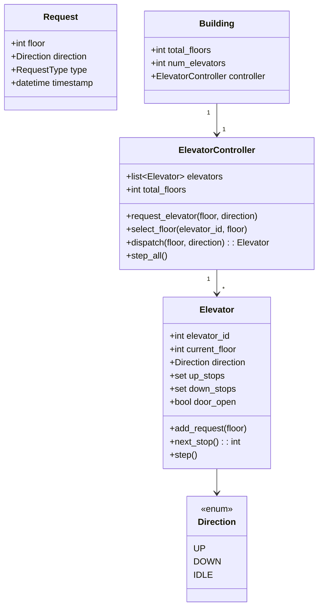

# 🛗 ELEVATOR SYSTEM — Complete LLD Guide
## The Definitive 17-Section Edition — V2.0

---

## 📖 Table of Contents
1. [🎯 Problem Statement & Context](#-1-problem-statement--context)
2. [🗣️ Requirement Gathering](#-2-requirement-gathering)
3. [✅ Requirements (FR + NFR)](#-3-requirements)
4. [🧠 Key Insight: Scheduling Algorithm + Direction Management](#-4-key-insight)
5. [📐 Class Diagram & Entity Relationships](#-5-class-diagram)
6. [🔧 API Design (Public Interface)](#-6-api-design)
7. [🏗️ Complete Code Implementation](#-7-complete-code)
8. [📊 Data Structure Choices & Trade-offs](#-8-data-structure-choices)
9. [🔒 Concurrency & Thread Safety Deep Dive](#-9-concurrency-deep-dive)
10. [🧪 SOLID Principles Mapping](#-10-solid-principles)
11. [🎨 Design Patterns Used](#-11-design-patterns)
12. [💾 Database Schema (Production View)](#-12-database-schema)
13. [⚠️ Edge Cases & Error Handling](#-13-edge-cases)
14. [🎮 Full Working Demo](#-14-full-working-demo)
15. [🎤 Interviewer Follow-ups (15+)](#-15-interviewer-follow-ups)
16. [⏱️ Interview Strategy (45-min Plan)](#-16-interview-strategy)
17. [🧠 Quick Recall Cheat Sheet](#-17-quick-recall)

---

# 🎯 1. Problem Statement & Context

## What You're Designing

> Design an **Elevator System** for a building with N floors and M elevators. Handle external requests (hall buttons: UP/DOWN on each floor) and internal requests (floor buttons inside the elevator). Implement an efficient scheduling algorithm that minimizes wait time and maximizes throughput. Each elevator should process requests using the SCAN (elevator) algorithm — serve all requests in the current direction before reversing.

## Real-World Context

| Metric | Real System |
|--------|-------------|
| Floors | 5–100+ |
| Elevators per building | 2–8 (residential), 8–24 (commercial) |
| Capacity | 8–20 persons |
| Speed | 1–6 m/s (1 floor ≈ 2–4 seconds) |
| Peak usage | Morning (up), Evening (down), Lunch (both) |
| Decision time | <100ms per request |

## Why Interviewers Love This Problem

| What They Test | How This Tests It |
|---------------|-------------------|
| **Scheduling algorithm** | SCAN vs LOOK vs SSTF — real CS algorithm |
| **Multi-elevator dispatch** | Which elevator should serve a new request? |
| **Direction management** | Continue in direction, serve en-route, reverse when done |
| **Concurrency** | Multiple requests arriving simultaneously |
| **State machine** | IDLE → MOVING_UP → MOVING_DOWN → IDLE |
| **Real-time system** | Continuous operation, no "start/end" |

---

# 🗣️ 2. Requirement Gathering

## Must-Ask Questions

| # | Question | WHY You Ask | Design Impact |
|---|----------|-------------|---------------|
| 1 | "How many floors and elevators?" | System scope | Configurable N floors, M elevators |
| 2 | "External requests (hall buttons) and internal (floor buttons)?" | TWO request types | ExternalRequest (floor + direction) vs InternalRequest (destination floor) |
| 3 | "What scheduling algorithm?" | **THE core algorithm** | SCAN (elevator algorithm): serve all in direction, then reverse |
| 4 | "Multiple elevators — how to dispatch?" | Assignment strategy | Nearest elevator in same direction (or idle) |
| 5 | "Elevator capacity?" | Overload prevention | Max weight/people. Skip floor if full |
| 6 | "Door open/close timing?" | Simulation detail | Open, wait 3s, close. Open button extends wait |
| 7 | "Emergency stop / fire mode?" | Safety features | Extension — mention but don't code |
| 8 | "VIP / express elevator?" | Priority queue | Extension — some elevators only serve top floors |

### 🎯 THE question that sets you apart

> "Should I use SCAN, LOOK, or SSTF for the scheduling algorithm?"

Then explain the trade-offs:

| Algorithm | Description | Pros | Cons |
|-----------|-------------|------|------|
| **FCFS** | First Come First Served | Simple | Terrible — elevator ping-pongs wildly |
| **SSTF** | Shortest Seek Time First | Minimizes per-request wait | Starvation — far requests wait forever |
| **SCAN** ⭐ | Serve all in direction, then reverse | Fair + efficient | Slightly longer for some requests |
| **LOOK** | Like SCAN but reverses at last request, not at top/bottom floor | Efficient variant | Marginally more complex |

**Default choice:** SCAN (or LOOK). It's the standard elevator algorithm used in real buildings and also the disk scheduling algorithm — showing CS knowledge.

---

# ✅ 3. Requirements

## Functional Requirements

| Priority | ID | Requirement | Complexity |
|----------|-----|-------------|-----------|
| **P0** | FR-1 | Handle **external requests** (hall button: floor + direction) | Medium |
| **P0** | FR-2 | Handle **internal requests** (floor button: destination) | Medium |
| **P0** | FR-3 | **SCAN algorithm**: serve all requests in current direction, then reverse | High |
| **P0** | FR-4 | Stop at requested floors, open/close doors | Medium |
| **P0** | FR-5 | **Multi-elevator dispatch**: assign request to best elevator | High |
| **P1** | FR-6 | Direction indicators (UP/DOWN display on each floor) | Low |
| **P1** | FR-7 | Capacity management (skip floor if full) | Medium |
| **P2** | FR-8 | Emergency stop, fire mode, maintenance mode | Medium |

---

# 🧠 4. Key Insight: SCAN Algorithm + Elevator Dispatch

## 🤔 THINK: Elevator is at floor 5, going UP. Requests: [3, 7, 2, 9, 6]. What order?

<details>
<summary>👀 Click to reveal — The SCAN algorithm step-by-step</summary>

### SCAN Algorithm Visualized

```
Current: Floor 5, Direction: UP
Requests: [3, 7, 2, 9, 6]

Step 1: Separate requests by direction
  ABOVE (serve now — going up): [6, 7, 9]  ← sorted ascending
  BELOW (serve later — after reversal): [3, 2]  ← sorted descending

Step 2: Serve UP requests in order
  5 → 6 → 7 → 9  (reached top of requests)

Step 3: Reverse direction to DOWN
  9 → 3 → 2  (serve remaining in descending order)

Full order: 5 → 6 → 7 → 9 → 3 → 2
Compare FCFS: 5 → 3 → 7 → 2 → 9 → 6  (ping-pong! 5 → 3 → 7 → 2 → 9 → 6 = lots of reversals)
```

### Why SCAN is Better Than FCFS

```
SCAN: 5→6→7→9→3→2
Total floors traveled: 1+1+2+6+1 = 11

FCFS: 5→3→7→2→9→6
Total floors traveled: 2+4+5+7+3 = 21

SCAN saves 48% movement! It's the same principle as disk scheduling.
```

### The Implementation: Two Sorted Sets

```python
class Elevator:
    def __init__(self, elevator_id, total_floors):
        self.current_floor = 0
        self.direction = Direction.UP
        
        # THE KEY DATA STRUCTURE: Two sorted sets
        self.up_stops: SortedSet = SortedSet()    # Floors to visit going UP
        self.down_stops: SortedSet = SortedSet()  # Floors to visit going DOWN
    
    def add_request(self, floor):
        """Add a floor to the appropriate direction set."""
        if floor > self.current_floor:
            self.up_stops.add(floor)
        elif floor < self.current_floor:
            self.down_stops.add(floor)
        # If floor == current_floor, already here!
    
    def next_stop(self):
        """Get next floor to visit based on current direction."""
        if self.direction == Direction.UP:
            if self.up_stops:
                return min(self.up_stops)    # Nearest floor above
            elif self.down_stops:
                self.direction = Direction.DOWN  # Reverse!
                return max(self.down_stops)  # Highest floor below
        else:  # DOWN
            if self.down_stops:
                return max(self.down_stops)  # Nearest floor below
            elif self.up_stops:
                self.direction = Direction.UP    # Reverse!
                return min(self.up_stops)    # Lowest floor above
        return None  # No requests — IDLE
```

### Multi-Elevator Dispatch: Which Elevator Gets the Request?

```python
def dispatch(self, floor: int, direction: Direction) -> Elevator:
    """
    Strategy: Choose the elevator that can reach the floor fastest.
    
    Priority order:
    1. Elevator already going in same direction AND will pass this floor
    2. Idle elevator closest to the floor
    3. Elevator going in opposite direction (will eventually reverse)
    
    Score = abs(elevator.current_floor - requested_floor)
    Penalty: +N for wrong direction (must complete current direction first)
    """
    best_elevator = None
    best_score = float('inf')
    
    for elevator in self.elevators:
        score = abs(elevator.current_floor - floor)
        
        if elevator.direction == Direction.IDLE:
            pass  # No penalty for idle
        elif elevator.direction == direction:
            # Same direction — bonus if en-route
            if direction == Direction.UP and elevator.current_floor <= floor:
                pass  # Will pass this floor — no penalty!
            elif direction == Direction.DOWN and elevator.current_floor >= floor:
                pass  # Will pass — no penalty
            else:
                score += self.total_floors  # Wrong side — penalty
        else:
            score += self.total_floors * 2  # Opposite direction — heavy penalty
        
        if score < best_score:
            best_score = score
            best_elevator = elevator
    
    return best_elevator
```

</details>

---

# 📐 5. Class Diagram & Entity Relationships



## Entity Relationships

```
Building
├── total_floors, num_elevators
└── ElevatorController
    ├── elevators[]
    │   ├── current_floor, direction
    │   ├── up_stops (sorted set)
    │   └── down_stops (sorted set)
    └── dispatch logic (nearest + direction match)
```

---

# 🔧 6. API Design (Public Interface)

```python
class ElevatorController:
    """
    Public API — TWO types of requests, matching physical buttons.
    
    External: Hall button on a floor (UP or DOWN)
      → System dispatches BEST elevator
      → "I'm on floor 5, I want to go UP"
    
    Internal: Floor button inside an elevator
      → Goes directly to that elevator's queue
      → "I'm in elevator 2, take me to floor 12"
    """
    
    def request_elevator(self, floor: int, direction: Direction) -> Elevator:
        """
        EXTERNAL request: Someone pressed UP/DOWN on a floor.
        Dispatches the best elevator.
        """
    
    def select_floor(self, elevator_id: int, floor: int) -> None:
        """
        INTERNAL request: Passenger inside elevator pressed a floor button.
        Adds floor to that elevator's stops.
        """
    
    def step_all(self) -> None:
        """
        Simulate one time step — each elevator moves one floor.
        For demo/testing. In production, elevators run continuously.
        """
    
    def display_status(self) -> None:
        """Show current status of all elevators."""
```

---

# 🏗️ 7. Complete Code Implementation

## Enums & Request

```python
from enum import Enum
from datetime import datetime
import threading

class Direction(Enum):
    UP = "UP"
    DOWN = "DOWN"
    IDLE = "IDLE"

class RequestType(Enum):
    EXTERNAL = "EXTERNAL"  # Hall button (floor + direction)
    INTERNAL = "INTERNAL"  # Cabin button (destination floor)
```

## Elevator — SCAN Algorithm

```python
class Elevator:
    """
    Single elevator with SCAN scheduling.
    
    Key data structures:
    - up_stops: set of floors to visit going UP (sorted ascending)
    - down_stops: set of floors to visit going DOWN (sorted descending)
    
    SCAN algorithm:
    1. If going UP: serve lowest floor in up_stops
    2. When up_stops empty: reverse to DOWN, serve highest in down_stops
    3. When down_stops empty: reverse to UP
    4. When both empty: IDLE
    """
    def __init__(self, elevator_id: int, total_floors: int):
        self.elevator_id = elevator_id
        self.total_floors = total_floors
        self.current_floor = 0
        self.direction = Direction.IDLE
        self.up_stops: set[int] = set()     # Floors to visit going UP
        self.down_stops: set[int] = set()   # Floors to visit going DOWN
        self.door_open = False
        self._lock = threading.Lock()
    
    def add_request(self, floor: int):
        """
        Add a floor to the appropriate direction queue.
        
        Logic:
        - If floor > current → goes in up_stops
        - If floor < current → goes in down_stops
        - If floor == current → already here (open door)
        
        Special case: elevator is IDLE
        - Set direction based on requested floor
        """
        with self._lock:
            if floor == self.current_floor:
                self.door_open = True
                return
            
            if floor > self.current_floor:
                self.up_stops.add(floor)
                if self.direction == Direction.IDLE:
                    self.direction = Direction.UP
            else:
                self.down_stops.add(floor)
                if self.direction == Direction.IDLE:
                    self.direction = Direction.DOWN
    
    def next_stop(self) -> int | None:
        """
        Determine the next floor to visit using SCAN.
        
        Going UP:
          - If up_stops has floors → go to nearest (min)
          - If up_stops empty → REVERSE to DOWN
          
        Going DOWN:
          - If down_stops has floors → go to nearest (max)
          - If down_stops empty → REVERSE to UP
          
        Both empty → IDLE (return None)
        """
        if self.direction == Direction.UP:
            # Floors above in ascending order
            above = sorted(f for f in self.up_stops if f >= self.current_floor)
            if above:
                return above[0]
            # Nothing above — check if anything below
            if self.down_stops:
                self.direction = Direction.DOWN
                return max(self.down_stops)
        
        elif self.direction == Direction.DOWN:
            # Floors below in descending order
            below = sorted((f for f in self.down_stops if f <= self.current_floor), reverse=True)
            if below:
                return below[0]
            # Nothing below — check if anything above
            if self.up_stops:
                self.direction = Direction.UP
                return min(self.up_stops)
        
        # Both empty
        self.direction = Direction.IDLE
        return None
    
    def step(self) -> str | None:
        """
        Simulate one time step: move one floor toward next_stop.
        Returns description of action taken, or None if idle.
        """
        self.door_open = False
        target = self.next_stop()
        
        if target is None:
            return None  # IDLE
        
        # Move one floor
        if target > self.current_floor:
            self.current_floor += 1
            self.direction = Direction.UP
        elif target < self.current_floor:
            self.current_floor -= 1
            self.direction = Direction.DOWN
        
        # Check if we've arrived at a stop
        action = None
        if self.current_floor in self.up_stops:
            self.up_stops.discard(self.current_floor)
            self.door_open = True
            action = f"🔔 Elevator {self.elevator_id} STOPPED at floor {self.current_floor} (↑)"
        
        if self.current_floor in self.down_stops:
            self.down_stops.discard(self.current_floor)
            self.door_open = True
            action = f"🔔 Elevator {self.elevator_id} STOPPED at floor {self.current_floor} (↓)"
        
        return action
    
    @property
    def is_idle(self):
        return not self.up_stops and not self.down_stops
    
    @property
    def total_pending(self):
        return len(self.up_stops) + len(self.down_stops)
    
    def __str__(self):
        dir_icon = {"UP": "⬆️", "DOWN": "⬇️", "IDLE": "⏸️"}
        door = "🟢 OPEN" if self.door_open else "🔴 CLOSED"
        up = sorted(self.up_stops) if self.up_stops else []
        dn = sorted(self.down_stops, reverse=True) if self.down_stops else []
        return (f"   Elevator {self.elevator_id}: Floor {self.current_floor:>2} "
                f"{dir_icon[self.direction.value]} | {door} | "
                f"Up:{up} Down:{dn}")
```

## Elevator Controller — Dispatch + Orchestration

```python
class ElevatorController:
    """
    Manages multiple elevators. Key responsibilities:
    1. DISPATCH: Which elevator handles a new external request?
    2. ROUTE: Add internal requests to specific elevator
    3. SIMULATE: Step all elevators forward
    
    Dispatch algorithm:
    - Prefer elevator going in SAME direction that will PASS this floor
    - Then prefer IDLE elevator closest to floor
    - Last resort: elevator going other direction (highest penalty)
    """
    def __init__(self, num_elevators: int, total_floors: int):
        self.total_floors = total_floors
        self.elevators = [Elevator(i+1, total_floors) for i in range(num_elevators)]
    
    def _dispatch(self, floor: int, direction: Direction) -> Elevator:
        """
        Find the best elevator for an external request.
        
        Scoring:
        - Base: distance from elevator to requested floor
        - Bonus (0 penalty): same direction + en-route
        - Penalty (+N): same direction but wrong side (passed it)
        - Penalty (+2N): opposite direction
        """
        best = None
        best_score = float('inf')
        
        for elevator in self.elevators:
            distance = abs(elevator.current_floor - floor)
            score = distance
            
            if elevator.direction == Direction.IDLE:
                # Idle — just use distance (already the base score)
                pass
            
            elif elevator.direction == direction:
                # Same direction
                if direction == Direction.UP and elevator.current_floor <= floor:
                    pass  # En-route! No penalty
                elif direction == Direction.DOWN and elevator.current_floor >= floor:
                    pass  # En-route! No penalty
                else:
                    score += self.total_floors  # Passed it — must complete direction first
            
            else:
                # Opposite direction — heavy penalty
                score += self.total_floors * 2
            
            # Tie-breaker: fewer pending requests
            score += elevator.total_pending * 0.5
            
            if score < best_score:
                best_score = score
                best = elevator
        
        return best
    
    def request_elevator(self, floor: int, direction: Direction) -> Elevator:
        """
        External request: hall button pressed.
        Dispatches to best elevator.
        """
        if floor < 0 or floor >= self.total_floors:
            print(f"   ❌ Invalid floor {floor}!"); return None
        
        elevator = self._dispatch(floor, direction)
        elevator.add_request(floor)
        
        dir_icon = "⬆️" if direction == Direction.UP else "⬇️"
        print(f"   {dir_icon} Floor {floor} → Dispatched to Elevator {elevator.elevator_id}")
        return elevator
    
    def select_floor(self, elevator_id: int, floor: int):
        """Internal request: passenger pressed floor button inside elevator."""
        if floor < 0 or floor >= self.total_floors:
            print(f"   ❌ Invalid floor {floor}!"); return
        
        elevator = self.elevators[elevator_id - 1]
        elevator.add_request(floor)
        print(f"   🔢 Elevator {elevator_id}: passenger selected floor {floor}")
    
    def step_all(self) -> list[str]:
        """
        Simulate one time step — all elevators move one floor.
        Returns list of actions (stop events).
        """
        actions = []
        for elevator in self.elevators:
            action = elevator.step()
            if action:
                actions.append(action)
        return actions
    
    def display_status(self):
        """Show status of all elevators."""
        print(f"\n   ╔══════ ELEVATOR STATUS ══════╗")
        for elevator in self.elevators:
            print(elevator)
        print(f"   ╚═════════════════════════════╝")
    
    def display_building(self):
        """Visual building representation."""
        print(f"\n   Building ({self.total_floors} floors, {len(self.elevators)} elevators)")
        for floor in range(self.total_floors - 1, -1, -1):
            floor_str = f"   F{floor:>2} │"
            for elev in self.elevators:
                if elev.current_floor == floor:
                    dir_sym = "▲" if elev.direction == Direction.UP else (
                        "▼" if elev.direction == Direction.DOWN else "■")
                    floor_str += f" [{dir_sym}] "
                else:
                    floor_str += "  ·  "
            print(floor_str + "│")
        print(f"       └{'─────' * len(self.elevators)}┘")
        for i, e in enumerate(self.elevators):
            print(f"        E{e.elevator_id}  ", end="")
        print()
```

---

# 📊 8. Data Structure Choices & Trade-offs

| Data Structure | Where | Why | Alternative | Why Not |
|---------------|-------|-----|-------------|---------|
| `set[int]` | up_stops, down_stops | O(1) add, O(1) discard, O(N log N) sorted traversal | `SortedList` | Set is simpler. Sorting only when needed (next_stop). For 100 floors, sorting set is negligible |
| Two separate sets | up_stops vs down_stops | SCAN needs to separate directional requests | Single list + filter | Cleaner separation. No re-filtering every step |
| `list[Elevator]` | Controller.elevators | Index by ID. Small N (2-8 elevators) | Dict | List is simpler for small N |

### Why Two Sets, Not One Queue?

```python
# ❌ One list: must re-sort and re-partition every step
pending = [3, 7, 2, 9, 6]
# Going UP from 5: filter above, sort ascending → [6, 7, 9]
# Reverse: filter below, sort descending → [3, 2]
# EVERY step, re-partition. Wasteful!

# ✅ Two sets: pre-partitioned by direction
up_stops = {6, 7, 9}     # Already partitioned!
down_stops = {2, 3}       # Already partitioned!
# O(1) to check if current_floor in stops
# O(N log N) only when getting min/max (can use SortedList for O(log N))
```

---

# 🔒 9. Concurrency & Thread Safety Deep Dive

## When Does Concurrency Matter?

Elevators run **continuously and independently** — each elevator is essentially its own thread.

### The Real Concurrency Model

```
Thread 1: Elevator 1 runs continuously (step loop)
Thread 2: Elevator 2 runs continuously (step loop)
Thread 3: Elevator 3 runs continuously (step loop)
Thread 4: Controller receives hall button presses (dispatch)
Thread 5: Controller receives cabin button presses (route)

Race condition: Thread 4 dispatches to Elevator 1 (modifies up_stops)
               WHILE Thread 1 is reading up_stops for next_stop()
```

```python
# Fix: per-elevator lock
class Elevator:
    def __init__(self):
        self._lock = threading.Lock()
    
    def add_request(self, floor):
        with self._lock:          # Protect set modification
            self.up_stops.add(floor)
    
    def step(self):
        with self._lock:          # Protect set read + remove
            target = self.next_stop()
            if self.current_floor in self.up_stops:
                self.up_stops.discard(self.current_floor)
```

### Why Per-Elevator Lock (Not Global)?

```
Global lock:
  Elevator 1 moving + Elevator 2 moving → SERIALIZED
  Only one elevator moves at a time → TERRIBLE throughput

Per-elevator lock:
  Each elevator moves independently → PARALLEL
  Dispatch writes to ONE elevator → only that elevator's lock
```

---

# 🧪 10. SOLID Principles Mapping

| Principle | Where Applied | Explanation |
|-----------|--------------|-------------|
| **S** | Clear separation | `Elevator` = movement + SCAN scheduling. `ElevatorController` = dispatch + orchestration. Building = configuration |
| **O** | Dispatch strategy | New dispatch algorithm (e.g., least-loaded) = new class. Zero change to Elevator |
| **L** | (Extension) Elevator types | `FreightElevator`, `ExpressElevator` could subclass `Elevator` with different speed/capacity |
| **I** | External vs Internal requests | Two different methods: `request_elevator()` vs `select_floor()`. Matches physical buttons |
| **D** | Controller → Elevator abstraction | Controller calls `elevator.add_request()` without knowing SCAN internals |

---

# 🎨 11. Design Patterns Used

| Pattern | Where | Why |
|---------|-------|-----|
| **Strategy** ⭐ | Dispatch algorithm | Could swap NEAREST, LEAST_LOADED, ZONE-based dispatch |
| **State** | Elevator direction | UP → DOWN → IDLE transitions (implicit in SCAN) |
| **Observer** | (Extension) Floor display | Elevator moves → notify floor indicators |
| **Singleton** | (Extension) Controller | One controller per building |
| **Command** | (Extension) Request queue | Request objects with priority |

### Cross-Problem: Scheduling Algorithms

| System | Algorithm | Decision |
|--------|-----------|----------|
| **Elevator** | SCAN / LOOK | Which direction, which floor next |
| **Disk I/O** | SCAN / SSTF | Same algorithm, physical domain |
| **Uber** | Nearest driver | Dispatch closest available |
| **ATM Cash** | Greedy (largest denom) | Minimize note count |

---

# 💾 12. Database Schema (Production View)

```sql
-- For smart building management

CREATE TABLE buildings (
    building_id SERIAL PRIMARY KEY,
    name        VARCHAR(100),
    total_floors INTEGER NOT NULL,
    num_elevators INTEGER NOT NULL
);

CREATE TABLE elevators (
    elevator_id SERIAL PRIMARY KEY,
    building_id INTEGER REFERENCES buildings(building_id),
    current_floor INTEGER DEFAULT 0,
    direction   VARCHAR(10) DEFAULT 'IDLE',
    status      VARCHAR(20) DEFAULT 'ACTIVE'  -- ACTIVE/MAINTENANCE/EMERGENCY
);

CREATE TABLE elevator_trips (
    trip_id     SERIAL PRIMARY KEY,
    elevator_id INTEGER REFERENCES elevators(elevator_id),
    from_floor  INTEGER NOT NULL,
    to_floor    INTEGER NOT NULL,
    passengers  INTEGER,
    started_at  TIMESTAMP DEFAULT NOW(),
    ended_at    TIMESTAMP,
    INDEX idx_elevator_time (elevator_id, started_at)
);

-- Analytics: Most used floors (to optimize idle position)
SELECT to_floor, COUNT(*) as visits
FROM elevator_trips
WHERE building_id = 1
GROUP BY to_floor
ORDER BY visits DESC;

-- Peak hours analysis
SELECT EXTRACT(HOUR FROM started_at) as hour, COUNT(*) as trips
FROM elevator_trips GROUP BY hour ORDER BY trips DESC;
```

---

# ⚠️ 13. Edge Cases & Error Handling

| # | Edge Case | Fix |
|---|-----------|-----|
| 1 | **Request for current floor** | Don't add to stops — just open door |
| 2 | **Request for invalid floor** | Validate `0 <= floor < total_floors` |
| 3 | **All elevators busy** | Dispatch to least-loaded (lowest total_pending) |
| 4 | **Elevator at top floor, going UP** | Reverse to DOWN. No UP stops to serve |
| 5 | **Both up_stops and down_stops empty** | Set direction = IDLE. Wait for new request |
| 6 | **Two people press UP on same floor** | `set.add()` — idempotent. Floor added once |
| 7 | **Elevator overweight** | Skip floor (don't open doors). Passenger must wait for next |
| 8 | **Power failure** | Emergency brake. When restored, return to ground floor |
| 9 | **Fire alarm** | All elevators go to ground floor, doors open, ignore all requests |
| 10 | **Simultaneous requests on many floors** | Processing order doesn't matter — SCAN handles ordering |
| 11 | **Person presses UP then immediately DOWN** | Add floor to both sets. Elevator stops once. Both directions served |
| 12 | **Express elevator** | Only serves floors 20+. Filter requests in add_request() |

---

# 🎮 14. Full Working Demo

```python
if __name__ == "__main__":
    print("=" * 65)
    print("     🛗 ELEVATOR SYSTEM — COMPLETE DEMO")
    print("=" * 65)
    
    controller = ElevatorController(num_elevators=2, total_floors=10)
    
    # Initial status
    controller.display_status()
    
    # ─── Test 1: External Request ───
    print("\n─── Test 1: Hall button pressed (Floor 5, UP) ───")
    controller.request_elevator(5, Direction.UP)
    
    print("\n─── Test 2: Hall button pressed (Floor 3, DOWN) ───")
    controller.request_elevator(3, Direction.DOWN)
    
    # ─── Simulate steps ───
    print("\n─── Simulating elevator movement ───")
    for step in range(8):
        actions = controller.step_all()
        for a in actions:
            print(f"   {a}")
        
        # After elevator 1 reaches floor 5, passenger selects floor 8
        if step == 4:
            print("\n   ─── Passenger enters Elevator 1, selects Floor 8 ───")
            controller.select_floor(1, 8)
    
    controller.display_status()
    
    # ─── Test 3: Internal Requests ───
    print("\n─── Test 3: Multiple requests ───")
    controller.request_elevator(7, Direction.DOWN)
    controller.request_elevator(1, Direction.UP)
    controller.select_floor(2, 0)  # Elevator 2 passenger wants ground
    
    # Simulate more steps
    print("\n─── Simulating more movement ───")
    for step in range(10):
        actions = controller.step_all()
        for a in actions:
            print(f"   {a}")
    
    controller.display_status()
    controller.display_building()
    
    print(f"\n{'='*65}")
    print("     ✅ ALL TESTS COMPLETE!")
    print(f"{'='*65}")
```

---

# 🎤 15. Interviewer Follow-ups (15+)

| Q | Question | Key Answer |
|---|----------|-----------|
| 1 | "Why SCAN over FCFS?" | SCAN minimizes total travel. FCFS causes ping-pong between distant floors. Same as disk scheduling |
| 2 | "SCAN vs LOOK?" | SCAN goes to top/bottom floor always. LOOK reverses at last request. LOOK is slightly more efficient |
| 3 | "How to dispatch to multiple elevators?" | Score = distance + direction penalty. Same direction en-route = best. Opposite direction = worst |
| 4 | "What data structure for stops?" | Two sets (up_stops, down_stops). Pre-partitioned by direction. O(1) add/remove |
| 5 | "How does elevator know to reverse?" | When current direction's set is empty and other set has requests → switch direction |
| 6 | "Overweight handling?" | Track passenger count. If capacity reached, skip floor (don't open). Signal "FULL" |
| 7 | "Fire mode?" | All elevators → ground floor. Ignore all requests. Open doors. Disable until reset |
| 8 | "VIP elevator?" | Separate elevator with priority queue. Serves executive floors first |
| 9 | "How to handle peak morning traffic?" | Pre-position idle elevators at ground floor. Use UP-PEAK mode: all elevators start at ground |
| 10 | "Energy optimization?" | Idle position = most requested floor (ML prediction). Sleep mode during off-hours |
| 11 | "Concurrency model?" | Each elevator = thread with per-elevator lock. Controller dispatches atomically |
| 12 | "Compare with disk scheduling?" | Identical! Elevator floors = disk tracks. SCAN = disk SCAN. Same algorithm |
| 13 | "Starvation in SSTF?" | SSTF serves closest floor. Far floors wait forever. SCAN prevents starvation: guaranteed service in 2 sweeps |
| 14 | "How many elevators needed?" | Rule of thumb: 1 elevator per 3-4 floors for <30s avg wait. Simulation determines exact number |
| 15 | "Maintenance mode?" | Take one elevator offline. Redistribute requests to remaining elevators. Controller updates dispatch |

---

# ⏱️ 16. Interview Strategy (45-min Plan)

| Time | Phase | What You Do |
|------|-------|-------------|
| **0–5** | Clarify | N floors, M elevators, external + internal requests |
| **5–10** | Key Insight | SCAN algorithm: two sorted sets, serve UP then DOWN. Compare FCFS vs SCAN |
| **10–15** | Class Diagram | Elevator (SCAN), ElevatorController (dispatch), Building |
| **15–20** | Dispatch | Scoring: distance + direction penalty. En-route bonus |
| **20–35** | Code | Elevator: add_request, next_stop (SCAN), step. Controller: dispatch, request_elevator |
| **35–40** | Demo | Multiple requests, show SCAN ordering, elevator stops |
| **40–45** | Extensions | Capacity, fire mode, peak traffic, energy optimization |

## Golden Sentences

> **Opening:** "This is the classic elevator/disk scheduling problem. I'll use the SCAN algorithm — serve all requests in the current direction, then reverse."

> **Data structure:** "Two sets: up_stops and down_stops. Pre-partitioned by direction. Going UP → serve min(up_stops). Empty → reverse to max(down_stops)."

> **Dispatch:** "For multi-elevator: score = distance + direction penalty. Same direction en-route = no penalty. Opposite direction = heavy penalty."

---

# 🧠 17. Quick Recall Cheat Sheet

## ⏱️ 30-Second Recall

> **SCAN algorithm:** Two sets (`up_stops`, `down_stops`). Going UP → serve next UP stop. UP empty → reverse to DOWN. DOWN empty → IDLE. **Dispatch:** Score = distance + direction penalty. En-route same direction = best. **Two request types:** External (hall button: floor + dir) vs Internal (cabin button: destination).

## ⏱️ 2-Minute Recall

Add:
> **SCAN vs FCFS:** SCAN minimizes total travel (serve all in one direction). FCFS ping-pongs between distant floors = 2× more travel.
> **Dispatch scoring:** Distance (base) + 0 (same direction en-route) + N (passed it) + 2N (opposite direction). Tie-break: fewer pending.
> **Concurrency:** Per-elevator lock. Controller dispatch writes to ONE elevator. Elevators run in parallel threads.
> **Edge cases:** Request for current floor = open door. Both sets empty = IDLE. Same floor pressed twice = set is idempotent.

## ⏱️ 5-Minute Recall

Add:
> **SOLID:** OCP — new dispatch strategy = new class. SRP: Elevator=SCAN scheduling, Controller=dispatch, Building=config.
> **Patterns:** Strategy (dispatch algorithm), State (direction management), Observer (floor indicators).
> **DB:** elevator_trips table for analytics. Most-visited floors → optimize idle position.
> **Extensions:** Capacity/weight check, fire mode (all→ground), VIP express, peak traffic pre-positioning, energy sleep mode.
> **Same as disk scheduling:** Floors = tracks. Elevator = disk arm. SCAN = disk SCAN. Mention this for bonus points.

---

## ✅ Pre-Implementation Checklist

- [ ] **Direction** enum (UP, DOWN, IDLE)
- [ ] **Elevator** (current_floor, direction, up_stops SET, down_stops SET, per-elevator lock)
- [ ] **add_request(floor)** — add to appropriate set based on floor vs current
- [ ] **next_stop()** — SCAN: min(up_stops) if UP, max(down_stops) if DOWN, reverse when empty
- [ ] **step()** — move one floor, check if at a stop, open doors
- [ ] **ElevatorController** (elevators list, total_floors)
- [ ] **dispatch(floor, direction)** — score each elevator, pick best
- [ ] **request_elevator()** — external: dispatch + add_request
- [ ] **select_floor()** — internal: add_request to specific elevator
- [ ] **display_status()** + **display_building()** — visual output
- [ ] **Demo:** multiple external/internal requests, SCAN ordering, direction reversal

---

*Version 2.0 — The Definitive 17-Section Edition (Gold Standard)*
