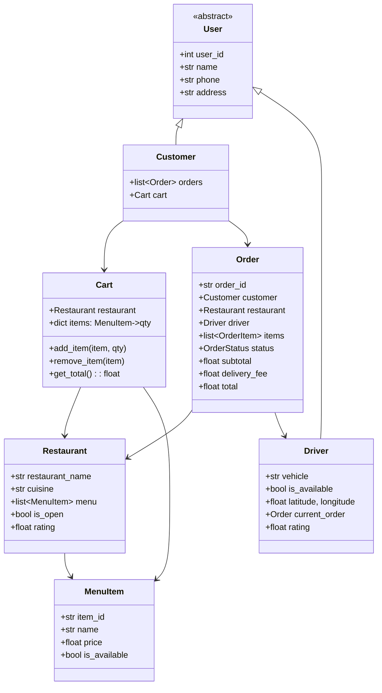

# 🍕 FOOD DELIVERY SYSTEM — Complete LLD Guide
## The Definitive 17-Section Edition — V2.0

---

## 📖 Table of Contents
1. [🎯 Problem Statement & Context](#-1-problem-statement--context)
2. [🗣️ Requirement Gathering](#-2-requirement-gathering)
3. [✅ Requirements (FR + NFR)](#-3-requirements)
4. [🧠 Key Insight: Order State Machine + Driver Assignment](#-4-key-insight)
5. [📐 Class Diagram & Entity Relationships](#-5-class-diagram)
6. [🔧 API Design (Public Interface)](#-6-api-design)
7. [🏗️ Complete Code Implementation](#-7-complete-code)
8. [📊 Data Structure Choices & Trade-offs](#-8-data-structure-choices)
9. [🔒 Concurrency & Thread Safety Deep Dive](#-9-concurrency-deep-dive)
10. [🧪 SOLID Principles Mapping](#-10-solid-principles)
11. [🎨 Design Patterns Used](#-11-design-patterns)
12. [💾 Database Schema (Production View)](#-12-database-schema)
13. [⚠️ Edge Cases & Error Handling](#-13-edge-cases)
14. [🎮 Full Working Demo](#-14-full-working-demo)
15. [🎤 Interviewer Follow-ups (15+)](#-15-interviewer-follow-ups)
16. [⏱️ Interview Strategy (45-min Plan)](#-16-interview-strategy)
17. [🧠 Quick Recall Cheat Sheet](#-17-quick-recall)

---

# 🎯 1. Problem Statement & Context

## What You're Designing

> Design a **Food Delivery System (Swiggy/Zomato/Uber Eats)** where customers browse restaurants, build a cart, place orders, get matched with delivery drivers, and track their order through a state machine (PLACED → ACCEPTED → PREPARING → PICKED_UP → DELIVERED). Support restaurant menus, real-time order status, driver assignment, and dynamic pricing.

## Real-World Context

| Metric | Real System (Swiggy/Zomato) |
|--------|------------------------------|
| Daily orders | 2-3 million (India) |
| Avg delivery time | 30-40 minutes |
| Concurrent orders | ~100K at peak |
| Driver fleet | 300K+ active delivery partners |
| Restaurant partners | 200K+ |
| Order states | 6-8 transitions |

## Why Interviewers Love This Problem

| What They Test | How This Tests It |
|---------------|-------------------|
| **Order State Machine** | PLACED → ACCEPTED → PREPARING → PICKED_UP → OUT_FOR_DELIVERY → DELIVERED |
| **Multi-actor system** | Customer, Restaurant, Driver — three different user types with different operations |
| **Driver assignment** | Find nearest available driver (Strategy pattern) |
| **Cart management** | Add/remove items, quantity, total calculation |
| **Payment Strategy** | Cash, Card, UPI — Strategy pattern |
| **Observer pattern** | Order status change → notify customer, restaurant, driver |
| **Concurrency** | Multiple orders, multiple drivers, simultaneous matching |

---

# 🗣️ 2. Requirement Gathering

## Must-Ask Questions

| # | Question | WHY You Ask | Design Impact |
|---|----------|-------------|---------------|
| 1 | "Three actors: Customer, Restaurant, Driver?" | Each has different operations | User ABC with 3 subclasses |
| 2 | "Order lifecycle — how many states?" | **THE state machine** is the core | 6 states with valid transitions |
| 3 | "How is a driver assigned?" | **Nearest available driver** strategy | DriverAssignment strategy with distance scoring |
| 4 | "Can customer order from multiple restaurants?" | Cart constraint | One restaurant per order (like Swiggy). Multiple = multiple orders |
| 5 | "Dynamic delivery fee?" | Distance-based pricing | Base fee + per-km charge + surge during peak |
| 6 | "Driver can reject an order?" | Reassignment flow | If rejected, find next nearest driver |
| 7 | "Payment types?" | Strategy pattern | Cash, Card, UPI, Wallet |
| 8 | "How does restaurant accept?" | Restaurant-side flow | Restaurant confirms → starts preparing |
| 9 | "Order tracking?" | Real-time updates | Observer pattern: notify on each state change |
| 10 | "Rating system?" | Post-delivery feedback | Customer rates both restaurant and driver |

### 🎯 THE question that shows you've built real systems

> "Who transitions each state? Customer places, Restaurant accepts/prepares, Driver picks up/delivers. Each actor owns different transitions."

```
PLACED         → Customer action
ACCEPTED       → Restaurant action
PREPARING      → Restaurant action (auto after accept)
READY          → Restaurant marks food ready
PICKED_UP      → Driver action (scans at restaurant)
OUT_FOR_DELIVERY → Driver action
DELIVERED      → Driver action (customer confirms or auto)
CANCELLED      → Customer/Restaurant/System (varies by stage)
```

---

# ✅ 3. Requirements

## Functional Requirements

| Priority | ID | Requirement | Actor | Complexity |
|----------|-----|-------------|-------|-----------|
| **P0** | FR-1 | Browse restaurants and menus | Customer | Low |
| **P0** | FR-2 | **Build cart** (add/remove items, quantities) | Customer | Medium |
| **P0** | FR-3 | **Place order** (validate cart, calculate total + delivery fee) | Customer | Medium |
| **P0** | FR-4 | **Order State Machine** (6 states with valid transitions) | All actors | High |
| **P0** | FR-5 | **Restaurant accepts/rejects** order | Restaurant | Medium |
| **P0** | FR-6 | **Driver assignment** (nearest available) | System | High |
| **P0** | FR-7 | **Driver picks up and delivers** | Driver | Medium |
| **P1** | FR-8 | Order tracking (real-time status) | Customer | Medium |
| **P1** | FR-9 | Payment processing | Customer | Medium |
| **P1** | FR-10 | Rating system (restaurant + driver) | Customer | Low |
| **P2** | FR-11 | Surge pricing during peak hours | System | Medium |

---

# 🧠 4. Key Insight: Order State Machine + Multi-Actor Transitions

## 🤔 THINK: Unlike ATM (one actor), food delivery has THREE actors each controlling different state transitions. How do you prevent invalid transitions?

<details>
<summary>👀 Click to reveal — The tri-actor state machine</summary>

### The Order State Machine

```
                    Customer                Restaurant               Driver
                       │                       │                       │
                  places order                 │                       │
                       │                       │                       │
                       ▼                       │                       │
                   [PLACED] ──────────────→ accepts ──────────────→ assigned
                       │                       │                       │
                  (can cancel)                 ▼                       │
                       │                  [ACCEPTED]                   │
                       │                       │                       │
                       │              starts preparing                 │
                       │                       │                       │
                       │                       ▼                       │
                       │                 [PREPARING]                   │
                       │                       │                       │
                       │               marks food ready                │
                       │                       │                       │
                       │                       ▼                       │
                       │                   [READY] ──────────────→ picks up
                       │                                               │
                       │                                               ▼
                       │                                          [PICKED_UP]
                       │                                               │
                       │                                          delivers
                       │                                               │
                       │                                               ▼
                       └──────────────────────────────────────── [DELIVERED]
```

### State × Actor × Operation Matrix (Draw This in Interview!)

| Current State | Valid Action | Actor | Next State |
|--------------|-------------|-------|------------|
| PLACED | Accept order | Restaurant | ACCEPTED |
| PLACED | Cancel order | Customer | CANCELLED |
| PLACED | Reject order | Restaurant | CANCELLED |
| ACCEPTED | Start preparing | Restaurant | PREPARING |
| PREPARING | Mark food ready | Restaurant | READY_FOR_PICKUP |
| READY_FOR_PICKUP | Pick up | Driver | PICKED_UP |
| PICKED_UP | Deliver | Driver | DELIVERED |
| Any (before PICKED_UP) | Cancel | Customer | CANCELLED |

### WHY This is Different From ATM/Vending State

| Aspect | ATM / Vending | Food Delivery |
|--------|--------------|---------------|
| Actors | 1 (user) | **3** (customer, restaurant, driver) |
| Who transitions? | Same user | **Different actors** per transition |
| Duration | ~60 seconds | **30–60 minutes** |
| Concurrent states | 1 at a time | **Thousands** of orders simultaneously |
| State validation | State rejects wrong ops | **Actor + State** both must match |

### Design Decision: Actor Validation in Each Transition

```python
def accept_order(self, order_id: str, restaurant_id: int):
    order = self.orders[order_id]
    
    # Validate ACTOR
    if order.restaurant.restaurant_id != restaurant_id:
        raise ValueError("Not your order!")
    
    # Validate STATE
    if order.status != OrderStatus.PLACED:
        raise ValueError(f"Can't accept order in {order.status} state!")
    
    # Transition
    order.status = OrderStatus.ACCEPTED
    self._notify_observers(order)  # Observer: notify customer
```

</details>

---

# 📐 5. Class Diagram & Entity Relationships



## Entity Relationships

```
Customer ──places──→ Order ──from──→ Restaurant
                       │                  │
                       │              MenuItem[] (menu)
                       │
                  ──assigned_to──→ Driver
                       │
                  OrderItem[] (item + qty + price snapshot)
                       │
                  OrderStatus (state machine)
```

### Key: Price Snapshot at Order Time

```python
class OrderItem:
    """Captures price AT TIME OF ORDER — not current menu price!"""
    def __init__(self, menu_item: MenuItem, quantity: int):
        self.menu_item = menu_item
        self.quantity = quantity
        self.unit_price = menu_item.price  # SNAPSHOT! If price changes later, order unaffected
        self.total = self.unit_price * quantity
```

---

# 🔧 6. API Design (Public Interface)

```python
class FoodDeliverySystem:
    """Three sets of APIs — one per actor type."""
    
    # ── Customer APIs ──
    def browse_restaurants(self, area: str = None) -> list[Restaurant]: ...
    def add_to_cart(self, customer_id, restaurant_id, item_id, qty) -> Cart: ...
    def remove_from_cart(self, customer_id, item_id) -> Cart: ...
    def place_order(self, customer_id, payment: PaymentStrategy) -> Order: ...
    def cancel_order(self, order_id, customer_id) -> float: ...  # Returns refund
    def rate_order(self, order_id, restaurant_rating, driver_rating) -> None: ...
    
    # ── Restaurant APIs ──
    def accept_order(self, order_id, restaurant_id) -> None: ...
    def reject_order(self, order_id, restaurant_id, reason) -> None: ...
    def mark_ready(self, order_id, restaurant_id) -> None: ...
    
    # ── Driver APIs ──
    def go_online(self, driver_id) -> None: ...
    def go_offline(self, driver_id) -> None: ...
    def pick_up_order(self, order_id, driver_id) -> None: ...
    def deliver_order(self, order_id, driver_id) -> None: ...
```

---

# 🏗️ 7. Complete Code Implementation

## Enums

```python
from enum import Enum
from datetime import datetime
from abc import ABC, abstractmethod
import uuid
import threading
import math
import random

class OrderStatus(Enum):
    PLACED = 1
    ACCEPTED = 2
    PREPARING = 3
    READY_FOR_PICKUP = 4
    PICKED_UP = 5
    DELIVERED = 6
    CANCELLED = 7

# Valid state transitions: current → allowed next states
VALID_TRANSITIONS = {
    OrderStatus.PLACED: {OrderStatus.ACCEPTED, OrderStatus.CANCELLED},
    OrderStatus.ACCEPTED: {OrderStatus.PREPARING, OrderStatus.CANCELLED},
    OrderStatus.PREPARING: {OrderStatus.READY_FOR_PICKUP, OrderStatus.CANCELLED},
    OrderStatus.READY_FOR_PICKUP: {OrderStatus.PICKED_UP},
    OrderStatus.PICKED_UP: {OrderStatus.DELIVERED},
    OrderStatus.DELIVERED: set(),  # Terminal state
    OrderStatus.CANCELLED: set(),  # Terminal state
}
```

## Payment Strategy

```python
class PaymentStrategy(ABC):
    @abstractmethod
    def pay(self, amount: float) -> bool: pass
    @abstractmethod
    def refund(self, amount: float) -> bool: pass

class CashOnDelivery(PaymentStrategy):
    def pay(self, amount): print(f"      💵 Cash on delivery: ₹{amount:,.0f}"); return True
    def refund(self, amount): print(f"      💵 Cash refund: ₹{amount:,.0f}"); return True

class CardPayment(PaymentStrategy):
    def __init__(self, card): self.card = card
    def pay(self, amount): print(f"      💳 Charged ₹{amount:,.0f} to ****{self.card[-4:]}"); return True
    def refund(self, amount): print(f"      💳 Refunded ₹{amount:,.0f}"); return True

class UPIPayment(PaymentStrategy):
    def __init__(self, upi_id): self.upi_id = upi_id
    def pay(self, amount): print(f"      📱 UPI ₹{amount:,.0f} from {self.upi_id}"); return True
    def refund(self, amount): print(f"      📱 UPI refund ₹{amount:,.0f}"); return True
```

## Core Entities

```python
class MenuItem:
    _counter = 0
    def __init__(self, name, price, category="Main"):
        MenuItem._counter += 1
        self.item_id = f"ITEM-{MenuItem._counter:04d}"
        self.name = name
        self.price = price
        self.category = category
        self.is_available = True
    def __str__(self):
        avail = "✅" if self.is_available else "❌"
        return f"   {avail} {self.name:<25} ₹{self.price:>6,.0f}"


class Restaurant:
    _counter = 0
    def __init__(self, name, cuisine, address, lat=0.0, lng=0.0):
        Restaurant._counter += 1
        self.restaurant_id = Restaurant._counter
        self.name = name
        self.cuisine = cuisine
        self.address = address
        self.lat, self.lng = lat, lng
        self.menu: list[MenuItem] = []
        self.is_open = True
        self.rating = 4.0
        self.total_ratings = 0
    
    def add_item(self, name, price, category="Main"):
        item = MenuItem(name, price, category)
        self.menu.append(item)
        return item
    
    def __str__(self):
        status = "🟢 Open" if self.is_open else "🔴 Closed"
        return f"🍽️ {self.name} | {self.cuisine} | ⭐{self.rating:.1f} | {status}"


class Customer:
    _counter = 0
    def __init__(self, name, phone, address, lat=0.0, lng=0.0):
        Customer._counter += 1
        self.customer_id = Customer._counter
        self.name = name
        self.phone = phone
        self.address = address
        self.lat, self.lng = lat, lng
        self.cart: 'Cart' = None
        self.orders: list['Order'] = []


class Driver:
    _counter = 0
    def __init__(self, name, phone, vehicle, lat=0.0, lng=0.0):
        Driver._counter += 1
        self.driver_id = Driver._counter
        self.name = name
        self.phone = phone
        self.vehicle = vehicle
        self.lat, self.lng = lat, lng
        self.is_available = False  # Must go_online first
        self.current_order: 'Order' = None
        self.rating = 4.5
        self.total_ratings = 0
        self.total_deliveries = 0


class OrderItem:
    """Captures menu item + quantity + price SNAPSHOT at order time."""
    def __init__(self, menu_item: MenuItem, quantity: int):
        self.menu_item = menu_item
        self.quantity = quantity
        self.unit_price = menu_item.price  # Price snapshot!
        self.total = round(self.unit_price * quantity, 2)
    def __str__(self):
        return f"   {self.menu_item.name} ×{self.quantity} = ₹{self.total:,.0f}"
```

## Cart

```python
class Cart:
    """
    Shopping cart — ONE restaurant per cart.
    Why? Delivery logistics: one driver, one restaurant pickup.
    Multi-restaurant = multiple carts = multiple orders.
    """
    def __init__(self, restaurant: Restaurant):
        self.restaurant = restaurant
        self.items: dict[str, tuple[MenuItem, int]] = {}  # item_id → (MenuItem, qty)
    
    def add_item(self, item: MenuItem, quantity: int = 1):
        if item.item_id in self.items:
            existing_item, existing_qty = self.items[item.item_id]
            self.items[item.item_id] = (existing_item, existing_qty + quantity)
        else:
            self.items[item.item_id] = (item, quantity)
    
    def remove_item(self, item_id: str):
        self.items.pop(item_id, None)
    
    def update_quantity(self, item_id: str, quantity: int):
        if quantity <= 0:
            self.remove_item(item_id)
        elif item_id in self.items:
            item, _ = self.items[item_id]
            self.items[item_id] = (item, quantity)
    
    @property
    def subtotal(self) -> float:
        return sum(item.price * qty for item, qty in self.items.values())
    
    @property
    def is_empty(self) -> bool:
        return len(self.items) == 0
    
    def display(self):
        print(f"\n   🛒 Cart — {self.restaurant.name}")
        for item_id, (item, qty) in self.items.items():
            print(f"      {item.name} ×{qty} = ₹{item.price * qty:,.0f}")
        print(f"      {'─'*30}")
        print(f"      Subtotal: ₹{self.subtotal:,.0f}")
```

## Order + State Machine

```python
class Order:
    """
    The central entity. Tracks lifecycle from PLACED → DELIVERED.
    
    State transitions are VALIDATED:
    1. Check current state allows this transition
    2. Check the ACTOR is authorized for this transition
    """
    _counter = 0
    
    def __init__(self, customer: Customer, restaurant: Restaurant,
                 items: list[OrderItem], delivery_fee: float, payment: PaymentStrategy):
        Order._counter += 1
        self.order_id = f"ORD-{Order._counter:05d}"
        self.customer = customer
        self.restaurant = restaurant
        self.items = items
        self.driver: Driver = None
        self.status = OrderStatus.PLACED
        self.subtotal = sum(i.total for i in items)
        self.delivery_fee = delivery_fee
        self.total = round(self.subtotal + delivery_fee, 2)
        self.payment = payment
        self.placed_at = datetime.now()
        self.delivered_at: datetime = None
        self.status_history: list[tuple[OrderStatus, datetime]] = [
            (OrderStatus.PLACED, self.placed_at)
        ]
        self._lock = threading.Lock()
    
    def transition_to(self, new_status: OrderStatus):
        """
        Validated state transition.
        Checks: is this transition allowed FROM current state?
        """
        if new_status not in VALID_TRANSITIONS.get(self.status, set()):
            raise ValueError(
                f"Invalid transition: {self.status.name} → {new_status.name}. "
                f"Allowed: {[s.name for s in VALID_TRANSITIONS[self.status]]}"
            )
        self.status = new_status
        self.status_history.append((new_status, datetime.now()))
        if new_status == OrderStatus.DELIVERED:
            self.delivered_at = datetime.now()
    
    def __str__(self):
        driver_info = f" | 🚗 {self.driver.name}" if self.driver else ""
        return (f"📦 {self.order_id}: {self.customer.name} → {self.restaurant.name} | "
                f"₹{self.total:,.0f} | {self.status.name}{driver_info}")
```

## The Food Delivery System

```python
class FoodDeliverySystem:
    """
    Central system — orchestrates customers, restaurants, drivers, orders.
    
    Key operations:
    1. Cart management (per customer)
    2. Order placement (cart → order + payment + driver assignment)
    3. Order lifecycle (state transitions by different actors)
    4. Driver assignment (nearest available)
    """
    DELIVERY_BASE_FEE = 30
    DELIVERY_PER_KM = 7
    
    def __init__(self):
        self.restaurants: dict[int, Restaurant] = {}
        self.customers: dict[int, Customer] = {}
        self.drivers: dict[int, Driver] = {}
        self.orders: dict[str, Order] = {}
    
    def register_restaurant(self, name, cuisine, address, lat=0, lng=0):
        r = Restaurant(name, cuisine, address, lat, lng)
        self.restaurants[r.restaurant_id] = r
        return r
    
    def register_customer(self, name, phone, address, lat=0, lng=0):
        c = Customer(name, phone, address, lat, lng)
        self.customers[c.customer_id] = c
        return c
    
    def register_driver(self, name, phone, vehicle, lat=0, lng=0):
        d = Driver(name, phone, vehicle, lat, lng)
        self.drivers[d.driver_id] = d
        return d
    
    # ── Distance Calculation ──
    def _distance_km(self, lat1, lng1, lat2, lng2):
        """Simplified distance calculation."""
        return round(math.sqrt((lat1-lat2)**2 + (lng1-lng2)**2) * 111, 1)  # Approx km
    
    def _calculate_delivery_fee(self, restaurant, customer):
        dist = self._distance_km(restaurant.lat, restaurant.lng, customer.lat, customer.lng)
        return round(self.DELIVERY_BASE_FEE + dist * self.DELIVERY_PER_KM, 2)
    
    # ── Cart Operations ──
    def add_to_cart(self, customer_id, restaurant_id, item_id, qty=1):
        customer = self.customers[customer_id]
        restaurant = self.restaurants[restaurant_id]
        
        if customer.cart and customer.cart.restaurant.restaurant_id != restaurant_id:
            print("   ⚠️ Cart already has items from another restaurant!")
            print(f"   Clear cart first (current: {customer.cart.restaurant.name})")
            return None
        
        if not customer.cart:
            customer.cart = Cart(restaurant)
        
        item = next((i for i in restaurant.menu if i.item_id == item_id), None)
        if not item:
            print("   ❌ Item not found!"); return None
        if not item.is_available:
            print(f"   ❌ '{item.name}' is currently unavailable!"); return None
        
        customer.cart.add_item(item, qty)
        print(f"   ✅ Added {qty}× {item.name} to cart (₹{item.price * qty:,.0f})")
        return customer.cart
    
    def clear_cart(self, customer_id):
        self.customers[customer_id].cart = None
        print("   🗑️ Cart cleared")
    
    # ── Place Order ──
    def place_order(self, customer_id, payment: PaymentStrategy):
        customer = self.customers[customer_id]
        
        if not customer.cart or customer.cart.is_empty:
            print("   ❌ Cart is empty!"); return None
        
        cart = customer.cart
        order_items = [OrderItem(item, qty) for item, qty in cart.items.values()]
        delivery_fee = self._calculate_delivery_fee(cart.restaurant, customer)
        
        order = Order(customer, cart.restaurant, order_items, delivery_fee, payment)
        
        # Process payment
        if not payment.pay(order.total):
            print("   ❌ Payment failed!"); return None
        
        self.orders[order.order_id] = order
        customer.orders.append(order)
        customer.cart = None  # Clear cart after order
        
        print(f"   ✅ ORDER PLACED! {order}")
        print(f"      Subtotal: ₹{order.subtotal:,.0f} | Delivery: ₹{delivery_fee:,.0f} | "
              f"Total: ₹{order.total:,.0f}")
        
        # Auto-assign driver
        self._assign_driver(order)
        return order
    
    # ── Driver Assignment (Nearest Available) ──
    def _assign_driver(self, order: Order):
        """
        Find nearest available driver to the RESTAURANT.
        
        Strategy: Score = distance to restaurant.
        Only consider: is_available == True AND current_order is None.
        
        In production: Consider driver rating, acceptance rate,
        current heading direction, and driver preferences.
        """
        best_driver = None
        best_distance = float('inf')
        
        for driver in self.drivers.values():
            if not driver.is_available or driver.current_order is not None:
                continue
            dist = self._distance_km(driver.lat, driver.lng,
                                     order.restaurant.lat, order.restaurant.lng)
            if dist < best_distance:
                best_distance = dist
                best_driver = driver
        
        if best_driver:
            order.driver = best_driver
            best_driver.current_order = order
            best_driver.is_available = False
            print(f"   🚗 Driver assigned: {best_driver.name} "
                  f"({best_distance:.1f} km from restaurant)")
        else:
            print("   ⏳ No drivers available. Searching...")
    
    # ── Restaurant Actions ──
    def accept_order(self, order_id, restaurant_id):
        order = self.orders[order_id]
        if order.restaurant.restaurant_id != restaurant_id:
            print("   ❌ Not your order!"); return
        order.transition_to(OrderStatus.ACCEPTED)
        order.transition_to(OrderStatus.PREPARING)  # Auto-transition
        print(f"   👨‍🍳 Order {order_id} ACCEPTED & PREPARING")
    
    def reject_order(self, order_id, restaurant_id, reason=""):
        order = self.orders[order_id]
        if order.restaurant.restaurant_id != restaurant_id:
            print("   ❌ Not your order!"); return
        order.transition_to(OrderStatus.CANCELLED)
        order.payment.refund(order.total)
        if order.driver:
            order.driver.is_available = True
            order.driver.current_order = None
        print(f"   ❌ Order {order_id} REJECTED by restaurant. Reason: {reason}")
    
    def mark_ready(self, order_id, restaurant_id):
        order = self.orders[order_id]
        if order.restaurant.restaurant_id != restaurant_id:
            print("   ❌ Not your order!"); return
        order.transition_to(OrderStatus.READY_FOR_PICKUP)
        print(f"   ✅ Order {order_id} READY FOR PICKUP! Driver {order.driver.name} notified")
    
    # ── Driver Actions ──
    def go_online(self, driver_id):
        driver = self.drivers[driver_id]
        driver.is_available = True
        print(f"   🟢 {driver.name} is ONLINE")
    
    def go_offline(self, driver_id):
        driver = self.drivers[driver_id]
        if driver.current_order:
            print("   ❌ Complete current delivery first!"); return
        driver.is_available = False
        print(f"   🔴 {driver.name} is OFFLINE")
    
    def pick_up_order(self, order_id, driver_id):
        order = self.orders[order_id]
        if not order.driver or order.driver.driver_id != driver_id:
            print("   ❌ Not your order!"); return
        order.transition_to(OrderStatus.PICKED_UP)
        print(f"   📦 Order {order_id} PICKED UP by {order.driver.name}")
    
    def deliver_order(self, order_id, driver_id):
        order = self.orders[order_id]
        if not order.driver or order.driver.driver_id != driver_id:
            print("   ❌ Not your order!"); return
        order.transition_to(OrderStatus.DELIVERED)
        order.driver.total_deliveries += 1
        order.driver.current_order = None
        order.driver.is_available = True
        elapsed = (order.delivered_at - order.placed_at).total_seconds() / 60
        print(f"   🎉 Order {order_id} DELIVERED! Time: {elapsed:.0f} min")
    
    # ── Customer Cancel ──
    def cancel_order(self, order_id, customer_id):
        order = self.orders[order_id]
        if order.customer.customer_id != customer_id:
            print("   ❌ Not your order!"); return 0
        if order.status in (OrderStatus.PICKED_UP, OrderStatus.DELIVERED):
            print("   ❌ Cannot cancel — food is already on the way!"); return 0
        order.transition_to(OrderStatus.CANCELLED)
        refund = order.total if order.status.value <= OrderStatus.PREPARING.value else order.total * 0.5
        order.payment.refund(refund)
        if order.driver:
            order.driver.is_available = True
            order.driver.current_order = None
        print(f"   🔄 Order {order_id} CANCELLED. Refund: ₹{refund:,.0f}")
        return refund
    
    # ── Rating ──
    def rate_order(self, order_id, restaurant_rating=None, driver_rating=None):
        order = self.orders[order_id]
        if order.status != OrderStatus.DELIVERED:
            print("   ❌ Can only rate delivered orders!"); return
        if restaurant_rating:
            r = order.restaurant
            r.rating = round((r.rating * r.total_ratings + restaurant_rating) / (r.total_ratings + 1), 1)
            r.total_ratings += 1
        if driver_rating and order.driver:
            d = order.driver
            d.rating = round((d.rating * d.total_ratings + driver_rating) / (d.total_ratings + 1), 1)
            d.total_ratings += 1
        print(f"   ⭐ Rated! Restaurant: {restaurant_rating}/5 | Driver: {driver_rating}/5")
    
    # ── Order Tracking ──
    def track_order(self, order_id):
        order = self.orders[order_id]
        print(f"\n   📍 TRACKING: {order.order_id}")
        print(f"   From: {order.restaurant.name} → To: {order.customer.name}")
        print(f"   Status: {order.status.name}")
        print(f"   Timeline:")
        for status, ts in order.status_history:
            print(f"      {ts.strftime('%H:%M:%S')} → {status.name}")
        if order.driver:
            print(f"   Driver: {order.driver.name} ({order.driver.vehicle})")
```

---

# 📊 8. Data Structure Choices & Trade-offs

| Data Structure | Where | Why | Alternative | Why Not |
|---------------|-------|-----|-------------|---------|
| `dict[str, (MenuItem, int)]` | Cart.items | O(1) lookup by item_id. Supports update quantity | `list[(MenuItem, qty)]` | Need O(1) add/remove by item |
| `dict[OrderStatus, set]` | VALID_TRANSITIONS | O(1) transition validation | if-elif chain | Violates OCP. Adding state = modify chain |
| `list[tuple]` | Order.status_history | Chronological audit trail | DB log | In-memory for LLD, DB for production |
| `dict[int, Driver]` | System.drivers | O(1) lookup + iterate for assignment | `list` | Need both lookup and scan |

### Why Price SNAPSHOT in OrderItem?

```python
# ❌ WITHOUT snapshot: price changes after order = chaos
order.total = sum(item.menu_item.price * qty)  # Menu price might change!
# Restaurant increases Biryani from ₹300 → ₹350 AFTER order placed
# Customer charged ₹350 instead of ₹300! 💀

# ✅ WITH snapshot: price locked at order time
class OrderItem:
    def __init__(self, menu_item, quantity):
        self.unit_price = menu_item.price  # LOCKED at order time
        self.total = self.unit_price * quantity
# Restaurant can change menu price freely — existing orders unaffected ✅
```

---

# 🔒 9. Concurrency & Thread Safety Deep Dive

## The Driver Assignment Race Condition (Critical!)

```
Timeline: Only 1 driver available (Ravi)

t=0: Order-A needs driver → scans → Ravi available ✅
t=1: Order-B needs driver → scans → Ravi available ✅ (not yet assigned!)
t=2: Order-A → assigns Ravi → Ravi.is_available = False
t=3: Order-B → assigns Ravi → Ravi.is_available = False
Result: Ravi assigned to 2 orders simultaneously! 💀
```

```python
# Fix: Lock on driver assignment
class FoodDeliverySystem:
    def __init__(self):
        self._driver_lock = threading.Lock()
    
    def _assign_driver(self, order):
        with self._driver_lock:  # ── Atomic driver scan + assign ──
            for driver in self.drivers.values():
                if driver.is_available and driver.current_order is None:
                    # CHECK and ASSIGN atomically
                    order.driver = driver
                    driver.current_order = order
                    driver.is_available = False
                    return
```

### Per-Order Lock for State Transitions

```python
def accept_order(self, order_id, restaurant_id):
    order = self.orders[order_id]
    with order._lock:  # Prevent concurrent state changes
        order.transition_to(OrderStatus.ACCEPTED)
```

---

# 🧪 10. SOLID Principles Mapping

| Principle | Where Applied | Explanation |
|-----------|--------------|-------------|
| **S** | Each class one job | Cart = item management. Order = lifecycle. System = orchestration. Restaurant = menu. Driver = availability |
| **O** | VALID_TRANSITIONS dict | Adding new state = add entry in dict. Zero code change in transition_to(). Payment strategy = new class for new method |
| **L** | PaymentStrategy | Cash, Card, UPI all substitutable. System calls payment.pay() without knowing type |
| **I** | Actor-specific APIs | Customer, Restaurant, Driver have separate method sets. No god interface |
| **D** | System → PaymentStrategy ABC | System doesn't know about CreditCard specifics |

---

# 🎨 11. Design Patterns Used

| Pattern | Where | Why |
|---------|-------|-----|
| **State Machine** ⭐ | Order status transitions | VALID_TRANSITIONS dict prevents invalid state changes |
| **Strategy** ⭐ | PaymentStrategy | Cash, Card, UPI — extensible without modifying order logic |
| **Observer** | (Extension) Status notifications | Order status change → push notification to customer, restaurant, driver |
| **Factory** | (Extension) OrderFactory | Build orders with validation, fee calculation, driver assignment |
| **Singleton** | FoodDeliverySystem | One system instance |

### Cross-Problem State Machine Comparison

| System | States | Actors | Key Pattern |
|--------|--------|--------|-------------|
| **Food Delivery** | 7 states | **3 actors** | Multi-actor state machine |
| **ATM** | 4 states | 1 actor | Single-actor state machine |
| **Vending** | 3 states | 1 actor | Single-actor + Recipe OCP |
| **Car Rental** | 4 states | 1 actor | Date-range lifecycle |

---

# 💾 12. Database Schema (Production View)

```sql
CREATE TABLE orders (
    order_id        VARCHAR(20) PRIMARY KEY,
    customer_id     INTEGER REFERENCES customers(id),
    restaurant_id   INTEGER REFERENCES restaurants(id),
    driver_id       INTEGER REFERENCES drivers(id),
    status          VARCHAR(20) NOT NULL DEFAULT 'PLACED',
    subtotal        DECIMAL(10,2),
    delivery_fee    DECIMAL(6,2),
    total           DECIMAL(10,2),
    payment_method  VARCHAR(20),
    placed_at       TIMESTAMP DEFAULT NOW(),
    delivered_at    TIMESTAMP,
    INDEX idx_customer (customer_id),
    INDEX idx_restaurant (restaurant_id),
    INDEX idx_status (status)
);

CREATE TABLE order_items (
    order_id    VARCHAR(20) REFERENCES orders(order_id),
    item_id     VARCHAR(20),
    item_name   VARCHAR(100),
    unit_price  DECIMAL(8,2),    -- Price SNAPSHOT!
    quantity    INTEGER NOT NULL,
    total       DECIMAL(10,2),
    PRIMARY KEY (order_id, item_id)
);

CREATE TABLE order_status_log (
    id          SERIAL PRIMARY KEY,
    order_id    VARCHAR(20) REFERENCES orders(order_id),
    status      VARCHAR(20) NOT NULL,
    changed_at  TIMESTAMP DEFAULT NOW(),
    changed_by  VARCHAR(20),     -- 'CUSTOMER', 'RESTAURANT', 'DRIVER', 'SYSTEM'
    INDEX idx_order_log (order_id, changed_at)
);

-- Driver assignment query: nearest available
SELECT d.*, ST_Distance(d.location, ST_MakePoint(?, ?)) as dist
FROM drivers d
WHERE d.is_available = TRUE AND d.current_order_id IS NULL
ORDER BY dist ASC LIMIT 1
FOR UPDATE SKIP LOCKED;  -- Lock row, skip already-locked drivers!
```

---

# ⚠️ 13. Edge Cases & Error Handling

| # | Edge Case | Fix |
|---|-----------|-----|
| 1 | **Cart from two restaurants** | Reject: "Clear cart first!" One restaurant per order |
| 2 | **Menu item becomes unavailable** | Check `is_available` at add_to_cart AND at place_order |
| 3 | **No drivers available** | Queue order, retry assignment. Notify customer "searching for driver" |
| 4 | **Driver rejects assigned order** | Unassign, mark available, re-run _assign_driver with next nearest |
| 5 | **Restaurant rejects after driver assigned** | Cancel order, release driver, full refund |
| 6 | **Cancel after pickup** | Reject: food already on the way. No cancel allowed |
| 7 | **Price change between cart and order** | OrderItem captures price SNAPSHOT at order time |
| 8 | **Two orders claim same driver** | Driver assignment lock (_driver_lock) prevents double assignment |
| 9 | **Restaurant closed** | Check `is_open` before place_order |
| 10 | **Empty cart order** | Validate `cart.is_empty` before place_order |
| 11 | **Driver goes offline during delivery** | Delivery continues — can't go offline with active order |
| 12 | **Delivery fee based on wrong distance** | Calculate at order time, snapshot in order |

---

# 🎮 14. Full Working Demo

```python
if __name__ == "__main__":
    print("=" * 65)
    print("     🍕 FOOD DELIVERY SYSTEM — COMPLETE DEMO")
    print("=" * 65)
    
    system = FoodDeliverySystem()
    
    # Setup restaurants
    pizza_place = system.register_restaurant("Pizza Palace", "Italian", "MG Road", 12.97, 77.59)
    b1 = pizza_place.add_item("Margherita Pizza", 350)
    b2 = pizza_place.add_item("Pepperoni Pizza", 450)
    b3 = pizza_place.add_item("Garlic Bread", 150)
    b4 = pizza_place.add_item("Coke", 60, "Beverage")
    
    # Setup users
    alice = system.register_customer("Alice", "9876543210", "Indiranagar", 12.98, 77.64)
    driver1 = system.register_driver("Ravi", "8765432109", "Bike", 12.96, 77.60)
    driver2 = system.register_driver("Priya", "7654321098", "Scooter", 13.00, 77.58)
    
    # Drivers go online
    system.go_online(driver1.driver_id)
    system.go_online(driver2.driver_id)
    
    # Test 1: Browse menu
    print("\n─── Test 1: Browse Restaurant Menu ───")
    print(f"   {pizza_place}")
    for item in pizza_place.menu:
        print(item)
    
    # Test 2: Build cart
    print("\n─── Test 2: Build Cart ───")
    system.add_to_cart(alice.customer_id, pizza_place.restaurant_id, b1.item_id, 2)
    system.add_to_cart(alice.customer_id, pizza_place.restaurant_id, b3.item_id, 1)
    system.add_to_cart(alice.customer_id, pizza_place.restaurant_id, b4.item_id, 2)
    alice.cart.display()
    
    # Test 3: Place order
    print("\n─── Test 3: Place Order ───")
    order = system.place_order(alice.customer_id, UPIPayment("alice@paytm"))
    
    # Test 4: Restaurant accepts
    print("\n─── Test 4: Restaurant Accepts ───")
    system.accept_order(order.order_id, pizza_place.restaurant_id)
    
    # Test 5: Food ready
    print("\n─── Test 5: Food Ready ───")
    system.mark_ready(order.order_id, pizza_place.restaurant_id)
    
    # Test 6: Driver picks up
    print("\n─── Test 6: Driver Picks Up ───")
    system.pick_up_order(order.order_id, driver1.driver_id)
    
    # Test 7: Delivered!
    print("\n─── Test 7: Delivered! ───")
    system.deliver_order(order.order_id, driver1.driver_id)
    
    # Test 8: Rate
    print("\n─── Test 8: Rate ───")
    system.rate_order(order.order_id, restaurant_rating=5, driver_rating=4)
    
    # Test 9: Track
    print("\n─── Test 9: Order Tracking ───")
    system.track_order(order.order_id)
    
    # Test 10: Invalid state transition
    print("\n─── Test 10: Try invalid transition ───")
    try:
        system.accept_order(order.order_id, pizza_place.restaurant_id)
    except ValueError as e:
        print(f"   ❌ {e}")
    
    print(f"\n{'='*65}")
    print("     ✅ ALL 10 TESTS COMPLETE!")
    print(f"{'='*65}")
```

---

# 🎤 15. Interviewer Follow-ups (15+)

| Q | Question | Key Answer |
|---|----------|-----------|
| 1 | "Why one restaurant per cart?" | One pickup location per delivery. Multi-restaurant = coordination nightmare for one driver |
| 2 | "How is driver assigned?" | Nearest available to restaurant. Score = distance. Production: add rating, acceptance rate |
| 3 | "Price snapshot — why?" | Menu prices can change anytime. Orders must use price at order time |
| 4 | "Who controls each state transition?" | Customer (place, cancel), Restaurant (accept, prepare, ready), Driver (pickup, deliver) |
| 5 | "Driver rejects order?" | Unassign, find next nearest. Track rejection rate for driver metrics |
| 6 | "Surge pricing?" | Peak hours (12-2PM, 7-10PM): delivery fee × 1.5. Calculate at order time |
| 7 | "Real-time tracking?" | WebSocket: driver location updates every 10s. Customer app shows live map |
| 8 | "Multi-restaurant order (Swiggy Genie)?" | Multiple orders bundled under one delivery. Driver has pickup route |
| 9 | "Estimated delivery time?" | Prep time (restaurant estimate) + travel time (distance/speed) |
| 10 | "How to handle no available drivers?" | Queue order, retry every 30s, expand search radius, notify customer |
| 11 | "Concurrent driver assignment?" | Lock on driver scan. Production: `SELECT FOR UPDATE SKIP LOCKED` |
| 12 | "Rating formula?" | Rolling average: `(old_rating × count + new) / (count + 1)` |
| 13 | "Coupon/discount?" | CouponStrategy: FLAT_OFF, PERCENTAGE, BOGO. Apply to subtotal before total |
| 14 | "Restaurant commission?" | Platform takes 20-30% of subtotal. Track in separate revenue table |
| 15 | "Order history?" | Customer can view all orders. Filter by status, date. Re-order button |

---

# ⏱️ 16. Interview Strategy (45-min Plan)

| Time | Phase | What You Do |
|------|-------|-------------|
| **0–5** | Clarify | 3 actors, state machine, driver assignment strategy |
| **5–10** | State Machine | Draw 7-state diagram with actor labels on transitions |
| **10–15** | Class Diagram | Customer, Restaurant, Driver, MenuItem, Cart, Order, OrderItem |
| **15–30** | Code | Cart, Order with transition_to(), driver assignment, restaurant/driver actions |
| **30–38** | Demo | Full lifecycle: cart → order → accept → prepare → pickup → deliver |
| **38–45** | Extensions | Surge pricing, real-time tracking, multi-restaurant, coupons |

## Golden Sentences

> **Opening:** "Food delivery is a multi-actor state machine problem. THREE actors (Customer, Restaurant, Driver) each control different state transitions."

> **Key difference:** "Unlike ATM (1 actor, 4 states), food delivery has 3 actors, 7 states, and each transition is owned by a SPECIFIC actor."

> **Driver assignment:** "Nearest available driver to restaurant. Atomic assignment with lock to prevent double-booking."

---

# 🧠 17. Quick Recall Cheat Sheet

## ⏱️ 30-Second Recall

> **3 actors:** Customer (place, cancel), Restaurant (accept, prepare, ready), Driver (pickup, deliver). **7 states:** PLACED→ACCEPTED→PREPARING→READY→PICKED_UP→DELIVERED + CANCELLED. **Cart:** one restaurant only. **Price:** snapshot at order time. **Driver:** nearest available to restaurant. **VALID_TRANSITIONS** dict prevents invalid state changes.

## ⏱️ 2-Minute Recall

Add:
> **Entities:** MenuItem, Cart (items dict), OrderItem (price snapshot), Order (state machine + history), Customer, Restaurant (menu), Driver (lat/lng, availability).
> **Driver race:** Lock on assignment (_driver_lock). Scan + assign atomically.
> **Cancel:** Before pickup = full refund. After pickup = no cancel.
> **Rating:** Rolling average: `(old × count + new) / (count + 1)`.

## ⏱️ 5-Minute Recall

Add:
> **SOLID:** OCP via VALID_TRANSITIONS dict + PaymentStrategy. SRP per class.
> **Patterns:** State Machine (order), Strategy (payment), Observer (notifications), Factory (order creation).
> **DB:** orders + order_items + order_status_log. Driver assignment: `FOR UPDATE SKIP LOCKED`.
> **Compare:** ATM=1 actor/4 states. Vending=1 actor/3 states. Food=3 actors/7 states. Same state machine pattern, different complexity.

---

## ✅ Pre-Implementation Checklist

- [ ] **OrderStatus** enum + **VALID_TRANSITIONS** dict
- [ ] **PaymentStrategy** ABC (Cash, Card, UPI)
- [ ] **MenuItem** (name, price, is_available)
- [ ] **Restaurant** (name, cuisine, menu list, is_open, rating)
- [ ] **Customer** (name, address, cart, orders)
- [ ] **Driver** (name, vehicle, lat/lng, is_available, current_order)
- [ ] **Cart** (one restaurant, items dict, add/remove, subtotal)
- [ ] **OrderItem** (menu_item, qty, unit_price SNAPSHOT)
- [ ] **Order** (state machine with transition_to, status_history, per-order lock)
- [ ] **FoodDeliverySystem** (register, cart ops, place_order, driver assignment)
- [ ] **Actor transitions:** accept/reject/ready (restaurant), pickup/deliver (driver), cancel (customer)
- [ ] **Demo:** full lifecycle, invalid state test, rating

---

*Version 2.0 — The Definitive 17-Section Edition (Gold Standard)*
