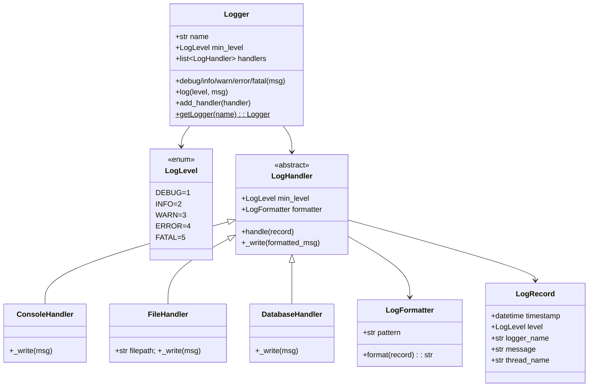

# 📝 LOGGING FRAMEWORK — Complete LLD Guide
## The Definitive 17-Section Edition — V2.0

---

## 📖 Table of Contents
1. [🎯 Problem Statement & Context](#-1-problem-statement--context)
2. [🗣️ Requirement Gathering](#-2-requirement-gathering)
3. [✅ Requirements (FR + NFR)](#-3-requirements)
4. [🧠 Key Insight: Chain of Responsibility + Multiple Handlers](#-4-key-insight)
5. [📐 Class Diagram & Entity Relationships](#-5-class-diagram)
6. [🔧 API Design (Public Interface)](#-6-api-design)
7. [🏗️ Complete Code Implementation](#-7-complete-code)
8. [📊 Data Structure Choices & Trade-offs](#-8-data-structure-choices)
9. [🔒 Concurrency & Thread Safety Deep Dive](#-9-concurrency-deep-dive)
10. [🧪 SOLID Principles Mapping](#-10-solid-principles)
11. [🎨 Design Patterns Used](#-11-design-patterns)
12. [💾 Database Schema (Production View)](#-12-database-schema)
13. [⚠️ Edge Cases & Error Handling](#-13-edge-cases)
14. [🎮 Full Working Demo](#-14-full-working-demo)
15. [🎤 Interviewer Follow-ups (15+)](#-15-interviewer-follow-ups)
16. [⏱️ Interview Strategy (45-min Plan)](#-16-interview-strategy)
17. [🧠 Quick Recall Cheat Sheet](#-17-quick-recall)

---

# 🎯 1. Problem Statement & Context

## What You're Designing

> Design a **Logging Framework (like Log4j, Python's `logging` module, or SLF4J)** that supports multiple log levels (DEBUG, INFO, WARN, ERROR, FATAL), multiple output handlers (Console, File, Remote/Database), configurable log formatting, and thread-safe operation. The framework should allow users to create named loggers, set minimum log levels, and route log messages to one or more handlers.

## Real-World Context

| Metric | Real Framework (Log4j/SLF4J) |
|--------|-------------------------------|
| Log levels | 5–7 (TRACE, DEBUG, INFO, WARN, ERROR, FATAL) |
| Handlers | Console, File, RotatingFile, Syslog, Database, ELK, CloudWatch |
| Throughput | 10K–100K log entries/second |
| Thread safety | CRITICAL — logs come from any thread |
| Format | Timestamp, level, thread, logger name, message |
| Singleton per name | `Logger.getLogger("com.app.db")` returns same instance |

## Why Interviewers Love This Problem

| What They Test | How This Tests It |
|---------------|-------------------|
| **Chain of Responsibility** | Log message flows through level filter → formatter → handler(s) |
| **Observer/Pub-Sub** | Logger (publisher) → multiple handlers (subscribers) |
| **Strategy** | Formatter is a strategy — different formats, same interface |
| **Singleton** | Named logger instances: `getLogger("auth")` always returns same object |
| **Thread safety** | Multiple threads logging simultaneously — MUST be safe |
| **OCP showcase** | New handler = new class, zero change to Logger |

---

# 🗣️ 2. Requirement Gathering

## Must-Ask Questions

| # | Question | WHY You Ask | Design Impact |
|---|----------|-------------|---------------|
| 1 | "What log levels?" | Level enum + comparison | DEBUG < INFO < WARN < ERROR < FATAL |
| 2 | "Multiple output targets?" | **Handler ABC (OCP star)** | Console, File, DB — each a handler subclass |
| 3 | "Same logger for same name?" | **Singleton per name** | `getLogger("auth")` always returns same instance |
| 4 | "Configurable format?" | **Formatter Strategy** | `{timestamp} [{level}] {message}` — customizable |
| 5 | "Thread safety?" | Concurrent logging | Lock on handler write (especially file I/O) |
| 6 | "Minimum log level filter?" | Level filtering | Logger has min level. Messages below it are dropped |
| 7 | "Multiple handlers per logger?" | Observer/fan-out | One logger → Console + File simultaneously |
| 8 | "Logger hierarchy?" | `com.app.db` inherits from `com.app` | Extension — mention for extra points |
| 9 | "File rotation?" | RotatingFileHandler | Extension: rotate at 10MB, keep 5 backups |
| 10 | "Async logging?" | Performance under load | Extension: queue + background thread |

### 🎯 THE question that shows architectural thinking

> "Should the logger directly write to console/file, or should it publish to handlers? If handlers, that's the Observer/OCP pattern — I can add a new handler without changing the logger."

---

# ✅ 3. Requirements

## Functional Requirements

| Priority | ID | Requirement | Complexity |
|----------|-----|-------------|-----------|
| **P0** | FR-1 | **Log levels**: DEBUG, INFO, WARN, ERROR, FATAL with ordering | Low |
| **P0** | FR-2 | **Level filtering**: Logger has min level. Drop messages below it | Low |
| **P0** | FR-3 | **Multiple handlers**: Console, File, Remote — per logger | High |
| **P0** | FR-4 | **Configurable format**: timestamp, level, logger name, message | Medium |
| **P0** | FR-5 | **Named logger singleton**: `getLogger("name")` returns same instance | Medium |
| **P1** | FR-6 | **Thread-safe** logging from multiple threads | High |
| **P1** | FR-7 | File handler with configurable path | Low |
| **P2** | FR-8 | Rotating file handler (size-based rotation) | Medium |
| **P2** | FR-9 | Logger hierarchy (inherit handlers from parent) | High |

---

# 🧠 4. Key Insight: Level Filtering + Handler Fan-Out

## 🤔 THINK: How does `logger.error("DB failed!")` end up in BOTH the console AND a file AND a database?

<details>
<summary>👀 Click to reveal — The log message pipeline</summary>

### Log Message Flow (Draw This in Interview!)

```
logger.error("DB connection failed!")
        │
        ▼
   ┌───────────────────────┐
   │ 1. LEVEL FILTER       │
   │ Is ERROR >= min_level? │
   │ (min_level = INFO)     │
   │ ERROR(4) >= INFO(2)    │
   │ → YES, continue ✅     │
   └───────────┬───────────┘
               │
               ▼
   ┌───────────────────────┐
   │ 2. CREATE LogRecord   │
   │ timestamp = now()      │
   │ level = ERROR          │
   │ logger = "db.pool"     │
   │ message = "DB..."      │
   │ thread = "Thread-3"    │
   └───────────┬───────────┘
               │
               ▼
   ┌───────────────────────┐
   │ 3. FAN-OUT to handlers│
   │ (Observer pattern)     │
   │                        │
   │  ┌─ ConsoleHandler ───→ print to stdout
   │  │
   │  ├─ FileHandler ──────→ write to app.log
   │  │
   │  └─ DBHandler ────────→ INSERT INTO logs
   └───────────────────────┘
```

### Level Ordering — Numeric Comparison

```python
class LogLevel(Enum):
    DEBUG = 1    # verbose development info
    INFO  = 2    # general information
    WARN  = 3    # potential issues
    ERROR = 4    # errors (recoverable)
    FATAL = 5    # critical failure (app may crash)

# Level filtering is just: message_level >= logger_min_level
# If logger min = WARN(3):
#   DEBUG(1) → SKIP ❌
#   INFO(2)  → SKIP ❌
#   WARN(3)  → LOG ✅
#   ERROR(4) → LOG ✅
#   FATAL(5) → LOG ✅
```

### Why Handlers Are OCP (The Star Pattern)

```python
# Adding a new output target:
# 1. Create new Handler subclass
# 2. Register it with the logger
# 3. ZERO changes to Logger, LogRecord, or existing handlers!

class CloudWatchHandler(LogHandler):
    def handle(self, record: LogRecord):
        # Send to AWS CloudWatch
        cloudwatch.put_log_events(...)

# Usage:
logger.add_handler(CloudWatchHandler(region="us-east-1"))
# Logger doesn't know about CloudWatch — it just iterates handlers!
```

### Why Not Just `print()`?

```python
# ❌ Bad: Hard-coded output
def log(msg):
    print(f"[ERROR] {msg}")                   # Only console!
    with open("app.log", "a") as f:           # Always file!
        f.write(f"[ERROR] {msg}\n")
    db.insert(level="ERROR", message=msg)     # Always DB!
# Adding email alert = MODIFY this function! OCP violation!

# ✅ Good: Handler-based
logger.error(msg)
# Internally: for handler in self.handlers: handler.handle(record)
# New output = new handler class. Zero change to logger.
```

</details>

---

# 📐 5. Class Diagram & Entity Relationships



---

# 🔧 6. API Design (Public Interface)

```python
class Logger:
    """
    Logger API — what application code calls.
    
    Usage:
        logger = Logger.get_logger("auth")
        logger.set_level(LogLevel.INFO)
        logger.add_handler(ConsoleHandler())
        logger.add_handler(FileHandler("auth.log"))
        
        logger.info("User logged in")       # → Console + File
        logger.debug("Token details...")     # → DROPPED (below INFO)
        logger.error("Auth failed!")         # → Console + File
    """
    
    @staticmethod
    def get_logger(name: str) -> 'Logger':
        """Named singleton: same name → same Logger instance."""
    
    def set_level(self, level: LogLevel) -> None: ...
    def add_handler(self, handler: LogHandler) -> None: ...
    def remove_handler(self, handler: LogHandler) -> None: ...
    
    def debug(self, message: str) -> None: ...
    def info(self, message: str) -> None: ...
    def warn(self, message: str) -> None: ...
    def error(self, message: str) -> None: ...
    def fatal(self, message: str) -> None: ...
```

---

# 🏗️ 7. Complete Code Implementation

## LogLevel & LogRecord

```python
from enum import Enum
from datetime import datetime
import threading
import os

class LogLevel(Enum):
    """
    Log levels with numeric ordering.
    Higher value = higher severity.
    Level filtering: message.level.value >= logger.min_level.value
    """
    DEBUG = 1
    INFO  = 2
    WARN  = 3
    ERROR = 4
    FATAL = 5

class LogRecord:
    """
    Immutable record of a single log event.
    Created by Logger, consumed by Handler.
    
    WHY a separate class?
    - Decouples log creation from log formatting
    - Handler + Formatter work with structured data, not raw strings
    - Can add fields (thread, stack trace) without changing Logger API
    """
    def __init__(self, level: LogLevel, logger_name: str, message: str):
        self.timestamp = datetime.now()
        self.level = level
        self.logger_name = logger_name
        self.message = message
        self.thread_name = threading.current_thread().name
```

## Formatter (Strategy Pattern)

```python
class LogFormatter:
    """
    Formats a LogRecord into a string for output.
    Strategy Pattern: different formatters produce different output.
    
    Default format: "2024-10-15 14:32:05 [ERROR] (auth) DB connection failed!"
    JSON format:    {"ts":"2024-10-15T14:32:05","level":"ERROR","msg":"DB..."}
    """
    DEFAULT_PATTERN = "{timestamp} [{level}] ({logger}) {message}"
    
    def __init__(self, pattern: str = None):
        self.pattern = pattern or self.DEFAULT_PATTERN
    
    def format(self, record: LogRecord) -> str:
        return self.pattern.format(
            timestamp=record.timestamp.strftime("%Y-%m-%d %H:%M:%S"),
            level=record.level.name,
            logger=record.logger_name,
            message=record.message,
            thread=record.thread_name,
        )

class JSONFormatter(LogFormatter):
    """JSON format for structured logging (ELK stack, CloudWatch)."""
    def format(self, record: LogRecord) -> str:
        import json
        return json.dumps({
            "timestamp": record.timestamp.isoformat(),
            "level": record.level.name,
            "logger": record.logger_name,
            "message": record.message,
            "thread": record.thread_name,
        })
```

## Handler ABC + Concrete Handlers

```python
class LogHandler:
    """
    Abstract handler — receives LogRecord, formats it, writes output.
    
    Template Method pattern:
    - handle() is the template: checks level → formats → _write()
    - Subclasses ONLY override _write() (where output goes)
    
    Each handler has its OWN min_level (independent of Logger's level).
    Example: Logger level = DEBUG, ConsoleHandler level = INFO, FileHandler level = DEBUG
    → Console gets INFO+, File gets everything.
    """
    def __init__(self, level: LogLevel = LogLevel.DEBUG,
                 formatter: LogFormatter = None):
        self.min_level = level
        self.formatter = formatter or LogFormatter()
        self._lock = threading.Lock()  # Thread-safe writing
    
    def handle(self, record: LogRecord):
        """
        Template Method:
        1. Check if this record should be handled (level filter)
        2. Format the record
        3. Write to output (subclass-specific)
        """
        if record.level.value < self.min_level.value:
            return  # Below this handler's level — skip
        
        formatted = self.formatter.format(record)
        
        with self._lock:  # Thread-safe write
            self._write(formatted)
    
    def _write(self, formatted_message: str):
        """Override in subclasses — where does the output go?"""
        raise NotImplementedError


class ConsoleHandler(LogHandler):
    """Writes to stdout. Color-coded by level."""
    
    COLORS = {
        LogLevel.DEBUG: "\033[36m",    # Cyan
        LogLevel.INFO:  "\033[32m",    # Green
        LogLevel.WARN:  "\033[33m",    # Yellow
        LogLevel.ERROR: "\033[31m",    # Red
        LogLevel.FATAL: "\033[35m",    # Magenta
    }
    RESET = "\033[0m"
    
    def __init__(self, level=LogLevel.DEBUG, formatter=None, use_colors=True):
        super().__init__(level, formatter)
        self.use_colors = use_colors
    
    def _write(self, formatted_message: str):
        print(formatted_message)


class FileHandler(LogHandler):
    """
    Writes to a file. Thread-safe via lock.
    File is opened in append mode and kept open for performance.
    """
    def __init__(self, filepath: str, level=LogLevel.DEBUG, formatter=None):
        super().__init__(level, formatter)
        self.filepath = filepath
        self._file = open(filepath, "a")
    
    def _write(self, formatted_message: str):
        self._file.write(formatted_message + "\n")
        self._file.flush()  # Ensure written immediately
    
    def close(self):
        if self._file:
            self._file.close()


class RotatingFileHandler(FileHandler):
    """
    Rotates log file when it exceeds max_bytes.
    Keeps backup_count old files: app.log → app.log.1 → app.log.2
    """
    def __init__(self, filepath, max_bytes=10_000_000, backup_count=5,
                 level=LogLevel.DEBUG, formatter=None):
        super().__init__(filepath, level, formatter)
        self.max_bytes = max_bytes
        self.backup_count = backup_count
    
    def _write(self, formatted_message: str):
        super()._write(formatted_message)
        
        # Check if rotation needed
        if os.path.getsize(self.filepath) >= self.max_bytes:
            self._rotate()
    
    def _rotate(self):
        """Rotate files: app.log → app.log.1, app.log.1 → app.log.2, etc."""
        self._file.close()
        
        # Shift existing backups
        for i in range(self.backup_count - 1, 0, -1):
            src = f"{self.filepath}.{i}"
            dst = f"{self.filepath}.{i+1}"
            if os.path.exists(src):
                os.rename(src, dst)
        
        # Current → .1
        os.rename(self.filepath, f"{self.filepath}.1")
        
        # Open fresh file
        self._file = open(self.filepath, "a")


class DatabaseHandler(LogHandler):
    """
    Writes logs to database (in-memory list for LLD demo).
    Production: batch INSERT for performance.
    """
    def __init__(self, level=LogLevel.WARN, formatter=None):
        super().__init__(level, formatter)
        self.records: list[dict] = []  # In-memory for demo
    
    def _write(self, formatted_message: str):
        self.records.append({
            "formatted": formatted_message,
            "stored_at": datetime.now().isoformat()
        })
```

## Logger — Named Singleton

```python
class Logger:
    """
    Named singleton logger. 
    
    Key design decisions:
    1. Singleton per name: get_logger("auth") always returns same instance
    2. Level filter: drop messages below min_level (saves Handler work)
    3. Fan-out: one log call → all registered handlers
    4. Thread-safe: Handler._lock protects concurrent writes
    
    Usage:
        auth_logger = Logger.get_logger("auth")
        auth_logger.set_level(LogLevel.INFO)
        auth_logger.add_handler(ConsoleHandler())
        auth_logger.add_handler(FileHandler("auth.log"))
        auth_logger.info("User logged in")  # → both Console and File
    """
    _loggers: dict[str, 'Logger'] = {}  # Name → Logger (singleton registry)
    _registry_lock = threading.Lock()
    
    @staticmethod
    def get_logger(name: str) -> 'Logger':
        """
        Named singleton: same name always returns same Logger instance.
        Thread-safe via lock on registry.
        """
        with Logger._registry_lock:
            if name not in Logger._loggers:
                Logger._loggers[name] = Logger(name)
            return Logger._loggers[name]
    
    def __init__(self, name: str):
        """Private-ish constructor. Use get_logger() instead."""
        self.name = name
        self.min_level = LogLevel.DEBUG  # Default: log everything
        self.handlers: list[LogHandler] = []
    
    def set_level(self, level: LogLevel):
        """Set minimum log level. Messages below this are dropped."""
        self.min_level = level
    
    def add_handler(self, handler: LogHandler):
        self.handlers.append(handler)
    
    def remove_handler(self, handler: LogHandler):
        self.handlers.remove(handler)
    
    def log(self, level: LogLevel, message: str):
        """
        Core log method. Called by convenience methods (debug, info, etc.).
        
        Pipeline:
        1. Level filter (fast exit for low-level messages)
        2. Create LogRecord (structured data)
        3. Fan-out to ALL handlers (Observer pattern)
        """
        # Step 1: Level filter — fast exit
        if level.value < self.min_level.value:
            return  # DROP — below minimum level
        
        # Step 2: Create structured record
        record = LogRecord(level, self.name, message)
        
        # Step 3: Fan-out to all handlers
        for handler in self.handlers:
            try:
                handler.handle(record)
            except Exception as e:
                # CRITICAL: Logger must NEVER crash the application!
                # Swallow handler errors silently.
                print(f"[LOGGER ERROR] Handler failed: {e}")
    
    # ── Convenience methods ──
    def debug(self, message: str): self.log(LogLevel.DEBUG, message)
    def info(self, message: str):  self.log(LogLevel.INFO, message)
    def warn(self, message: str):  self.log(LogLevel.WARN, message)
    def error(self, message: str): self.log(LogLevel.ERROR, message)
    def fatal(self, message: str): self.log(LogLevel.FATAL, message)
```

---

# 📊 8. Data Structure Choices & Trade-offs

| Data Structure | Where | Why | Alternative | Why Not |
|---------------|-------|-----|-------------|---------|
| `dict[str, Logger]` | Logger._loggers | Named singleton registry. O(1) lookup by name | Global variable | Dict supports multiple named loggers |
| `list[LogHandler]` | Logger.handlers | Ordered fan-out. Small N (2-5 handlers typically) | `set` | Order might matter (console before file). Small N |
| `Enum with int value` | LogLevel | Numeric comparison: `level.value >= min.value` | Int constants | Enum is type-safe and self-documenting |
| `threading.Lock` | Handler._lock + Logger._registry_lock | Thread-safe writes and singleton creation | No lock | Multi-threaded apps = corrupted output |

### Why TWO Levels of Filtering?

```
Logger level = INFO        ← First filter (fast, before record creation)
ConsoleHandler level = WARN ← Second filter (per-handler)
FileHandler level = DEBUG   ← Second filter (per-handler)

logger.debug("x")  → Dropped at Logger level ❌ (DEBUG < INFO)
                      No LogRecord created! No handler called! FAST!

logger.info("y")   → Passes Logger filter ✅
                    → ConsoleHandler: INFO < WARN → SKIP ❌
                    → FileHandler: INFO >= DEBUG → WRITE ✅

logger.error("z")  → Passes Logger filter ✅
                    → ConsoleHandler: ERROR >= WARN → WRITE ✅
                    → FileHandler: ERROR >= DEBUG → WRITE ✅
```

---

# 🔒 9. Concurrency & Thread Safety Deep Dive

## Why Logging MUST Be Thread-Safe

```
Thread-1: logger.info("Processing order 42")
Thread-2: logger.error("DB connection lost!")
Thread-3: logger.warn("Cache miss rate high")

All three write to the SAME file simultaneously!

Without lock:
"2024-10-15 Processing 2024-10-15 DB connorder 42ection lost!Cache mi..."
                              ↑ GARBLED OUTPUT! 💀

With lock (per-handler):
Thread-1 acquires FileHandler lock → writes full line → releases
Thread-2 acquires FileHandler lock → writes full line → releases
Thread-3 acquires FileHandler lock → writes full line → releases
```

```python
class LogHandler:
    def __init__(self):
        self._lock = threading.Lock()
    
    def handle(self, record):
        formatted = self.formatter.format(record)
        with self._lock:          # ── CRITICAL SECTION ──
            self._write(formatted)  # Only one thread writes at a time
```

### Why Lock per Handler, Not per Logger?

```
logger has: ConsoleHandler + FileHandler

Per-Logger lock:
  Thread-1 writes to Console → holds lock
  Thread-2 wants to write to File → BLOCKED! (even though different handler)
  Console and File are SERIALIZED! 

Per-Handler lock:
  Thread-1 writes to Console → holds Console lock only
  Thread-2 writes to File → holds File lock only → PARALLEL!
  Different handlers can write simultaneously!
```

### Singleton Registry Thread Safety

```python
@staticmethod
def get_logger(name):
    with Logger._registry_lock:  # Prevent double creation
        if name not in Logger._loggers:
            Logger._loggers[name] = Logger(name)
        return Logger._loggers[name]
```

---

# 🧪 10. SOLID Principles Mapping

| Principle | Where Applied | Explanation |
|-----------|--------------|-------------|
| **S** | Each class one job | LogRecord = data. Formatter = string conversion. Handler = output destination. Logger = orchestration + filtering |
| **O** ⭐⭐⭐ | **Handler hierarchy** | New output target = new Handler subclass. `CloudWatchHandler`, `SlackHandler`, `EmailHandler` — ZERO change to Logger! |
| **L** | Handler substitution | Logger calls `handler.handle(record)`. ConsoleHandler, FileHandler, DBHandler all work identically |
| **I** | Minimal Handler ABC | Only 1 abstract method: `_write()`. No bloat |
| **D** | Logger → LogHandler ABC | Logger depends on `LogHandler` abstraction, never on `ConsoleHandler` specifically |

### OCP: The Star Example

```python
# Adding Slack alerts for FATAL errors:
class SlackHandler(LogHandler):
    def __init__(self, webhook_url):
        super().__init__(level=LogLevel.FATAL)  # Only FATAL
        self.webhook_url = webhook_url
    
    def _write(self, formatted_message):
        requests.post(self.webhook_url, json={"text": f"🚨 {formatted_message}"})

# Usage — ZERO changes to Logger:
logger = Logger.get_logger("production")
logger.add_handler(SlackHandler("https://hooks.slack.com/..."))
logger.fatal("Server is DOWN!")  # → Console + File + Slack alert!
```

---

# 🎨 11. Design Patterns Used

| Pattern | Where | Why | Alternative | Why Not |
|---------|-------|-----|-------------|---------|
| **Observer** ⭐ | Logger → Handlers | One log call → fan-out to multiple handlers | Direct method calls | OCP violation. Adding handler = modifying Logger |
| **Strategy** ⭐ | LogFormatter | Different format styles, same interface | Hard-coded format | Can't swap formats. OCP violation |
| **Template Method** | LogHandler.handle() | Base: level filter → format → _write(). Subclass: only _write() | Copy-paste in each handler | DRY — filter+format logic written ONCE |
| **Singleton** | Logger.get_logger() | Same name = same instance | Global dict | Same pattern, just encapsulated better |
| **Chain of Responsibility** | (Extension) Logger hierarchy | `com.app.db` → `com.app` → root. Messages propagate up | Flat loggers | Python's logging uses this |

### Cross-Problem Pattern Comparison

| Pattern | Logging Framework | Coffee Vending | ATM |
|---------|------------------|----------------|-----|
| **Template Method** | handle(): filter → format → _write() | Default reject in VendingState | Default reject in ATMState |
| **Strategy** | LogFormatter | PaymentStrategy | (Extension) |
| **Observer** | Logger → Handlers | (Extension) alerts | (Extension) |
| **Singleton** | Named logger registry | VendingMachine | ATM |

---

# 💾 12. Database Schema (Production View)

```sql
-- For centralized log aggregation (ELK alternative)

CREATE TABLE logs (
    log_id      BIGSERIAL PRIMARY KEY,
    timestamp   TIMESTAMP NOT NULL DEFAULT NOW(),
    level       VARCHAR(10) NOT NULL,
    logger_name VARCHAR(100) NOT NULL,
    message     TEXT NOT NULL,
    thread_name VARCHAR(50),
    hostname    VARCHAR(100),
    INDEX idx_level (level),
    INDEX idx_logger (logger_name),
    INDEX idx_time (timestamp)
) PARTITION BY RANGE (timestamp);
-- Partition by day for efficient cleanup:
-- DROP old partitions instead of DELETE (instant!)

-- Error rate in last hour
SELECT level, COUNT(*) as count
FROM logs
WHERE timestamp > NOW() - INTERVAL '1 hour'
GROUP BY level
ORDER BY count DESC;

-- Most noisy loggers
SELECT logger_name, COUNT(*) FROM logs
WHERE timestamp > NOW() - INTERVAL '1 day'
GROUP BY logger_name ORDER BY count DESC LIMIT 10;
```

---

# ⚠️ 13. Edge Cases & Error Handling

| # | Edge Case | Fix |
|---|-----------|-----|
| 1 | **Handler throws exception** | Logger catches and swallows — NEVER crash the app! |
| 2 | **File handler — disk full** | Catch IOError. Fallback to console. Alert admin |
| 3 | **No handlers registered** | Log message is silently dropped. No error |
| 4 | **Log message is None** | Convert to string: `str(message)` |
| 5 | **Logger.get_logger() from multiple threads** | Registry lock prevents double-creation |
| 6 | **File handler — file deleted while logging** | Reopen file on next write attempt |
| 7 | **Extremely high log volume** | Async logging: queue + background writer thread |
| 8 | **Binary data in message** | Sanitize: replace non-printable chars |
| 9 | **Format string has missing fields** | Catch KeyError in formatter, return raw message |
| 10 | **Close FileHandler but Logger still references it** | Handler.close() + Logger.remove_handler() |

### The Critical Rule: Logger Must NEVER Crash the App

```python
def log(self, level, message):
    ...
    for handler in self.handlers:
        try:
            handler.handle(record)
        except Exception as e:
            # SWALLOW error! Log system failure should not
            # bring down the production application.
            # At most: print to stderr as last resort.
            import sys
            print(f"[LOGGER INTERNAL ERROR] {e}", file=sys.stderr)
```

---

# 🎮 14. Full Working Demo

```python
if __name__ == "__main__":
    print("=" * 65)
    print("     📝 LOGGING FRAMEWORK — COMPLETE DEMO")
    print("=" * 65)
    
    # ─── Test 1: Basic Console Logging ───
    print("\n─── Test 1: Basic Console Logger ───")
    app_logger = Logger.get_logger("app")
    app_logger.set_level(LogLevel.DEBUG)
    app_logger.add_handler(ConsoleHandler())
    
    app_logger.debug("Application starting...")
    app_logger.info("Server listening on port 8080")
    app_logger.warn("Cache miss rate: 45%")
    app_logger.error("Failed to connect to Redis!")
    app_logger.fatal("Out of memory!")
    
    # ─── Test 2: Level Filtering ───
    print("\n─── Test 2: Level Filtering (min=WARN) ───")
    db_logger = Logger.get_logger("database")
    db_logger.set_level(LogLevel.WARN)  # Only WARN+
    db_logger.add_handler(ConsoleHandler())
    
    db_logger.debug("Query: SELECT * ...")  # DROPPED ❌
    db_logger.info("Connection pool: 5/10")  # DROPPED ❌
    db_logger.warn("Slow query: 2.3s")       # LOGGED ✅
    db_logger.error("Connection lost!")       # LOGGED ✅
    
    # ─── Test 3: Multiple Handlers ───
    print("\n─── Test 3: Multiple Handlers (Console + File) ───")
    auth_logger = Logger.get_logger("auth")
    auth_logger.set_level(LogLevel.DEBUG)
    auth_logger.add_handler(ConsoleHandler(level=LogLevel.INFO))
    auth_logger.add_handler(FileHandler("/tmp/auth.log", level=LogLevel.DEBUG))
    
    auth_logger.debug("Token generated: abc123")  # File only (Console min=INFO)
    auth_logger.info("User 'alice' logged in")    # Console + File
    auth_logger.error("Invalid password for 'bob'")  # Console + File
    
    print(f"   📄 File handler logs written to /tmp/auth.log")
    
    # ─── Test 4: Singleton Verification ───
    print("\n─── Test 4: Named Singleton ───")
    logger1 = Logger.get_logger("auth")
    logger2 = Logger.get_logger("auth")
    print(f"   Same instance? {logger1 is logger2}")  # True!
    print(f"   Handlers count: {len(logger1.handlers)}")  # Already has 2
    
    # ─── Test 5: JSON Formatter ───
    print("\n─── Test 5: JSON Formatter ───")
    json_logger = Logger.get_logger("api")
    json_logger.set_level(LogLevel.INFO)
    json_logger.add_handler(ConsoleHandler(formatter=JSONFormatter()))
    
    json_logger.info("Request received: GET /users")
    json_logger.error("500 Internal Server Error")
    
    # ─── Test 6: Database Handler ───
    print("\n─── Test 6: DB Handler (WARN+ only) ───")
    db_handler = DatabaseHandler(level=LogLevel.WARN)
    monitor_logger = Logger.get_logger("monitor")
    monitor_logger.add_handler(db_handler)
    monitor_logger.add_handler(ConsoleHandler())
    
    monitor_logger.info("Health check OK")      # Console only
    monitor_logger.error("Disk usage: 95%!")     # Console + DB
    monitor_logger.fatal("Service unresponsive!")  # Console + DB
    
    print(f"   DB records stored: {len(db_handler.records)}")
    for r in db_handler.records:
        print(f"      {r['formatted']}")
    
    # ─── Test 7: Thread Safety ───
    print("\n─── Test 7: Multi-threaded Logging ───")
    mt_logger = Logger.get_logger("threadtest")
    mt_logger.set_level(LogLevel.INFO)
    mt_logger.add_handler(ConsoleHandler())
    
    def worker(thread_id):
        for i in range(3):
            mt_logger.info(f"Thread-{thread_id}: task {i}")
    
    threads = [threading.Thread(target=worker, args=(i,)) for i in range(3)]
    for t in threads: t.start()
    for t in threads: t.join()
    
    # ─── Test 8: OCP — Add Custom Handler ───
    print("\n─── Test 8: OCP — Custom AlertHandler ───")
    
    class AlertHandler(LogHandler):
        def __init__(self):
            super().__init__(level=LogLevel.FATAL)
            self.alerts = []
        def _write(self, msg):
            self.alerts.append(msg)
            print(f"   🚨 ALERT FIRED: {msg}")
    
    alert_handler = AlertHandler()
    app_logger.add_handler(alert_handler)
    app_logger.error("This won't trigger alert")  # ERROR < FATAL
    app_logger.fatal("SYSTEM DOWN!")               # Triggers alert!
    print(f"   Total alerts: {len(alert_handler.alerts)}")
    
    print(f"\n{'='*65}")
    print("     ✅ ALL 8 TESTS COMPLETE!")
    print(f"{'='*65}")
```

---

# 🎤 15. Interviewer Follow-ups (15+)

| Q | Question | Key Answer |
|---|----------|-----------|
| 1 | "Why Handler ABC?" | OCP — new output = new subclass. Logger doesn't change. Log4j has 20+ handlers! |
| 2 | "Why named singleton?" | `getLogger("auth")` from ANY file returns SAME instance. Config once, use everywhere |
| 3 | "Two-level filtering?" | Logger level = fast, drops before record creation. Handler level = per-handler granularity |
| 4 | "Thread safety approach?" | Per-handler lock. Different handlers can write in parallel! Per-logger would serialize Console+File |
| 5 | "What if handler throws?" | Swallow exception! Logger MUST NEVER crash the application. Print to stderr as last resort |
| 6 | "Async logging?" | Queue (bounded) + background writer thread. Logger.log() just enqueues (fast). Thread dequeues + writes |
| 7 | "Log rotation?" | RotatingFileHandler: when file > max_bytes, rename current → .1, .1 → .2, etc. Open fresh file |
| 8 | "Logger hierarchy?" | `com.app.db` inherits handlers from `com.app`. Message propagates up to root logger |
| 9 | "Structured logging?" | JSONFormatter instead of text. For ELK/Splunk/CloudWatch |
| 10 | "Performance?" | Level check is O(1). Fan-out is O(handlers). Async decouples caller from I/O |
| 11 | "MDC (Mapped Diagnostic Context)?" | Per-thread context: `{request_id: "abc123"}`. Auto-added to every log in that thread |
| 12 | "Rate limiting logs?" | Alert handler: max 1 alert per minute per message. Debounce repeated errors |
| 13 | "Compare with Observer?" | Logger = Subject, Handlers = Observers. `add_handler` = `subscribe`. `log()` = `notify_all()` |
| 14 | "File handler — append vs truncate?" | Always APPEND mode. Truncate would lose historical logs |
| 15 | "Production setup?" | Console (dev), File + rotation (staging), JSON + ELK (production), Slack alerts (FATAL) |

---

# ⏱️ 16. Interview Strategy (45-min Plan)

| Time | Phase | What You Do |
|------|-------|-------------|
| **0–5** | Clarify | Levels, handlers, format, thread safety |
| **5–10** | Key Insight | Draw pipeline: Logger → level filter → record → handlers (fan-out) |
| **10–15** | Class Diagram | LogLevel, LogRecord, LogFormatter, LogHandler ABC, Logger |
| **15–30** | Code | Logger (singleton, level filter, fan-out), ConsoleHandler, FileHandler, Formatter |
| **30–38** | Demo | Level filtering, multi-handler, JSON format, OCP (custom AlertHandler) |
| **38–45** | Extensions | Rotation, hierarchy, async, MDC, structured logging |

## Golden Sentences

> **Opening:** "Logging is an Observer + OCP problem. Logger publishes to multiple Handlers. Adding a new output target = new Handler subclass, zero change to Logger."

> **Template Method:** "Handler.handle() is the template: check level → format → _write(). Subclasses only override _write(). Filter and format logic is written once."

> **Thread safety:** "Per-handler lock, not per-logger. This allows Console and File to write in parallel — different I/O targets shouldn't serialize each other."

> **Critical rule:** "Logger must NEVER crash the application. If a handler throws, swallow the exception. A logging failure is less severe than an application crash."

---

# 🧠 17. Quick Recall Cheat Sheet

## ⏱️ 30-Second Recall

> **LogLevel enum** (DEBUG=1 < INFO=2 < WARN=3 < ERROR=4 < FATAL=5). **Logger:** named singleton, level filter, fan-out to handlers. **Handler ABC:** Template Method — `handle()` checks level → formats → `_write()`. Subclasses = ConsoleHandler, FileHandler, DBHandler. **OCP:** new handler = new class, zero code change. **Thread-safe:** per-handler lock.

## ⏱️ 2-Minute Recall

Add:
> **Pipeline:** log() → level check (fast exit) → create LogRecord → iterate handlers → each handler: level check → format → _write().
> **Two-level filtering:** Logger level (global cutoff) + Handler level (per-handler). Console=WARN, File=DEBUG = File gets more detail.
> **Singleton:** `Logger.get_logger("name")` → same instance. Registry dict + lock.
> **Formatter:** Strategy pattern. Default=text, JSONFormatter for ELK/structured logging.

## ⏱️ 5-Minute Recall

Add:
> **SOLID:** OCP is the STAR — Handler ABC. SRP per class (Record, Formatter, Handler, Logger). DIP: Logger→Handler ABC.
> **Patterns:** Observer (logger→handlers), Strategy (formatter), Template Method (handle), Singleton (named logger), Chain of Responsibility (extension: logger hierarchy).
> **Thread safety:** Per-handler lock allows parallel writes to different outputs. Per-logger would serialize. Registry lock for singleton creation.
> **Critical:** Logger NEVER crashes the app. Swallow handler exceptions.
> **Extensions:** RotatingFileHandler (max_bytes, backup_count), async logging (queue + background thread), logger hierarchy (com.app.db inherits com.app), MDC (per-thread context).

---

## ✅ Pre-Implementation Checklist

- [ ] **LogLevel** enum with numeric values (DEBUG=1 through FATAL=5)
- [ ] **LogRecord** (timestamp, level, logger_name, message, thread_name)
- [ ] **LogFormatter** (pattern-based formatting) + **JSONFormatter**
- [ ] **LogHandler** ABC (level filter, formatter, _lock, handle() template, abstract _write())
- [ ] **ConsoleHandler** (_write = print)
- [ ] **FileHandler** (_write = file.write + flush)
- [ ] **RotatingFileHandler** (extension: rotate at max_bytes)
- [ ] **DatabaseHandler** (extension: store in list/DB)
- [ ] **Logger** (name, min_level, handlers list, log() pipeline, convenience methods)
- [ ] **Logger.get_logger()** — named singleton with registry lock
- [ ] **Demo:** level filtering, multi-handler, singleton, JSON format, OCP custom handler, threading

---

*Version 2.0 — The Definitive 17-Section Edition (Gold Standard)*
