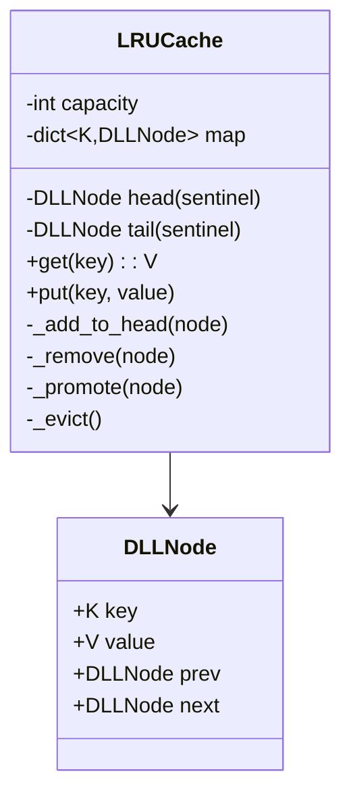

# 🧠 LRU CACHE — Complete LLD Guide
## The Definitive 17-Section Edition — V2.0

---

## 📖 Table of Contents
1. [🎯 Problem Statement & Context](#-1-problem-statement--context)
2. [🗣️ Requirement Gathering](#-2-requirement-gathering)
3. [✅ Requirements (FR + NFR)](#-3-requirements)
4. [🧠 Key Insight: HashMap + Doubly Linked List = O(1) Everything](#-4-key-insight)
5. [📐 Class Diagram & Entity Relationships](#-5-class-diagram)
6. [🔧 API Design (Public Interface)](#-6-api-design)
7. [🏗️ Complete Code Implementation](#-7-complete-code)
8. [📊 Data Structure Choices & Trade-offs](#-8-data-structure-choices)
9. [🔒 Concurrency & Thread Safety Deep Dive](#-9-concurrency-deep-dive)
10. [🧪 SOLID Principles Mapping](#-10-solid-principles)
11. [🎨 Design Patterns Used](#-11-design-patterns)
12. [💾 Database Schema (Production View)](#-12-database-schema)
13. [⚠️ Edge Cases & Error Handling](#-13-edge-cases)
14. [🎮 Full Working Demo](#-14-full-working-demo)
15. [🎤 Interviewer Follow-ups (15+)](#-15-interviewer-follow-ups)
16. [⏱️ Interview Strategy (45-min Plan)](#-16-interview-strategy)
17. [🧠 Quick Recall Cheat Sheet](#-17-quick-recall)

---

# 🎯 1. Problem Statement & Context

## What You're Designing

> Design a **Least Recently Used (LRU) Cache** with fixed capacity that supports `get(key)` and `put(key, value)` both in **O(1)** time. When the cache is full and a new key is inserted, evict the **least recently used** key. Both `get` and `put` count as "using" a key.

## Real-World Context

| Metric | Real System |
|--------|-------------|
| Use case | CPU L1/L2/L3 cache, Redis, Memcached, CDN edge cache, DNS cache |
| Hit rate goal | 90%+ (good), 99%+ (excellent) |
| Typical size | 1K–10M entries |
| Operation cost | O(1) for get + put (CRITICAL — if not O(1), it's wrong) |
| Eviction policy | LRU (most common), LFU, FIFO, Random |

## Why Interviewers Love This Problem

| What They Test | How This Tests It |
|---------------|-------------------|
| **Data structure combo** ⭐ | HashMap + Doubly Linked List = O(1) for everything |
| **Why not just HashMap?** | HashMap alone has no concept of "order" or "recency" |
| **Why not just LinkedList?** | LinkedList alone has O(N) lookup |
| **Pointer manipulation** | DLL node insertion, removal, promotion — fiddly but must be correct |
| **Concurrency** | Thread-safe cache with lock (or lock-free with CAS) |
| **LeetCode #146** | One of the most classic interview problems |

---

# 🗣️ 2. Requirement Gathering

## Must-Ask Questions

| # | Question | WHY You Ask | Design Impact |
|---|----------|-------------|---------------|
| 1 | "Fixed capacity?" | Eviction trigger | Capacity is set at construction |
| 2 | "O(1) for both get and put?" | **THE constraint** that dictates data structure | HashMap + DLL. Nothing else achieves O(1) for both |
| 3 | "What gets evicted?" | **LRU** — least recently used | DLL tail = LRU. DLL head = MRU |
| 4 | "Does get() count as 'use'?" | Recency update | YES — get promotes node to head (most recently used) |
| 5 | "Key and value types?" | Generic or fixed | Generic `<K, V>` ideally; `int, int` for interview simplicity |
| 6 | "Thread-safe?" | Concurrency | Lock on get/put for thread safety |
| 7 | "What if key already exists on put?" | Update behavior | Update value + promote to MRU head |
| 8 | "Null keys/values?" | Edge case | Decide policy: reject nulls or allow |

### 🎯 THE answer that immediately shows you know this

> "I need O(1) get AND O(1) eviction of least recently used. HashMap gives O(1) lookup. Doubly Linked List gives O(1) insertion/removal by node reference. I use BOTH together: HashMap stores key → DLL node pointer, DLL maintains recency order."

---

# ✅ 3. Requirements

## Functional Requirements

| Priority | ID | Requirement | Complexity |
|----------|-----|-------------|-----------|
| **P0** | FR-1 | `get(key)` — return value, O(1), promote to MRU | High |
| **P0** | FR-2 | `put(key, value)` — insert/update, O(1), promote to MRU | High |
| **P0** | FR-3 | Evict LRU entry when capacity exceeded | High |
| **P0** | FR-4 | Fixed capacity set at construction | Low |
| **P1** | FR-5 | Thread-safe operations | Medium |
| **P2** | FR-6 | Cache statistics (hit rate, miss rate) | Low |

---

# 🧠 4. Key Insight: HashMap + Doubly Linked List = O(1) Everything

## 🤔 THINK: Why can't you use JUST a HashMap or JUST a LinkedList?

<details>
<summary>👀 Click to reveal — The most elegant data structure combination in CS</summary>

### The Problem: We Need TWO Things to Be O(1)

```
Need 1: LOOKUP by key → O(1)        → HashMap ✅
Need 2: FIND + REMOVE the LRU item → O(1) → ???
Need 3: MOVE any item to "most recent" → O(1) → ???
```

### Why Each Structure Alone Fails

| Structure | Lookup | Find LRU | Move to MRU | Verdict |
|-----------|--------|----------|-------------|---------|
| **HashMap** | O(1) ✅ | O(N) ❌ (which key is oldest?) | N/A | No ordering |
| **Array** | O(N) ❌ | O(1) ✅ (element at index 0) | O(N) ❌ (shift all) | Too slow |
| **Single LinkedList** | O(N) ❌ | O(1) ✅ (tail) | O(N) ❌ (find it first) | No fast lookup |
| **Doubly LinkedList** | O(N) ❌ | O(1) ✅ (tail) | O(1) ✅ (if you have the node!) | No fast lookup |
| **HashMap + DLL** ⭐ | O(1) ✅ | O(1) ✅ | O(1) ✅ | PERFECT! |

### The Combination: HashMap Points Into the DLL

```
HashMap:                          Doubly Linked List (DLL):
┌───────────┐                     ┌──────────────────────────────────────┐
│ key → node│                     │ HEAD ←→ [A] ←→ [B] ←→ [C] ←→ TAIL │
│ "A" → ─┼──┼───────────────────→│  MRU                          LRU  │
│ "B" → ─┼──┼──────────→         └──────────────────────────────────────┘
│ "C" → ─┼──┼──→                  
└───────────┘                     

get("B"):                          put("D") when full:
1. HashMap["B"] → node     O(1)   1. Remove TAIL (C) from DLL    O(1)
2. DLL: remove node B      O(1)   2. Delete "C" from HashMap     O(1)
3. DLL: insert B at HEAD   O(1)   3. Create node D               O(1)
4. Return node.value        O(1)   4. Insert D at HEAD in DLL     O(1)
                                    5. HashMap["D"] = node D       O(1)
Total: O(1) ✅                     Total: O(1) ✅
```

### Why DOUBLY Linked? Why Not SINGLY?

```
SINGLY Linked: A → B → C → D → None

To remove B:
1. Find A (B's previous) — must scan from head! O(N) 💀
2. Set A.next = C

DOUBLY Linked: None ← A ⟷ B ⟷ C ⟷ D → None

To remove B:
1. B.prev.next = B.next    O(1) ✅ (B knows its prev!)
2. B.next.prev = B.prev    O(1) ✅ (B knows its next!)

DLL allows O(1) removal of ANY node if you have the reference!
HashMap gives you the reference!
```

### Sentinel Nodes — The Clean Implementation Trick

```python
# Without sentinels: must check for null everywhere
def remove(self, node):
    if node.prev:                  # Is it the head?
        node.prev.next = node.next
    else:
        self.head = node.next      # Update head pointer
    if node.next:                  # Is it the tail?
        node.next.prev = node.prev
    else:
        self.tail = node.prev      # Update tail pointer

# With sentinels: NEVER check for null!
# Dummy HEAD and TAIL always exist, real nodes go between them
#   HEAD ⟷ [real nodes] ⟷ TAIL
# A real node is ALWAYS surrounded by valid prev/next pointers

def remove(self, node):
    node.prev.next = node.next    # Always works! No null check!
    node.next.prev = node.prev    # Always works! No null check!
```

</details>

---

# 📐 5. Class Diagram & Entity Relationships



## Internal Structure

```
LRUCache:
├── capacity: int (max entries)
├── map: dict[key → DLLNode]  (O(1) lookup)
└── DLL: HEAD ⟷ [MRU] ⟷ [...] ⟷ [LRU] ⟷ TAIL
         sentinel                        sentinel
         (dummy)                         (dummy)

Operations:
  get(key)   → map[key] → node → promote to HEAD → return value
  put(k,v)   → if exists: update + promote
              → if new: create node, add to HEAD, map[k]=node
              → if over capacity: evict TAIL.prev (LRU)
```

---

# 🔧 6. API Design (Public Interface)

```python
class LRUCache:
    """
    LRU Cache with O(1) get and put.
    
    API matches LeetCode #146 exactly:
    - __init__(capacity) — create cache with max size
    - get(key) — return value if exists, else -1. Promotes to MRU.
    - put(key, value) — insert or update. Evicts LRU if over capacity.
    """
    
    def __init__(self, capacity: int): ...
    def get(self, key: int) -> int: ...
    def put(self, key: int, value: int) -> None: ...
    
    # Internal helpers:
    def _add_to_head(self, node: 'DLLNode') -> None: ...
    def _remove(self, node: 'DLLNode') -> None: ...
    def _promote(self, node: 'DLLNode') -> None: ...
    def _evict(self) -> None: ...
```

---

# 🏗️ 7. Complete Code Implementation

## DLL Node

```python
import threading

class DLLNode:
    """
    Doubly Linked List node. Stores key AND value.
    
    WHY store key in the node?
    When evicting the tail (LRU), we need to ALSO delete from HashMap.
    HashMap.delete(key) needs the key → node must carry the key!
    
    This is a subtle but critical detail many people miss.
    """
    def __init__(self, key: int = 0, value: int = 0):
        self.key = key
        self.value = value
        self.prev: 'DLLNode' = None
        self.next: 'DLLNode' = None
    
    def __repr__(self):
        return f"({self.key}:{self.value})"
```

## LRU Cache — Full Implementation

```python
class LRUCache:
    """
    O(1) LRU Cache using HashMap + Doubly Linked List.
    
    Invariants:
    1. len(map) <= capacity (always)
    2. DLL order = recency (head.next = MRU, tail.prev = LRU)
    3. map[key].key == key (bidirectional consistency)
    4. Every node in DLL has an entry in map, and vice versa
    
    Sentinel nodes HEAD and TAIL simplify edge cases:
    - HEAD.next is always the MRU node (or TAIL if empty)
    - TAIL.prev is always the LRU node (or HEAD if empty)
    - Never need null checks — every real node has valid prev/next
    """
    
    def __init__(self, capacity: int):
        self.capacity = capacity
        self.map: dict[int, DLLNode] = {}
        
        # Sentinel nodes — never removed, simplify edge cases
        self.head = DLLNode()  # Dummy head (before MRU)
        self.tail = DLLNode()  # Dummy tail (after LRU)
        self.head.next = self.tail
        self.tail.prev = self.head
        
        # Stats
        self.hits = 0
        self.misses = 0
    
    # ═══════════ PUBLIC API ═══════════
    
    def get(self, key: int) -> int:
        """
        Get value for key. Returns -1 if not found.
        If found: promotes node to MRU (head).
        
        Steps:
        1. Check HashMap → O(1)
        2. If miss → return -1
        3. If hit → promote node (remove + add to head) → O(1)
        4. Return value
        """
        if key not in self.map:
            self.misses += 1
            return -1
        
        node = self.map[key]
        self._promote(node)  # Move to MRU position
        self.hits += 1
        return node.value
    
    def put(self, key: int, value: int) -> None:
        """
        Insert or update key-value pair.
        If key exists: update value + promote to MRU.
        If key is new:
          - If at capacity: evict LRU (tail.prev)
          - Create new node, add to head, add to map
        
        Steps for new key at capacity:
        1. Evict LRU: remove tail.prev from DLL + delete from map → O(1)
        2. Create node → O(1)
        3. Add node to DLL head → O(1)
        4. Add to HashMap → O(1)
        """
        if key in self.map:
            # Update existing
            node = self.map[key]
            node.value = value
            self._promote(node)
            return
        
        # Check capacity — evict if needed
        if len(self.map) >= self.capacity:
            self._evict()
        
        # Insert new
        node = DLLNode(key, value)
        self.map[key] = node
        self._add_to_head(node)
    
    # ═══════════ INTERNAL DLL OPERATIONS ═══════════
    
    def _add_to_head(self, node: DLLNode):
        """
        Insert node right after HEAD sentinel (MRU position).
        
        Before: HEAD ⟷ [old_first] ⟷ ...
        After:  HEAD ⟷ [node] ⟷ [old_first] ⟷ ...
        
        4 pointer updates:
        """
        node.prev = self.head
        node.next = self.head.next
        self.head.next.prev = node
        self.head.next = node
    
    def _remove(self, node: DLLNode):
        """
        Remove node from its current position in DLL.
        
        Before: ... ⟷ [A] ⟷ [node] ⟷ [B] ⟷ ...
        After:  ... ⟷ [A] ⟷ [B] ⟷ ...
        
        2 pointer updates (sentinel nodes = no null checks!):
        """
        node.prev.next = node.next
        node.next.prev = node.prev
    
    def _promote(self, node: DLLNode):
        """
        Move existing node to MRU position (head).
        = remove from current position + add to head.
        """
        self._remove(node)
        self._add_to_head(node)
    
    def _evict(self):
        """
        Remove LRU entry: tail.prev.
        Must also delete from HashMap using the node's key!
        (This is why DLLNode stores the key.)
        """
        lru_node = self.tail.prev
        self._remove(lru_node)
        del self.map[lru_node.key]  # Must know key → node stores it!
    
    # ═══════════ DISPLAY & STATS ═══════════
    
    def display(self):
        """Show cache state: MRU → LRU order."""
        items = []
        curr = self.head.next
        while curr != self.tail:
            items.append(f"{curr.key}:{curr.value}")
            curr = curr.next
        order = " → ".join(items) if items else "(empty)"
        total = self.hits + self.misses
        hit_rate = (self.hits / total * 100) if total > 0 else 0
        print(f"   Cache [{len(self.map)}/{self.capacity}]: {order}")
        print(f"   Stats: {self.hits} hits, {self.misses} misses, "
              f"{hit_rate:.0f}% hit rate")
    
    @property
    def size(self):
        return len(self.map)
    
    def __contains__(self, key):
        return key in self.map
    
    def __len__(self):
        return len(self.map)
```

## Step-by-Step Trace

```python
"""
TRACE: LRUCache(capacity=3)

put(1, 10):   DLL: HEAD ⟷ [1:10] ⟷ TAIL                    map: {1}
put(2, 20):   DLL: HEAD ⟷ [2:20] ⟷ [1:10] ⟷ TAIL           map: {1, 2}
put(3, 30):   DLL: HEAD ⟷ [3:30] ⟷ [2:20] ⟷ [1:10] ⟷ TAIL  map: {1, 2, 3}

get(1):       Promote 1 to head!
              DLL: HEAD ⟷ [1:10] ⟷ [3:30] ⟷ [2:20] ⟷ TAIL  map: {1, 2, 3}
              Returns 10 ✅

put(4, 40):   FULL! Evict LRU = 2 (tail.prev)
              Remove 2 from DLL, delete from map
              Add 4 to head
              DLL: HEAD ⟷ [4:40] ⟷ [1:10] ⟷ [3:30] ⟷ TAIL  map: {1, 3, 4}

get(2):       Not in map → return -1 ❌ (was evicted!)

put(3, 300):  Key 3 EXISTS → update value + promote
              DLL: HEAD ⟷ [3:300] ⟷ [4:40] ⟷ [1:10] ⟷ TAIL  map: {1, 3, 4}
"""
```

---

# 📊 8. Data Structure Choices & Trade-offs

| Data Structure | Where | Why | Alternative | Why Not |
|---------------|-------|-----|-------------|---------|
| `dict` (HashMap) | key → DLLNode | O(1) lookup by key | `list` | O(N) search |
| Doubly Linked List | Recency ordering | O(1) insert/remove with node reference | Singly Linked | Can't do O(1) remove (need prev pointer!) |
| Sentinel nodes | DLL head/tail | Eliminate null checks in insert/remove | Head/tail pointers | Null edge cases make code error-prone |
| `DLLNode.key` | Node stores key | Need key to delete from HashMap during eviction | External tracking | Coupling key→node already exists in map |

### Eviction Policy Comparison

| Policy | Data Structure | Use Case |
|--------|---------------|----------|
| **LRU** (Least Recently Used) | HashMap + DLL | General purpose (most common) |
| **LFU** (Least Frequently Used) | HashMap + FreqMap + DLL per freq | Workloads with hot keys |
| **FIFO** | HashMap + Queue | Simple, no promotion needed |
| **Random** | HashMap + Array | Avoid pathological access patterns |
| **TTL** (Time To Live) | HashMap + MinHeap | Session cache, token cache |

---

# 🔒 9. Concurrency & Thread Safety Deep Dive

## The Race Condition: Simultaneous Get + Eviction

```
Timeline: Cache at capacity, key 5 is LRU (tail.prev)

t=0: Thread A → get(5) → found in map! Going to promote...
t=1: Thread B → put(99, ...) → cache full → evict LRU = key 5!
t=2: Thread B → removes node 5 from DLL, deletes from map
t=3: Thread A → tries to promote node 5 → node.prev is CORRUPT! 💀
```

```python
# Fix: Single lock on entire cache
class ThreadSafeLRUCache:
    def __init__(self, capacity):
        self._cache = LRUCache(capacity)
        self._lock = threading.Lock()
    
    def get(self, key):
        with self._lock:
            return self._cache.get(key)
    
    def put(self, key, value):
        with self._lock:
            self._cache.put(key, value)
```

### Why Single Lock, Not Read-Write Lock?

```python
# ❌ Read-Write lock seems attractive but DOESN'T WORK:
# get() is NOT read-only! It PROMOTES the node (modifies DLL).
# Every get() is a WRITE operation on the DLL!

# So RW lock gives no benefit — every operation needs exclusive lock.

# ✅ For high-concurrency production:
# - Segmented/Striped locks (ConcurrentHashMap style)
# - Lock-free with CAS (extremely complex)
# - Near-LRU approximation (probabilistic, lock-free)
```

---

# 🧪 10. SOLID Principles Mapping

| Principle | Where Applied | Explanation |
|-----------|--------------|-------------|
| **S** | DLLNode = data. LRUCache = orchestration | Node doesn't know about eviction. Cache doesn't know about node internals |
| **O** | (Extension) Eviction policy | Could create EvictionPolicy ABC: LRU, LFU, FIFO. Swap without changing cache API |
| **L** | EvictionPolicy subclasses | LRU and LFU both implement `evict()` identically from cache perspective |
| **I** | Minimal API | Only 2 methods: `get()` and `put()`. Nothing else exposed |
| **D** | (Extension) Cache → EvictionPolicy | Cache depends on policy abstraction, not LRU specifically |

---

# 🎨 11. Design Patterns Used

| Pattern | Where | Why |
|---------|-------|-----|
| **Composite Data Structure** ⭐ | HashMap + DLL | Two structures combined to achieve O(1) for all operations |
| **Strategy** | (Extension) EvictionPolicy | LRU, LFU, FIFO — swappable algorithms |
| **Proxy** | ThreadSafeLRUCache wraps LRUCache | Adds thread safety transparently |
| **Decorator** | (Extension) StatsCache | Wraps cache, adds hit/miss counting |
| **Singleton** | (Extension) CacheManager | Global cache registry |

### Cross-Problem: HashMap + Something Pattern

| Problem | HashMap + ? | Why Both |
|---------|------------|----------|
| **LRU Cache** | HashMap + **DLL** | O(1) lookup + O(1) recency order |
| **LFU Cache** | HashMap + **FreqMap + DLL** | O(1) lookup + O(1) frequency tracking |
| **Twitter Feed** | HashMap + **MaxHeap** | O(1) user lookup + O(log N) top-K tweets |
| **Rate Limiter** | HashMap + **Sliding Window** | O(1) user lookup + O(1) rate check |

---

# 💾 12. Database Schema (Production View)

```sql
-- For distributed cache with persistence (Redis-like)

CREATE TABLE cache_entries (
    cache_key   VARCHAR(255) PRIMARY KEY,
    cache_value BLOB,
    last_accessed TIMESTAMP DEFAULT NOW(),
    created_at  TIMESTAMP DEFAULT NOW(),
    ttl_seconds INTEGER,
    INDEX idx_last_accessed (last_accessed)  -- For LRU eviction
);

-- LRU eviction query (for persistence layer):
DELETE FROM cache_entries
WHERE cache_key IN (
    SELECT cache_key FROM cache_entries
    ORDER BY last_accessed ASC
    LIMIT 100  -- Batch eviction
);

-- Cache stats
SELECT 
    COUNT(*) as total_entries,
    MIN(last_accessed) as oldest_entry,
    MAX(last_accessed) as newest_entry
FROM cache_entries;
```

---

# ⚠️ 13. Edge Cases & Error Handling

| # | Edge Case | Fix |
|---|-----------|-----|
| 1 | **Capacity = 0** | Every put immediately evicts. get always returns -1 |
| 2 | **Capacity = 1** | Only 1 entry. Every new put evicts the previous |
| 3 | **put() with existing key** | Update value + promote. DON'T increase size |
| 4 | **get() on non-existent key** | Return -1. No DLL modification |
| 5 | **Evict when putting existing key** | Should NOT happen! Existing key = update, size stays same |
| 6 | **get() promotes — changes eviction order** | Correct! get(key) saves key from being LRU. Feature, not bug |
| 7 | **Two threads: get + evict same key** | Single lock prevents this race |
| 8 | **Large values** | DLL stores reference, not copy. Value can be any size |
| 9 | **Repeated put of same key** | Idempotent: value updated, promoted, size unchanged |
| 10 | **Cache always miss (thrashing)** | Working set > capacity. Increase capacity or use different policy |

### The Subtle Bug: Evicting on Existing Key Put

```python
# ❌ BUG: Checking capacity BEFORE checking if key exists
def put(self, key, value):
    if len(self.map) >= self.capacity:
        self._evict()              # Evicts EVEN if key already exists!
    # ... add node

# ✅ CORRECT: Check existing key FIRST
def put(self, key, value):
    if key in self.map:
        # Update existing — no eviction needed! Size stays same!
        node = self.map[key]
        node.value = value
        self._promote(node)
        return
    
    # Only evict for genuinely NEW keys
    if len(self.map) >= self.capacity:
        self._evict()
    # ... add new node
```

---

# 🎮 14. Full Working Demo

```python
if __name__ == "__main__":
    print("=" * 65)
    print("     🧠 LRU CACHE — COMPLETE DEMO")
    print("=" * 65)
    
    cache = LRUCache(3)
    
    # ─── Test 1: Basic Put + Get ───
    print("\n─── Test 1: Basic Operations ───")
    cache.put(1, 100)
    cache.put(2, 200)
    cache.put(3, 300)
    cache.display()
    # Expected: 3:300 → 2:200 → 1:100 (MRU → LRU)
    
    # ─── Test 2: Get Promotes ───
    print("\n─── Test 2: get(1) promotes key 1 to MRU ───")
    val = cache.get(1)
    print(f"   get(1) = {val}")
    cache.display()
    # Expected: 1:100 → 3:300 → 2:200 (1 promoted!)
    
    # ─── Test 3: Eviction ───
    print("\n─── Test 3: put(4,400) — evicts LRU (key 2) ───")
    cache.put(4, 400)
    cache.display()
    # Expected: 4:400 → 1:100 → 3:300 (key 2 evicted!)
    
    # ─── Test 4: Miss ───
    print("\n─── Test 4: get(2) — miss (evicted!) ───")
    val = cache.get(2)
    print(f"   get(2) = {val}")  # -1
    cache.display()
    
    # ─── Test 5: Update Existing ───
    print("\n─── Test 5: put(3, 999) — update existing ───")
    cache.put(3, 999)
    cache.display()
    # Expected: 3:999 → 4:400 → 1:100 (3 updated + promoted, NO eviction!)
    
    # ─── Test 6: Capacity 1 ───
    print("\n─── Test 6: Edge — Capacity 1 ───")
    tiny = LRUCache(1)
    tiny.put(1, 10)
    tiny.put(2, 20)  # Evicts 1
    print(f"   get(1) = {tiny.get(1)}")  # -1
    print(f"   get(2) = {tiny.get(2)}")  # 20
    tiny.display()
    
    # ─── Test 7: Sequence from LeetCode ───
    print("\n─── Test 7: LeetCode #146 Example ───")
    lru = LRUCache(2)
    lru.put(1, 1)
    lru.put(2, 2)
    print(f"   get(1) = {lru.get(1)}")  # 1
    lru.put(3, 3)  # Evicts key 2
    print(f"   get(2) = {lru.get(2)}")  # -1
    lru.put(4, 4)  # Evicts key 1
    print(f"   get(1) = {lru.get(1)}")  # -1
    print(f"   get(3) = {lru.get(3)}")  # 3
    print(f"   get(4) = {lru.get(4)}")  # 4
    lru.display()
    
    # ─── Test 8: Stats ───
    print("\n─── Test 8: Cache Stats ───")
    stat_cache = LRUCache(3)
    stat_cache.put(1, 10)
    stat_cache.put(2, 20)
    stat_cache.put(3, 30)
    stat_cache.get(1)  # Hit
    stat_cache.get(2)  # Hit
    stat_cache.get(99) # Miss
    stat_cache.get(99) # Miss
    stat_cache.display()
    
    print(f"\n{'='*65}")
    print("     ✅ ALL 8 TESTS COMPLETE!")
    print(f"{'='*65}")
```

---

# 🎤 15. Interviewer Follow-ups (15+)

| Q | Question | Key Answer |
|---|----------|-----------|
| 1 | "Why HashMap + DLL?" | HashMap = O(1) lookup. DLL = O(1) remove + insert at head. Combined = O(1) for everything |
| 2 | "Why DOUBLY linked?" | Need O(1) removal. Singly linked can't remove without scanning for prev. DLL: `node.prev.next = node.next` |
| 3 | "Why sentinel nodes?" | Eliminate null checks. HEAD.next is always valid. TAIL.prev is always valid. Cleaner code |
| 4 | "Why does DLLNode store the key?" | During eviction, need to delete from HashMap: `del map[lru_node.key]`. Node must carry key |
| 5 | "LRU vs LFU?" | LRU = recency. LFU = frequency count. LFU needs HashMap + FreqMap + DLL per frequency |
| 6 | "Thread safety?" | Single lock on get/put. Can't use RW lock because get() modifies DLL (promotes). Every op is a write |
| 7 | "Distributed LRU?" | Consistent hashing: partition keys across nodes. Each node has local LRU |
| 8 | "TTL support?" | Add `expires_at` to node. Lazy eviction: check TTL on get(). Background thread for proactive cleanup |
| 9 | "Cache warming?" | Pre-load popular keys on startup. Prevents cold-start miss storm |
| 10 | "Write-through vs write-back?" | Write-through: update DB on every put. Write-back: batch updates (risk: data loss on crash) |
| 11 | "O(1) with OrderedDict?" | Python's `OrderedDict` uses DLL internally. `move_to_end()` + `popitem(last=False)`. Same O(1) |
| 12 | "Cache invalidation?" | "Two hard things in CS: cache invalidation and naming things." TTL, event-based, manual |
| 13 | "Hit rate optimization?" | Monitor hit/miss. If hit rate < 90%, increase capacity or switch eviction policy |
| 14 | "Negative caching?" | Cache misses too: `put(key, NOT_FOUND)`. Prevents repeated DB lookups for non-existent keys |
| 15 | "Large objects?" | Store references, not copies. Or evict by total memory size, not count |

---

# ⏱️ 16. Interview Strategy (45-min Plan)

| Time | Phase | What You Do |
|------|-------|-------------|
| **0–3** | Clarify | Capacity, O(1) constraint, what counts as "use" |
| **3–8** | Key Insight | Draw HashMap + DLL diagram. Explain why each alone fails. Show pointer layout |
| **8–12** | Class Diagram | DLLNode (key, value, prev, next), LRUCache (map, head sentinel, tail sentinel) |
| **12–25** | Code | DLLNode, _add_to_head, _remove, _promote, _evict, get(), put() — with step-by-step trace |
| **25–35** | Demo | LeetCode #146 sequence. Show eviction, promotion, update |
| **35–40** | Edge Cases | Capacity 0/1, update existing (no evict!), concurrent get+evict |
| **40–45** | Extensions | TTL, LFU, distributed, thread safety approach |

## Golden Sentences

> **Opening:** "LRU Cache needs O(1) lookup AND O(1) eviction of least recent. HashMap gives O(1) lookup. Doubly Linked List gives O(1) remove with node reference. I combine both."

> **Why doubly?:** "Singly linked can't remove a node without scanning for its predecessor — O(N). Doubly linked: `node.prev.next = node.next` — O(1). HashMap gives me the node reference."

> **Sentinel trick:** "I use dummy HEAD and TAIL nodes so I never have to check for null. Every real node is always between valid prev and next pointers."

> **Subtle detail:** "DLLNode stores the KEY because during eviction, I need to delete from HashMap: `del map[node.key]`. The node must carry the key."

---

# 🧠 17. Quick Recall Cheat Sheet

## ⏱️ 30-Second Recall

> **HashMap + Doubly Linked List = O(1) everything.** Map: key→node (O(1) lookup). DLL: MRU at head, LRU at tail. `get()` = lookup + promote. `put()` = (if exists: update+promote) | (if new+full: evict tail.prev, then add to head). Sentinel HEAD/TAIL avoid null checks. **Node stores key** for eviction deletion from map.

## ⏱️ 2-Minute Recall

Add:
> **4 DLL operations:** `_add_to_head` (4 pointers), `_remove` (2 pointers), `_promote` (remove+add), `_evict` (remove tail.prev + del map[key]).
> **Why doubly?** Singly can't remove without prev pointer → O(N). Doubly = O(1).
> **Thread safety:** Single lock (not RW — get() modifies DLL). Production: segmented locks.
> **Subtle bug:** Check existing key BEFORE checking capacity. Update existing = no eviction needed!

## ⏱️ 5-Minute Recall

Add:
> **Edge cases:** Capacity 0/1, put existing (update, don't evict), get promotes (changes eviction order), thrashing (working set > capacity).
> **LRU vs LFU:** LRU=recency (DLL), LFU=frequency (DLL per freq count). LFU keeps hot items better.
> **Production:** TTL support (lazy expiry on get), negative caching (cache misses), write-through vs write-back, distributed via consistent hashing.
> **Python shortcut:** `OrderedDict.move_to_end()` + `popitem()` = same O(1). Built-in DLL.
> **Cross-problem:** HashMap+DLL (LRU), HashMap+Heap (Twitter), HashMap+Window (Rate Limiter). HashMap + X is a common composite pattern.

---

## ✅ Pre-Implementation Checklist

- [ ] **DLLNode** (key, value, prev, next) — key stored for eviction HashMap deletion
- [ ] **LRUCache.__init__** — capacity, map{}, HEAD sentinel, TAIL sentinel, HEAD⟷TAIL linked
- [ ] **_add_to_head(node)** — 4 pointer updates, node goes right after HEAD
- [ ] **_remove(node)** — 2 pointer updates, no null checks (sentinels!)
- [ ] **_promote(node)** — _remove + _add_to_head (composite operation)
- [ ] **_evict()** — remove tail.prev + del map[tail.prev.key]
- [ ] **get(key)** — map lookup → if miss return -1 → if hit: promote + return value
- [ ] **put(key, value)** — if exists: update+promote → if new+full: evict → add to head + map
- [ ] **display()** — traverse DLL head→tail showing MRU→LRU order
- [ ] **Demo:** LeetCode #146 sequence, capacity edge cases, promotion behavior

---

*Version 2.0 — The Definitive 17-Section Edition (Gold Standard)*
