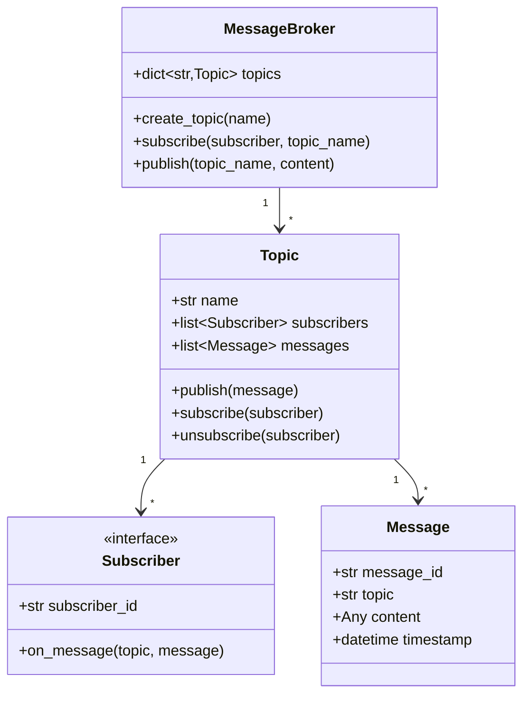

# 📡 PUB-SUB SYSTEM — Complete LLD Guide
## The Definitive 17-Section Edition — V2.0

---

## 📖 Table of Contents
1. [🎯 Problem Statement & Context](#-1-problem-statement--context)
2. [🗣️ Requirement Gathering](#-2-requirement-gathering)
3. [✅ Requirements (FR + NFR)](#-3-requirements)
4. [🧠 Key Insight: Topic-Based Decoupling + Message Queue](#-4-key-insight)
5. [📐 Class Diagram & Entity Relationships](#-5-class-diagram)
6. [🔧 API Design (Public Interface)](#-6-api-design)
7. [🏗️ Complete Code Implementation](#-7-complete-code)
8. [📊 Data Structure Choices & Trade-offs](#-8-data-structure-choices)
9. [🔒 Concurrency & Thread Safety Deep Dive](#-9-concurrency-deep-dive)
10. [🧪 SOLID Principles Mapping](#-10-solid-principles)
11. [🎨 Design Patterns Used](#-11-design-patterns)
12. [💾 Database Schema (Production View)](#-12-database-schema)
13. [⚠️ Edge Cases & Error Handling](#-13-edge-cases)
14. [🎮 Full Working Demo](#-14-full-working-demo)
15. [🎤 Interviewer Follow-ups (15+)](#-15-interviewer-follow-ups)
16. [⏱️ Interview Strategy (45-min Plan)](#-16-interview-strategy)
17. [🧠 Quick Recall Cheat Sheet](#-17-quick-recall)

---

# 🎯 1. Problem Statement & Context

## What You're Designing

> Design a **Publish-Subscribe (Pub-Sub) Message Broker** where publishers send messages to named **topics**, and subscribers receive messages from topics they've subscribed to. The system decouples producers from consumers — publishers don't know (or care) who subscribes, and subscribers don't know who published. Support topic creation, subscription management, message publishing with fan-out delivery, and message ordering guarantees.

## Real-World Context

| Metric | Real System (Kafka/RabbitMQ) |
|--------|------------------------------|
| Topics | 100s–1000s |
| Messages/sec | 1M+ (Kafka) |
| Subscribers per topic | 1–1000 |
| Message retention | 7 days (Kafka), until consumed (RabbitMQ) |
| Delivery guarantee | At-least-once, at-most-once, exactly-once |
| Use cases | Notifications, event streaming, microservice communication |

## Why Interviewers Love This Problem

| What They Test | How This Tests It |
|---------------|-------------------|
| **Observer Pattern** ⭐ | THE textbook implementation of Observer |
| **Decoupling** | Publisher → Topic → Subscriber(s). No direct dependency |
| **Fan-out delivery** | One message → N subscribers |
| **Concurrency** | Publish + subscribe from multiple threads simultaneously |
| **Message ordering** | Messages within a topic must preserve publish order |
| **At-least-once vs exactly-once** | Delivery semantics |

---

# 🗣️ 2. Requirement Gathering

## Must-Ask Questions

| # | Question | WHY You Ask | Design Impact |
|---|----------|-------------|---------------|
| 1 | "Topic-based or content-based routing?" | **Routing strategy** | Topic-based (subscribers pick topics). Content-based = filter on message content |
| 2 | "Push or pull delivery?" | Subscriber model | Push = broker sends to subscriber callback. Pull = subscriber polls |
| 3 | "Message ordering?" | Ordering guarantee | Within a topic = ordered (FIFO). Across topics = no guarantee |
| 4 | "Delivery guarantee?" | Reliability | At-least-once (default), at-most-once (fire-and-forget), exactly-once (hard) |
| 5 | "Persistent messages?" | Durability | In-memory for LLD. Production: disk + replication |
| 6 | "Subscriber groups?" | Load balancing | Consumer groups: one message → one member per group (not all) |
| 7 | "Back-pressure?" | Slow subscriber handling | If subscriber can't keep up: buffer, drop, or slow publisher |
| 8 | "Message replay?" | Offset management | Re-read from position X. Kafka's killer feature |

### 🎯 THE question that shows system design knowledge

> "Is this push-based (broker sends to callback) or pull-based (subscribers poll)? Push is simpler for LLD, but pull scales better because subscribers control their own pace."

---

# ✅ 3. Requirements

## Functional Requirements

| Priority | ID | Requirement | Complexity |
|----------|-----|-------------|-----------|
| **P0** | FR-1 | **Create topics** by name | Low |
| **P0** | FR-2 | **Subscribe** to a topic (observer registration) | Medium |
| **P0** | FR-3 | **Publish** message to a topic | Medium |
| **P0** | FR-4 | **Fan-out delivery**: message → all subscribers of that topic | High |
| **P0** | FR-5 | **Unsubscribe** from a topic | Low |
| **P1** | FR-6 | Message ordering within a topic (FIFO) | Medium |
| **P1** | FR-7 | Message filtering (subscribers can filter by attributes) | Medium |
| **P2** | FR-8 | Consumer groups (one message → one member per group) | High |
| **P2** | FR-9 | Message replay (re-read from offset) | High |

---

# 🧠 4. Key Insight: Topic = Subject, Subscriber = Observer

## 🤔 THINK: When a publisher sends "order_placed" to the "orders" topic, how does the message reach the NotificationService, InventoryService, and AnalyticsService simultaneously?

<details>
<summary>👀 Click to reveal — The fan-out mechanism</summary>

### The Pub-Sub Pipeline

```
Publisher (OrderService):
  broker.publish("orders", Message("order_placed", {order_id: 42}))
        │
        ▼
   ┌──────────┐
   │  BROKER   │ ← Central registry of topics + subscribers
   └────┬─────┘
        │
        ▼
   ┌──────────────────────┐
   │  Topic: "orders"      │
   │  Subscribers:          │
   │    ├─ NotificationSvc  │─── callback("order_placed") → sends email ✅
   │    ├─ InventorySvc     │─── callback("order_placed") → reduces stock ✅
   │    └─ AnalyticsSvc     │─── callback("order_placed") → logs event ✅
   └──────────────────────┘
   
   Fan-out: 1 message → 3 subscribers → 3 deliveries
```

### Push vs Pull Model

| Model | How It Works | Pros | Cons |
|-------|-------------|------|------|
| **Push** (our LLD) | Broker calls `subscriber.on_message(msg)` | Simple, real-time | Subscriber overload risk |
| **Pull** (Kafka) | Subscriber calls `broker.poll(topic, offset)` | Back-pressure, replay | Subscriber must poll periodically |

### Decoupling: The Core Value

```python
# ❌ WITHOUT Pub-Sub: Direct coupling
class OrderService:
    def place_order(self, order):
        self.notification_service.send_email(order)    # Direct dependency!
        self.inventory_service.reduce_stock(order)      # Direct dependency!
        self.analytics_service.log(order)               # Direct dependency!
        # Adding a new service = MODIFY OrderService! OCP violation!

# ✅ WITH Pub-Sub: Complete decoupling
class OrderService:
    def place_order(self, order):
        self.broker.publish("orders", Message("order_placed", order))
        # OrderService doesn't know WHO subscribes!
        # Adding a new service = just subscribe(). ZERO change here!
```

### Message Structure

```python
class Message:
    """
    A message is:
    - topic: which topic it belongs to
    - content: the payload (any data)
    - metadata: timestamp, message_id, publisher_id
    
    Message is IMMUTABLE after creation. 
    Same message object is shared across all subscribers (read-only).
    """
    def __init__(self, topic, content, publisher_id=None):
        self.message_id = str(uuid.uuid4())[:8]
        self.topic = topic
        self.content = content
        self.publisher_id = publisher_id
        self.timestamp = datetime.now()
```

</details>

---

# 📐 5. Class Diagram & Entity Relationships



## Entity Relationships

```
MessageBroker (singleton)
├── topics: dict[name → Topic]
│   Topic "orders"
│   ├── subscribers: [NotificationSvc, InventorySvc, AnalyticsSvc]
│   ├── messages: [msg1, msg2, msg3, ...] (ordered FIFO)
│   └── publish(msg) → fan-out to all subscribers
│
│   Topic "payments"
│   ├── subscribers: [AccountingSvc, FraudDetectionSvc]
│   └── ...
│
Publisher ──publish(topic, content)──→ Broker ──fan-out──→ Subscribers
```

---

# 🔧 6. API Design (Public Interface)

```python
class MessageBroker:
    """
    Central Pub-Sub API.
    
    Publishers:
        broker.publish("orders", {"order_id": 42, "status": "placed"})
    
    Subscribers:
        broker.subscribe("orders", notification_service)
        broker.subscribe("orders", inventory_service)
    
    Management:
        broker.create_topic("orders")
        broker.unsubscribe("orders", notification_service)
    """
    def create_topic(self, name: str) -> 'Topic': ...
    def delete_topic(self, name: str) -> None: ...
    def subscribe(self, topic_name: str, subscriber: 'Subscriber') -> None: ...
    def unsubscribe(self, topic_name: str, subscriber: 'Subscriber') -> None: ...
    def publish(self, topic_name: str, content: any) -> 'Message': ...
    def get_topic(self, name: str) -> 'Topic': ...
```

---

# 🏗️ 7. Complete Code Implementation

## Message

```python
from abc import ABC, abstractmethod
from datetime import datetime
from collections import deque
import uuid
import threading
import time

class Message:
    """
    Immutable message published to a topic.
    Shared across all subscribers (read-only).
    """
    _counter = 0
    def __init__(self, topic: str, content: any, publisher_id: str = None):
        Message._counter += 1
        self.message_id = f"MSG-{Message._counter:06d}"
        self.topic = topic
        self.content = content
        self.publisher_id = publisher_id
        self.timestamp = datetime.now()
    
    def __str__(self):
        ts = self.timestamp.strftime("%H:%M:%S")
        return f"[{ts}] #{self.message_id} ({self.topic}): {self.content}"
```

## Subscriber Interface

```python
class Subscriber(ABC):
    """
    Observer interface — any service that wants to receive messages.
    
    Subclasses implement on_message() to handle messages their way:
    - NotificationService → sends email
    - InventoryService → updates stock
    - LoggingService → writes to log file
    
    This is the Observer pattern's "Observer" interface.
    """
    def __init__(self, subscriber_id: str):
        self.subscriber_id = subscriber_id
    
    @abstractmethod
    def on_message(self, topic: str, message: Message) -> None:
        """Called by the broker when a new message arrives on a subscribed topic."""
        pass


class PrintSubscriber(Subscriber):
    """Simple subscriber that prints messages to console."""
    def on_message(self, topic, message):
        print(f"      📬 [{self.subscriber_id}] received: {message.content}")


class LogSubscriber(Subscriber):
    """Subscriber that logs messages to a list (simulating file/DB)."""
    def __init__(self, subscriber_id):
        super().__init__(subscriber_id)
        self.log: list[Message] = []
    
    def on_message(self, topic, message):
        self.log.append(message)
        print(f"      📝 [{self.subscriber_id}] logged: {message.content} "
              f"(total: {len(self.log)})")


class FilterSubscriber(Subscriber):
    """Subscriber with content-based filtering."""
    def __init__(self, subscriber_id, filter_key=None, filter_value=None):
        super().__init__(subscriber_id)
        self.filter_key = filter_key
        self.filter_value = filter_value
        self.received: list[Message] = []
    
    def on_message(self, topic, message):
        # Content-based filter: only process matching messages
        if self.filter_key and isinstance(message.content, dict):
            if message.content.get(self.filter_key) != self.filter_value:
                return  # Skip — doesn't match filter
        self.received.append(message)
        print(f"      🔍 [{self.subscriber_id}] filtered-received: {message.content}")
```

## Topic

```python
class Topic:
    """
    Named topic — the "Subject" in Observer pattern.
    
    Manages:
    - subscribers: list of Observer objects
    - messages: ordered FIFO history (deque for bounded retention)
    - publish: fan-out to all subscribers
    
    Thread-safe: lock on subscribe/unsubscribe/publish.
    """
    def __init__(self, name: str, max_messages: int = 1000):
        self.name = name
        self.subscribers: list[Subscriber] = []
        self.messages: deque[Message] = deque(maxlen=max_messages)
        self._lock = threading.Lock()
    
    def subscribe(self, subscriber: Subscriber):
        with self._lock:
            if subscriber not in self.subscribers:
                self.subscribers.append(subscriber)
                print(f"   ✅ {subscriber.subscriber_id} subscribed to '{self.name}'")
            else:
                print(f"   ℹ️ {subscriber.subscriber_id} already subscribed to '{self.name}'")
    
    def unsubscribe(self, subscriber: Subscriber):
        with self._lock:
            if subscriber in self.subscribers:
                self.subscribers.remove(subscriber)
                print(f"   🔕 {subscriber.subscriber_id} unsubscribed from '{self.name}'")
    
    def publish(self, message: Message):
        """
        Fan-out: deliver message to ALL subscribers.
        
        Key decisions:
        1. Synchronous delivery (for LLD simplicity)
        2. Subscriber exception doesn't affect other subscribers
        3. Message stored in topic history BEFORE delivery
        
        Production: async delivery via thread pool or message queue.
        """
        with self._lock:
            # Store message (FIFO, bounded by maxlen)
            self.messages.append(message)
            
            # Fan-out delivery
            for subscriber in self.subscribers:
                try:
                    subscriber.on_message(self.name, message)
                except Exception as e:
                    # CRITICAL: One subscriber failure must NOT affect others!
                    print(f"      ❌ Error delivering to {subscriber.subscriber_id}: {e}")
    
    @property
    def subscriber_count(self):
        return len(self.subscribers)
    
    @property
    def message_count(self):
        return len(self.messages)
    
    def __str__(self):
        return (f"📡 Topic '{self.name}' | "
                f"{self.subscriber_count} subscribers | "
                f"{self.message_count} messages")
```

## Message Broker

```python
class MessageBroker:
    """
    Central Pub-Sub broker — the entry point.
    
    Responsibilities:
    1. Topic management (create, delete, list)
    2. Subscription management (subscribe, unsubscribe)
    3. Message routing (publish to topic → fan-out)
    
    Singleton: one broker per system.
    
    This is NOT the Observer — this is the MEDIATOR that
    connects publishers (via publish) to observers (via topics).
    """
    _instance = None
    
    def __new__(cls):
        if cls._instance is None:
            cls._instance = super().__new__(cls)
            cls._instance._initialized = False
        return cls._instance
    
    def __init__(self):
        if self._initialized: return
        self._initialized = True
        self.topics: dict[str, Topic] = {}
        self._lock = threading.Lock()
    
    def create_topic(self, name: str) -> Topic:
        with self._lock:
            if name in self.topics:
                print(f"   ℹ️ Topic '{name}' already exists")
                return self.topics[name]
            topic = Topic(name)
            self.topics[name] = topic
            print(f"   ✅ Created topic: '{name}'")
            return topic
    
    def delete_topic(self, name: str):
        with self._lock:
            if name in self.topics:
                del self.topics[name]
                print(f"   🗑️ Deleted topic: '{name}'")
    
    def subscribe(self, topic_name: str, subscriber: Subscriber):
        topic = self.topics.get(topic_name)
        if not topic:
            print(f"   ❌ Topic '{topic_name}' does not exist!")
            return
        topic.subscribe(subscriber)
    
    def unsubscribe(self, topic_name: str, subscriber: Subscriber):
        topic = self.topics.get(topic_name)
        if topic:
            topic.unsubscribe(subscriber)
    
    def publish(self, topic_name: str, content: any,
                publisher_id: str = None) -> Message | None:
        """
        Publish message to a topic.
        
        Steps:
        1. Find topic (O(1) dict lookup)
        2. Create Message object
        3. Topic.publish → fan-out to all subscribers
        
        Returns the Message object for confirmation.
        """
        topic = self.topics.get(topic_name)
        if not topic:
            print(f"   ❌ Topic '{topic_name}' does not exist!")
            return None
        
        message = Message(topic_name, content, publisher_id)
        print(f"   📤 Publishing to '{topic_name}': {content}")
        topic.publish(message)
        return message
    
    def display_topics(self):
        print(f"\n   ╔══════ MESSAGE BROKER STATUS ══════╗")
        for topic in self.topics.values():
            print(f"   ║ {topic}")
        if not self.topics:
            print(f"   ║ (no topics)")
        print(f"   ╚════════════════════════════════════╝")
```

---

# 📊 8. Data Structure Choices & Trade-offs

| Data Structure | Where | Why | Alternative | Why Not |
|---------------|-------|-----|-------------|---------|
| `dict[str, Topic]` | Broker.topics | O(1) lookup by topic name | `list[Topic]` | Need fast lookup: "does topic orders exist?" |
| `list[Subscriber]` | Topic.subscribers | Ordered fan-out. Small N (1-100 per topic). Iterate all | `set` | Need ordered delivery. Can use set if order doesn't matter |
| `deque(maxlen=N)` | Topic.messages | **Bounded FIFO**. Auto-evicts oldest when full. O(1) append | `list` | List grows unbounded! deque with maxlen = automatic retention |
| **Subscriber ABC** | Interface | Concrete subscribers decide HOW to process. Decoupling | Hard-coded callbacks | OCP violation. New subscriber type = modify broker |

### Why deque with maxlen for Message History?

```python
# ❌ List: grows forever → memory leak!
self.messages = []
self.messages.append(msg)  # Eventually: millions of messages → OOM!

# ✅ deque(maxlen=1000): bounded FIFO
self.messages = deque(maxlen=1000)
self.messages.append(msg)  # At 1001st message: oldest auto-evicted!
# O(1) append + automatic retention management

# For production: Kafka uses log segments on disk with configurable retention.
```

---

# 🔒 9. Concurrency & Thread Safety Deep Dive

## When Does Concurrency Matter?

| Scenario | Race Condition |
|----------|----------------|
| Publish + Subscribe simultaneously | Publishing to subscribers list while list is being modified |
| Multiple publishers to same topic | Messages interleaved. Order must be preserved PER-PUBLISHER |
| Subscriber processing blocks | Slow subscriber blocks fan-out to all others |

### The ConcurrentModification Problem

```
t=0: Publisher → topic.publish() → iterating subscribers: [A, B, C]
t=1: New subscriber → topic.subscribe(D) → modifying list while iterating!
Result: RuntimeError: list changed size during iteration! 💀
```

```python
# Fix 1: Lock on topic (our approach)
def publish(self, message):
    with self._lock:  # Blocks subscribe() during fan-out
        for subscriber in self.subscribers:
            subscriber.on_message(...)

# Fix 2: Copy-on-iterate (lock-free)
def publish(self, message):
    subscribers_snapshot = self.subscribers[:]  # Copy!
    for subscriber in subscribers_snapshot:
        subscriber.on_message(...)
# Pro: publish doesn't block subscribe
# Con: new subscriber misses messages during this publish cycle
```

### Slow Subscriber: The Fan-Out Bottleneck

```
Subscribers: [FastSvc (1ms), SlowSvc (5000ms), AnotherFastSvc (1ms)]

Synchronous fan-out:
  FastSvc: 1ms ✅
  SlowSvc: 5000ms... ⏳ (blocks everyone!)
  AnotherFastSvc: waiting... 💀
  Total: 5002ms for ONE message!

Async fan-out (production):
  Each subscriber gets its own thread/queue
  FastSvc: 1ms ✅ (parallel)
  SlowSvc: 5000ms ⏳ (own thread, doesn't block others)
  AnotherFastSvc: 1ms ✅ (parallel)
  Total: 5000ms, but FastSvc got it instantly!
```

```python
# Production: Async delivery with thread pool
import concurrent.futures

def publish(self, message):
    self.messages.append(message)
    with concurrent.futures.ThreadPoolExecutor() as pool:
        futures = [pool.submit(sub.on_message, self.name, message)
                   for sub in self.subscribers]
        # Fire-and-forget or wait for all
```

---

# 🧪 10. SOLID Principles Mapping

| Principle | Where Applied | Explanation |
|-----------|--------------|-------------|
| **S** | Each class: one job | Message = data. Topic = routing + delivery. Subscriber = processing. Broker = management |
| **O** ⭐⭐⭐ | **Subscriber ABC** | New subscriber type = new subclass. PrintSubscriber, LogSubscriber, EmailSubscriber — ZERO change to Topic/Broker! |
| **L** | All subscribers interchangeable | Topic calls `subscriber.on_message()` without knowing the concrete type |
| **I** | Subscriber has 1 method | `on_message()` only. No bloated interface |
| **D** | Topic → Subscriber ABC | Topic depends on Subscriber abstraction, never on PrintSubscriber or LogSubscriber specifically |

### OCP: The Star Example

```python
# Adding email alerts — ZERO change to Broker/Topic:
class EmailSubscriber(Subscriber):
    def __init__(self, email_address):
        super().__init__(f"email-{email_address}")
        self.email = email_address
    
    def on_message(self, topic, message):
        send_email(self.email, subject=f"Alert: {topic}",
                   body=str(message.content))

# Usage:
broker.subscribe("alerts", EmailSubscriber("admin@company.com"))
broker.publish("alerts", "Server CPU at 95%!")
# → Email sent! Broker and Topic unchanged!
```

---

# 🎨 11. Design Patterns Used

| Pattern | Where | Why |
|---------|-------|-----|
| **Observer** ⭐⭐⭐ | Topic → Subscribers | THE textbook Observer. Topic = Subject. Subscriber = Observer. `publish()` = `notify_all()` |
| **Mediator** | MessageBroker | Centralizes topic management. Publishers don't know subscribers |
| **Strategy** | Subscriber subclasses | Different processing strategies: print, log, email, webhook |
| **Singleton** | MessageBroker | One broker per system |
| **Command** | (Extension) Message as Command | Message encapsulates action + data. Can be replayed |

### Observer vs Pub-Sub vs Event Bus

| Concept | Coupling | Routing | Example |
|---------|----------|---------|---------|
| **Observer** | Subject knows observers directly | Direct method call | Button → ButtonListeners |
| **Pub-Sub** ⭐ | Publisher doesn't know subscribers | Topic-based routing via broker | Kafka, RabbitMQ |
| **Event Bus** | Components don't know each other | Event-type routing | Guava EventBus |

### Cross-Problem Observer Comparison

| System | Subject (Publisher) | Observers (Subscribers) | Trigger |
|--------|-------------------|------------------------|---------|
| **Pub-Sub** | Any publisher | Topic subscribers | `publish()` |
| **Logging** | Logger | Handlers (Console, File) | `log()` |
| **Food Delivery** | Order (status change) | Customer, Restaurant, Driver | `transition_to()` |

---

# 💾 12. Database Schema (Production View)

```sql
-- For persistent message broker (Kafka-like)

CREATE TABLE topics (
    topic_name  VARCHAR(100) PRIMARY KEY,
    created_at  TIMESTAMP DEFAULT NOW(),
    max_retention_hours INTEGER DEFAULT 168  -- 7 days
);

CREATE TABLE subscriptions (
    subscriber_id VARCHAR(100),
    topic_name    VARCHAR(100) REFERENCES topics(topic_name),
    subscribed_at TIMESTAMP DEFAULT NOW(),
    last_offset   BIGINT DEFAULT 0,  -- For pull-based: last read position
    PRIMARY KEY (subscriber_id, topic_name)
);

CREATE TABLE messages (
    message_id  BIGSERIAL,
    topic_name  VARCHAR(100) REFERENCES topics(topic_name),
    content     JSONB NOT NULL,
    publisher_id VARCHAR(100),
    published_at TIMESTAMP DEFAULT NOW(),
    PRIMARY KEY (topic_name, message_id)
) PARTITION BY LIST (topic_name);
-- Each topic = separate partition for performance

-- Pull-based: subscriber reads from last offset
SELECT * FROM messages
WHERE topic_name = 'orders' AND message_id > 42  -- last_offset = 42
ORDER BY message_id ASC
LIMIT 100;

-- Update offset after processing
UPDATE subscriptions
SET last_offset = 142
WHERE subscriber_id = 'notification-svc' AND topic_name = 'orders';
```

---

# ⚠️ 13. Edge Cases & Error Handling

| # | Edge Case | Fix |
|---|-----------|-----|
| 1 | **Publish to non-existent topic** | Return None + error message. Don't auto-create |
| 2 | **Subscribe to non-existent topic** | Reject with error. Must create_topic first |
| 3 | **Subscriber throws exception** | Catch in Topic.publish(). Log error. Continue to next subscriber |
| 4 | **Duplicate subscription** | Check `if subscriber not in subscribers`. Idempotent |
| 5 | **Unsubscribe non-subscriber** | Safe no-op. Check before remove |
| 6 | **Publish with no subscribers** | Message stored in history. No delivery. No error |
| 7 | **Message history overflow** | `deque(maxlen=N)` auto-evicts oldest. Bounded memory |
| 8 | **Concurrent publish + subscribe** | Lock on Topic. Subscriber added AFTER current publish cycle |
| 9 | **Slow subscriber blocks others** | Production: async delivery per subscriber |
| 10 | **Subscriber processes same message twice** | Idempotent subscribers. Or: track message_id, skip duplicates |
| 11 | **Topic deleted while subscribers active** | Notify subscribers. Unsubscribe all first |
| 12 | **Large message payload** | Set max_message_size. Reject oversized messages |

---

# 🎮 14. Full Working Demo

```python
if __name__ == "__main__":
    # Reset singleton
    MessageBroker._instance = None
    
    print("=" * 65)
    print("     📡 PUB-SUB MESSAGE BROKER — COMPLETE DEMO")
    print("=" * 65)
    
    broker = MessageBroker()
    
    # ─── Test 1: Create Topics ───
    print("\n─── Test 1: Create Topics ───")
    broker.create_topic("orders")
    broker.create_topic("payments")
    broker.create_topic("alerts")
    
    # ─── Test 2: Create Subscribers ───
    print("\n─── Test 2: Subscribe ───")
    notif_svc = PrintSubscriber("NotificationService")
    inventory_svc = PrintSubscriber("InventoryService")
    analytics_svc = LogSubscriber("AnalyticsService")
    fraud_svc = PrintSubscriber("FraudDetection")
    
    broker.subscribe("orders", notif_svc)
    broker.subscribe("orders", inventory_svc)
    broker.subscribe("orders", analytics_svc)
    broker.subscribe("payments", fraud_svc)
    broker.subscribe("payments", analytics_svc)
    
    # ─── Test 3: Publish — Fan-out ───
    print("\n─── Test 3: Publish to 'orders' (3 subscribers) ───")
    broker.publish("orders", {"order_id": 42, "status": "placed"}, "OrderService")
    
    print("\n─── Test 4: Publish to 'payments' (2 subscribers) ───")
    broker.publish("payments", {"payment_id": 99, "amount": 1500}, "PaymentService")
    
    # ─── Test 5: Unsubscribe ───
    print("\n─── Test 5: Unsubscribe InventoryService ───")
    broker.unsubscribe("orders", inventory_svc)
    
    print("\n─── Test 6: Publish again (now 2 subscribers) ───")
    broker.publish("orders", {"order_id": 43, "status": "shipped"}, "OrderService")
    
    # ─── Test 7: Publish to non-existent topic ───
    print("\n─── Test 7: Publish to non-existent topic ───")
    broker.publish("nonexistent", "hello!")
    
    # ─── Test 8: Duplicate subscription ───
    print("\n─── Test 8: Duplicate subscription ───")
    broker.subscribe("orders", notif_svc)  # Already subscribed!
    
    # ─── Test 9: Content-based filtering ───
    print("\n─── Test 9: Filtered Subscriber ───")
    vip_filter = FilterSubscriber("VIPHandler", 
                                   filter_key="priority", filter_value="HIGH")
    broker.subscribe("alerts", vip_filter)
    
    broker.publish("alerts", {"msg": "normal alert", "priority": "LOW"})
    broker.publish("alerts", {"msg": "VIP alert!", "priority": "HIGH"})
    print(f"   VIP handler received {len(vip_filter.received)} messages "
          f"(filtered from 2)")
    
    # ─── Test 10: Analytics Log Check ───
    print("\n─── Test 10: Analytics Service Log ───")
    print(f"   AnalyticsService total logged: {len(analytics_svc.log)}")
    for msg in analytics_svc.log:
        print(f"      {msg}")
    
    # ─── Status ───
    broker.display_topics()
    
    print(f"\n{'='*65}")
    print("     ✅ ALL 10 TESTS COMPLETE!")
    print(f"{'='*65}")
```

---

# 🎤 15. Interviewer Follow-ups (15+)

| Q | Question | Key Answer |
|---|----------|-----------|
| 1 | "Is this Observer pattern?" | Yes — Topic = Subject, Subscriber = Observer. Broker adds topic-based routing (Mediator) |
| 2 | "Push vs Pull?" | Push (broker calls subscriber). Pull = subscriber polls (Kafka). Pull scales better |
| 3 | "What if subscriber fails?" | Catch exception, log, continue to next. One failure must NOT block others |
| 4 | "Message ordering?" | Within topic = FIFO (deque). Across topics = no guarantee |
| 5 | "Consumer groups?" | Partition messages: each message → one member per group. Round-robin or hash-based |
| 6 | "At-least-once delivery?" | Retry on failure. Subscriber must be idempotent (handle duplicates) |
| 7 | "Exactly-once?" | Hardest guarantee. Transaction log + dedup at subscriber |
| 8 | "Message replay?" | Store messages with offset. Subscriber can re-read from any offset (Kafka) |
| 9 | "Async delivery?" | Thread pool per topic. Each subscriber gets its own thread. Fire-and-forget |
| 10 | "Back-pressure?" | Bounded queue per subscriber. If full: drop, block publisher, or alert |
| 11 | "Dead letter queue?" | Failed messages → DLQ. Retry later or manual investigation |
| 12 | "Wildcard subscriptions?" | Subscribe to "orders.*" → matches "orders.placed", "orders.shipped" |
| 13 | "Compare with Event Bus?" | Pub-Sub = topic routing. Event Bus = type routing. Both decouple producers/consumers |
| 14 | "Kafka partitions?" | Topic split into partitions. Each partition = ordered, single consumer from group |
| 15 | "How does this scale?" | Partition topics. Distribute partitions across brokers. Consumer groups for horizontal scaling |

---

# ⏱️ 16. Interview Strategy (45-min Plan)

| Time | Phase | What You Do |
|------|-------|-------------|
| **0–5** | Clarify | Topic-based, push/pull, ordering, delivery guarantee |
| **5–10** | Key Insight | Draw: Publisher → Broker → Topic → Subscribers. Explain decoupling value |
| **10–15** | Class Diagram | Message, Subscriber ABC, Topic, MessageBroker |
| **15–30** | Code | Subscriber ABC, Topic (subscribe/publish/fan-out), Broker (create_topic, publish, subscribe) |
| **30–38** | Demo | Create topics, subscribe services, publish with fan-out, unsubscribe, filtered subscriber |
| **38–45** | Extensions | Consumer groups, pull model, dead letter queue, partitioning |

## Golden Sentences

> **Opening:** "Pub-Sub is the Observer pattern with topic-based routing. Publisher sends to a Topic (Subject). All Subscribers (Observers) of that topic receive the message. Complete decoupling — publisher doesn't know who subscribes."

> **Why Pub-Sub over direct calls:** "Without Pub-Sub, OrderService must call NotificationService, InventoryService, AnalyticsService directly. Adding a new service = modify OrderService. With Pub-Sub: just `subscribe('orders', new_service)`. Zero change to publisher."

> **Critical rule:** "One subscriber failure must NEVER affect other subscribers. Catch exceptions in the fan-out loop and continue."

---

# 🧠 17. Quick Recall Cheat Sheet

## ⏱️ 30-Second Recall

> **Observer pattern** with topic-based routing. **Publisher** → **Broker** → **Topic** → **Subscribers** (fan-out). Subscriber ABC: `on_message()`. Topic stores subscribers list + message history (deque). **Decoupling:** publisher doesn't know subscribers. New subscriber = `subscribe()`, zero publisher change. **One subscriber failure doesn't affect others.**

## ⏱️ 2-Minute Recall

Add:
> **Entities:** Message (id, topic, content, timestamp). Subscriber (ABC, on_message). Topic (name, subscribers list, messages deque). Broker (topics dict, singleton).
> **Fan-out:** `for sub in subscribers: sub.on_message(msg)`. Catch exceptions per subscriber.
> **deque(maxlen):** Bounded FIFO for message history. Auto-evicts oldest.
> **Thread safety:** Lock on Topic for publish/subscribe. Production: copy-on-iterate or async delivery.

## ⏱️ 5-Minute Recall

Add:
> **SOLID:** OCP is the STAR — new subscriber type = new ABC subclass, zero change to Broker/Topic. Subscriber interface has 1 method (ISP).
> **Push vs Pull:** Push = broker calls callback. Pull = subscriber polls with offset (#Kafka).
> **Consumer groups:** 1 message → 1 member per group (not all). Load balancing.
> **Dead letter queue:** Failed messages go to DLQ for retry/investigation.
> **Compare:** Observer (direct), Pub-Sub (broker-mediated), Event Bus (type-routed). Pub-Sub = most decoupled.
> **Cross-problem:** Same as Logging (Logger→Handlers), Food Delivery (Order→notify actors).

---

## ✅ Pre-Implementation Checklist

- [ ] **Message** (message_id, topic, content, timestamp, publisher_id)
- [ ] **Subscriber** ABC with `on_message(topic, message)` — the Observer interface
- [ ] **PrintSubscriber**, **LogSubscriber**, **FilterSubscriber** — concrete observers
- [ ] **Topic** (name, subscribers list, messages deque, per-topic lock)
- [ ] **Topic.subscribe()** — add to list, check duplicate
- [ ] **Topic.unsubscribe()** — remove from list
- [ ] **Topic.publish()** — append to history, fan-out to all, catch per-subscriber errors
- [ ] **MessageBroker** (topics dict, singleton, _lock for topic management)
- [ ] **Broker.create_topic()**, **publish()**, **subscribe()**, **unsubscribe()**
- [ ] **Demo:** create topics, subscribe services, publish with fan-out, unsubscribe, filter

---

*Version 2.0 — The Definitive 17-Section Edition (Gold Standard)*
