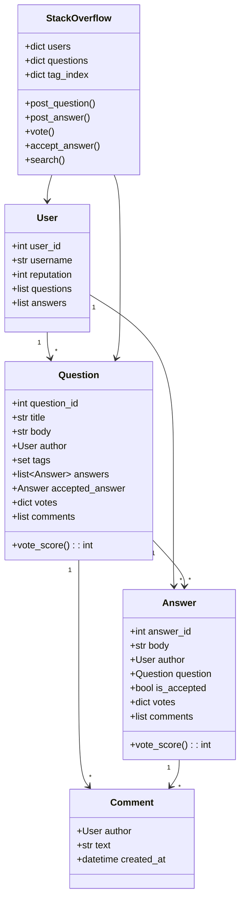

# 📚 STACK OVERFLOW — Complete LLD Guide
## The Definitive 17-Section Edition — V2.0

---

## 📖 Table of Contents
1. [🎯 Problem Statement & Context](#-1-problem-statement--context)
2. [🗣️ Requirement Gathering](#-2-requirement-gathering)
3. [✅ Requirements (FR + NFR)](#-3-requirements)
4. [🧠 Key Insight: Voting System + Reputation Engine + Tag-Based Search](#-4-key-insight)
5. [📐 Class Diagram & Entity Relationships](#-5-class-diagram)
6. [🔧 API Design (Public Interface)](#-6-api-design)
7. [🏗️ Complete Code Implementation](#-7-complete-code)
8. [📊 Data Structure Choices & Trade-offs](#-8-data-structure-choices)
9. [🔒 Concurrency & Thread Safety Deep Dive](#-9-concurrency-deep-dive)
10. [🧪 SOLID Principles Mapping](#-10-solid-principles)
11. [🎨 Design Patterns Used](#-11-design-patterns)
12. [💾 Database Schema (Production View)](#-12-database-schema)
13. [⚠️ Edge Cases & Error Handling](#-13-edge-cases)
14. [🎮 Full Working Demo](#-14-full-working-demo)
15. [🎤 Interviewer Follow-ups (15+)](#-15-interviewer-follow-ups)
16. [⏱️ Interview Strategy (45-min Plan)](#-16-interview-strategy)
17. [🧠 Quick Recall Cheat Sheet](#-17-quick-recall)

---

# 🎯 1. Problem Statement & Context

## What You're Designing

> Design a **Stack Overflow-like Q&A platform** where users post questions with tags, other users post answers, both questions and answers can be voted on (upvote/downvote), questions can be marked as accepted, users earn reputation based on their contributions, and content is searchable by tags, keywords, and user. The system tracks reputation changes, supports comments on questions/answers, and handles concurrent voting.

## Real-World Context

| Metric | Real Stack Overflow |
|--------|---------------------|
| Questions | 24M+ |
| Answers | 35M+ |
| Users | 22M+ |
| Tags | 60K+ |
| Rep thresholds | 15 (upvote), 50 (comment), 3000 (close vote) |
| Votes per day | 500K+ |

## Why Interviewers Love This Problem

| What They Test | How This Tests It |
|---------------|-------------------|
| **Content hierarchy** | Question → Answer → Comment (tree structure) |
| **Voting system** ⭐ | Upvote/downvote with undo, one vote per user per post |
| **Reputation engine** ⭐ | Points for getting upvoted, accepted answer, etc. |
| **Tag-based search** | Tags as first-class entities, intersection search |
| **User privileges** | Reputation unlocks capabilities |
| **Accepted answer** | Question author marks ONE answer as accepted |

---

# 🗣️ 2. Requirement Gathering

## Must-Ask Questions

| # | Question | WHY You Ask | Design Impact |
|---|----------|-------------|---------------|
| 1 | "Can a user vote on their own post?" | **Self-vote prevention** | Validate voter ≠ author |
| 2 | "Can you change your vote?" | Vote toggling | Upvote → undo → downvote. Must track per-user-per-post |
| 3 | "Reputation system?" | **THE key differentiator** | +10 for question upvote, +15 for answer upvote, +25 for accepted |
| 4 | "Tags — how many per question?" | Tag limits | Max 5 tags per question. Tags are predefined or user-created |
| 5 | "Accepted answer — who can accept?" | Acceptance rules | Only question author can accept. Only ONE accepted per question |
| 6 | "Search by what?" | Search strategy | By tag, by keyword in title/body, by user |
| 7 | "Comments on Q and A?" | Comment model | Comments on both questions and answers. Simple text + author |
| 8 | "Reputation thresholds?" | Privilege system | 15 rep to upvote, 50 to comment, etc. |

### 🎯 THE design insight

> "Questions and Answers share behaviors: both have author, body, votes, comments. I'll make them share a base `Post` class (or interface). Voting is per-user-per-post tracked in a dict to prevent double voting and allow toggling."

---

# ✅ 3. Requirements

## Functional Requirements

| Priority | ID | Requirement | Complexity |
|----------|-----|-------------|-----------|
| **P0** | FR-1 | **Post question** (title, body, tags, author) | Medium |
| **P0** | FR-2 | **Post answer** to a question | Medium |
| **P0** | FR-3 | **Vote** (upvote/downvote with toggle/undo) on Q or A | High |
| **P0** | FR-4 | **Accept answer** (only question author, only one per Q) | Medium |
| **P0** | FR-5 | **Reputation system** with point tracking | High |
| **P0** | FR-6 | **Search** by tag, keyword, user | Medium |
| **P1** | FR-7 | **Comments** on questions and answers | Low |
| **P1** | FR-8 | Answer sorting (by votes, by date) | Low |
| **P2** | FR-9 | Reputation-based privileges | Medium |

---

# 🧠 4. Key Insight: Vote Tracking + Reputation Points

## 🤔 THINK: Alice upvotes Bob's answer. Then Alice changes to downvote. What happens to Bob's reputation?

<details>
<summary>👀 Click to reveal — The voting + reputation pipeline</summary>

### Vote Tracking: Per-User-Per-Post

```python
# Track WHICH user voted WHAT on each post
# votes: dict[user_id → VoteType]

class VoteType(Enum):
    UPVOTE = 1
    DOWNVOTE = -1

# Example: Post #42 (Bob's answer)
post.votes = {
    "alice": VoteType.UPVOTE,    # Alice upvoted
    "charlie": VoteType.DOWNVOTE, # Charlie downvoted
}

# Vote score = sum of all votes
# +1 (alice) + (-1) (charlie) = 0
```

### Voting Rules & Edge Cases

```
Scenario 1: Alice upvotes Bob's answer
  → votes["alice"] = UPVOTE
  → Bob.reputation += 10
  → Score: +1

Scenario 2: Alice tries to upvote AGAIN
  → Already voted UPVOTE → TOGGLE: UNDO the upvote
  → del votes["alice"]
  → Bob.reputation -= 10
  → Score: 0

Scenario 3: Alice DOWNVOTES Bob's answer
  → votes["alice"] = DOWNVOTE
  → Bob.reputation -= 2 (downvote penalty)
  → Alice.reputation -= 1 (cost to downvote!)
  → Score: -1

Scenario 4: Alice changes DOWNVOTE to UPVOTE
  → Undo downvote first: Bob.rep += 2, Alice.rep += 1
  → Apply upvote: Bob.rep += 10
  → votes["alice"] = UPVOTE
  → Score: +1
```

### Reputation Point Table

| Action | Points | Who Gets |
|--------|--------|----------|
| Question upvoted | **+10** | Question author |
| Answer upvoted | **+10** | Answer author |
| Answer accepted | **+15** | Answer author |
| Accept an answer | **+2** | Question author |
| Question downvoted | **-2** | Question author |
| Answer downvoted | **-2** | Answer author |
| Downvote someone | **-1** | The voter (cost to downvote!) |
| Minimum rep | **1** | Rep cannot go below 1 |

### Tag-Based Search

```python
# Tags: each question has a SET of tags
# Tag index: dict[tag → set[question_ids]]

tag_index = {
    "python":     {Q1, Q3, Q7},
    "javascript": {Q2, Q5},
    "database":   {Q1, Q4},
}

# Search "python" → {Q1, Q3, Q7}
# Search "python" + "database" → {Q1, Q3, Q7} ∩ {Q1, Q4} = {Q1}
```

</details>

---

# 📐 5. Class Diagram & Entity Relationships



---

# 🔧 6. API Design (Public Interface)

```python
class StackOverflow:
    """
    Platform API — what the web application calls.
    
    Content: post_question, post_answer, add_comment
    Voting: vote (upvote/downvote/undo with toggle)
    Acceptance: accept_answer (only by question author)
    Search: search by tags, keywords, user
    """
    def register_user(self, username: str) -> 'User': ...
    def post_question(self, user_id, title, body, tags) -> 'Question': ...
    def post_answer(self, user_id, question_id, body) -> 'Answer': ...
    def add_comment(self, user_id, post_type, post_id, text) -> 'Comment': ...
    def vote(self, user_id, post_type, post_id, vote_type) -> int:
        """Vote on Q or A. Returns new score. Toggle if same vote repeated."""
    def accept_answer(self, user_id, question_id, answer_id) -> bool: ...
    def search(self, tags=None, keyword=None, user_id=None) -> list: ...
```

---

# 🏗️ 7. Complete Code Implementation

## Enums & Constants

```python
from enum import Enum
from datetime import datetime
import threading

class VoteType(Enum):
    UPVOTE = 1
    DOWNVOTE = -1

# Reputation points configuration
REP_CONFIG = {
    "question_upvoted": 10,
    "answer_upvoted": 10,
    "answer_accepted": 15,
    "accept_given": 2,       # Questioner gets 2 for accepting
    "question_downvoted": -2,
    "answer_downvoted": -2,
    "downvote_cost": -1,     # Cost to the voter for downvoting
}
MIN_REPUTATION = 1
```

## User

```python
class User:
    _counter = 0
    def __init__(self, username: str):
        User._counter += 1
        self.user_id = User._counter
        self.username = username
        self.reputation = 1  # Start with 1 (minimum)
        self.questions: list['Question'] = []
        self.answers: list['Answer'] = []
        self.created_at = datetime.now()
    
    def adjust_reputation(self, points: int):
        """
        Adjust reputation. Never below MIN_REPUTATION.
        """
        self.reputation = max(MIN_REPUTATION, self.reputation + points)
    
    def __str__(self):
        return f"👤 {self.username} (rep: {self.reputation})"
```

## Question & Answer (Votable Content)

```python
class Comment:
    def __init__(self, author: User, text: str):
        self.author = author
        self.text = text
        self.created_at = datetime.now()
    
    def __str__(self):
        return f"      💬 {self.author.username}: {self.text}"


class Question:
    """
    A question with title, body, tags, votes, answers, and comments.
    
    Voting: dict[user_id → VoteType]
    - Tracks WHO voted WHAT
    - Prevents double voting
    - Enables toggle (upvote → undo → downvote)
    """
    _counter = 0
    def __init__(self, author: User, title: str, body: str, tags: set[str]):
        Question._counter += 1
        self.question_id = Question._counter
        self.author = author
        self.title = title
        self.body = body
        self.tags = tags
        self.answers: list['Answer'] = []
        self.accepted_answer: 'Answer' = None
        self.votes: dict[int, VoteType] = {}  # user_id → VoteType
        self.comments: list[Comment] = []
        self.created_at = datetime.now()
    
    @property
    def vote_score(self) -> int:
        return sum(v.value for v in self.votes.values())
    
    @property
    def answer_count(self) -> int:
        return len(self.answers)
    
    def __str__(self):
        accepted = "✅" if self.accepted_answer else ""
        return (f"❓ [{self.vote_score:+d}] {self.title} "
                f"[{', '.join(self.tags)}] — {self.author.username} "
                f"| {self.answer_count} answers {accepted}")


class Answer:
    """
    An answer to a question. Can be voted and accepted.
    """
    _counter = 0
    def __init__(self, author: User, question: Question, body: str):
        Answer._counter += 1
        self.answer_id = Answer._counter
        self.author = author
        self.question = question
        self.body = body
        self.is_accepted = False
        self.votes: dict[int, VoteType] = {}  # user_id → VoteType
        self.comments: list[Comment] = []
        self.created_at = datetime.now()
    
    @property
    def vote_score(self) -> int:
        return sum(v.value for v in self.votes.values())
    
    def __str__(self):
        accepted = " ✅ ACCEPTED" if self.is_accepted else ""
        return (f"   💡 [{self.vote_score:+d}] {self.body[:60]}... "
                f"— {self.author.username}{accepted}")
```

## The Stack Overflow System

```python
class StackOverflowSystem:
    """
    Central Q&A platform.
    
    Key operations:
    - post_question: create question with tags, update tag index
    - post_answer: create answer, link to question
    - vote: upvote/downvote with toggle logic + reputation changes
    - accept_answer: mark one answer as accepted (question author only)
    - search: by tags (intersection), keywords, user
    """
    _instance = None
    
    def __new__(cls):
        if cls._instance is None:
            cls._instance = super().__new__(cls)
            cls._instance._initialized = False
        return cls._instance
    
    def __init__(self):
        if self._initialized: return
        self._initialized = True
        self.users: dict[int, User] = {}
        self.questions: dict[int, Question] = {}
        self.answers: dict[int, Answer] = {}
        self.tag_index: dict[str, set[int]] = {}  # tag → set of question_ids
        self._vote_lock = threading.Lock()
    
    # ── User Management ──
    def register_user(self, username: str) -> User:
        user = User(username)
        self.users[user.user_id] = user
        print(f"   ✅ Registered: {user}")
        return user
    
    # ── Question ──
    def post_question(self, user_id: int, title: str, body: str,
                      tags: list[str]) -> Question:
        author = self.users.get(user_id)
        if not author:
            print("   ❌ User not found!"); return None
        
        tag_set = set(t.lower() for t in tags)
        question = Question(author, title, body, tag_set)
        self.questions[question.question_id] = question
        author.questions.append(question)
        
        # Update tag index
        for tag in tag_set:
            if tag not in self.tag_index:
                self.tag_index[tag] = set()
            self.tag_index[tag].add(question.question_id)
        
        print(f"   ✅ Question #{question.question_id}: '{title}' "
              f"[{', '.join(tag_set)}]")
        return question
    
    # ── Answer ──
    def post_answer(self, user_id: int, question_id: int,
                    body: str) -> Answer:
        author = self.users.get(user_id)
        question = self.questions.get(question_id)
        if not author or not question:
            print("   ❌ Invalid user or question!"); return None
        
        answer = Answer(author, question, body)
        question.answers.append(answer)
        self.answers[answer.answer_id] = answer
        author.answers.append(answer)
        
        print(f"   ✅ Answer #{answer.answer_id} on Q#{question_id} "
              f"by {author.username}")
        return answer
    
    # ── Voting ──
    def vote(self, voter_id: int, post_type: str, post_id: int,
             vote_type: VoteType) -> int | None:
        """
        Vote on a question or answer.
        
        Toggle logic:
        1. Same vote again → UNDO (remove vote)
        2. Different vote → SWITCH (undo old + apply new)
        3. New vote → APPLY
        
        Reputation changes applied on each action.
        Cannot vote on own post.
        """
        voter = self.users.get(voter_id)
        if not voter:
            print("   ❌ Voter not found!"); return None
        
        # Get the post
        if post_type == "question":
            post = self.questions.get(post_id)
        elif post_type == "answer":
            post = self.answers.get(post_id)
        else:
            print("   ❌ Invalid post type!"); return None
        
        if not post:
            print("   ❌ Post not found!"); return None
        
        # Self-vote prevention
        if post.author.user_id == voter_id:
            print("   ❌ Cannot vote on your own post!")
            return None
        
        with self._vote_lock:
            existing_vote = post.votes.get(voter_id)
            
            if existing_vote == vote_type:
                # TOGGLE: Same vote again → UNDO
                self._undo_rep(post, existing_vote, voter)
                del post.votes[voter_id]
                print(f"   🔄 {voter.username} UNDID {vote_type.name} "
                      f"on {post_type} #{post_id}")
                
            elif existing_vote is not None:
                # SWITCH: Different vote → undo old + apply new
                self._undo_rep(post, existing_vote, voter)
                self._apply_rep(post, vote_type, voter)
                post.votes[voter_id] = vote_type
                print(f"   🔄 {voter.username} CHANGED to {vote_type.name} "
                      f"on {post_type} #{post_id}")
                
            else:
                # NEW: First vote
                self._apply_rep(post, vote_type, voter)
                post.votes[voter_id] = vote_type
                print(f"   {'👍' if vote_type == VoteType.UPVOTE else '👎'} "
                      f"{voter.username} {vote_type.name}D "
                      f"{post_type} #{post_id}")
        
        print(f"      Score: {post.vote_score:+d} | "
              f"Author rep: {post.author.reputation}")
        return post.vote_score
    
    def _apply_rep(self, post, vote_type: VoteType, voter: User):
        """Apply reputation changes for a vote."""
        is_question = isinstance(post, Question)
        
        if vote_type == VoteType.UPVOTE:
            key = "question_upvoted" if is_question else "answer_upvoted"
            post.author.adjust_reputation(REP_CONFIG[key])
        else:  # DOWNVOTE
            key = "question_downvoted" if is_question else "answer_downvoted"
            post.author.adjust_reputation(REP_CONFIG[key])
            voter.adjust_reputation(REP_CONFIG["downvote_cost"])  # Cost to voter!
    
    def _undo_rep(self, post, vote_type: VoteType, voter: User):
        """Reverse reputation changes for a vote."""
        is_question = isinstance(post, Question)
        
        if vote_type == VoteType.UPVOTE:
            key = "question_upvoted" if is_question else "answer_upvoted"
            post.author.adjust_reputation(-REP_CONFIG[key])
        else:  # DOWNVOTE
            key = "question_downvoted" if is_question else "answer_downvoted"
            post.author.adjust_reputation(-REP_CONFIG[key])
            voter.adjust_reputation(-REP_CONFIG["downvote_cost"])
    
    # ── Accept Answer ──
    def accept_answer(self, user_id: int, question_id: int,
                      answer_id: int) -> bool:
        """
        Accept an answer. Rules:
        1. Only question author can accept
        2. Only ONE answer can be accepted per question
        3. Can change acceptance (unaccept old, accept new)
        """
        question = self.questions.get(question_id)
        answer = self.answers.get(answer_id)
        
        if not question or not answer:
            print("   ❌ Invalid question or answer!"); return False
        
        if question.author.user_id != user_id:
            print("   ❌ Only the question author can accept an answer!")
            return False
        
        if answer.question.question_id != question_id:
            print("   ❌ This answer doesn't belong to this question!")
            return False
        
        # Unaccept previous if exists
        if question.accepted_answer:
            old = question.accepted_answer
            old.is_accepted = False
            old.author.adjust_reputation(-REP_CONFIG["answer_accepted"])
            question.author.adjust_reputation(-REP_CONFIG["accept_given"])
        
        # Accept new
        answer.is_accepted = True
        question.accepted_answer = answer
        answer.author.adjust_reputation(REP_CONFIG["answer_accepted"])
        question.author.adjust_reputation(REP_CONFIG["accept_given"])
        
        print(f"   ✅ Accepted answer #{answer_id} by {answer.author.username} "
              f"on Q#{question_id}")
        print(f"      {answer.author.username} rep: {answer.author.reputation} (+15)")
        return True
    
    # ── Comments ──
    def add_comment(self, user_id: int, post_type: str, post_id: int,
                    text: str) -> Comment:
        author = self.users.get(user_id)
        if not author:
            print("   ❌ User not found!"); return None
        
        if post_type == "question":
            post = self.questions.get(post_id)
        else:
            post = self.answers.get(post_id)
        
        if not post:
            print("   ❌ Post not found!"); return None
        
        comment = Comment(author, text)
        post.comments.append(comment)
        print(f"   💬 {author.username} commented on {post_type} #{post_id}")
        return comment
    
    # ── Search ──
    def search(self, tags: list[str] = None, keyword: str = None,
               user_id: int = None) -> list[Question]:
        """
        Search questions by tags, keyword, or user.
        Tags: intersection (all tags must match).
        Keyword: substring match in title or body.
        """
        results = set(self.questions.keys())
        
        if tags:
            for tag in tags:
                tag = tag.lower()
                tag_questions = self.tag_index.get(tag, set())
                results = results.intersection(tag_questions)
        
        if keyword:
            keyword = keyword.lower()
            results = {qid for qid in results
                      if keyword in self.questions[qid].title.lower()
                      or keyword in self.questions[qid].body.lower()}
        
        if user_id:
            results = {qid for qid in results
                      if self.questions[qid].author.user_id == user_id}
        
        # Sort by vote score descending
        sorted_ids = sorted(results,
                           key=lambda qid: self.questions[qid].vote_score,
                           reverse=True)
        return [self.questions[qid] for qid in sorted_ids]
    
    # ── Display ──
    def display_question(self, question_id: int):
        q = self.questions.get(question_id)
        if not q:
            print("   ❌ Question not found!"); return
        
        print(f"\n   {'─'*55}")
        print(f"   {q}")
        print(f"   {q.body}")
        for c in q.comments:
            print(f"   {c}")
        print(f"   {'─'*35}")
        if not q.answers:
            print("   No answers yet.")
        for a in sorted(q.answers, key=lambda a: (-a.is_accepted, -a.vote_score)):
            print(f"   {a}")
            for c in a.comments:
                print(f"   {c}")
        print(f"   {'─'*55}")
```

---

# 📊 8. Data Structure Choices & Trade-offs

| Data Structure | Where | Why | Alternative | Why Not |
|---------------|-------|-----|-------------|---------|
| `dict[int, VoteType]` | votes per post | O(1) check "has user voted?". Track vote type for toggle | `set` | Need to know WHAT they voted (up or down) for toggle |
| `dict[str, set[int]]` | tag_index | O(1) tag lookup. Intersection for multi-tag search | Full scan | Tag search is the primary use case. Must be fast |
| `set[str]` | Question.tags | O(1) tag membership check. No duplicates | `list` | Tags should be unique. Set enforces this |
| `list[Answer]` | Question.answers | Ordered (by creation time). Can sort by votes | `dict` | Need ordered iteration for display |

### Why dict for votes, not a simple counter?

```python
# ❌ Just a counter:
class Post:
    upvotes = 5
    downvotes = 2
    # WHO voted? Can't check! Can't prevent double voting!
    # Can't implement toggle/undo!

# ✅ dict[user_id → VoteType]:
class Post:
    votes = {
        "alice": VoteType.UPVOTE,
        "bob": VoteType.DOWNVOTE,
    }
    # Can check: "has alice voted?" → O(1)
    # Can toggle: "alice voted UP → same vote → undo"
    # Can switch: "alice voted UP → now DOWN → reverse rep + apply new"
    # Score: sum(v.value for v in votes.values()) = 1 + (-1) = 0
```

---

# 🔒 9. Concurrency & Thread Safety Deep Dive

## The Double-Vote Race

```
Timeline: Post with 0 votes

t=0: Thread A (Alice) → check votes["alice"] → None → new vote!
t=1: Thread B (Alice) → check votes["alice"] → None → new vote!  
     (concurrent request from same user — double-click!)
t=2: Thread A → votes["alice"] = UPVOTE → rep += 10
t=3: Thread B → votes["alice"] = UPVOTE → rep += 10 
     💀 DOUBLE reputation award!
```

```python
# Fix: Lock on vote operation
def vote(self, voter_id, post_type, post_id, vote_type):
    with self._vote_lock:
        existing = post.votes.get(voter_id)
        if existing == vote_type:
            # Toggle undo — atomic with check
            ...
        else:
            # Apply — atomic with check
            post.votes[voter_id] = vote_type
```

### Production: Per-Post Lock

```python
# Global lock serializes ALL votes across ALL posts — slow!
# Per-post lock: voting on Q1 doesn't block voting on Q2

class Question:
    def __init__(self):
        self._vote_lock = threading.Lock()

def vote(self, voter_id, post, vote_type):
    with post._vote_lock:  # Only locks THIS post
        ...
```

---

# 🧪 10. SOLID Principles Mapping

| Principle | Where Applied | Explanation |
|-----------|--------------|-------------|
| **S** | Clear separation | User = identity + reputation. Question = content + tags. Answer = response + acceptance. Comment = text. System = orchestration |
| **O** | REP_CONFIG dict | Change reputation values = edit config. Zero code change |
| **O** | (Extension) Post ABC | Question and Answer can share Votable interface |
| **L** | Vote works on Q and A | vote() handles both question and answer identically via duck typing |
| **I** | Focused methods | post_question, vote, accept_answer are separate. Not one monolithic method |
| **D** | System uses User/Question abstractions | Not coupled to specific implementations |

---

# 🎨 11. Design Patterns Used

| Pattern | Where | Why |
|---------|-------|-----|
| **Observer** | (Extension) Notifications | New answer → notify question author. Vote milestone → badge |
| **Strategy** | (Extension) Ranking algorithm | Sort answers by votes, by date, by "best" (weighted) |
| **Singleton** | StackOverflowSystem | One platform |
| **Composite** | (Extension) Q → A → Comment tree | Content hierarchy |
| **Template Method** | (Extension) Post base class | Shared voting logic for Q and A |

### Cross-Problem Voting Comparison

| System | What's Voted | Vote Tracking | Impact |
|--------|-------------|---------------|--------|
| **Stack Overflow** | Questions, Answers | per-user-per-post dict | Reputation points |
| **Reddit** | Posts, Comments | per-user-per-post | Karma (similar to rep) |
| **Yelp/Google Maps** | Reviews | Star rating (1-5 scale) | Business ranking |

---

# 💾 12. Database Schema (Production View)

```sql
CREATE TABLE users (
    user_id     SERIAL PRIMARY KEY,
    username    VARCHAR(50) UNIQUE NOT NULL,
    reputation  INTEGER DEFAULT 1,
    created_at  TIMESTAMP DEFAULT NOW()
);

CREATE TABLE questions (
    question_id SERIAL PRIMARY KEY,
    author_id   INTEGER REFERENCES users(user_id),
    title       VARCHAR(300) NOT NULL,
    body        TEXT NOT NULL,
    accepted_answer_id INTEGER,
    created_at  TIMESTAMP DEFAULT NOW(),
    FULLTEXT INDEX idx_search (title, body)
);

CREATE TABLE question_tags (
    question_id INTEGER REFERENCES questions(question_id),
    tag         VARCHAR(50),
    PRIMARY KEY (question_id, tag),
    INDEX idx_tag (tag)
);

CREATE TABLE answers (
    answer_id   SERIAL PRIMARY KEY,
    question_id INTEGER REFERENCES questions(question_id),
    author_id   INTEGER REFERENCES users(user_id),
    body        TEXT NOT NULL,
    is_accepted BOOLEAN DEFAULT FALSE,
    created_at  TIMESTAMP DEFAULT NOW()
);

CREATE TABLE votes (
    user_id     INTEGER REFERENCES users(user_id),
    post_type   VARCHAR(10),  -- 'question' or 'answer'
    post_id     INTEGER,
    vote_type   SMALLINT,  -- 1 = upvote, -1 = downvote
    PRIMARY KEY (user_id, post_type, post_id)
);

-- Get vote score for a question
SELECT COALESCE(SUM(vote_type), 0) as score
FROM votes WHERE post_type = 'question' AND post_id = 42;

-- Search by tag intersection
SELECT q.* FROM questions q
JOIN question_tags t1 ON q.question_id = t1.question_id AND t1.tag = 'python'
JOIN question_tags t2 ON q.question_id = t2.question_id AND t2.tag = 'database';
```

---

# ⚠️ 13. Edge Cases & Error Handling

| # | Edge Case | Fix |
|---|-----------|-----|
| 1 | **Vote on own post** | Reject: "Cannot vote on your own post!" |
| 2 | **Double upvote (toggle)** | Same vote type → UNDO. Remove vote, reverse reputation |
| 3 | **Switch from upvote to downvote** | Undo upvote rep, then apply downvote rep |
| 4 | **Reputation below minimum** | `max(MIN_REPUTATION, rep + change)`. Never below 1 |
| 5 | **Accept wrong question's answer** | Validate answer.question_id == question_id |
| 6 | **Change accepted answer** | Unaccept old (reverse rep), accept new (apply rep) |
| 7 | **Accept own answer** | Allowed in Stack Overflow. Design decision |
| 8 | **Empty tag search** | Return all questions. Tags is optional filter |
| 9 | **Concurrent votes on same post** | Per-post lock. Atomic check + apply |
| 10 | **Delete question with answers** | Soft delete. Keep answers visible. Or cascade delete |
| 11 | **Downvote cost — voter's rep** | Voting has a downvote cost of -1 to the voter |
| 12 | **Search with special characters** | Sanitize input. Escape SQL injection |

---

# 🎮 14. Full Working Demo

```python
if __name__ == "__main__":
    StackOverflowSystem._instance = None
    
    print("=" * 65)
    print("     📚 STACK OVERFLOW — COMPLETE DEMO")
    print("=" * 65)
    
    so = StackOverflowSystem()
    
    # Register users
    print("\n─── Setup: Register Users ───")
    alice = so.register_user("alice")
    bob = so.register_user("bob")
    charlie = so.register_user("charlie")
    diana = so.register_user("diana")
    
    # Test 1: Post question
    print("\n─── Test 1: Post Question ───")
    q1 = so.post_question(alice.user_id, 
        "How to implement LRU Cache in Python?",
        "I need an O(1) solution using HashMap + DLL...",
        ["python", "data-structures", "cache"])
    
    q2 = so.post_question(bob.user_id,
        "What is the difference between SQL and NoSQL?",
        "When should I use each type of database?",
        ["database", "sql", "nosql"])
    
    # Test 2: Post answers
    print("\n─── Test 2: Post Answers ───")
    a1 = so.post_answer(bob.user_id, q1.question_id,
        "Use OrderedDict! It has O(1) move_to_end() and popitem()...")
    a2 = so.post_answer(charlie.user_id, q1.question_id,
        "Implement your own DLL + HashMap. DLLNode stores key for eviction...")
    a3 = so.post_answer(diana.user_id, q1.question_id,
        "Just use functools.lru_cache() decorator for simple cases...")
    
    # Test 3: Voting
    print("\n─── Test 3: Upvote ───")
    so.vote(alice.user_id, "answer", a2.answer_id, VoteType.UPVOTE)
    so.vote(diana.user_id, "answer", a2.answer_id, VoteType.UPVOTE)
    so.vote(alice.user_id, "answer", a1.answer_id, VoteType.UPVOTE)
    
    # Test 4: Self-vote prevention
    print("\n─── Test 4: Self-Vote Prevention ───")
    so.vote(bob.user_id, "answer", a1.answer_id, VoteType.UPVOTE)  # Bob's own!
    
    # Test 5: Vote toggle (undo)
    print("\n─── Test 5: Vote Toggle (Undo) ───")
    print(f"   Charlie rep before: {charlie.reputation}")
    so.vote(alice.user_id, "answer", a2.answer_id, VoteType.UPVOTE)  # Undo!
    print(f"   Charlie rep after undo: {charlie.reputation}")
    
    # Test 6: Vote switch (upvote → downvote)
    print("\n─── Test 6: Vote Switch ───")
    so.vote(diana.user_id, "answer", a1.answer_id, VoteType.UPVOTE)  # First: upvote
    so.vote(diana.user_id, "answer", a1.answer_id, VoteType.DOWNVOTE)  # Switch to downvote!
    
    # Test 7: Accept answer
    print("\n─── Test 7: Accept Answer ───")
    so.accept_answer(alice.user_id, q1.question_id, a2.answer_id)
    
    # Test 8: Search
    print("\n─── Test 8: Search ───")
    print("\n   Search by tag 'python':")
    results = so.search(tags=["python"])
    for q in results:
        print(f"   {q}")
    
    print("\n   Search by tags 'database' + 'sql':")
    results = so.search(tags=["database", "sql"])
    for q in results:
        print(f"   {q}")
    
    print("\n   Search by keyword 'LRU':")
    results = so.search(keyword="LRU")
    for q in results:
        print(f"   {q}")
    
    # Test 9: Comments
    print("\n─── Test 9: Comments ───")
    so.add_comment(diana.user_id, "answer", a2.answer_id,
                   "Great explanation! The DLLNode key storage trick is clever.")
    
    # Test 10: Display full question
    print("\n─── Test 10: Full Question Display ───")
    so.display_question(q1.question_id)
    
    # Final reputation
    print("\n─── Final Reputation ───")
    for user in [alice, bob, charlie, diana]:
        print(f"   {user}")
    
    print(f"\n{'='*65}")
    print("     ✅ ALL 10 TESTS COMPLETE!")
    print(f"{'='*65}")
```

---

# 🎤 15. Interviewer Follow-ups (15+)

| Q | Question | Key Answer |
|---|----------|-----------|
| 1 | "Why dict for votes?" | Track WHO voted WHAT. Enables toggle, prevents double-vote, O(1) check |
| 2 | "Vote toggle logic?" | Same vote = undo. Different vote = undo old + apply new. New = apply |
| 3 | "Reputation minimum?" | Never below 1. `max(1, rep + change)` |
| 4 | "Downvote cost to voter?" | -1 rep to voter. Discourages frivolous downvoting |
| 5 | "Self-vote?" | Rejected. Check voter_id ≠ author.user_id |
| 6 | "Tag search?" | Inverted index: tag → set of question_ids. Multi-tag = set intersection |
| 7 | "Answer sorting?" | By votes (relevance), by date (newest), accepted first |
| 8 | "Reputation privileges?" | 15 = upvote, 50 = comment, 2000 = edit, 3000 = close vote |
| 9 | "Full-text search?" | Production: Elasticsearch. LLD: keyword in title/body |
| 10 | "Bounty system?" | Offer rep on question. Winner gets bounty rep |
| 11 | "Badges?" | Observer: vote count crosses 100 → "Great Answer" badge |
| 12 | "Duplicate questions?" | Mark as duplicate, link to original. Close question |
| 13 | "Edit history?" | Store revisions: list of (timestamp, content). Show diff |
| 14 | "Hot questions?" | Score = votes + views + answers + recency. Weighted formula |
| 15 | "Concurrent votes?" | Per-post lock. Voting on Q1 doesn't block voting on Q2 |

---

# ⏱️ 16. Interview Strategy (45-min Plan)

| Time | Phase | What You Do |
|------|-------|-------------|
| **0–5** | Clarify | Voting rules, reputation, tags, acceptance |
| **5–10** | Key Insight | Vote tracking = dict[user→VoteType]. Toggle/undo logic. Reputation points table |
| **10–15** | Class Diagram | User, Question, Answer, Comment, SO System |
| **15–30** | Code | User (rep), Question (votes dict, tags), vote() with toggle logic, accept_answer(), search by tags |
| **30–38** | Demo | Post Q, answer, upvote, toggle, self-vote reject, accept, tag search |
| **38–45** | Extensions | Privileges, bounties, badges, full-text search |

## Golden Sentences

> **Opening:** "Stack Overflow has three core mechanics: voting (per-user-per-post dict for toggle/undo), reputation (configurable point table), and tag-based search (inverted index with set intersection)."

> **Voting:** "Votes stored as dict[user_id → VoteType]. Same vote again = toggle undo. Different vote = reverse old + apply new. This gives O(1) check and full toggle support."

> **Reputation:** "Configurable via REP_CONFIG dict. Upvote = +10, accepted = +15, downvote costs the voter -1. Minimum rep = 1."

---

# 🧠 17. Quick Recall Cheat Sheet

## ⏱️ 30-Second Recall

> **Votes:** `dict[user_id → VoteType]` per post. Toggle: same = undo, different = switch. Self-vote blocked. **Reputation:** +10 upvote, +15 accepted, -2 downvoted, -1 downvote cost. Min = 1. **Tags:** inverted index `dict[tag → set(question_ids)]`. Multi-tag = intersection. **Accept:** only question author, one per question.

## ⏱️ 2-Minute Recall

Add:
> **Entities:** User (username, reputation). Question (title, body, tags set, answers list, votes dict, accepted_answer). Answer (body, question ref, votes dict, is_accepted). Comment (author, text).
> **Vote flow:** Check self-vote → check existing → toggle/switch/new → apply/undo rep → update dict.
> **Search:** Tags (inverted index intersection) → keyword (substring) → sort by vote_score descending.

## ⏱️ 5-Minute Recall

Add:
> **SOLID:** OCP via REP_CONFIG dict (change point values = edit config). vote() handles both Q and A via duck typing (LSP).
> **Concurrency:** _vote_lock for atomic check+apply. Production: per-post lock for parallelism.
> **DB:** votes table with PK(user_id, post_type, post_id). FULLTEXT index on title+body. question_tags JOIN for tag search.
> **Edge cases:** Toggle undo (reverse rep), switch vote (undo+apply), self-vote, change accepted answer (unaccept old), rep floor at 1.
> **Extensions:** Privileges (rep thresholds), bounties (offer rep), badges (Observer on milestones), edit history (revisions list), hot questions (weighted score).

---

## ✅ Pre-Implementation Checklist

- [ ] **VoteType** enum (UPVOTE=1, DOWNVOTE=-1) + **REP_CONFIG** dict
- [ ] **User** (username, reputation, adjust_reputation with min=1)
- [ ] **Question** (title, body, tags set, answers, votes dict, accepted_answer, vote_score property)
- [ ] **Answer** (body, question ref, votes dict, is_accepted, vote_score property)
- [ ] **Comment** (author, text, timestamp)
- [ ] **vote()** — self-vote check → toggle/switch/new → apply/undo rep → update dict
- [ ] **accept_answer()** — author check → unaccept old → accept new → rep changes
- [ ] **Tag index** (dict[tag → set(question_ids)]) → search with intersection
- [ ] **search()** — by tags, keyword, user. Sort by vote_score
- [ ] **Demo:** post Q, answer, vote, toggle, self-vote reject, accept, search

---

*Version 2.0 — The Definitive 17-Section Edition (Gold Standard)*
