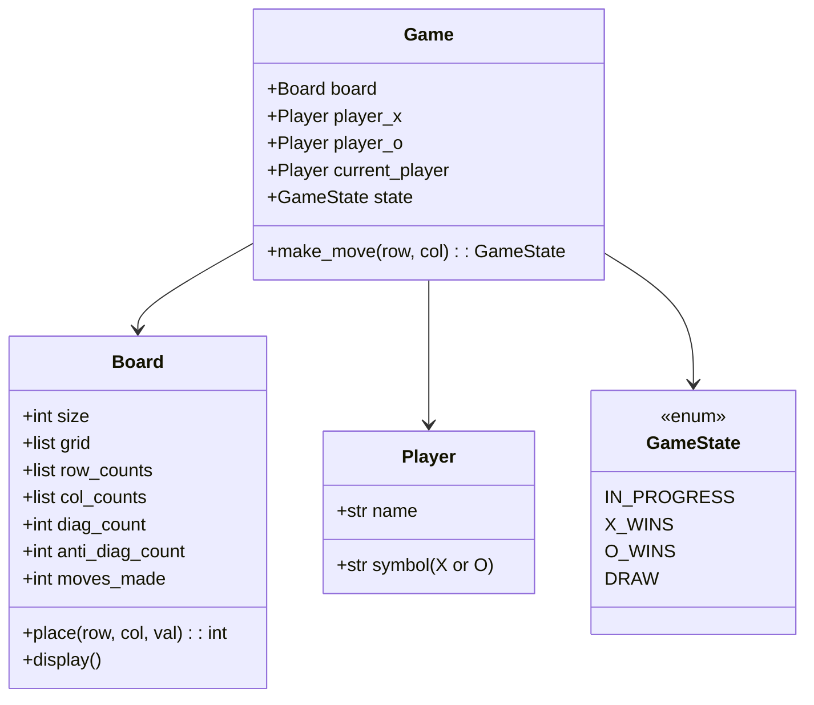

# ❌⭕ TIC TAC TOE — Complete LLD Guide
## The Definitive 17-Section Edition — V2.0

---

## 📖 Table of Contents
1. [🎯 Problem Statement & Context](#-1-problem-statement--context)
2. [🗣️ Requirement Gathering](#-2-requirement-gathering)
3. [✅ Requirements (FR + NFR)](#-3-requirements)
4. [🧠 Key Insight: O(1) Win Check with Row/Col/Diagonal Counters](#-4-key-insight)
5. [📐 Class Diagram & Entity Relationships](#-5-class-diagram)
6. [🔧 API Design (Public Interface)](#-6-api-design)
7. [🏗️ Complete Code Implementation](#-7-complete-code)
8. [📊 Data Structure Choices & Trade-offs](#-8-data-structure-choices)
9. [🔒 Concurrency & Thread Safety Deep Dive](#-9-concurrency-deep-dive)
10. [🧪 SOLID Principles Mapping](#-10-solid-principles)
11. [🎨 Design Patterns Used](#-11-design-patterns)
12. [💾 Database Schema (Production View)](#-12-database-schema)
13. [⚠️ Edge Cases & Error Handling](#-13-edge-cases)
14. [🎮 Full Working Demo](#-14-full-working-demo)
15. [🎤 Interviewer Follow-ups (15+)](#-15-interviewer-follow-ups)
16. [⏱️ Interview Strategy (45-min Plan)](#-16-interview-strategy)
17. [🧠 Quick Recall Cheat Sheet](#-17-quick-recall)

---

# 🎯 1. Problem Statement & Context

## What You're Designing

> Design a **Tic Tac Toe** game where two players take turns placing their symbols (X and O) on an N×N grid. A player wins by completing an entire row, column, or diagonal with their symbol. If all cells are filled with no winner, it's a draw. Support **O(1) win checking** using counter-based detection, not brute-force grid scanning.

## Why Interviewers Love This Problem

| What They Test | How This Tests It |
|---------------|-------------------|
| **O(1) win detection** ⭐ | Counter-based: track row/col/diagonal sums instead of scanning |
| **Clean game loop** | Turn alternation, move validation, state management |
| **NxN generalization** | Not just 3×3 — your solution must work for any board size |
| **Input validation** | Out of bounds, occupied cell, game already over |
| **State management** | IN_PROGRESS, X_WINS, O_WINS, DRAW |

---

# 🗣️ 2. Requirement Gathering

## Must-Ask Questions

| # | Question | WHY You Ask | Design Impact |
|---|----------|-------------|---------------|
| 1 | "Standard 3×3 or variable NxN?" | **Generalization** | N as constructor parameter. Win = fill entire row/col/diag |
| 2 | "Just two players?" | Player count | Always 2. X goes first |
| 3 | "How to detect win — scan or O(1)?" | **THE key algorithm** | Counter-based: O(1) per move vs O(N) per scan |
| 4 | "Draw condition?" | Game over check | All N² cells filled + no winner = DRAW |
| 5 | "Undo move?" | Extension | Pop last move, restore counters. Extension for interview |
| 6 | "AI opponent?" | Extension | Minimax algorithm. Mention for bonus |

### 🎯 THE answer that impresses interviewers

> "Instead of scanning the row, column, and diagonals after every move — which is O(N) — I can track a counter per row, per column, and per diagonal. X adds +1, O adds -1. When any counter reaches +N or -N, that player wins. This makes win detection **O(1)** per move."

---

# ✅ 3. Requirements

## Functional Requirements

| Priority | ID | Requirement | Complexity |
|----------|-----|-------------|-----------|
| **P0** | FR-1 | **NxN board** with configurable size | Low |
| **P0** | FR-2 | **Two players** (X always first, alternate turns) | Low |
| **P0** | FR-3 | **Place symbol** at (row, col) with validation | Medium |
| **P0** | FR-4 | **O(1) win detection** using counters | High |
| **P0** | FR-5 | **Draw detection** (all cells filled, no winner) | Low |
| **P0** | FR-6 | **Move validation** (bounds, occupied, game over) | Medium |
| **P1** | FR-7 | Board display (visual grid) | Low |
| **P2** | FR-8 | Undo move | Medium |

---

# 🧠 4. Key Insight: O(1) Win Detection with Counters

## 🤔 THINK: How do you check if a player just won WITHOUT scanning the entire row?

<details>
<summary>👀 Click to reveal — The brilliant counter trick</summary>

### The Naive Approach: O(N) Scan After Each Move

```python
# ❌ After placing at (row, col), check:
# 1. Scan entire row → O(N)
# 2. Scan entire col → O(N)
# 3. Scan main diagonal → O(N)
# 4. Scan anti-diagonal → O(N)
# Total: O(N) per move

def check_win_naive(board, row, col, player, n):
    # Check row
    if all(board[row][c] == player for c in range(n)):  # O(N)
        return True
    # Check col
    if all(board[r][col] == player for r in range(n)):  # O(N)
        return True
    # Check diagonals...  O(N) each
```

### The O(1) Approach: Counter-Based Detection ⭐

```python
"""
INSIGHT: Instead of scanning, maintain RUNNING COUNTERS.

  X adds +1 to counter
  O adds -1 to counter

  When counter == +N → X wins!
  When counter == -N → O wins!

Counters needed:
  - row_counts[N]    → one counter per row
  - col_counts[N]    → one counter per column
  - diag_count       → main diagonal (row == col)
  - anti_diag_count  → anti-diagonal (row + col == N-1)
"""

# TRACE: 3×3 board, X places markers

# X at (0,0): row_counts[0] = +1, col_counts[0] = +1, diag = +1
# O at (1,1): row_counts[1] = -1, col_counts[1] = -1, diag = -1+0 = 0
# X at (0,1): row_counts[0] = +2, col_counts[1] = 0
# O at (2,0): row_counts[2] = -1, col_counts[0] = 0, anti_diag = -1
# X at (0,2): row_counts[0] = +3 == +N → X WINS! (completed row 0)

#  Board:          Counters after X wins:
#  X | X | X       row_counts = [+3, -1, -1]  ← row 0 = +3 = WIN!
#  ─────────       col_counts = [0, 0, 0]
#    | O |          diag = 0
#  ─────────       anti_diag = -1
#  O |   |
```

### When Is a Cell on a Diagonal?

```
Main diagonal:     row == col
Anti-diagonal:     row + col == N - 1

3×3 example:
  (0,0)  (0,1)  (0,2)
  (1,0)  (1,1)  (1,2)
  (2,0)  (2,1)  (2,2)

Main diagonal:  (0,0), (1,1), (2,2) → row == col ✅
Anti-diagonal:  (0,2), (1,1), (2,0) → row + col == 2 (N-1) ✅
Center (1,1):   on BOTH diagonals!
```

### Why This is O(1)

```
Per move:
1. Update row_counts[row] → O(1)
2. Update col_counts[col] → O(1)
3. If on main diagonal: update diag → O(1)
4. If on anti-diagonal: update anti_diag → O(1)
5. Check if any counter == ±N → O(1)

Total: O(1) per move! ✅
(vs O(N) for scanning approach)
```

</details>

---

# 📐 5. Class Diagram & Entity Relationships



---

# 🔧 6. API Design (Public Interface)

```python
class Game:
    """
    Tic Tac Toe Game API.
    
    Primary: make_move(row, col) → GameState
    Query: current_player, state, is_over
    Display: display_board()
    Extension: undo()
    """
    def make_move(self, row: int, col: int) -> 'GameState':
        """Place current player's symbol. Returns updated game state."""
    def display_board(self) -> None: ...
    def undo(self) -> bool: ...
    
    @property
    def is_over(self) -> bool: ...
    @property
    def current_player(self) -> 'Player': ...
    @property
    def winner(self) -> 'Player': ...
```

---

# 🏗️ 7. Complete Code Implementation

## Enums & Player

```python
from enum import Enum

class GameState(Enum):
    IN_PROGRESS = "IN_PROGRESS"
    X_WINS = "X_WINS"
    O_WINS = "O_WINS"
    DRAW = "DRAW"

class Player:
    def __init__(self, name: str, symbol: str):
        self.name = name
        self.symbol = symbol  # "X" or "O"
    
    def __str__(self):
        return f"{self.symbol} ({self.name})"
```

## Board with O(1) Win Detection

```python
class Board:
    """
    NxN board with O(1) win detection using counters.
    
    Counter system:
    - row_counts[i]: sum of values in row i
    - col_counts[j]: sum of values in column j
    - diag_count: sum on main diagonal (r == c)
    - anti_diag_count: sum on anti-diagonal (r + c == N-1)
    
    X = +1, O = -1
    Win: any counter reaches +N (X wins) or -N (O wins)
    """
    def __init__(self, size: int = 3):
        self.size = size
        self.grid = [[" " for _ in range(size)] for _ in range(size)]
        
        # O(1) win detection counters
        self.row_counts = [0] * size
        self.col_counts = [0] * size
        self.diag_count = 0
        self.anti_diag_count = 0
        
        self.moves_made = 0
        self.move_history: list[tuple] = []  # (row, col, symbol, val)
    
    def is_valid_move(self, row: int, col: int) -> bool:
        if row < 0 or row >= self.size or col < 0 or col >= self.size:
            return False
        return self.grid[row][col] == " "
    
    def place(self, row: int, col: int, symbol: str) -> int:
        """
        Place symbol at (row, col). Update counters.
        Returns: 0 = no winner, +N = X wins, -N = O wins.
        
        The counter value approach:
        X contributes +1 to each counter it touches
        O contributes -1 to each counter it touches
        """
        val = 1 if symbol == "X" else -1
        self.grid[row][col] = symbol
        self.moves_made += 1
        self.move_history.append((row, col, symbol, val))
        
        # Update counters — O(1)!
        self.row_counts[row] += val
        self.col_counts[col] += val
        
        if row == col:  # Main diagonal
            self.diag_count += val
        if row + col == self.size - 1:  # Anti-diagonal
            self.anti_diag_count += val
        
        # Check win — O(1)!
        n = self.size
        if (abs(self.row_counts[row]) == n or
            abs(self.col_counts[col]) == n or
            abs(self.diag_count) == n or
            abs(self.anti_diag_count) == n):
            return val * n  # +N or -N (indicates winner)
        return 0  # No winner yet
    
    @property
    def is_full(self) -> bool:
        return self.moves_made == self.size * self.size
    
    def undo(self) -> tuple | None:
        """Undo last move. Reverse counter updates."""
        if not self.move_history:
            return None
        row, col, symbol, val = self.move_history.pop()
        self.grid[row][col] = " "
        self.moves_made -= 1
        
        self.row_counts[row] -= val
        self.col_counts[col] -= val
        if row == col:
            self.diag_count -= val
        if row + col == self.size - 1:
            self.anti_diag_count -= val
        
        return (row, col, symbol)
    
    def display(self):
        print()
        n = self.size
        for i in range(n):
            row_str = " | ".join(f" {self.grid[i][j]} " for j in range(n))
            print(f"   {row_str}")
            if i < n - 1:
                print(f"   {'─────┼' * (n-1)}─────")
        print()
```

## Game — Turn-Based Logic

```python
class Game:
    """
    Tic Tac Toe game orchestrator.
    
    Turn flow:
    1. Validate move (bounds, occupied, game not over)
    2. Place on board → get counter result
    3. Check result: win or draw
    4. Switch player
    
    O(1) per move for win detection — counters, not scanning!
    """
    def __init__(self, player1_name="Player 1", player2_name="Player 2",
                 board_size=3):
        self.board = Board(board_size)
        self.player_x = Player(player1_name, "X")
        self.player_o = Player(player2_name, "O")
        self._current = self.player_x  # X always goes first
        self.state = GameState.IN_PROGRESS
        self._winner: Player = None
    
    @property
    def current_player(self) -> Player:
        return self._current
    
    @property
    def is_over(self) -> bool:
        return self.state != GameState.IN_PROGRESS
    
    @property
    def winner(self) -> Player | None:
        return self._winner
    
    def make_move(self, row: int, col: int) -> GameState:
        """
        Make a move for the current player.
        
        Returns GameState: IN_PROGRESS, X_WINS, O_WINS, or DRAW.
        """
        # Validate game state
        if self.is_over:
            print(f"   ❌ Game is already over! ({self.state.value})")
            return self.state
        
        # Validate move
        if not self.board.is_valid_move(row, col):
            if row < 0 or row >= self.board.size or col < 0 or col >= self.board.size:
                print(f"   ❌ ({row},{col}) is out of bounds!")
            else:
                print(f"   ❌ ({row},{col}) is already occupied!")
            return self.state
        
        # Place and check result
        result = self.board.place(row, col, self._current.symbol)
        
        if result != 0:
            # Winner!
            self._winner = self._current
            self.state = GameState.X_WINS if self._current.symbol == "X" else GameState.O_WINS
            print(f"   🎲 {self._current} places at ({row},{col})")
            print(f"   🏆 {self._current.name} ({self._current.symbol}) WINS!")
        elif self.board.is_full:
            # Draw
            self.state = GameState.DRAW
            print(f"   🎲 {self._current} places at ({row},{col})")
            print(f"   🤝 DRAW! Board is full.")
        else:
            print(f"   🎲 {self._current} places at ({row},{col})")
            self._switch_player()
        
        return self.state
    
    def _switch_player(self):
        self._current = self.player_o if self._current == self.player_x else self.player_x
    
    def undo(self) -> bool:
        """Undo last move. Reverse board + switch player back."""
        if self.is_over:
            # Allow undo from game-over state
            self.state = GameState.IN_PROGRESS
            self._winner = None
        
        result = self.board.undo()
        if result:
            self._switch_player()
            print(f"   ↩️ Undid move at ({result[0]},{result[1]})")
            return True
        return False
    
    def display_board(self):
        self.board.display()
        if not self.is_over:
            print(f"   Next: {self._current}")
```

---

# 📊 8. Data Structure Choices & Trade-offs

| Data Structure | Where | Why | Alternative | Why Not |
|---------------|-------|-----|-------------|---------|
| `list[list[str]]` | Board.grid | Visual display. N×N. Direct (row,col) access | `dict[(r,c) → symbol]` | Grid is cleaner for display. Fixed size |
| `list[int]` (counters) | row_counts, col_counts | O(1) win check per row/col | Brute-force scan | O(N) per scan vs O(1) with counters |
| `int` | diag_count, anti_diag_count | Only 2 diagonals on any board | `list` | Just 2 values, not worth a list |
| `list[tuple]` | move_history | Undo support. Ordered. Last-in-first-out | `stack` | Python list with append/pop IS a stack |

### The Counter Math — Why +1/-1?

```python
# X = +1, O = -1. Sum of counter tells us:
# +N = all X → X wins!
# -N = all O → O wins!
# Anything else = mixed or incomplete

# Example: row_counts[0] for 3×3
# X, X, X → 1+1+1 = +3 = +N → X wins row 0!
# X, O, X → 1+(-1)+1 = +1 → no winner
# O, O, O → (-1)+(-1)+(-1) = -3 = -N → O wins row 0!
```

---

# 🔒 9. Concurrency & Thread Safety Deep Dive

## When Does Concurrency Matter?

Tic Tac Toe is **strictly turn-based** — only one player moves at a time. No concurrency in core game logic.

### Online Multiplayer: Where Concurrency Appears

```
Player A sends move (0,0) from their client
Player B sends move (1,1) from their client simultaneously

Server must:
1. Validate it's the sender's turn
2. Process move atomically (check empty + place + counter update)
3. Reject out-of-turn requests
```

```python
import threading

class OnlineGame:
    def __init__(self):
        self.game = Game()
        self._lock = threading.Lock()
    
    def handle_move(self, player_symbol, row, col):
        with self._lock:
            if self.game.current_player.symbol != player_symbol:
                return {"error": "Not your turn!"}
            state = self.game.make_move(row, col)
            return {"state": state.value, "board": self.get_board_state()}
```

---

# 🧪 10. SOLID Principles Mapping

| Principle | Where Applied | Explanation |
|-----------|--------------|-------------|
| **S** | Board = grid + counters. Game = turns + rules. Player = identity | Board doesn't know about turns. Game doesn't know about counter math |
| **O** | (Extension) Board size configurable | 3×3, 4×4, 5×5 — same code, different N. Zero code change |
| **L** | Player X and O are interchangeable | Game logic treats both identically (just +1/-1 difference) |
| **I** | Minimal API | make_move() is the only mutation. Clean interface |
| **D** | Game → Board (via place()) | Game doesn't directly manipulate grid or counters |

---

# 🎨 11. Design Patterns Used

| Pattern | Where | Why |
|---------|-------|-----|
| **State** | (Extension) GameState enum | Governs allowed actions (can't move if game over) |
| **Command** | (Extension) MoveCommand for undo | Each move = command object. Undo = reverse command |
| **Strategy** | (Extension) AI player types | RandomAI, MinimaxAI — different move selection strategies |
| **Observer** | (Extension) UI updates | Move → notify UI components to refresh display |

### Cross-Problem Win Detection Comparison

| Game | Grid | Win Condition | Detection | Complexity |
|------|------|---------------|-----------|-----------|
| **Tic Tac Toe** | NxN | Complete row/col/diag | Counter-based | **O(1)** per move ⭐ |
| **Connect Four** | 6×7 | 4 in a row (any direction) | Scan from last drop | O(4 × directions) |
| **Chess** | 8×8 | Checkmate | Simulate all moves | O(pieces × moves) |

---

# 💾 12. Database Schema (Production View)

```sql
CREATE TABLE games (
    game_id     VARCHAR(20) PRIMARY KEY,
    board_size  INTEGER DEFAULT 3,
    player_x    VARCHAR(50),
    player_o    VARCHAR(50),
    state       VARCHAR(20) DEFAULT 'IN_PROGRESS',
    winner      VARCHAR(1),
    created_at  TIMESTAMP DEFAULT NOW()
);

CREATE TABLE moves (
    game_id     VARCHAR(20) REFERENCES games(game_id),
    move_number INTEGER,
    row_idx     INTEGER,
    col_idx     INTEGER,
    symbol      VARCHAR(1),
    PRIMARY KEY (game_id, move_number)
);

-- Replay: rebuild board from moves
SELECT * FROM moves WHERE game_id = 'G001' ORDER BY move_number;
```

---

# ⚠️ 13. Edge Cases & Error Handling

| # | Edge Case | Fix |
|---|-----------|-----|
| 1 | **Move on occupied cell** | `grid[r][c] != " "` → reject |
| 2 | **Out of bounds** | `r < 0 or r >= N or c < 0 or c >= N` → reject |
| 3 | **Move after game over** | Check `self.is_over` before processing |
| 4 | **Center cell: on BOTH diagonals** | `(1,1)` on 3×3: update BOTH diag_count AND anti_diag_count |
| 5 | **Draw: full board, no winner** | `moves_made == N² and result == 0` → DRAW |
| 6 | **Win on last move (also could be draw)** | Check win BEFORE checking draw. Win takes priority |
| 7 | **1×1 board** | First move always wins. Trivial but valid |
| 8 | **Undo from game-over** | Reset state to IN_PROGRESS, reverse counter |
| 9 | **Undo with empty history** | Return None/False. No-op |
| 10 | **NxN where N is even: no true center** | Anti-diagonal still works: `row + col == N-1` |

---

# 🎮 14. Full Working Demo

```python
if __name__ == "__main__":
    print("=" * 65)
    print("     ❌⭕ TIC TAC TOE — COMPLETE DEMO")
    print("=" * 65)
    
    # ─── Test 1: X wins by row ───
    print("\n─── Test 1: X Wins by Row 0 ───")
    g1 = Game("Alice", "Bob", 3)
    g1.make_move(0, 0)  # X
    g1.make_move(1, 0)  # O
    g1.make_move(0, 1)  # X
    g1.make_move(1, 1)  # O
    g1.make_move(0, 2)  # X → row 0 complete!
    g1.display_board()
    
    # ─── Test 2: O wins by column ───
    print("─── Test 2: O Wins by Column 1 ───")
    g2 = Game("Alice", "Bob", 3)
    g2.make_move(0, 0)  # X
    g2.make_move(0, 1)  # O
    g2.make_move(1, 0)  # X
    g2.make_move(1, 1)  # O
    g2.make_move(2, 2)  # X
    g2.make_move(2, 1)  # O → col 1 complete!
    g2.display_board()
    
    # ─── Test 3: X wins by diagonal ───
    print("─── Test 3: X Wins by Main Diagonal ───")
    g3 = Game("Alice", "Bob", 3)
    g3.make_move(0, 0)  # X
    g3.make_move(0, 1)  # O
    g3.make_move(1, 1)  # X
    g3.make_move(0, 2)  # O
    g3.make_move(2, 2)  # X → diagonal!
    g3.display_board()
    
    # ─── Test 4: Draw ───
    print("─── Test 4: Draw ───")
    g4 = Game("Alice", "Bob", 3)
    moves = [(0,0),(0,1),(0,2),(1,0),(1,1),(2,0),(1,2),(2,2),(2,1)]
    for r, c in moves:
        g4.make_move(r, c)
    g4.display_board()
    
    # ─── Test 5: Invalid moves ───
    print("─── Test 5: Invalid Moves ───")
    g5 = Game("Alice", "Bob", 3)
    g5.make_move(0, 0)  # Valid
    g5.make_move(0, 0)  # Occupied!
    g5.make_move(5, 5)  # Out of bounds!
    
    # ─── Test 6: Move after game over ───
    print("\n─── Test 6: Move After Game Over ───")
    g1.make_move(2, 2)  # Game already over!
    
    # ─── Test 7: Undo ───
    print("\n─── Test 7: Undo ───")
    g7 = Game("Alice", "Bob", 3)
    g7.make_move(0, 0)
    g7.make_move(1, 1)
    g7.display_board()
    g7.undo()
    g7.display_board()
    
    # ─── Test 8: 4×4 board ───
    print("─── Test 8: 4×4 Board — X wins diagonal ───")
    g8 = Game("Alice", "Bob", 4)
    for i in range(4):
        g8.make_move(i, i)         # X on diagonal
        if not g8.is_over and i < 3:
            g8.make_move(i, 3-i)   # O on anti-diagonal (won't fill before X)
    g8.display_board()
    
    print(f"\n{'='*65}")
    print("     ✅ ALL 8 TESTS COMPLETE!")
    print(f"{'='*65}")
```

---

# 🎤 15. Interviewer Follow-ups (15+)

| Q | Question | Key Answer |
|---|----------|-----------|
| 1 | "Why O(1) not O(N) win check?" | Counters: +1 for X, -1 for O. abs(counter)==N means all same. No scan needed |
| 2 | "How do counters work?" | row_counts[i], col_counts[j], diag, anti_diag. Update on each move. Check if abs==N |
| 3 | "Center cell — both diagonals?" | Yes! (1,1) on 3×3 updates BOTH diag_count and anti_diag_count |
| 4 | "NxN generalization?" | Same code. Counter reaches ±N for any board size |
| 5 | "How to implement undo?" | Pop move_history. Subtract val from all counters. Reset grid cell |
| 6 | "AI opponent?" | Minimax: score all possible future states. O(b^d) where b=branching, d=depth. Alpha-beta pruning |
| 7 | "Connect Four?" | Similar counters but 4 directions (horizontal, vertical, 2 diagonals). Check from last-dropped piece |
| 8 | "Online multiplayer?" | Server validates turn order. Lock on game state. WebSocket for real-time |
| 9 | "Can you do O(1) with just grid scanning?" | No — scanning entire row/col is O(N). Counters are the only O(1) way |
| 10 | "Draw: when can you detect early?" | After N×2-1 moves if it's impossible for either player to complete a line |
| 11 | "Why +1/-1 not separate X/O counters?" | One counter captures both: +N means all X, -N means all O. Simpler. Less memory |
| 12 | "Board as 1D array?" | Cell = row × N + col. Same logic, different indexing. Common in competitive programming |
| 13 | "What if N=1?" | First move always wins. Trivial edge case |
| 14 | "Time + space complexity?" | Time: O(1) per move. Space: O(N) for counters + O(N²) for grid |
| 15 | "Could this work for 3D tic-tac-toe?" | Extend: N³ cells. Counters for rows, cols, pillars, and 4 space diagonals |

---

# ⏱️ 16. Interview Strategy (45-min Plan)

| Time | Phase | What You Do |
|------|-------|-------------|
| **0–3** | Clarify | NxN, O(1) win check, draw |
| **3–8** | Key Insight | Draw counters: X=+1, O=-1. abs(counter)==N = win. Trace an example |
| **8–12** | Class Diagram | Player, Board (grid + counters), Game (turns + state) |
| **12–25** | Code | Board.place() with counter updates, Board.display(), Game.make_move() with validation |
| **25–35** | Demo | Row win, column win, diagonal win, draw, invalid moves |
| **35–40** | Edge Cases | Center on both diags, undo, move after game over |
| **40–45** | Extensions | AI (Minimax), undo, NxN, online multiplayer |

## Golden Sentences

> **Opening:** "I'll use counter-based O(1) win detection. Each row, column, and diagonal has a running counter. X adds +1, O adds -1. When any counter's absolute value equals N, that player wins."

> **Why counters work:** "Instead of scanning N cells after every move, I update 2–4 counters in O(1). A counter reaching ±N means all cells in that line belong to one player."

> **Diagonal check:** "A cell (r,c) is on the main diagonal if r==c, and on the anti-diagonal if r+c==N-1. Center cell might be on BOTH."

---

# 🧠 17. Quick Recall Cheat Sheet

## ⏱️ 30-Second Recall

> **O(1) win detection:** `row_counts[N]`, `col_counts[N]`, `diag_count`, `anti_diag_count`. X=+1, O=-1. `abs(counter)==N` → win! **Move:** validate → place → update counters → check win → check draw → switch player. Grid = `list[list[str]]`.

## ⏱️ 2-Minute Recall

Add:
> **Board.place(row, col, symbol):** val = +1 or -1. Update: row_counts[row] += val, col_counts[col] += val. If row==col: diag += val. If row+col==N-1: anti_diag += val. Check `abs` of all four.
> **Game:** player_x always first. make_move validates bounds + occupied + game over. Returns GameState enum.
> **Undo:** Pop history, subtract val from counters, clear grid cell.

## ⏱️ 5-Minute Recall

Add:
> **Edge cases:** Center on BOTH diags, 1×1 board (instant win), win on last move (win > draw priority), move after game over (reject).
> **NxN:** Same code. Counter threshold = N. Works for any size.
> **Complexity:** O(1) per move (time), O(N) counters + O(N²) grid (space).
> **AI:** Minimax explores game tree. Alpha-beta pruning prunes losing branches. O(b^d).
> **Compare:** Snake&Ladders (1D, luck), TicTacToe (2D, strategy, small), Chess (2D, deep strategy).

---

## ✅ Pre-Implementation Checklist

- [ ] **GameState** enum (IN_PROGRESS, X_WINS, O_WINS, DRAW)
- [ ] **Player** (name, symbol: "X"/"O")
- [ ] **Board** (size, grid[][], row_counts[], col_counts[], diag_count, anti_diag_count, moves_made)
- [ ] **Board.place()** — update grid + all counters + return ±N if win
- [ ] **Board.is_valid_move()** — bounds + occupied check
- [ ] **Board.display()** — visual grid with separators
- [ ] **Board.undo()** — pop history, reverse counter updates
- [ ] **Game** (board, players, current, state, _switch_player)
- [ ] **Game.make_move()** — validate → place → check win → check draw → switch
- [ ] **Demo:** row win, col win, diagonal win, draw, invalid moves, undo

---

*Version 2.0 — The Definitive 17-Section Edition (Gold Standard)*
