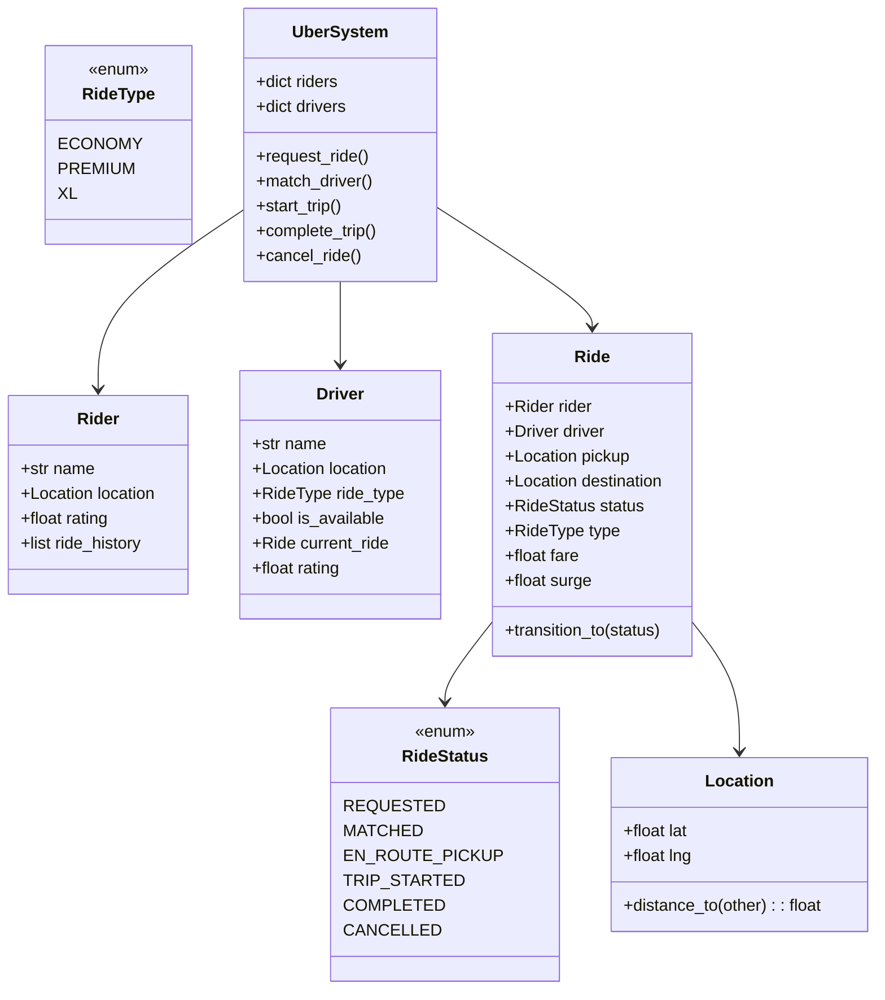

# 🚗 UBER / RIDE-SHARING — Complete LLD Guide
## The Definitive 17-Section Edition — V2.0

---

## 📖 Table of Contents
1. [🎯 Problem Statement & Context](#-1-problem-statement--context)
2. [🗣️ Requirement Gathering](#-2-requirement-gathering)
3. [✅ Requirements (FR + NFR)](#-3-requirements)
4. [🧠 Key Insight: Ride State Machine + Driver Matching + Dynamic Pricing](#-4-key-insight)
5. [📐 Class Diagram & Entity Relationships](#-5-class-diagram)
6. [🔧 API Design (Public Interface)](#-6-api-design)
7. [🏗️ Complete Code Implementation](#-7-complete-code)
8. [📊 Data Structure Choices & Trade-offs](#-8-data-structure-choices)
9. [🔒 Concurrency & Thread Safety Deep Dive](#-9-concurrency-deep-dive)
10. [🧪 SOLID Principles Mapping](#-10-solid-principles)
11. [🎨 Design Patterns Used](#-11-design-patterns)
12. [💾 Database Schema (Production View)](#-12-database-schema)
13. [⚠️ Edge Cases & Error Handling](#-13-edge-cases)
14. [🎮 Full Working Demo](#-14-full-working-demo)
15. [🎤 Interviewer Follow-ups (15+)](#-15-interviewer-follow-ups)
16. [⏱️ Interview Strategy (45-min Plan)](#-16-interview-strategy)
17. [🧠 Quick Recall Cheat Sheet](#-17-quick-recall)

---

# 🎯 1. Problem Statement & Context

## What You're Designing

> Design an **Uber/Ola-like Ride-Sharing System** where riders request rides from their location to a destination, the system matches them with the **nearest available driver**, the driver accepts and navigates to pickup, completes the trip, and fare is calculated based on distance + time + surge pricing. The ride follows a strict state machine lifecycle: REQUESTED → MATCHED → EN_ROUTE_PICKUP → TRIP_STARTED → COMPLETED / CANCELLED.

## Real-World Context

| Metric | Real Uber |
|--------|-----------|
| Active drivers | 5M+ globally |
| Trips/day | 25M+ |
| Matching latency | <5 seconds |
| Surge multiplier | 1.0× – 5.0× |
| Ride types | UberX, Comfort, XL, Black, Pool |
| Driver radius | 5–10 km search radius |

## Why Interviewers Love This Problem

| What They Test | How This Tests It |
|---------------|-------------------|
| **Ride state machine** ⭐ | 5 states with strict transitions |
| **Driver matching** ⭐ | Nearest available driver — distance + availability |
| **Fare calculation** | Distance × rate + time × rate + surge multiplier |
| **Multi-actor system** | Rider, Driver, System — each has different operations |
| **Location handling** | lat/lng coordinates, distance calculation |
| **Concurrency** | Two riders request → same nearest driver |

---

# 🗣️ 2. Requirement Gathering

## Must-Ask Questions

| # | Question | WHY You Ask | Design Impact |
|---|----------|-------------|---------------|
| 1 | "Matching algorithm?" | **Core feature** | Nearest available driver within radius |
| 2 | "Ride types?" | Pricing tiers | ECONOMY, PREMIUM, XL — different base rates |
| 3 | "Surge pricing?" | Dynamic pricing | Multiplier based on demand/supply ratio |
| 4 | "Ride lifecycle?" | **State machine** | REQUESTED → MATCHED → EN_ROUTE → TRIP_STARTED → COMPLETED |
| 5 | "Who can cancel?" | Cancel rules | Rider: free before pickup. Driver: penalty after accept |
| 6 | "Driver acceptance?" | Auto vs manual | Auto-assign (our LLD) vs driver accepts/rejects |
| 7 | "ETA calculation?" | Distance/time | Distance ÷ avg_speed. Simple for LLD |
| 8 | "Payment?" | Strategy pattern | Cash, Card, Wallet — Strategy pattern |
| 9 | "Rating?" | Post-trip | Rider rates driver, driver rates rider. Bidirectional |
| 10 | "Ride sharing / pool?" | Extension | Match multiple riders going same direction |

### 🎯 THE design question that shows depth

> "This has the same multi-actor state machine as Food Delivery — Rider and Driver each trigger different transitions. The core pattern is: VALID_TRANSITIONS dict ensuring only legal state changes, with atomic driver assignment using a lock to prevent two riders getting the same driver."

---

# ✅ 3. Requirements

## Functional Requirements

| Priority | ID | Requirement | Complexity |
|----------|-----|-------------|-----------|
| **P0** | FR-1 | **Request ride** (pickup, destination, ride type) | Medium |
| **P0** | FR-2 | **Match nearest driver** within search radius | High |
| **P0** | FR-3 | **Ride state machine** with strict transitions | High |
| **P0** | FR-4 | **Fare calculation** (distance + time + surge) | Medium |
| **P0** | FR-5 | **Driver lifecycle** (available, on_trip, offline) | Medium |
| **P1** | FR-6 | **Cancel ride** (rider and driver, with rules) | Medium |
| **P1** | FR-7 | **Rating system** (bidirectional) | Low |
| **P1** | FR-8 | **Ride history** for rider and driver | Low |
| **P2** | FR-9 | **Surge pricing** based on demand | Medium |
| **P2** | FR-10 | **Multiple ride types** (Economy, Premium) | Low |

---

# 🧠 4. Key Insight: Ride State Machine + Nearest Driver

## 🤔 THINK: Rider requests a ride. How does the system find the right driver and manage the entire trip lifecycle?

<details>
<summary>👀 Click to reveal — The ride lifecycle and matching algorithm</summary>

### Ride State Machine (Draw This First!)

```
REQUESTED ──match driver──→ MATCHED ──driver arrives──→ EN_ROUTE_PICKUP
     │                        │                              │
     │ cancel                 │ cancel (penalty)             │
     ↓                        ↓                              │
  CANCELLED              CANCELLED                           │
                                                             │
     ┌──────────────────── start trip ──────────────────────┘
     ↓
TRIP_STARTED ──arrive at destination──→ COMPLETED
     │                                      │
     │                                      ↓
     └──────────────────────────→ Rate + Pay + History
```

```python
VALID_TRANSITIONS = {
    RideStatus.REQUESTED:       {RideStatus.MATCHED, RideStatus.CANCELLED},
    RideStatus.MATCHED:         {RideStatus.EN_ROUTE_PICKUP, RideStatus.CANCELLED},
    RideStatus.EN_ROUTE_PICKUP: {RideStatus.TRIP_STARTED, RideStatus.CANCELLED},
    RideStatus.TRIP_STARTED:    {RideStatus.COMPLETED},
    RideStatus.COMPLETED:       set(),  # Terminal
    RideStatus.CANCELLED:       set(),  # Terminal
}
```

### Driver Matching: Nearest Available

```
Rider at (12.97, 77.59) requests ECONOMY ride.

Available drivers:
  Driver A: (12.98, 77.60) → 1.4 km ← NEAREST!
  Driver B: (12.95, 77.55) → 4.8 km
  Driver C: (12.99, 77.62) → 3.7 km (but PREMIUM only)
  Driver D: on_trip (not available)

Algorithm:
1. Filter: available + correct ride type
2. Sort by distance to pickup
3. Assign NEAREST

CRITICAL: Must be ATOMIC — two riders requesting simultaneously
could both select Driver A!
```

### Fare Calculation

```python
def calculate_fare(distance_km, duration_min, ride_type, surge):
    """
    Fare = (base_fare + distance × per_km + duration × per_min) × surge
    
    ECONOMY:  base=50, per_km=10, per_min=2
    PREMIUM:  base=100, per_km=15, per_min=3
    
    Example: 8 km, 20 min, ECONOMY, surge=1.5×
    Fare = (50 + 8×10 + 20×2) × 1.5
         = (50 + 80 + 40) × 1.5
         = 170 × 1.5
         = ₹255
    """
```

### Uber vs Food Delivery: Same Pattern, Different Actors

| Aspect | Uber | Food Delivery |
|--------|------|---------------|
| **Actors** | Rider, Driver | Customer, Restaurant, Driver |
| **State machine** | 5 states (ride lifecycle) | 7 states (order lifecycle) |
| **Matching** | Nearest driver to RIDER | Nearest driver to RESTAURANT |
| **Pricing** | Distance + time + surge | Menu price + delivery fee |
| **Core pattern** | VALID_TRANSITIONS + atomic assignment | Same! |

</details>

---

# 📐 5. Class Diagram & Entity Relationships



---

# 🔧 6. API Design (Public Interface)

```python
class UberSystem:
    """
    Uber API — maps to rider app actions and driver app actions.
    
    Rider actions: request_ride, cancel_ride, rate_driver
    Driver actions: go_online, go_offline, start_trip, complete_trip
    System actions: match_driver (automatic)
    """
    def request_ride(self, rider_id, pickup_lat, pickup_lng,
                     dest_lat, dest_lng, ride_type="ECONOMY") -> 'Ride': ...
    def cancel_ride(self, ride_id, cancelled_by) -> bool: ...
    def start_trip(self, ride_id) -> bool: ...
    def complete_trip(self, ride_id) -> float:
        """Returns fare amount."""
    def rate_ride(self, ride_id, rider_rating=None, driver_rating=None): ...
```

---

# 🏗️ 7. Complete Code Implementation

## Enums & Location

```python
from enum import Enum
from datetime import datetime
import math
import threading
import random

class RideStatus(Enum):
    REQUESTED = "REQUESTED"
    MATCHED = "MATCHED"
    EN_ROUTE_PICKUP = "EN_ROUTE_PICKUP"
    TRIP_STARTED = "TRIP_STARTED"
    COMPLETED = "COMPLETED"
    CANCELLED = "CANCELLED"

class RideType(Enum):
    ECONOMY = "ECONOMY"
    PREMIUM = "PREMIUM"
    XL = "XL"

VALID_TRANSITIONS = {
    RideStatus.REQUESTED:       {RideStatus.MATCHED, RideStatus.CANCELLED},
    RideStatus.MATCHED:         {RideStatus.EN_ROUTE_PICKUP, RideStatus.CANCELLED},
    RideStatus.EN_ROUTE_PICKUP: {RideStatus.TRIP_STARTED, RideStatus.CANCELLED},
    RideStatus.TRIP_STARTED:    {RideStatus.COMPLETED},
    RideStatus.COMPLETED:       set(),
    RideStatus.CANCELLED:       set(),
}

FARE_CONFIG = {
    RideType.ECONOMY: {"base": 50, "per_km": 10, "per_min": 2},
    RideType.PREMIUM: {"base": 100, "per_km": 15, "per_min": 3},
    RideType.XL:      {"base": 80, "per_km": 12, "per_min": 2.5},
}

class Location:
    """GPS coordinates with Haversine distance calculation."""
    def __init__(self, lat: float, lng: float):
        self.lat = lat
        self.lng = lng
    
    def distance_to(self, other: 'Location') -> float:
        """Haversine distance in km between two GPS points."""
        R = 6371  # Earth radius in km
        dlat = math.radians(other.lat - self.lat)
        dlng = math.radians(other.lng - self.lng)
        a = (math.sin(dlat/2)**2 +
             math.cos(math.radians(self.lat)) *
             math.cos(math.radians(other.lat)) *
             math.sin(dlng/2)**2)
        return R * 2 * math.atan2(math.sqrt(a), math.sqrt(1-a))
    
    def __str__(self):
        return f"({self.lat:.4f}, {self.lng:.4f})"
```

## Rider & Driver

```python
class Rider:
    _counter = 0
    def __init__(self, name: str, lat: float, lng: float):
        Rider._counter += 1
        self.rider_id = Rider._counter
        self.name = name
        self.location = Location(lat, lng)
        self.rating = 5.0
        self.total_ratings = 0
        self.ride_history: list['Ride'] = []
        self.current_ride: 'Ride' = None
    
    def update_rating(self, new_rating: float):
        self.total_ratings += 1
        self.rating = ((self.rating * (self.total_ratings - 1) + new_rating)
                       / self.total_ratings)
    
    def __str__(self):
        return f"🧑 {self.name} (⭐{self.rating:.1f})"


class Driver:
    _counter = 0
    def __init__(self, name: str, lat: float, lng: float,
                 ride_type: RideType = RideType.ECONOMY):
        Driver._counter += 1
        self.driver_id = Driver._counter
        self.name = name
        self.location = Location(lat, lng)
        self.ride_type = ride_type
        self.is_available = True
        self.is_online = True
        self.current_ride: 'Ride' = None
        self.rating = 5.0
        self.total_ratings = 0
        self.total_trips = 0
        self.total_earnings = 0.0
        self.ride_history: list['Ride'] = []
    
    def update_rating(self, new_rating: float):
        self.total_ratings += 1
        self.rating = ((self.rating * (self.total_ratings - 1) + new_rating)
                       / self.total_ratings)
    
    def __str__(self):
        status = "🟢 Online" if self.is_online else "🔴 Offline"
        avail = "Available" if self.is_available else "On Trip"
        return (f"🚗 {self.name} ({self.ride_type.value}) | "
                f"⭐{self.rating:.1f} | {status} | {avail}")
```

## Ride

```python
class Ride:
    """
    A single ride from pickup to destination.
    
    Follows strict state machine via VALID_TRANSITIONS.
    Fare calculated on completion: (base + dist×rate + time×rate) × surge.
    """
    _counter = 0
    def __init__(self, rider: Rider, pickup: Location, destination: Location,
                 ride_type: RideType, surge: float = 1.0):
        Ride._counter += 1
        self.ride_id = Ride._counter
        self.rider = rider
        self.driver: Driver = None
        self.pickup = pickup
        self.destination = destination
        self.ride_type = ride_type
        self.status = RideStatus.REQUESTED
        self.surge_multiplier = surge
        
        self.request_time = datetime.now()
        self.match_time: datetime = None
        self.trip_start_time: datetime = None
        self.trip_end_time: datetime = None
        self.fare: float = None
        
        self.rider_rating: float = None
        self.driver_rating: float = None
        
        self.status_history = [(RideStatus.REQUESTED, datetime.now())]
    
    def transition_to(self, new_status: RideStatus):
        """Strict state machine transition."""
        if new_status not in VALID_TRANSITIONS.get(self.status, set()):
            raise ValueError(
                f"Invalid transition: {self.status.value} → {new_status.value}. "
                f"Allowed: {[s.value for s in VALID_TRANSITIONS[self.status]]}"
            )
        self.status = new_status
        self.status_history.append((new_status, datetime.now()))
        
        if new_status == RideStatus.MATCHED:
            self.match_time = datetime.now()
        elif new_status == RideStatus.TRIP_STARTED:
            self.trip_start_time = datetime.now()
        elif new_status == RideStatus.COMPLETED:
            self.trip_end_time = datetime.now()
    
    @property
    def distance_km(self) -> float:
        return self.pickup.distance_to(self.destination)
    
    @property
    def estimated_duration_min(self) -> float:
        avg_speed_kmh = 25  # City average
        return (self.distance_km / avg_speed_kmh) * 60
    
    def calculate_fare(self) -> float:
        config = FARE_CONFIG[self.ride_type]
        base = config["base"]
        dist_charge = self.distance_km * config["per_km"]
        time_charge = self.estimated_duration_min * config["per_min"]
        self.fare = round((base + dist_charge + time_charge) * self.surge_multiplier, 2)
        return self.fare
    
    def __str__(self):
        driver_info = f" → Driver: {self.driver.name}" if self.driver else ""
        fare_info = f" | ₹{self.fare:.0f}" if self.fare else ""
        return (f"🚕 Ride #{self.ride_id}: {self.rider.name} | "
                f"{self.status.value} | {self.ride_type.value} | "
                f"{self.distance_km:.1f}km{driver_info}{fare_info}")
```

## The Uber System

```python
class UberSystem:
    """
    Central ride-hailing system.
    
    Key operations:
    1. request_ride: Create ride, auto-match nearest driver
    2. Driver transitions: en_route → start_trip → complete_trip
    3. cancel_ride: Rider or driver cancels
    4. Fare: calculated on completion with surge
    5. Rating: bidirectional after ride
    
    Threading: _driver_lock for atomic driver matching
    """
    _instance = None
    
    def __new__(cls):
        if cls._instance is None:
            cls._instance = super().__new__(cls)
            cls._instance._initialized = False
        return cls._instance
    
    def __init__(self):
        if self._initialized: return
        self._initialized = True
        self.riders: dict[int, Rider] = {}
        self.drivers: dict[int, Driver] = {}
        self.rides: dict[int, Ride] = {}
        self._driver_lock = threading.Lock()
        self._surge = 1.0  # Global surge multiplier
    
    def register_rider(self, name, lat, lng) -> Rider:
        rider = Rider(name, lat, lng)
        self.riders[rider.rider_id] = rider
        print(f"   ✅ Rider registered: {rider}")
        return rider
    
    def register_driver(self, name, lat, lng,
                        ride_type=RideType.ECONOMY) -> Driver:
        driver = Driver(name, lat, lng, ride_type)
        self.drivers[driver.driver_id] = driver
        print(f"   ✅ Driver registered: {driver}")
        return driver
    
    def set_surge(self, multiplier: float):
        self._surge = max(1.0, multiplier)
        print(f"   ⚡ Surge pricing: {self._surge:.1f}×")
    
    # ── Request Ride ──
    def request_ride(self, rider_id: int, dest_lat: float, dest_lng: float,
                     ride_type=RideType.ECONOMY) -> Ride | None:
        rider = self.riders.get(rider_id)
        if not rider:
            print("   ❌ Rider not found!"); return None
        if rider.current_ride:
            print("   ❌ Rider already has an active ride!"); return None
        
        destination = Location(dest_lat, dest_lng)
        ride = Ride(rider, rider.location, destination, ride_type, self._surge)
        self.rides[ride.ride_id] = ride
        rider.current_ride = ride
        
        print(f"   🔍 Ride #{ride.ride_id} requested: {rider.name} "
              f"→ {ride.distance_km:.1f} km ({ride_type.value})")
        
        if self._surge > 1.0:
            print(f"      ⚡ Surge: {self._surge:.1f}×")
        
        # Auto-match
        self._match_driver(ride)
        return ride
    
    def _match_driver(self, ride: Ride):
        """
        Find nearest available driver for this ride.
        Atomic: lock prevents two rides getting the same driver.
        """
        with self._driver_lock:
            best_driver = None
            best_distance = float('inf')
            
            for driver in self.drivers.values():
                if not driver.is_available or not driver.is_online:
                    continue
                if driver.current_ride is not None:
                    continue
                
                dist = driver.location.distance_to(ride.pickup)
                if dist < best_distance:
                    best_distance = dist
                    best_driver = driver
            
            if best_driver:
                ride.driver = best_driver
                best_driver.current_ride = ride
                best_driver.is_available = False
                ride.transition_to(RideStatus.MATCHED)
                
                eta = round(best_distance / 25 * 60, 1)  # minutes
                print(f"   ✅ Matched: {best_driver.name} "
                      f"({best_distance:.1f} km, ETA {eta} min)")
            else:
                print("   ⏳ No drivers available! Searching...")
    
    # ── Driver Actions ──
    def driver_en_route(self, ride_id: int) -> bool:
        ride = self.rides.get(ride_id)
        if not ride: return False
        ride.transition_to(RideStatus.EN_ROUTE_PICKUP)
        print(f"   🚗 Driver {ride.driver.name} en route to pickup")
        return True
    
    def start_trip(self, ride_id: int) -> bool:
        ride = self.rides.get(ride_id)
        if not ride: return False
        ride.transition_to(RideStatus.TRIP_STARTED)
        print(f"   🏁 Trip started: {ride.rider.name} → {ride.destination}")
        return True
    
    def complete_trip(self, ride_id: int) -> float:
        ride = self.rides.get(ride_id)
        if not ride: return 0
        
        ride.transition_to(RideStatus.COMPLETED)
        fare = ride.calculate_fare()
        
        # Release driver
        ride.driver.is_available = True
        ride.driver.current_ride = None
        ride.driver.total_trips += 1
        ride.driver.total_earnings += fare
        ride.driver.ride_history.append(ride)
        
        # Update rider
        ride.rider.current_ride = None
        ride.rider.ride_history.append(ride)
        
        config = FARE_CONFIG[ride.ride_type]
        print(f"   ✅ Trip completed!")
        print(f"      Distance: {ride.distance_km:.1f} km | "
              f"Est. time: {ride.estimated_duration_min:.0f} min")
        print(f"      Base: ₹{config['base']} + "
              f"Dist: ₹{ride.distance_km * config['per_km']:.0f} + "
              f"Time: ₹{ride.estimated_duration_min * config['per_min']:.0f}")
        if ride.surge_multiplier > 1:
            print(f"      Surge: {ride.surge_multiplier:.1f}×")
        print(f"      💰 Total fare: ₹{fare:.0f}")
        return fare
    
    # ── Cancel ──
    def cancel_ride(self, ride_id: int, cancelled_by: str) -> bool:
        ride = self.rides.get(ride_id)
        if not ride:
            print("   ❌ Ride not found!"); return False
        
        if ride.status in {RideStatus.COMPLETED, RideStatus.CANCELLED}:
            print("   ❌ Ride already finished!"); return False
        
        ride.transition_to(RideStatus.CANCELLED)
        
        # Release driver if assigned
        if ride.driver:
            ride.driver.is_available = True
            ride.driver.current_ride = None
        ride.rider.current_ride = None
        
        penalty = ""
        if ride.status == RideStatus.TRIP_STARTED:
            penalty = " (cancellation fee may apply)"
        
        print(f"   ❌ Ride #{ride_id} cancelled by {cancelled_by}{penalty}")
        return True
    
    # ── Rating ──
    def rate_ride(self, ride_id: int, rider_rating: float = None,
                  driver_rating: float = None):
        ride = self.rides.get(ride_id)
        if not ride or ride.status != RideStatus.COMPLETED:
            print("   ❌ Can only rate completed rides!"); return
        
        if driver_rating:
            ride.driver_rating = driver_rating
            ride.driver.update_rating(driver_rating)
            print(f"   ⭐ {ride.rider.name} rated driver "
                  f"{ride.driver.name}: {driver_rating}/5")
        
        if rider_rating:
            ride.rider_rating = rider_rating
            ride.rider.update_rating(rider_rating)
            print(f"   ⭐ {ride.driver.name} rated rider "
                  f"{ride.rider.name}: {rider_rating}/5")
    
    # ── Driver Online/Offline ──
    def go_offline(self, driver_id: int):
        driver = self.drivers.get(driver_id)
        if driver and driver.is_available:
            driver.is_online = False
            driver.is_available = False
            print(f"   🔴 {driver.name} went offline")
    
    def go_online(self, driver_id: int):
        driver = self.drivers.get(driver_id)
        if driver:
            driver.is_online = True
            driver.is_available = True
            print(f"   🟢 {driver.name} is online")
```

---

# 📊 8. Data Structure Choices & Trade-offs

| Data Structure | Where | Why | Alternative | Why Not |
|---------------|-------|-----|-------------|---------|
| `dict[int, Driver]` | System.drivers | O(1) lookup by ID | `list` | Need fast lookup by driver_id |
| `VALID_TRANSITIONS` dict | Ride state machine | O(1) validity check. Declarative, easy to read | if-elif chain | Hard to maintain. Not extensible |
| `FARE_CONFIG` dict | Fare parameters | OCP — new ride type = add entry. Zero code change | Hard-coded | Violates OCP |
| `list[tuple]` | Ride.status_history | Audit trail. Chronological state changes | No history | Need for debugging and analytics |
| `Location` object | Coordinates | Encapsulate lat/lng + distance calculation | Raw tuple | Behavior (distance_to) belongs with data |

### Why Not a Spatial Index for Driver Matching?

```python
# Our approach: scan all drivers O(D)
for driver in drivers.values():
    dist = driver.location.distance_to(ride.pickup)

# Production: spatial index
# - GeoHash: encode lat/lng → string. Nearby locations share prefix
# - R-Tree: spatial index for range queries  
# - Redis GEOSEARCH: built-in spatial query
# - Uber's H3: hexagonal hierarchical spatial index

# For LLD interview: linear scan is fine. Mention GeoHash/H3 for bonus.
```

---

# 🔒 9. Concurrency & Thread Safety Deep Dive

## The Same-Driver-Two-Riders Race

```
Timeline: Driver A is the nearest available for BOTH riders

t=0: Rider X → request_ride → scans → Driver A is nearest!
t=1: Rider Y → request_ride → scans → Driver A is nearest!
t=2: Rider X → assigns Driver A → ride matched!
t=3: Rider Y → assigns Driver A → 💀 DOUBLE ASSIGNMENT!
```

```python
# Fix: _driver_lock makes match atomic
def _match_driver(self, ride):
    with self._driver_lock:  # Only one ride matches at a time
        for driver in self.drivers.values():
            if not driver.is_available:  # Already assigned!
                continue
            ...
        best_driver.is_available = False  # Atomic with search
```

### Production: Per-Zone Locking

```
City divided into zones. Each zone has its own lock.
Zone A lock → matching in Zone A
Zone B lock → matching in Zone B (PARALLEL!)

Riders in different zones → parallel matching!
Riders in same zone → serialized (but same-zone = correct behavior)
```

---

# 🧪 10. SOLID Principles Mapping

| Principle | Where Applied | Explanation |
|-----------|--------------|-------------|
| **S** | Clear separation | Rider = identity. Driver = identity + availability. Ride = trip state. Location = coordinates + distance. System = orchestration |
| **O** | FARE_CONFIG + VALID_TRANSITIONS | New ride type (POOL) = add config entry. New state = add to transition dict |
| **L** | All ride types processed identically | request_ride, complete_trip work the same for ECONOMY and PREMIUM |
| **I** | Separate rider/driver operations | request_ride (rider), start_trip (driver), complete_trip (driver) |
| **D** | System → enums + config dicts | Not hard-coded pricing or transitions |

---

# 🎨 11. Design Patterns Used

| Pattern | Where | Why |
|---------|-------|-----|
| **State Machine** ⭐ | VALID_TRANSITIONS | Ride lifecycle with strict state transitions |
| **Strategy** | FARE_CONFIG | Different pricing per ride type |
| **Observer** | (Extension) Notifications | Ride matched → notify rider. Trip completed → send receipt |
| **Singleton** | UberSystem | One system per application |
| **Factory** | (Extension) RideFactory | Create rides with default config |

### Cross-Problem Multi-Actor Comparison

| System | Actors | State Machine | Matching |
|--------|--------|---------------|----------|
| **Uber** | Rider, Driver | 5 states (ride lifecycle) | Nearest driver to RIDER |
| **Food Delivery** | Customer, Restaurant, Driver | 7 states (order lifecycle) | Nearest driver to RESTAURANT |
| **Ambulance** | Patient, Dispatcher, Ambulance | 4 states | Nearest + equipped |

---

# 💾 12. Database Schema (Production View)

```sql
CREATE TABLE riders (
    rider_id    SERIAL PRIMARY KEY,
    name        VARCHAR(100),
    lat         DECIMAL(9,6),
    lng         DECIMAL(9,6),
    rating      DECIMAL(3,2) DEFAULT 5.0
);

CREATE TABLE drivers (
    driver_id   SERIAL PRIMARY KEY,
    name        VARCHAR(100),
    lat         DECIMAL(9,6),
    lng         DECIMAL(9,6),
    ride_type   VARCHAR(20),
    is_available BOOLEAN DEFAULT TRUE,
    is_online   BOOLEAN DEFAULT TRUE,
    rating      DECIMAL(3,2) DEFAULT 5.0,
    -- Spatial index for fast nearest-driver queries
    SPATIAL INDEX idx_location (lat, lng)
);

CREATE TABLE rides (
    ride_id     SERIAL PRIMARY KEY,
    rider_id    INTEGER REFERENCES riders(rider_id),
    driver_id   INTEGER REFERENCES drivers(driver_id),
    pickup_lat  DECIMAL(9,6),
    pickup_lng  DECIMAL(9,6),
    dest_lat    DECIMAL(9,6),
    dest_lng    DECIMAL(9,6),
    ride_type   VARCHAR(20),
    status      VARCHAR(20),
    surge       DECIMAL(3,2) DEFAULT 1.0,
    fare        DECIMAL(10,2),
    request_time TIMESTAMP,
    match_time  TIMESTAMP,
    start_time  TIMESTAMP,
    end_time    TIMESTAMP,
    rider_rating DECIMAL(2,1),
    driver_rating DECIMAL(2,1)
);

-- Find nearest available driver (with spatial index)
SELECT driver_id, name,
    ST_Distance_Sphere(POINT(lng, lat), POINT(77.59, 12.97)) / 1000 as dist_km
FROM drivers
WHERE is_available = TRUE AND is_online = TRUE AND ride_type = 'ECONOMY'
ORDER BY dist_km ASC
LIMIT 1
FOR UPDATE;  -- Lock row for atomic assignment!
```

---

# ⚠️ 13. Edge Cases & Error Handling

| # | Edge Case | Fix |
|---|-----------|-----|
| 1 | **No drivers available** | Return message. Retry with expanding radius |
| 2 | **Two riders request → same nearest driver** | _driver_lock: atomic match. Second rider gets next nearest |
| 3 | **Rider already has active ride** | Reject: "Already have an active ride!" |
| 4 | **Cancel after trip started** | By rider: cancellation fee. By driver: penalty on record |
| 5 | **Driver goes offline mid-ride** | Can't go offline during active ride. Reject offline request |
| 6 | **Invalid state transition** | VALID_TRANSITIONS raises ValueError |
| 7 | **Surge pricing edge: exactly 1.0** | Treat as no surge. Display no surge indicator |
| 8 | **Zero distance ride** | Minimum fare applies (base fare at least) |
| 9 | **Driver rating drops below 4.0** | (Extension) Deactivate driver. Quality control |
| 10 | **Payment failure** | Hold ride in COMPLETED but flag payment_failed |

---

# 🎮 14. Full Working Demo

```python
if __name__ == "__main__":
    UberSystem._instance = None
    
    print("=" * 65)
    print("     🚗 UBER / RIDE-SHARING — COMPLETE DEMO")
    print("=" * 65)
    
    uber = UberSystem()
    
    # Setup
    print("\n─── Setup: Register Riders & Drivers ───")
    r1 = uber.register_rider("Alice", 12.9716, 77.5946)
    r2 = uber.register_rider("Bob", 12.9352, 77.6245)
    
    d1 = uber.register_driver("Raju", 12.9750, 77.5960, RideType.ECONOMY)
    d2 = uber.register_driver("Suresh", 12.9400, 77.6300, RideType.ECONOMY)
    d3 = uber.register_driver("Vijay", 12.9800, 77.6000, RideType.PREMIUM)
    
    # Test 1: Request & Match
    print("\n─── Test 1: Alice Requests Ride ───")
    ride1 = uber.request_ride(r1.rider_id, 12.9352, 77.6245)
    
    # Test 2: Full ride lifecycle
    print("\n─── Test 2: Full Ride Lifecycle ───")
    uber.driver_en_route(ride1.ride_id)
    uber.start_trip(ride1.ride_id)
    fare1 = uber.complete_trip(ride1.ride_id)
    
    # Test 3: Rating
    print("\n─── Test 3: Rating ───")
    uber.rate_ride(ride1.ride_id, driver_rating=5, rider_rating=4)
    
    # Test 4: Bob requests ride (Raju now available again!)
    print("\n─── Test 4: Bob Requests Ride ───")
    ride2 = uber.request_ride(r2.rider_id, 13.0000, 77.6500)
    
    # Test 5: Surge pricing
    print("\n─── Test 5: Surge Pricing ───")
    uber.complete_trip(ride2.ride_id)  # Complete Bob's ride first
    uber.set_surge(1.5)
    ride3 = uber.request_ride(r1.rider_id, 12.9500, 77.6100)
    if ride3:
        uber.start_trip(ride3.ride_id)
        fare3 = uber.complete_trip(ride3.ride_id)
    uber.set_surge(1.0)  # Reset surge
    
    # Test 6: Cancel ride
    print("\n─── Test 6: Cancel Ride ───")
    ride4 = uber.request_ride(r2.rider_id, 13.0100, 77.6600)
    if ride4:
        uber.cancel_ride(ride4.ride_id, "Bob")
    
    # Test 7: No drivers available
    print("\n─── Test 7: No Drivers (all offline) ───")
    uber.go_offline(d1.driver_id)
    uber.go_offline(d2.driver_id)
    uber.go_offline(d3.driver_id)
    ride5 = uber.request_ride(r1.rider_id, 12.9500, 77.6100)
    
    # Test 8: Driver back online
    print("\n─── Test 8: Driver Back Online ───")
    uber.go_online(d1.driver_id)
    ride6 = uber.request_ride(r1.rider_id, 12.9500, 77.6100)
    if ride6:
        uber.start_trip(ride6.ride_id)
        uber.complete_trip(ride6.ride_id)
    
    # Final stats
    print("\n─── Final Stats ───")
    for d in [d1, d2, d3]:
        print(f"   {d} | Trips: {d.total_trips} | Earnings: ₹{d.total_earnings:.0f}")
    
    print(f"\n{'='*65}")
    print("     ✅ ALL 8 TESTS COMPLETE!")
    print(f"{'='*65}")
```

---

# 🎤 15. Interviewer Follow-ups (15+)

| Q | Question | Key Answer |
|---|----------|-----------|
| 1 | "Driver matching algorithm?" | Scan available, filter by type, sort by distance, pick nearest. Lock for atomicity |
| 2 | "Surge pricing?" | Demand/supply ratio. More requests than drivers → surge > 1.0. Multiplier on fare |
| 3 | "Fare calculation?" | (base + distance×rate + time×rate) × surge. Config dict per ride type (OCP) |
| 4 | "Race condition: two riders, one driver?" | _driver_lock: atomic find + assign. Second rider gets next nearest |
| 5 | "Ride pooling?" | Match riders going same direction. Split fare. Complex route optimization |
| 6 | "ETA calculation?" | distance / avg_speed. Production: Google Maps API with real-time traffic |
| 7 | "Driver acceptance flow?" | Send ride offer → driver has 15 seconds → accept/reject. If reject, offer to next nearest |
| 8 | "GeoHash / H3?" | Spatial indexing for fast nearest query. H3 = hexagonal grid. Uber uses H3 |
| 9 | "Payment strategy?" | Strategy pattern: Cash, Card, Wallet. Charge after complete_trip |
| 10 | "How does Uber handle millions of drivers?" | City partitioned into zones. Per-zone driver index. Spatial databases |
| 11 | "Cancel penalty?" | Free cancel before driver arrives. ₹50 fee if driver already en route |
| 12 | "Driver quality control?" | Rating < 4.2 → warning. < 4.0 → deactivation |
| 13 | "Scheduled rides?" | Future time. Match driver 10 min before. Priority queue by scheduled_time |
| 14 | "Multi-stop?" | Intermediate waypoints. Fare = total route distance regardless of stops |
| 15 | "Compare with Food Delivery?" | Same pattern: state machine + atomic driver assignment. Food has 3 actors, Uber has 2 |

---

# ⏱️ 16. Interview Strategy (45-min Plan)

| Time | Phase | What You Do |
|------|-------|-------------|
| **0–5** | Clarify | Matching, ride types, surge, cancellation |
| **5–10** | Key Insight | Draw state machine (5 states). VALID_TRANSITIONS dict. Compare with Food Delivery |
| **10–15** | Class Diagram | Location, Rider, Driver, Ride, UberSystem |
| **15–30** | Code | Ride (state machine), Driver matching (lock + nearest), fare calculation, complete_trip |
| **30–38** | Demo | Full lifecycle, surge ride, cancel, no drivers, rating |
| **38–45** | Extensions | GeoHash/H3, ride pooling, driver acceptance, scheduled rides |

## Golden Sentences

> **Opening:** "Uber is a multi-actor state machine with atomic driver assignment. Same pattern as Food Delivery but with 2 actors (Rider, Driver) instead of 3."

> **Matching:** "Scan available drivers, filter by ride type and online status, sort by distance to pickup, pick nearest. Lock for atomic find + assign."

> **Fare:** "Configurable via FARE_CONFIG dict. `(base + dist×per_km + time×per_min) × surge`. New ride type = add config entry (OCP)."

---

# 🧠 17. Quick Recall Cheat Sheet

## ⏱️ 30-Second Recall

> **5 states:** REQUESTED → MATCHED → EN_ROUTE_PICKUP → TRIP_STARTED → COMPLETED (or CANCELLED). **VALID_TRANSITIONS** dict. **Matching:** nearest available driver, atomic with _driver_lock. **Fare:** `(base + dist×rate + time×rate) × surge`. FARE_CONFIG per ride type. **Rating:** bidirectional rolling average.

## ⏱️ 2-Minute Recall

Add:
> **Entities:** Location (lat, lng, distance_to). Rider (name, location, current_ride). Driver (name, location, ride_type, is_available, is_online). Ride (rider, driver, pickup, dest, status, surge, fare).
> **Match flow:** lock → scan available + online → filter ride type → sort by distance → assign nearest → set unavailable.
> **Complete flow:** transition → calc fare → release driver (available=True) → update histories + earnings.
> **Cancel:** allowed from REQUESTED, MATCHED, EN_ROUTE. Release driver if assigned.

## ⏱️ 5-Minute Recall

Add:
> **SOLID:** OCP via FARE_CONFIG (new type = add entry) + VALID_TRANSITIONS (new state = add to dict). SRP per class.
> **Concurrency:** _driver_lock prevents double assignment. Production: per-zone locking for parallelism.
> **DB:** drivers table with SPATIAL INDEX. `SELECT ... ORDER BY distance LIMIT 1 FOR UPDATE`.
> **Production:** H3 hexagonal grid (Uber), GeoHash, Redis GEOSEARCH for fast nearest queries.
> **Compare:** Uber (Rider+Driver) vs Food Delivery (Customer+Restaurant+Driver). Same VALID_TRANSITIONS pattern, different actor count and states.

---

## ✅ Pre-Implementation Checklist

- [ ] **RideStatus** enum (6 states) + **VALID_TRANSITIONS** dict
- [ ] **RideType** enum + **FARE_CONFIG** dict (base, per_km, per_min)
- [ ] **Location** (lat, lng, distance_to with Haversine)
- [ ] **Rider** (name, location, rating, current_ride, ride_history)
- [ ] **Driver** (name, location, ride_type, is_available, is_online, current_ride, earnings)
- [ ] **Ride** (rider, driver, pickup, destination, status, surge, fare, transition_to, calculate_fare)
- [ ] **request_ride()** — create ride → auto _match_driver
- [ ] **_match_driver()** — _driver_lock → scan available → nearest → assign → MATCHED
- [ ] **complete_trip()** — transition → calc fare → release driver → update histories
- [ ] **cancel_ride()** — validate state → transition → release driver
- [ ] **Demo:** full lifecycle, surge, cancel, no drivers, rating

---

*Version 2.0 — The Definitive 17-Section Edition (Gold Standard)*
