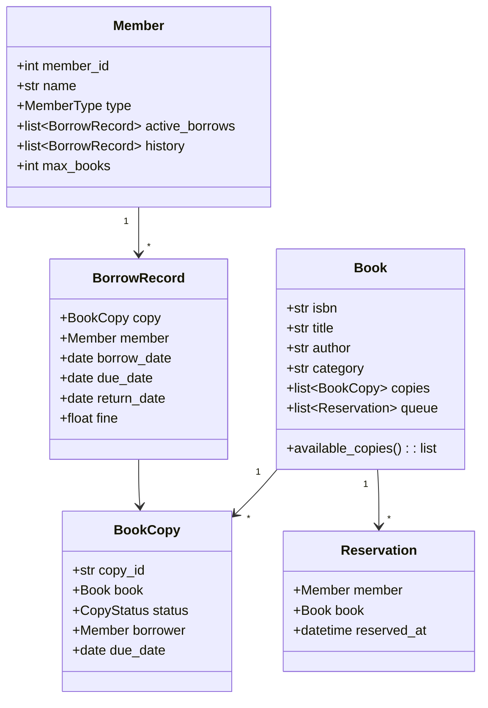

# 📚 LIBRARY MANAGEMENT SYSTEM — Complete LLD Guide
## The Definitive 17-Section Edition — V2.0

---

## 📖 Table of Contents
1. [🎯 Problem Statement & Context](#-1-problem-statement--context)
2. [🗣️ Requirement Gathering](#-2-requirement-gathering)
3. [✅ Requirements (FR + NFR)](#-3-requirements)
4. [🧠 Key Insight: Book vs BookCopy + Borrowing Lifecycle](#-4-key-insight)
5. [📐 Class Diagram & Entity Relationships](#-5-class-diagram)
6. [🔧 API Design (Public Interface)](#-6-api-design)
7. [🏗️ Complete Code Implementation](#-7-complete-code)
8. [📊 Data Structure Choices & Trade-offs](#-8-data-structure-choices)
9. [🔒 Concurrency & Thread Safety Deep Dive](#-9-concurrency-deep-dive)
10. [🧪 SOLID Principles Mapping](#-10-solid-principles)
11. [🎨 Design Patterns Used](#-11-design-patterns)
12. [💾 Database Schema (Production View)](#-12-database-schema)
13. [⚠️ Edge Cases & Error Handling](#-13-edge-cases)
14. [🎮 Full Working Demo](#-14-full-working-demo)
15. [🎤 Interviewer Follow-ups (15+)](#-15-interviewer-follow-ups)
16. [⏱️ Interview Strategy (45-min Plan)](#-16-interview-strategy)
17. [🧠 Quick Recall Cheat Sheet](#-17-quick-recall)

---

# 🎯 1. Problem Statement & Context

## What You're Designing

> Design a **Library Management System** where members search the catalog, borrow physical book copies, return them with fine calculation for overdue books, place reservations when all copies are borrowed, and librarians manage the catalog. Support the critical distinction between **Book (title/metadata)** and **BookCopy (physical copy)** — the same design pattern as BookMyShow's Movie vs Show.

## Real-World Context

| Metric | Real Library |
|--------|-------------|
| Books in catalog | 10K–500K titles |
| Copies per title | 1–20 copies |
| Active members | 1K–50K |
| Borrow period | 14–21 days |
| Max books per member | 5–10 |
| Fine rate | ₹5–₹10/day overdue |
| Reservation queue | FIFO per title |

## Why Interviewers Love This Problem

| What They Test | How This Tests It |
|---------------|-------------------|
| **Entity-Instance pattern** ⭐ | Book (title) vs BookCopy (physical copy) — like Movie vs Show |
| **Borrowing lifecycle** | AVAILABLE → BORROWED → RETURNED (or OVERDUE) |
| **Fine calculation** | Date arithmetic + per-day penalty |
| **Reservation queue** | FIFO per Book — when a copy returns, first reserver gets it |
| **Concurrency** | Two members try to borrow the last copy simultaneously |
| **Search** | By title, author, ISBN, category |

---

# 🗣️ 2. Requirement Gathering

## Must-Ask Questions

| # | Question | WHY You Ask | Design Impact |
|---|----------|-------------|---------------|
| 1 | "Is 'Harry Potter' one entity or one per physical copy?" | **THE key distinction** | Book (metadata) vs BookCopy (physical) |
| 2 | "Multiple copies of the same book?" | Entity-Instance | Book has `copies: list[BookCopy]` |
| 3 | "Borrow duration?" | Fine calculation | `BORROW_DAYS = 14`, fine after that |
| 4 | "Fine rate?" | Late return penalty | `FINE_PER_DAY = 5` (₹) |
| 5 | "Max books per member?" | Borrowing limit | `MAX_BOOKS = 5` |
| 6 | "What if all copies are borrowed?" | **Reservation queue** | FIFO waitlist per Book (not per BookCopy) |
| 7 | "Can a borrower extend/renew?" | Extension feature | Renew = reset due_date if no reservations pending |
| 8 | "Search by what?" | Search strategy | Title, author, ISBN, category |
| 9 | "Member types?" | Different limits | Regular (5 books), Premium (10 books) |
| 10 | "Digital books / e-books?" | Extension | No physical copy needed, concurrent access |

### 🎯 THE question that nails the interview

> "This looks like the Entity-Instance pattern from BookMyShow. There, it's Movie vs Show. Here, should it be Book vs BookCopy?"

**YES!** Drawing this analogy immediately shows pattern recognition:

| System | Template (Metadata) | Instance (Physical/Timed) |
|--------|-------------------|--------------------------|
| **BookMyShow** | Movie | Show (at screen, at time) |
| **Library** | Book (title, author, ISBN) | BookCopy (copy #1, copy #2) |
| **Car Rental** | CarModel | Car (VIN, plate number) |
| **Concert** | Event | EventZone (capacity count) |

---

# ✅ 3. Requirements

## Functional Requirements

| Priority | ID | Requirement | Complexity |
|----------|-----|-------------|-----------|
| **P0** | FR-1 | Add books to catalog (title, author, ISBN, category) | Low |
| **P0** | FR-2 | Add physical copies of a book | Low |
| **P0** | FR-3 | Register members (name, email, member type) | Low |
| **P0** | FR-4 | **Search** catalog (by title, author, ISBN, category) | Medium |
| **P0** | FR-5 | **Borrow** a book copy (check availability, member limits) | High |
| **P0** | FR-6 | **Return** a book copy (fine calculation if overdue) | High |
| **P0** | FR-7 | **Reservation queue** — request when all copies borrowed | High |
| **P1** | FR-8 | Renew a borrow (extend due date) | Medium |
| **P1** | FR-9 | Member borrow history | Low |
| **P2** | FR-10 | Librarian reports (most borrowed, overdue list) | Low |

## Non-Functional Requirements

| ID | Requirement | Why |
|----|-------------|-----|
| NFR-1 | **Atomicity** — borrow = check availability + assign copy atomically | Prevent double-borrow |
| NFR-2 | **FIFO fairness** — reservation honor order | Prevents queue jumping |

---

# 🧠 4. Key Insight: Book vs BookCopy + Reservation Queue

## 🤔 THINK: Library has 3 copies of "Harry Potter". Alice borrows one, Bob borrows one, Charlie wants one. What entities do you need?

<details>
<summary>👀 Click to reveal — The Entity-Instance pattern applied to libraries</summary>

### Book vs BookCopy (Draw This First!)

```
Book: "Harry Potter and the Philosopher's Stone"
├── ISBN: 978-0747532699
├── Author: "J.K. Rowling"
├── Category: "Fantasy"
└── copies: [
        BookCopy #1: AVAILABLE ✅
        BookCopy #2: BORROWED  (Alice, due Oct 15) 📕
        BookCopy #3: BORROWED  (Bob, due Oct 20) 📕
    ]

Charlie wants "Harry Potter":
→ BookCopy #1 is AVAILABLE → Borrow it! ✅

Dave wants "Harry Potter":
→ ALL copies BORROWED → Join reservation queue! 📋
→ When ANY copy is returned → Dave gets notified first (FIFO)
```

### Why Not Just "Book" With a Count?

```python
# ❌ BAD: Just a counter (like concert zone-based)
class Book:
    total_copies = 3
    available_copies = 1  # Who has which copy? No idea!

# ✅ GOOD: Individual BookCopy entities
class BookCopy:
    copy_id = "HP-001"
    status = CopyStatus.BORROWED
    borrower = alice          # Know EXACTLY who has this copy
    due_date = "2024-10-15"   # Know WHEN it's due back
    condition = "Good"        # Track physical condition

# WHY? Unlike concerts (anonymous zone access), library needs to track:
# - WHO has which specific copy
# - WHEN each copy is due
# - Physical CONDITION of each copy
# - HISTORY of who had each copy
```

### Reservation Queue: Per Book, Not Per Copy

```
Book "Harry Potter" — ALL 3 copies borrowed

Reservation queue (FIFO):
  [Dave (joined Oct 5), Eve (joined Oct 6), Frank (joined Oct 7)]

Alice returns Copy #2 on Oct 10:
  1. Copy #2 → RESERVED (not AVAILABLE!)
  2. Pop Dave from queue (FIFO)
  3. Notify Dave: "Your reserved book is ready! Pick up within 3 days."
  4. Dave picks up → Copy #2 → BORROWED
  
  If Dave doesn't pick up in 3 days:
  5. Copy #2 → re-offer to Eve (next in queue)
```

### Fine Calculation — Date Arithmetic

```python
def calculate_fine(due_date, return_date):
    """
    Fine = (overdue_days) × FINE_PER_DAY
    
    Example:
    Due: Oct 15. Returned: Oct 20. Overdue = 5 days.
    Fine = 5 × ₹5 = ₹25
    
    Due: Oct 15. Returned: Oct 10. Overdue = 0 (early return!)
    Fine = ₹0
    """
    overdue_days = (return_date - due_date).days
    if overdue_days <= 0:
        return 0  # Returned on time or early
    return overdue_days * FINE_PER_DAY
```

</details>

---

# 📐 5. Class Diagram & Entity Relationships



---

# 🔧 6. API Design (Public Interface)

```python
class LibrarySystem:
    # ── Catalog Management (Librarian) ──
    def add_book(self, isbn, title, author, category) -> Book: ...
    def add_copy(self, isbn) -> BookCopy: ...
    
    # ── Member Operations ──
    def register_member(self, name, email, member_type="REGULAR") -> Member: ...
    def search(self, title=None, author=None, isbn=None, category=None) -> list[Book]: ...
    def borrow_book(self, member_id, isbn) -> BorrowRecord: ...
    def return_book(self, member_id, copy_id) -> float:
        """Returns fine amount (0 if on time)."""
    def reserve_book(self, member_id, isbn) -> int:
        """Returns position in queue."""
    def renew_book(self, member_id, copy_id) -> date:
        """Returns new due date. Fails if reservations pending."""
```

---

# 🏗️ 7. Complete Code Implementation

## Enums & Constants

```python
from enum import Enum
from datetime import datetime, date, timedelta
import threading
import uuid

class CopyStatus(Enum):
    AVAILABLE = 1
    BORROWED = 2
    RESERVED = 3     # Returned but held for reserver
    LOST = 4
    MAINTENANCE = 5

class MemberType(Enum):
    REGULAR = 1    # Max 5 books, 14-day borrow
    PREMIUM = 2    # Max 10 books, 21-day borrow

BORROW_LIMITS = {
    MemberType.REGULAR: {"max_books": 5, "borrow_days": 14},
    MemberType.PREMIUM: {"max_books": 10, "borrow_days": 21},
}
FINE_PER_DAY = 5  # ₹5 per overdue day
```

## Core Entities

```python
class Book:
    """
    The METADATA entity — represents a title, NOT a physical copy.
    Like Movie in BookMyShow, NOT Show.
    """
    def __init__(self, isbn, title, author, category):
        self.isbn = isbn
        self.title = title
        self.author = author
        self.category = category
        self.copies: list['BookCopy'] = []
        self.reservations: list['Reservation'] = []  # FIFO queue
        self._lock = threading.Lock()
    
    @property
    def available_copies(self) -> list['BookCopy']:
        return [c for c in self.copies if c.status == CopyStatus.AVAILABLE]
    
    @property
    def total_copies(self) -> int:
        return len(self.copies)
    
    @property
    def available_count(self) -> int:
        return len(self.available_copies)
    
    def __str__(self):
        return (f"📖 \"{self.title}\" by {self.author} | ISBN: {self.isbn} | "
                f"{self.category} | {self.available_count}/{self.total_copies} available")


class BookCopy:
    """The PHYSICAL entity — one copy of a Book you can hold in your hand."""
    _counter = 0
    def __init__(self, book: Book):
        BookCopy._counter += 1
        self.copy_id = f"CP-{BookCopy._counter:05d}"
        self.book = book
        self.status = CopyStatus.AVAILABLE
        self.borrower: 'Member' = None
        self.due_date: date = None
    
    def __str__(self):
        borrower_info = f" → {self.borrower.name} (due {self.due_date})" if self.borrower else ""
        return f"   📕 {self.copy_id}: {self.status.name}{borrower_info}"


class Member:
    def __init__(self, name, email, member_type=MemberType.REGULAR):
        self.member_id = id(self)
        self.name = name
        self.email = email
        self.member_type = member_type
        self.active_borrows: list['BorrowRecord'] = []
        self.history: list['BorrowRecord'] = []
        self.total_fines = 0.0
    
    @property
    def max_books(self):
        return BORROW_LIMITS[self.member_type]["max_books"]
    
    @property
    def borrow_days(self):
        return BORROW_LIMITS[self.member_type]["borrow_days"]
    
    @property
    def can_borrow(self):
        return len(self.active_borrows) < self.max_books
    
    def __str__(self):
        return (f"👤 {self.name} ({self.member_type.name}) | "
                f"Active: {len(self.active_borrows)}/{self.max_books}")


class BorrowRecord:
    def __init__(self, copy: BookCopy, member: Member, borrow_days: int):
        self.copy = copy
        self.member = member
        self.borrow_date = date.today()
        self.due_date = date.today() + timedelta(days=borrow_days)
        self.return_date: date = None
        self.fine = 0.0
    
    @property
    def is_overdue(self):
        if self.return_date: return False
        return date.today() > self.due_date
    
    def __str__(self):
        status = "RETURNED" if self.return_date else ("⚠️ OVERDUE" if self.is_overdue else "ACTIVE")
        fine_info = f" | Fine: ₹{self.fine:.0f}" if self.fine > 0 else ""
        return (f"   📋 {self.copy.book.title} ({self.copy.copy_id}) | "
                f"Due: {self.due_date} | {status}{fine_info}")


class Reservation:
    def __init__(self, member: Member, book: Book):
        self.member = member
        self.book = book
        self.reserved_at = datetime.now()
```

## The Library System

```python
class LibrarySystem:
    """
    Central system — manages catalog, members, borrows, returns, reservations.
    
    Key operations and their complexity:
    - search: O(N) scan of books (production: full-text index)
    - borrow: O(copies) to find available copy
    - return: O(1) — copy reference in BorrowRecord
    - reserve: O(1) — append to FIFO queue
    """
    _instance = None
    
    def __new__(cls):
        if cls._instance is None:
            cls._instance = super().__new__(cls)
            cls._instance._initialized = False
        return cls._instance
    
    def __init__(self):
        if self._initialized: return
        self._initialized = True
        self.books: dict[str, Book] = {}        # ISBN → Book
        self.members: dict[int, Member] = {}
        self.copies: dict[str, BookCopy] = {}   # copy_id → BookCopy
    
    # ── Catalog Management ──
    def add_book(self, isbn, title, author, category):
        if isbn in self.books:
            print(f"   ℹ️ Book already exists. Use add_copy() to add more copies.")
            return self.books[isbn]
        book = Book(isbn, title, author, category)
        self.books[isbn] = book
        print(f"   ✅ Added: {book}")
        return book
    
    def add_copy(self, isbn):
        book = self.books.get(isbn)
        if not book:
            print("   ❌ Book not in catalog!"); return None
        copy = BookCopy(book)
        book.copies.append(copy)
        self.copies[copy.copy_id] = copy
        print(f"   ✅ Added copy {copy.copy_id} of '{book.title}' "
              f"(total: {book.total_copies})")
        return copy
    
    # ── Member Management ──
    def register_member(self, name, email, member_type=MemberType.REGULAR):
        member = Member(name, email, member_type)
        self.members[member.member_id] = member
        print(f"   ✅ Registered: {member}")
        return member
    
    # ── Search ──
    def search(self, title=None, author=None, isbn=None, category=None):
        results = list(self.books.values())
        if isbn: return [self.books[isbn]] if isbn in self.books else []
        if title: results = [b for b in results if title.lower() in b.title.lower()]
        if author: results = [b for b in results if author.lower() in b.author.lower()]
        if category: results = [b for b in results if category.lower() in b.category.lower()]
        return results
    
    # ── Borrow ──
    def borrow_book(self, member_id, isbn):
        member = self.members.get(member_id)
        book = self.books.get(isbn)
        if not member: print("   ❌ Member not found!"); return None
        if not book: print("   ❌ Book not in catalog!"); return None
        
        if not member.can_borrow:
            print(f"   ❌ {member.name} has reached max borrow limit "
                  f"({len(member.active_borrows)}/{member.max_books})")
            return None
        
        with book._lock:  # ── CRITICAL: atomic availability check + assign ──
            available = book.available_copies
            if not available:
                print(f"   ❌ No copies of '{book.title}' available!")
                print(f"   💡 Use reserve_book() to join the waitlist "
                      f"(current queue: {len(book.reservations)})")
                return None
            
            # Take first available copy
            copy = available[0]
            copy.status = CopyStatus.BORROWED
            copy.borrower = member
            
            # Create borrow record
            borrow = BorrowRecord(copy, member, member.borrow_days)
            copy.due_date = borrow.due_date
            member.active_borrows.append(borrow)
            member.history.append(borrow)
        
        print(f"   ✅ BORROWED: '{book.title}' ({copy.copy_id}) by {member.name}")
        print(f"      Due date: {borrow.due_date} ({member.borrow_days} days)")
        return borrow
    
    # ── Return ──
    def return_book(self, member_id, copy_id):
        member = self.members.get(member_id)
        copy = self.copies.get(copy_id)
        if not member or not copy:
            print("   ❌ Invalid member or copy!"); return 0
        
        # Find the active borrow record
        borrow = next(
            (b for b in member.active_borrows if b.copy.copy_id == copy_id), None
        )
        if not borrow:
            print("   ❌ This copy is not borrowed by this member!"); return 0
        
        # Process return
        borrow.return_date = date.today()
        
        # Calculate fine
        overdue_days = (date.today() - borrow.due_date).days
        fine = max(0, overdue_days * FINE_PER_DAY)
        borrow.fine = fine
        member.total_fines += fine
        
        # Remove from active borrows
        member.active_borrows.remove(borrow)
        copy.borrower = None
        copy.due_date = None
        
        book = copy.book
        with book._lock:
            # Check reservation queue FIRST
            if book.reservations:
                reserver = book.reservations.pop(0)  # FIFO
                copy.status = CopyStatus.RESERVED
                print(f"   📋 Copy reserved for {reserver.member.name} (waitlist)")
                print(f"      📧 Notification sent: Pick up within 3 days!")
            else:
                copy.status = CopyStatus.AVAILABLE
        
        print(f"   ✅ RETURNED: '{book.title}' ({copy_id}) by {member.name}")
        if fine > 0:
            print(f"   ⚠️ OVERDUE by {overdue_days} days! Fine: ₹{fine:.0f}")
        else:
            print(f"   ✅ Returned on time! No fine.")
        return fine
    
    # ── Reservation ──
    def reserve_book(self, member_id, isbn):
        member = self.members.get(member_id)
        book = self.books.get(isbn)
        if not member or not book:
            print("   ❌ Invalid member or book!"); return -1
        
        # Check if already has a copy or already in queue
        for b in member.active_borrows:
            if b.copy.book.isbn == isbn:
                print("   ❌ You already have a copy of this book!"); return -1
        for r in book.reservations:
            if r.member.member_id == member_id:
                print("   ❌ Already in the reservation queue!"); return -1
        
        reservation = Reservation(member, book)
        book.reservations.append(reservation)
        position = len(book.reservations)
        print(f"   📋 {member.name} reserved '{book.title}'. Position: #{position}")
        return position
    
    # ── Renew ──
    def renew_book(self, member_id, copy_id):
        member = self.members.get(member_id)
        borrow = next(
            (b for b in member.active_borrows if b.copy.copy_id == copy_id), None
        )
        if not borrow:
            print("   ❌ No active borrow found!"); return None
        
        # Can't renew if reservations pending
        if borrow.copy.book.reservations:
            print(f"   ❌ Cannot renew — {len(borrow.copy.book.reservations)} "
                  f"reservations pending!"); return None
        
        # Extend due date
        old_due = borrow.due_date
        borrow.due_date = date.today() + timedelta(days=member.borrow_days)
        print(f"   🔄 Renewed! New due date: {borrow.due_date} (was {old_due})")
        borrow.copy.due_date = borrow.due_date
        return borrow.due_date
    
    # ── Reports ──
    def display_overdue(self):
        print("\n   ⚠️ OVERDUE BOOKS:")
        found = False
        for member in self.members.values():
            for b in member.active_borrows:
                if b.is_overdue:
                    days = (date.today() - b.due_date).days
                    print(f"   {b.copy.book.title} ({b.copy.copy_id}) | "
                          f"{member.name} | {days} days overdue | "
                          f"Fine so far: ₹{days * FINE_PER_DAY}")
                    found = True
        if not found:
            print("   ✅ No overdue books!")
```

---

# 📊 8. Data Structure Choices & Trade-offs

| Data Structure | Where | Why | Alternative | Why Not |
|---------------|-------|-----|-------------|---------|
| `dict[str, Book]` | books (by ISBN) | O(1) lookup by ISBN. ISBN is unique natural key | `list[Book]` | Need fast lookup by ISBN |
| `list[BookCopy]` | Book.copies | Ordered. Small N (1-20 copies). Scan for available | `dict` | No unique natural key needed for copies |
| `list[Reservation]` | Book.reservations | **FIFO queue**. `pop(0)` gets first. Order matters! | `deque` | List fine for interview. Mention deque for O(1) pop |
| `list[BorrowRecord]` | Member.active_borrows | Small list (max 5-10). Need scan by copy_id | `dict[copy_id, BorrowRecord]` | Both work. List is simpler for small N |
| `dict[str, BookCopy]` | System.copies | O(1) lookup by copy_id for return operations | Nested search | Return needs fast copy_id lookup without knowing ISBN |

---

# 🔒 9. Concurrency & Thread Safety Deep Dive

## The Last Copy Race Condition

```
Timeline: Book "HP" has 1 available copy (CP-003)

t=0: Alice → CP-003 AVAILABLE → can borrow!
t=1: Bob   → CP-003 AVAILABLE → can borrow! (not yet assigned!)
t=2: Alice → assigns CP-003 → status = BORROWED
t=3: Bob   → assigns CP-003 → status = BORROWED 💀 DOUBLE-BORROW!
```

```python
# Fix: Per-book lock
with book._lock:
    available = book.available_copies
    if not available:
        return None  # Rejected!
    copy = available[0]
    copy.status = CopyStatus.BORROWED  # Atomic with check!
```

### Why Per-Book Lock, Not Global?

```
Alice borrows "Harry Potter" → locks HP book
Bob borrows "Lord of the Rings" → locks LOTR book
PARALLEL! ✅

Global lock would serialize ALL borrows across ALL books — terrible.
```

---

# 🧪 10. SOLID Principles Mapping

| Principle | Where Applied | Explanation |
|-----------|--------------|-------------|
| **S** | Clear separation | Book = metadata. BookCopy = physical state. Member = user info + limits. BorrowRecord = transaction. System = orchestration |
| **O** | MemberType + BORROW_LIMITS | New member tier (STUDENT with 3 books) = add to enum + config dict. Zero code change in borrow logic |
| **L** | Member types | `member.can_borrow` works for Regular and Premium identically |
| **I** | Focused APIs | borrow, return, reserve, renew are separate. Not one monolithic method |
| **D** | System → Book (abstraction) | System uses Book.available_copies property, doesn't scan copies directly |

---

# 🎨 11. Design Patterns Used

| Pattern | Where | Why |
|---------|-------|-----|
| **Entity-Instance** ⭐ | Book → BookCopy | Same title = different physical copies with independent status |
| **Singleton** | LibrarySystem | One library per system |
| **Observer** | (Extension) Notifications | Return triggers reservation notification to next in queue |
| **Strategy** | (Extension) Search | SearchByTitle, SearchByAuthor, FullTextSearch |
| **Factory** | (Extension) BookCopyFactory | Generate copies with barcode/RFID |

### Cross-Problem Entity-Instance

| System | Metadata Entity | Physical Instance | Status Tracked On |
|--------|----------------|-------------------|-------------------|
| **Library** | Book (ISBN) | BookCopy | BookCopy.status |
| **BookMyShow** | Movie | Show → ShowSeat | ShowSeat.status |
| **Car Rental** | CarModel | Car (VIN) | Car.status |

---

# 💾 12. Database Schema (Production View)

```sql
CREATE TABLE books (
    isbn        VARCHAR(20) PRIMARY KEY,
    title       VARCHAR(200) NOT NULL,
    author      VARCHAR(100) NOT NULL,
    category    VARCHAR(50),
    INDEX idx_title (title),
    INDEX idx_author (author)
);

CREATE TABLE book_copies (
    copy_id     VARCHAR(20) PRIMARY KEY,
    isbn        VARCHAR(20) REFERENCES books(isbn),
    status      VARCHAR(20) DEFAULT 'AVAILABLE',
    borrower_id INTEGER REFERENCES members(member_id),
    due_date    DATE,
    INDEX idx_isbn_status (isbn, status)
);

CREATE TABLE borrow_records (
    record_id   SERIAL PRIMARY KEY,
    copy_id     VARCHAR(20) REFERENCES book_copies(copy_id),
    member_id   INTEGER REFERENCES members(member_id),
    borrow_date DATE NOT NULL,
    due_date    DATE NOT NULL,
    return_date DATE,
    fine        DECIMAL(8,2) DEFAULT 0
);

-- Find available copy for borrowing (atomic!)
SELECT copy_id FROM book_copies
WHERE isbn = '978-0747532699' AND status = 'AVAILABLE'
LIMIT 1
FOR UPDATE;  -- Lock the row!

-- Overdue books report
SELECT bc.copy_id, b.title, m.name, bc.due_date,
    DATEDIFF(CURRENT_DATE, bc.due_date) as days_overdue,
    DATEDIFF(CURRENT_DATE, bc.due_date) * 5 as fine
FROM book_copies bc
JOIN books b ON bc.isbn = b.isbn
JOIN members m ON bc.borrower_id = m.member_id
WHERE bc.status = 'BORROWED' AND bc.due_date < CURRENT_DATE;
```

---

# ⚠️ 13. Edge Cases & Error Handling

| # | Edge Case | Fix |
|---|-----------|-----|
| 1 | **Last copy — two members borrow simultaneously** | Per-book lock. Atomic check + assign |
| 2 | **Member at max limit** | Check `can_borrow` before processing |
| 3 | **Return triggers reservation** | Check queue BEFORE setting copy to AVAILABLE. Pop first reserver |
| 4 | **Renew with pending reservations** | Block renewal — reserver has priority |
| 5 | **Return wrong member's book** | Verify `borrow.member == returning member` |
| 6 | **Already in reservation queue** | Check queue before adding. Prevent duplicates |
| 7 | **Already has a copy, tries to borrow again** | Check if member has active borrow for same ISBN |
| 8 | **Book with 0 copies** | `available_copies` returns empty list. Graceful reject |
| 9 | **Fine calculation — returns exactly on due date** | 0 days overdue = ₹0 fine (on-time) |
| 10 | **Reserver doesn't pick up** | 3-day hold. If expired, offer to next in queue |

---

# 🎮 14. Full Working Demo

```python
if __name__ == "__main__":
    print("=" * 65)
    print("     📚 LIBRARY MANAGEMENT SYSTEM — COMPLETE DEMO")
    print("=" * 65)
    
    lib = LibrarySystem()
    
    # Setup catalog
    print("\n─── Setup: Add Books & Copies ───")
    hp = lib.add_book("978-0747532699", "Harry Potter and the Philosopher's Stone",
                      "J.K. Rowling", "Fantasy")
    lib.add_copy(hp.isbn)
    lib.add_copy(hp.isbn)
    
    lotr = lib.add_book("978-0618640157", "The Lord of the Rings",
                        "J.R.R. Tolkien", "Fantasy")
    lib.add_copy(lotr.isbn)
    
    # Register members
    alice = lib.register_member("Alice", "alice@mail.com")
    bob = lib.register_member("Bob", "bob@mail.com", MemberType.PREMIUM)
    
    # Search
    print("\n─── Test 1: Search ───")
    results = lib.search(category="Fantasy")
    for b in results:
        print(f"   {b}")
    
    # Borrow
    print("\n─── Test 2: Alice borrows Harry Potter ───")
    b1 = lib.borrow_book(alice.member_id, hp.isbn)
    
    print("\n─── Test 3: Bob borrows Harry Potter (second copy) ───")
    b2 = lib.borrow_book(bob.member_id, hp.isbn)
    
    # All copies borrowed — reservation
    print("\n─── Test 4: Charlie tries HP (all copies out!) ───")
    charlie = lib.register_member("Charlie", "charlie@mail.com")
    lib.borrow_book(charlie.member_id, hp.isbn)  # Should fail!
    lib.reserve_book(charlie.member_id, hp.isbn)  # Join queue
    
    # Return with fine
    print("\n─── Test 5: Alice returns (simulate overdue) ───")
    b1.due_date = date.today() - timedelta(days=3)  # Simulate 3 days overdue
    fine = lib.return_book(alice.member_id, b1.copy.copy_id)
    
    # Renew
    print("\n─── Test 6: Bob tries to renew HP (reservation pending!) ───")
    lib.renew_book(bob.member_id, b2.copy.copy_id)
    
    print("\n─── Test 7: Bob borrows LOTR and renews (no reservations) ───")
    b3 = lib.borrow_book(bob.member_id, lotr.isbn)
    lib.renew_book(bob.member_id, b3.copy.copy_id)
    
    # Status
    print("\n─── Final Status ───")
    for b in lib.books.values():
        print(f"   {b}")
        for c in b.copies:
            print(f"   {c}")
    
    print(f"\n{'='*65}")
    print("     ✅ ALL 7 TESTS COMPLETE!")
    print(f"{'='*65}")
```

---

# 🎤 15. Interviewer Follow-ups (15+)

| Q | Question | Key Answer |
|---|----------|-----------|
| 1 | "Book vs BookCopy — why?" | Book = metadata (title, author). BookCopy = physical (status, borrower). Same pattern as Movie/Show |
| 2 | "Why per-book lock, not global?" | Borrowing HP shouldn't block borrowing LOTR. Per-book = parallel borrows for different titles |
| 3 | "Fine calculation?" | `max(0, (return_date - due_date).days) × FINE_PER_DAY`. Zero if on time |
| 4 | "Reservation queue — why FIFO?" | Fairness. First to request = first to get. Queue jumping is unfair |
| 5 | "Renew with reservations?" | Block — reserver has priority. Can only renew if queue is empty |
| 6 | "Return triggers reservation?" | Check queue BEFORE setting AVAILABLE. Reserve for first in queue. Notify them |
| 7 | "E-books?" | No physical copy needed. "Copy" = license count. Concurrent borrows = license limit |
| 8 | "Member types?" | BORROW_LIMITS config dict. New type = add entry. Zero code change (OCP) |
| 9 | "Overdue notifications?" | Scheduled job: scan active borrows where due_date < today. Email/SMS alert |
| 10 | "Full-text search?" | Production: Elasticsearch. LLD: simple string matching. Mention you know the difference |
| 11 | "ISBN uniqueness?" | ISBN identifies a TITLE (edition). Different editions = different ISBNs. Same edition = same ISBN |
| 12 | "Book transferred between libraries?" | Update `library_id` on BookCopy. Book (metadata) is shared |
| 13 | "Lost book?" | Set CopyStatus.LOST. Charge replacement cost. Reduce available count |
| 14 | "Popular books report?" | COUNT borrow_records GROUP BY isbn ORDER BY count DESC |
| 15 | "Barcode/RFID scanning?" | copy_id = barcode value. Scanner input maps to return_book(copy_id) |

---

# ⏱️ 16. Interview Strategy (45-min Plan)

| Time | Phase | What You Do |
|------|-------|-------------|
| **0–5** | Clarify | Book vs BookCopy, borrow limits, fines, reservations |
| **5–10** | Key Insight | Draw Entity-Instance: Book → BookCopy[]. Compare with Movie → Show |
| **10–15** | Class Diagram | Book, BookCopy, Member, BorrowRecord, Reservation |
| **15–30** | Code | Book with copies, borrow (lock + assign), return (fine + reservation check), reserve (FIFO) |
| **30–38** | Demo | Borrow, all-copies-out → reserve, return triggers reservation notification, fine |
| **38–45** | Extensions | Renew, member types, e-books, search optimization |

## Golden Sentences

> **Opening:** "Library is the Entity-Instance pattern — Book is metadata (like Movie), BookCopy is physical (like Show). Same title can have multiple copies with independent borrow status."

> **Reservation:** "When all copies are borrowed, members join a FIFO queue per Book. When any copy is returned, the first reserver gets it — not released to general availability."

---

# 🧠 17. Quick Recall Cheat Sheet

## ⏱️ 30-Second Recall

> **Book (metadata) vs BookCopy (physical)** — Entity-Instance pattern. Borrow = assign AVAILABLE copy to member. Return = fine calculation + check reservation queue. **FIFO reservation** per Book (not per Copy). **Per-book lock** for concurrent borrow of last copy. Fine = `overdue_days × ₹5`. Member limits: Regular=5, Premium=10.

## ⏱️ 2-Minute Recall

Add:
> **Entities:** Book (ISBN, title, author, copies[], reservations[]). BookCopy (status, borrower, due_date). Member (type, active_borrows, max_books). BorrowRecord (borrow_date, due_date, return_date, fine).
> **Return flow:** calculate fine → remove from active_borrows → check reservation queue → if reserver exists: RESERVED (not AVAILABLE) + notify → else: AVAILABLE.
> **Renew:** Extend due_date by borrow_days. BLOCKED if reservations pending.

## ⏱️ 5-Minute Recall

Add:
> **SOLID:** OCP via BORROW_LIMITS dict (new member type = add config). SRP per class. Entity-Instance = core pattern.
> **DB:** `book_copies` with `FOR UPDATE` for atomic borrow. Overdue report: `WHERE status='BORROWED' AND due_date < TODAY`.
> **Concurrency:** Per-book lock (not global). Borrow of HP doesn't block borrow of LOTR.
> **Compare:** BookMyShow (Movie→Show→Seat), Library (Book→BookCopy), Car Rental (Model→Car). Same pattern.

---

## ✅ Pre-Implementation Checklist

- [ ] **CopyStatus**, MemberType enums + **BORROW_LIMITS** config
- [ ] **Book** (isbn, title, author, category, copies[], reservations[], per-book lock)
- [ ] **BookCopy** (copy_id, book ref, status, borrower, due_date)
- [ ] **Member** (name, type, active_borrows, max_books, can_borrow)
- [ ] **BorrowRecord** (copy, member, dates, fine)
- [ ] **Reservation** (member, book, timestamp)
- [ ] **borrow_book()** — lock, check available, check member limit, assign copy
- [ ] **return_book()** — fine calculation, check reservation queue FIRST, then AVAILABLE
- [ ] **reserve_book()** — FIFO queue per Book, duplicate check
- [ ] **renew_book()** — blocked if reservations pending
- [ ] **Demo:** borrow, all-out + reserve, overdue return with fine, reservation notification

---

*Version 2.0 — The Definitive 17-Section Edition (Gold Standard)*
