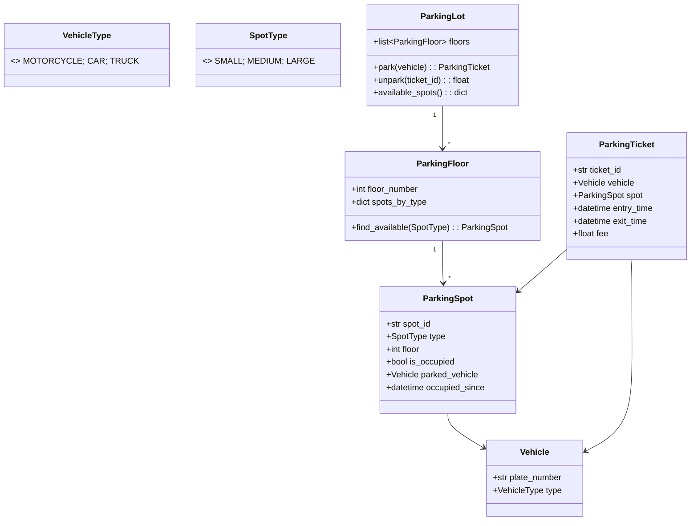

# 🅿️ PARKING LOT — Complete LLD Guide
## The Definitive 17-Section Edition — V2.0

---

## 📖 Table of Contents
1. [🎯 Problem Statement & Context](#-1-problem-statement--context)
2. [🗣️ Requirement Gathering](#-2-requirement-gathering)
3. [✅ Requirements (FR + NFR)](#-3-requirements)
4. [🧠 Key Insight: Vehicle-Spot Type Matching + Hourly Rate Strategy](#-4-key-insight)
5. [📐 Class Diagram & Entity Relationships](#-5-class-diagram)
6. [🔧 API Design (Public Interface)](#-6-api-design)
7. [🏗️ Complete Code Implementation](#-7-complete-code)
8. [📊 Data Structure Choices & Trade-offs](#-8-data-structure-choices)
9. [🔒 Concurrency & Thread Safety Deep Dive](#-9-concurrency-deep-dive)
10. [🧪 SOLID Principles Mapping](#-10-solid-principles)
11. [🎨 Design Patterns Used](#-11-design-patterns)
12. [💾 Database Schema (Production View)](#-12-database-schema)
13. [⚠️ Edge Cases & Error Handling](#-13-edge-cases)
14. [🎮 Full Working Demo](#-14-full-working-demo)
15. [🎤 Interviewer Follow-ups (15+)](#-15-interviewer-follow-ups)
16. [⏱️ Interview Strategy (45-min Plan)](#-16-interview-strategy)
17. [🧠 Quick Recall Cheat Sheet](#-17-quick-recall)

---

# 🎯 1. Problem Statement & Context

## What You're Designing

> Design a **Parking Lot System** that manages multiple floors, each with different-sized spots (SMALL, MEDIUM, LARGE) for different vehicle types (Motorcycle, Car, Truck). Handle vehicle entry (assign nearest available spot by type), exit (calculate fee based on duration), display availability, and handle concurrent operations thread-safely.

## Real-World Context

| Metric | Real System |
|--------|-------------|
| Spots per floor | 50–200 |
| Floors | 1–10 |
| Vehicle types | Motorcycle, Car, Van/SUV, Truck/Bus |
| Pricing | Hourly rate per spot type |
| Peak concurrency | 10+ vehicles entering/exiting simultaneously |
| Entry/exit time | <5 seconds per vehicle |

## Why Interviewers Love This Problem

| What They Test | How This Tests It |
|---------------|-------------------|
| **Vehicle-Spot matching** | Motorcycle → SMALL, Car → MEDIUM, Truck → LARGE |
| **Spot allocation** | Find nearest available spot of correct type |
| **Fee calculation** | Duration × hourly rate (Strategy pattern) |
| **Multi-floor layout** | Floor → Spot hierarchy |
| **Concurrency** | Two cars arrive → race for last MEDIUM spot |
| **OCP** | Add new vehicle type or spot type without breaking existing code |

---

# 🗣️ 2. Requirement Gathering

## Must-Ask Questions

| # | Question | WHY You Ask | Design Impact |
|---|----------|-------------|---------------|
| 1 | "Vehicle types? Motorcycle, Car, Truck?" | **Type matching** | VehicleType enum → SpotType mapping |
| 2 | "Spot sizes? Do they match 1-to-1 with vehicles?" | **Matching strategy** | SMALL = Motorcycle, MEDIUM = Car, LARGE = Truck. Can a Motorcycle park in MEDIUM? |
| 3 | "Multi-floor?" | Floor hierarchy | ParkingLot → Floor[] → Spot[] |
| 4 | "Pricing model?" | Fee calculation | Hourly rate per spot type. First hour flat, then per-hour |
| 5 | "How to find a spot?" | Allocation algorithm | Nearest available of matching type. Floor 1 first, then Floor 2 |
| 6 | "Entry and exit gates?" | Concurrency points | Multiple gates = concurrent entry/exit |
| 7 | "Can a smaller vehicle park in a larger spot?" | Flexibility | Design choice: simplest = strict match. Mention flexibility |
| 8 | "Display board?" | Availability view | Per-floor, per-type available count |

### 🎯 THE question that shows depth

> "When I say Vehicle-Spot matching, should it be strict (Motorcycle → SMALL only) or flexible (Motorcycle can use SMALL or MEDIUM)? Strict is cleaner for LLD, but I'll mention flexibility as an extension."

---

# ✅ 3. Requirements

## Functional Requirements

| Priority | ID | Requirement | Complexity |
|----------|-----|-------------|-----------|
| **P0** | FR-1 | **Park vehicle** — find available spot by type, assign it | Medium |
| **P0** | FR-2 | **Unpark vehicle** — release spot, calculate fee by duration | Medium |
| **P0** | FR-3 | **Vehicle-Spot matching**: Motorcycle→SMALL, Car→MEDIUM, Truck→LARGE | Low |
| **P0** | FR-4 | **Multi-floor** with spot allocation priority (lower floor first) | Medium |
| **P0** | FR-5 | **Fee calculation** based on duration × hourly rate | Medium |
| **P1** | FR-6 | Display availability (per floor, per type) | Low |
| **P1** | FR-7 | Generate tickets (entry ticket, exit receipt) | Low |
| **P2** | FR-8 | Reserved/handicap spots | Low |
| **P2** | FR-9 | Electric vehicle charging spots | Low |

---

# 🧠 4. Key Insight: Vehicle-Spot Type Matching + Fee Strategy

## 🤔 THINK: How do you efficiently find the nearest available MEDIUM spot across multiple floors?

<details>
<summary>👀 Click to reveal — The spot allocation + fee strategy</summary>

### Vehicle → Spot Type Mapping

```python
VEHICLE_TO_SPOT = {
    VehicleType.MOTORCYCLE: SpotType.SMALL,
    VehicleType.CAR: SpotType.MEDIUM,
    VehicleType.TRUCK: SpotType.LARGE,
}

# Strict matching: Motorcycle ONLY in SMALL.
# This is the cleanest for LLD interviews.
# Mention flexible matching as extension (Motorcycle in MEDIUM/LARGE if SMALL full).
```

### Spot Allocation Algorithm

```
Vehicle arrives: Car (needs MEDIUM spot)

Floor 1: MEDIUM spots [✅, ❌, ❌, ✅, ✅]  → first available = Spot #1
Floor 2: MEDIUM spots [✅, ✅, ✅, ✅, ✅]  → not needed

Strategy: Scan Floor 1 first. If full, try Floor 2, etc.
Within each floor: First available spot of matching type.

Data structure: Per floor, per type → list of available spots.
```

### Fee Calculation — Strategy Pattern

```python
HOURLY_RATES = {
    SpotType.SMALL: 10,    # ₹10/hour for motorcycle
    SpotType.MEDIUM: 20,   # ₹20/hour for car
    SpotType.LARGE: 40,    # ₹40/hour for truck
}

def calculate_fee(spot_type, entry_time, exit_time):
    """
    Fee = ceil(hours) × hourly_rate
    
    Example: Car parked 2.5 hours
    ceil(2.5) = 3 hours
    Fee = 3 × ₹20 = ₹60
    
    WHY ceil? Partial hour = charged full hour (industry standard).
    """
    duration = exit_time - entry_time
    hours = math.ceil(duration.total_seconds() / 3600)
    return max(1, hours) * HOURLY_RATES[spot_type]
```

### This vs BookMyShow: Key Difference

| Aspect | BookMyShow | Parking Lot |
|--------|-----------|-------------|
| Allocation | User CHOOSES specific seat | System ASSIGNS best available spot |
| Selection | By seat number (A1, B5) | By type match (nearest available) |
| Duration | Fixed (movie length) | **Variable** (0.5 hours to days) |
| Pricing | Per seat tier | **Per hour × spot type** |

</details>

---

# 📐 5. Class Diagram & Entity Relationships



---

# 🔧 6. API Design (Public Interface)

```python
class ParkingLot:
    """
    Public API — maps to physical entry/exit gates.
    
    Entry gate: park(vehicle) → ticket
    Exit gate: unpark(ticket_id) → fee
    Display board: available_spots() → per-floor, per-type count
    """
    def park(self, vehicle: Vehicle) -> ParkingTicket:
        """Assign best available spot. Returns ticket."""
    def unpark(self, ticket_id: str) -> float:
        """Release spot. Returns fee based on duration."""
    def available_spots(self) -> dict:
        """Per-floor, per-type availability count."""
    def display_board(self) -> None:
        """Visual availability display."""
```

---

# 🏗️ 7. Complete Code Implementation

## Enums & Vehicle

```python
from enum import Enum
from datetime import datetime, timedelta
import math
import threading
import uuid

class VehicleType(Enum):
    MOTORCYCLE = 1
    CAR = 2
    TRUCK = 3

class SpotType(Enum):
    SMALL = 1     # For motorcycles
    MEDIUM = 2    # For cars
    LARGE = 3     # For trucks

VEHICLE_TO_SPOT = {
    VehicleType.MOTORCYCLE: SpotType.SMALL,
    VehicleType.CAR: SpotType.MEDIUM,
    VehicleType.TRUCK: SpotType.LARGE,
}

HOURLY_RATES = {
    SpotType.SMALL: 10,
    SpotType.MEDIUM: 20,
    SpotType.LARGE: 40,
}

class Vehicle:
    def __init__(self, plate_number: str, vehicle_type: VehicleType):
        self.plate_number = plate_number
        self.vehicle_type = vehicle_type
    
    def __str__(self):
        icons = {VehicleType.MOTORCYCLE: "🏍️", VehicleType.CAR: "🚗", VehicleType.TRUCK: "🚛"}
        return f"{icons[self.vehicle_type]} {self.plate_number} ({self.vehicle_type.name})"
```

## Parking Spot

```python
class ParkingSpot:
    """
    A single physical parking spot on a floor.
    
    Has a fixed SpotType (SMALL/MEDIUM/LARGE) and tracks:
    - Whether it's occupied
    - Which vehicle is parked
    - When the vehicle entered (for fee calculation)
    """
    def __init__(self, spot_id: str, spot_type: SpotType, floor: int):
        self.spot_id = spot_id
        self.spot_type = spot_type
        self.floor = floor
        self.is_occupied = False
        self.parked_vehicle: Vehicle = None
        self.occupied_since: datetime = None
    
    def park(self, vehicle: Vehicle):
        self.is_occupied = True
        self.parked_vehicle = vehicle
        self.occupied_since = datetime.now()
    
    def unpark(self) -> Vehicle:
        vehicle = self.parked_vehicle
        self.is_occupied = False
        self.parked_vehicle = None
        self.occupied_since = None
        return vehicle
    
    def __str__(self):
        status = f"🚗 {self.parked_vehicle.plate_number}" if self.is_occupied else "✅ Free"
        return f"   [{self.spot_id}] {self.spot_type.name}: {status}"
```

## Parking Floor

```python
class ParkingFloor:
    """
    One floor in the parking lot.
    Spots organized by type for efficient lookup.
    """
    def __init__(self, floor_number: int, small=10, medium=20, large=5):
        self.floor_number = floor_number
        self.spots_by_type: dict[SpotType, list[ParkingSpot]] = {
            SpotType.SMALL: [],
            SpotType.MEDIUM: [],
            SpotType.LARGE: [],
        }
        # Create spots
        for i in range(small):
            spot = ParkingSpot(f"F{floor_number}-S{i+1:02d}", SpotType.SMALL, floor_number)
            self.spots_by_type[SpotType.SMALL].append(spot)
        for i in range(medium):
            spot = ParkingSpot(f"F{floor_number}-M{i+1:02d}", SpotType.MEDIUM, floor_number)
            self.spots_by_type[SpotType.MEDIUM].append(spot)
        for i in range(large):
            spot = ParkingSpot(f"F{floor_number}-L{i+1:02d}", SpotType.LARGE, floor_number)
            self.spots_by_type[SpotType.LARGE].append(spot)
    
    def find_available(self, spot_type: SpotType) -> ParkingSpot | None:
        """Find first available spot of given type. Returns None if full."""
        for spot in self.spots_by_type[spot_type]:
            if not spot.is_occupied:
                return spot
        return None
    
    def available_count(self, spot_type: SpotType) -> int:
        return sum(1 for s in self.spots_by_type[spot_type] if not s.is_occupied)
    
    def total_count(self, spot_type: SpotType) -> int:
        return len(self.spots_by_type[spot_type])
```

## Parking Ticket

```python
class ParkingTicket:
    """
    Generated at entry, completed at exit.
    
    Entry: vehicle, spot, entry_time
    Exit: exit_time, fee calculated
    """
    _counter = 0
    def __init__(self, vehicle: Vehicle, spot: ParkingSpot):
        ParkingTicket._counter += 1
        self.ticket_id = f"TKT-{ParkingTicket._counter:06d}"
        self.vehicle = vehicle
        self.spot = spot
        self.entry_time = datetime.now()
        self.exit_time: datetime = None
        self.fee: float = None
    
    def close(self):
        """Close ticket at exit. Calculate fee."""
        self.exit_time = datetime.now()
        duration = self.exit_time - self.entry_time
        hours = math.ceil(max(duration.total_seconds(), 1) / 3600)
        self.fee = hours * HOURLY_RATES[self.spot.spot_type]
    
    def __str__(self):
        dur = ""
        if self.exit_time:
            secs = (self.exit_time - self.entry_time).total_seconds()
            dur = f" | Duration: {secs/3600:.1f}h | Fee: ₹{self.fee:.0f}"
        return (f"🎫 {self.ticket_id}: {self.vehicle} → "
                f"Spot {self.spot.spot_id}{dur}")
```

## The Parking Lot System

```python
class ParkingLot:
    """
    Main system — multi-floor parking lot.
    
    Operations:
    1. park(): Find spot by vehicle type → assign → generate ticket
    2. unpark(): Release spot → calculate fee → return fee
    3. display_board(): Show per-floor, per-type availability
    
    Spot allocation: Lower floor first → first available spot of matching type.
    Thread-safe: Lock on park/unpark to prevent double-assignment.
    """
    _instance = None
    
    def __new__(cls, *args, **kwargs):
        if cls._instance is None:
            cls._instance = super().__new__(cls)
            cls._instance._initialized = False
        return cls._instance
    
    def __init__(self, num_floors=3, small_per_floor=10,
                 medium_per_floor=20, large_per_floor=5):
        if self._initialized: return
        self._initialized = True
        
        self.floors: list[ParkingFloor] = []
        for i in range(num_floors):
            self.floors.append(ParkingFloor(i+1, small_per_floor,
                                            medium_per_floor, large_per_floor))
        
        self.active_tickets: dict[str, ParkingTicket] = {}  # ticket_id → ticket
        self.vehicle_tickets: dict[str, str] = {}  # plate → ticket_id
        self._lock = threading.Lock()
    
    def park(self, vehicle: Vehicle) -> ParkingTicket | None:
        """
        Park a vehicle:
        1. Determine required spot type from vehicle type
        2. Scan floors (lower first) for available spot
        3. Assign spot, generate ticket
        
        Thread-safe: lock prevents two cars getting the last spot.
        """
        with self._lock:
            # Already parked?
            if vehicle.plate_number in self.vehicle_tickets:
                print(f"   ❌ Vehicle {vehicle.plate_number} already parked!")
                return None
            
            required_spot = VEHICLE_TO_SPOT[vehicle.vehicle_type]
            
            # Scan floors — lower floor first
            for floor in self.floors:
                spot = floor.find_available(required_spot)
                if spot:
                    spot.park(vehicle)
                    ticket = ParkingTicket(vehicle, spot)
                    self.active_tickets[ticket.ticket_id] = ticket
                    self.vehicle_tickets[vehicle.plate_number] = ticket.ticket_id
                    
                    print(f"   ✅ PARKED: {vehicle} → Spot {spot.spot_id} (Floor {floor.floor_number})")
                    print(f"   🎫 Ticket: {ticket.ticket_id}")
                    return ticket
            
            print(f"   ❌ No {required_spot.name} spots available! Parking lot FULL for this type.")
            return None
    
    def unpark(self, ticket_id: str) -> float:
        """
        Unpark a vehicle:
        1. Find ticket → spot
        2. Calculate fee (duration × rate)
        3. Release spot
        4. Return fee
        """
        with self._lock:
            if ticket_id not in self.active_tickets:
                print(f"   ❌ Invalid ticket: {ticket_id}")
                return 0
            
            ticket = self.active_tickets[ticket_id]
            ticket.close()
            
            # Release spot
            ticket.spot.unpark()
            
            # Cleanup
            del self.active_tickets[ticket_id]
            del self.vehicle_tickets[ticket.vehicle.plate_number]
            
            print(f"   ✅ EXIT: {ticket.vehicle}")
            print(f"   💰 Fee: ₹{ticket.fee:.0f} "
                  f"({math.ceil((ticket.exit_time - ticket.entry_time).total_seconds()/3600)}h × "
                  f"₹{HOURLY_RATES[ticket.spot.spot_type]}/h)")
            return ticket.fee
    
    def display_board(self):
        """Visual availability display — like a real parking display board."""
        print(f"\n   ╔══════════ PARKING AVAILABILITY ══════════╗")
        for floor in self.floors:
            print(f"   ║ Floor {floor.floor_number}:                               ║")
            for stype in SpotType:
                avail = floor.available_count(stype)
                total = floor.total_count(stype)
                if total > 0:
                    bar = "█" * avail + "░" * (total - avail)
                    print(f"   ║   {stype.name:>6}: {bar} {avail}/{total}  ║")
        print(f"   ╚══════════════════════════════════════════╝")
    
    def get_availability(self) -> dict:
        """Returns availability dict: {floor: {type: (available, total)}}"""
        result = {}
        for floor in self.floors:
            result[floor.floor_number] = {}
            for stype in SpotType:
                avail = floor.available_count(stype)
                total = floor.total_count(stype)
                result[floor.floor_number][stype.name] = (avail, total)
        return result
```

---

# 📊 8. Data Structure Choices & Trade-offs

| Data Structure | Where | Why | Alternative | Why Not |
|---------------|-------|-----|-------------|---------|
| `dict[SpotType, list[ParkingSpot]]` | Floor.spots_by_type | O(1) type lookup, then scan list for available | Flat list of all spots | Must filter by type every time — slower |
| `dict[str, ParkingTicket]` | active_tickets | O(1) lookup by ticket_id for unpark | `list` | Need fast lookup at exit gate |
| `dict[str, str]` | vehicle_tickets (plate→ticket_id) | O(1) check "is this vehicle already parked?" | Scan all tickets | Prevent duplicate parking |
| `list[ParkingFloor]` | ParkingLot.floors | Ordered by floor number. Scan lower floors first | `dict[int, Floor]` | List preserves floor order naturally |

### Why Not a Heap/Priority Queue for Spots?

```python
# Could use min-heap: always get nearest spot O(log N)
# But ParkingLot N is small (50-200 spots per floor)
# Linear scan is fine: O(N) where N ≤ 200

# Heap adds complexity for minimal gain in this problem.
# Mention it for bonus: "For a 10,000-spot garage, I'd use a heap."
```

---

# 🔒 9. Concurrency & Thread Safety Deep Dive

## The Last Spot Race

```
Timeline: 1 MEDIUM spot left on Floor 1

t=0: Car A → scans → finds spot M-20 AVAILABLE
t=1: Car B → scans → finds spot M-20 AVAILABLE (same spot!)
t=2: Car A → assigns M-20 → occupied
t=3: Car B → assigns M-20 → 💀 TWO CARS ONE SPOT!
```

```python
# Fix: Lock on park() — atomic find + assign
def park(self, vehicle):
    with self._lock:        # Only one vehicle parks at a time
        spot = self._find_available(required_type)
        if not spot: return None
        spot.park(vehicle)  # Atomic with the find
```

### Entry Gate Throughput

```
Global lock → sequential processing → ~1 vehicle/second
For 10+ vehicles arriving simultaneously → 10+ second wait

Production fix: Per-floor lock (parallel assignment across floors)
Or: Per-type lock (Motorcycle and Car enter simultaneously)

For LLD interview: global lock is fine. Mention per-floor as optimization.
```

---

# 🧪 10. SOLID Principles Mapping

| Principle | Where Applied | Explanation |
|-----------|--------------|-------------|
| **S** | Clear separation | Vehicle = identity. Spot = status. Ticket = transaction. Floor = layout. ParkingLot = orchestration |
| **O** | VEHICLE_TO_SPOT + HOURLY_RATES dicts | New vehicle type (BUS): add to dict. New spot type (EV_CHARGING): add to enum + dict. Zero code change |
| **L** | (Extension) Vehicle subclasses | Motorcycle, Car, Truck all treated uniformly via vehicle_type |
| **I** | Minimal API | park(), unpark(), display_board(). Three methods. Clean |
| **D** | ParkingLot → enums + dicts | System uses mapping tables, not hard-coded if-elif chains |

---

# 🎨 11. Design Patterns Used

| Pattern | Where | Why |
|---------|-------|-----|
| **Strategy** | Fee calculation (HOURLY_RATES) | Different rates per spot type. Easily extensible |
| **Factory** | (Extension) VehicleFactory | Create from plate scan: auto-detect type |
| **Singleton** | ParkingLot | One physical parking lot |
| **Observer** | (Extension) Display board | Spot changes → update display |

### Cross-Problem Comparison

| System | Entity | Instance | Allocation |
|--------|--------|----------|------------|
| **Parking Lot** | SpotType | ParkingSpot | System assigns best match |
| **BookMyShow** | ShowSeat | Booking | User chooses specific seat |
| **Library** | Book | BookCopy | System assigns available copy |
| **Concert** | Zone | Zone capacity | System decrements counter |

---

# 💾 12. Database Schema (Production View)

```sql
CREATE TABLE parking_spots (
    spot_id     VARCHAR(10) PRIMARY KEY,
    floor       INTEGER NOT NULL,
    spot_type   VARCHAR(10) NOT NULL,
    is_occupied BOOLEAN DEFAULT FALSE,
    vehicle_plate VARCHAR(20),
    occupied_since TIMESTAMP,
    INDEX idx_floor_type (floor, spot_type, is_occupied)
);

CREATE TABLE parking_tickets (
    ticket_id   VARCHAR(20) PRIMARY KEY,
    vehicle_plate VARCHAR(20) NOT NULL,
    spot_id     VARCHAR(10) REFERENCES parking_spots(spot_id),
    entry_time  TIMESTAMP NOT NULL DEFAULT NOW(),
    exit_time   TIMESTAMP,
    fee         DECIMAL(8,2),
    is_active   BOOLEAN DEFAULT TRUE,
    INDEX idx_plate (vehicle_plate),
    INDEX idx_active (is_active)
);

-- Find available spot (atomic!)
SELECT spot_id FROM parking_spots
WHERE floor = 1 AND spot_type = 'MEDIUM' AND is_occupied = FALSE
ORDER BY spot_id ASC LIMIT 1
FOR UPDATE;  -- Lock row!

-- Revenue report
SELECT spot_type, COUNT(*) as transactions,
       SUM(fee) as total_revenue,
       AVG(TIMESTAMPDIFF(HOUR, entry_time, exit_time)) as avg_duration
FROM parking_tickets
WHERE exit_time IS NOT NULL AND DATE(entry_time) = CURDATE()
GROUP BY spot_type;
```

---

# ⚠️ 13. Edge Cases & Error Handling

| # | Edge Case | Fix |
|---|-----------|-----|
| 1 | **Vehicle already parked** | Check vehicle_tickets dict before assigning new spot |
| 2 | **All spots of needed type full** | Return None + message. Don't park in wrong type |
| 3 | **Invalid ticket at exit** | Validate ticket_id exists in active_tickets |
| 4 | **Two cars race for last spot** | Lock on park() — atomic find + assign |
| 5 | **Duration < 1 hour** | Charge minimum 1 hour (ceil rounds up) |
| 6 | **Overnight parking** | Fee continues accumulating. 24h × rate |
| 7 | **Vehicle type doesn't match any spot type** | VEHICLE_TO_SPOT ensures mapping exists |
| 8 | **Lost ticket** | Charge max daily rate. Find by plate number |
| 9 | **Unpark wrong vehicle** | Ticket.vehicle must match the vehicle at the spot |
| 10 | **EV charging spot** | Extension: new SpotType.EV_CHARGING + additional charging fee |

---

# 🎮 14. Full Working Demo

```python
if __name__ == "__main__":
    # Reset singleton for demo
    ParkingLot._instance = None
    ParkingLot._instance = None
    
    print("=" * 65)
    print("     🅿️ PARKING LOT — COMPLETE DEMO")
    print("=" * 65)
    
    lot = ParkingLot(num_floors=2, small_per_floor=3,
                     medium_per_floor=3, large_per_floor=2)
    
    # Test 1: Park vehicles
    print("\n─── Test 1: Park Vehicles ───")
    bike1 = Vehicle("KA-01-1111", VehicleType.MOTORCYCLE)
    car1 = Vehicle("KA-02-2222", VehicleType.CAR)
    car2 = Vehicle("KA-03-3333", VehicleType.CAR)
    truck1 = Vehicle("KA-04-4444", VehicleType.TRUCK)
    
    t1 = lot.park(bike1)
    t2 = lot.park(car1)
    t3 = lot.park(car2)
    t4 = lot.park(truck1)
    
    # Test 2: Display board
    print("\n─── Test 2: Display Board ───")
    lot.display_board()
    
    # Test 3: Duplicate parking
    print("\n─── Test 3: Duplicate Vehicle ───")
    lot.park(car1)  # Should fail!
    
    # Test 4: Fill up medium spots on Floor 1
    print("\n─── Test 4: Fill Floor 1 Medium → Overflow to Floor 2 ───")
    car3 = Vehicle("KA-05-5555", VehicleType.CAR)
    t5 = lot.park(car3)  # Last MEDIUM on Floor 1
    
    car4 = Vehicle("KA-06-6666", VehicleType.CAR)
    t6 = lot.park(car4)  # Should go to Floor 2!
    
    lot.display_board()
    
    # Test 5: Unpark with fee
    print("\n─── Test 5: Unpark (simulate 2.5 hours) ───")
    # Simulate time passage
    if t2:
        t2.entry_time = datetime.now() - timedelta(hours=2, minutes=30)
        fee = lot.unpark(t2.ticket_id)
    
    # Test 6: Invalid ticket
    print("\n─── Test 6: Invalid Ticket ───")
    lot.unpark("TKT-999999")
    
    # Test 7: Spot freed — park new car
    print("\n─── Test 7: Park in freed spot ───")
    car5 = Vehicle("KA-07-7777", VehicleType.CAR)
    lot.park(car5)
    
    # Test 8: All spots full
    print("\n─── Test 8: All LARGE spots full ───")
    truck2 = Vehicle("KA-08-8888", VehicleType.TRUCK)
    truck3 = Vehicle("KA-09-9999", VehicleType.TRUCK)
    truck4 = Vehicle("KA-10-0000", VehicleType.TRUCK)
    truck5 = Vehicle("KA-11-1111", VehicleType.TRUCK)
    lot.park(truck2)
    lot.park(truck3)
    lot.park(truck4)
    lot.park(truck5)  # Should indicate full!
    
    lot.display_board()
    
    print(f"\n{'='*65}")
    print("     ✅ ALL 8 TESTS COMPLETE!")
    print(f"{'='*65}")
```

---

# 🎤 15. Interviewer Follow-ups (15+)

| Q | Question | Key Answer |
|---|----------|-----------|
| 1 | "Vehicle-spot matching strategy?" | VEHICLE_TO_SPOT dict. Strict 1:1 for simplicity. Extension: flexible (motorcycle in medium) |
| 2 | "Lower floor first — why?" | Closer to exit. Better UX. Simple: scan floors in order |
| 3 | "Fee calculation?" | `ceil(hours) × hourly_rate`. Partial hour = full hour charge |
| 4 | "Concurrent entry?" | Lock on park(). Production: per-floor lock for parallelism |
| 5 | "Display board update?" | Re-scan available counts. Production: Observer pattern on spot changes |
| 6 | "EV charging?" | New SpotType.EV_CHARGING. Additional per-kWh charge. Time limit for charging |
| 7 | "Monthly pass?" | Member table. Skip fee calculation. Reserved spots assignment |
| 8 | "Handicap spots?" | SpotType.HANDICAP. Priority allocation. Legal compliance |
| 9 | "Multi-level pricing?" | First 2 hours: ₹20/h. After: ₹30/h. Maximum daily cap |
| 10 | "License plate recognition?" | Auto-detect vehicle at entry. Camera → plate → Vehicle object |
| 11 | "Nearest to elevator?" | Sort spots by distance_to_elevator. Assign closest |
| 12 | "Valet parking?" | Driver drops at gate. Staff parks. Retrieval queue at exit |
| 13 | "Real-time occupancy?" | Sensors per spot. IoT → database → display |
| 14 | "Revenue analytics?" | GROUP BY spot_type, time_of_day, day_of_week |
| 15 | "Peak pricing?" | Dynamic rate multiplier based on occupancy %. 90%+ = 2× rate |

---

# ⏱️ 16. Interview Strategy (45-min Plan)

| Time | Phase | What You Do |
|------|-------|-------------|
| **0–5** | Clarify | Vehicle types, spot types, pricing, multi-floor |
| **5–10** | Key Insight | VEHICLE_TO_SPOT mapping. Lower floor first. Fee = ceil(hours) × rate |
| **10–15** | Class Diagram | Vehicle, ParkingSpot, ParkingTicket, ParkingFloor, ParkingLot |
| **15–30** | Code | ParkingSpot (park/unpark), Floor (find_available), ParkingLot (park with lock, unpark with fee) |
| **30–38** | Demo | Park multiple types, fill floor → overflow, unpark with fee, display board |
| **38–45** | Extensions | EV charging, handicap, monthly pass, dynamic pricing |

## Golden Sentences

> **Opening:** "Parking Lot is a type-matching allocation problem. VEHICLE_TO_SPOT maps each vehicle to its required spot type. System assigns the first available spot on the lowest floor."

> **Key difference from BMS:** "Unlike BookMyShow where users CHOOSE seats, parking lot ASSIGNS spots automatically — best available of matching type."

> **Fee:** "ceil(duration_hours) × hourly_rate_per_type. Partial hour = full hour charge."

---

# 🧠 17. Quick Recall Cheat Sheet

## ⏱️ 30-Second Recall

> **3 entities:** Vehicle (plate + type), ParkingSpot (type + occupied), ParkingTicket (vehicle + spot + times + fee). **VEHICLE_TO_SPOT** dict maps Motorcycle→SMALL, Car→MEDIUM, Truck→LARGE. **Allocate:** lower floor first, first available of matching type. **Fee:** `ceil(hours) × HOURLY_RATES[spot_type]`. **Lock** on park() for thread-safe last-spot assignment.

## ⏱️ 2-Minute Recall

Add:
> **ParkingFloor:** spots_by_type dict. `find_available(type)`: scan list for first free spot.
> **ParkingLot:** floors list, active_tickets dict, vehicle_tickets dict (plate→ticket for duplicate check).
> **Unpark:** find ticket → calc fee → release spot → cleanup dicts.
> **Concurrency:** Global lock (fine for interview). Production: per-floor lock.

## ⏱️ 5-Minute Recall

Add:
> **SOLID:** OCP via dicts (VEHICLE_TO_SPOT, HOURLY_RATES). New type = add dict entry, zero code change.
> **DB:** spots table + tickets table. `SELECT FOR UPDATE` for atomic spot assignment.
> **Edge cases:** Already parked (check vehicle_tickets), lost ticket (charge max daily), EV spots, handicap priority.
> **Compare:** BMS (user chooses seat), Parking (system assigns spot), Library (system assigns copy). Different allocation strategies.

---

## ✅ Pre-Implementation Checklist

- [ ] **VehicleType**, **SpotType** enums + **VEHICLE_TO_SPOT** + **HOURLY_RATES** dicts
- [ ] **Vehicle** (plate_number, vehicle_type)
- [ ] **ParkingSpot** (spot_id, type, floor, is_occupied, parked_vehicle, occupied_since, park/unpark)
- [ ] **ParkingTicket** (ticket_id, vehicle, spot, entry/exit time, fee, close method)
- [ ] **ParkingFloor** (floor_number, spots_by_type dict, find_available, available_count)
- [ ] **ParkingLot** (floors list, active_tickets, vehicle_tickets, _lock)
- [ ] **park()** — lock, check duplicate, find spot (lower floor first), assign, generate ticket
- [ ] **unpark()** — lock, find ticket, calc fee, release spot, cleanup
- [ ] **display_board()** — per-floor, per-type visual with bars
- [ ] **Demo:** park different types, floor overflow, unpark with fee, full parking

---

*Version 2.0 — The Definitive 17-Section Edition (Gold Standard)*
