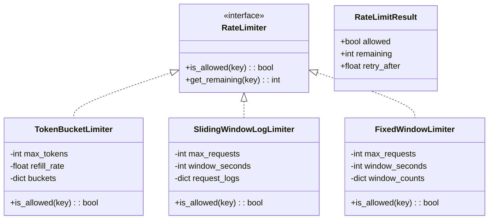

# ⏱️ RATE LIMITER — Complete LLD Guide
## The Definitive 17-Section Edition — V2.0

---

## 📖 Table of Contents
1. [🎯 Problem Statement & Context](#-1-problem-statement--context)
2. [🗣️ Requirement Gathering](#-2-requirement-gathering)
3. [✅ Requirements (FR + NFR)](#-3-requirements)
4. [🧠 Key Insight: Sliding Window + Token Bucket Algorithms](#-4-key-insight)
5. [📐 Class Diagram & Entity Relationships](#-5-class-diagram)
6. [🔧 API Design (Public Interface)](#-6-api-design)
7. [🏗️ Complete Code Implementation](#-7-complete-code)
8. [📊 Data Structure Choices & Trade-offs](#-8-data-structure-choices)
9. [🔒 Concurrency & Thread Safety Deep Dive](#-9-concurrency-deep-dive)
10. [🧪 SOLID Principles Mapping](#-10-solid-principles)
11. [🎨 Design Patterns Used](#-11-design-patterns)
12. [💾 Database Schema (Production View)](#-12-database-schema)
13. [⚠️ Edge Cases & Error Handling](#-13-edge-cases)
14. [🎮 Full Working Demo](#-14-full-working-demo)
15. [🎤 Interviewer Follow-ups (15+)](#-15-interviewer-follow-ups)
16. [⏱️ Interview Strategy (45-min Plan)](#-16-interview-strategy)
17. [🧠 Quick Recall Cheat Sheet](#-17-quick-recall)

---

# 🎯 1. Problem Statement & Context

## What You're Designing

> Design a **Rate Limiter** that controls how many requests a user (or IP, API key) can make within a time window. If the limit is exceeded, reject the request with `429 Too Many Requests`. Support multiple algorithms (Token Bucket, Sliding Window Log, Sliding Window Counter, Fixed Window), configurable rules per user/endpoint, and thread-safe operation.

## Real-World Context

| Metric | Real System |
|--------|-------------|
| Usage | Every API gateway: AWS API Gateway, Cloudflare, Nginx, Redis-based |
| Common limits | 100 req/min, 1000 req/hour, 10K req/day |
| Granularity | Per user, per IP, per API key, per endpoint |
| Response | HTTP 429 Too Many Requests + `Retry-After` header |
| Storage | Redis (distributed), in-memory (single node) |

## Why Interviewers Love This Problem

| What They Test | How This Tests It |
|---------------|-------------------|
| **Algorithm knowledge** ⭐ | 4+ algorithms with different trade-offs |
| **Time-based computation** | Sliding windows, token refill rates |
| **Strategy pattern** | Different algorithms, same interface |
| **Concurrency** | Atomic check-and-increment under load |
| **Distributed systems** | Redis for multi-server rate limiting |
| **Trade-off discussion** | Memory vs accuracy vs performance |

---

# 🗣️ 2. Requirement Gathering

## Must-Ask Questions

| # | Question | WHY You Ask | Design Impact |
|---|----------|-------------|---------------|
| 1 | "Rate limit per user, IP, or API key?" | **Key identity** | Rate limit keyed by user_id or IP address |
| 2 | "What algorithm?" | **THE core design** | Token Bucket, Sliding Window, Fixed Window |
| 3 | "Limit per what window? Minute, hour, day?" | Window configuration | Configurable: `max_requests` per `window_seconds` |
| 4 | "Single server or distributed?" | Storage backend | In-memory (single) vs Redis (distributed) |
| 5 | "What happens when limited?" | Response behavior | HTTP 429 + `Retry-After` header |
| 6 | "Different limits per endpoint?" | Multi-rule support | `/api/login`: 5/min, `/api/data`: 100/min |
| 7 | "Burst handling?" | Token Bucket vs Fixed Window | Token Bucket allows controlled bursts |
| 8 | "Hard limit or soft limit?" | Strictness | Hard: strict reject. Soft: allow some overflow |

### 🎯 THE answer that shows deep algorithm knowledge

> "There are 4 main algorithms, each with different trade-offs. Let me compare them and implement the two most practical ones: **Token Bucket** for burst-friendly scenarios and **Sliding Window Log** for precise counting."

---

# ✅ 3. Requirements

## Functional Requirements

| Priority | ID | Requirement | Complexity |
|----------|-----|-------------|-----------|
| **P0** | FR-1 | **is_allowed(key)** — check if request should be allowed | High |
| **P0** | FR-2 | Configurable limit: `max_requests` per `window_seconds` | Low |
| **P0** | FR-3 | Per-key tracking (user_id, IP, API key) | Medium |
| **P0** | FR-4 | Return remaining quota + retry-after time | Medium |
| **P1** | FR-5 | Multiple algorithms (Token Bucket, Sliding Window) | High |
| **P1** | FR-6 | Per-endpoint different limits | Medium |
| **P2** | FR-7 | Distributed rate limiting (Redis backend) | High |

---

# 🧠 4. Key Insight: The 4 Algorithms Compared

## 🤔 THINK: Window = 1 minute, max = 5 requests. User sends 6th request at 0:45. Allow or reject?

<details>
<summary>👀 Click to reveal — All 4 algorithms with traces</summary>

### Algorithm 1: Fixed Window Counter

```
Window: [0:00 — 1:00], max = 5

0:10 → count=1 ✅   0:20 → count=2 ✅   0:30 → count=3 ✅
0:40 → count=4 ✅   0:45 → count=5 ✅   0:50 → count=6 ❌ REJECTED!
1:00 → NEW WINDOW → count RESETS to 0
1:05 → count=1 ✅

Problem: BOUNDARY BURST!
At 0:59: 5 requests (allowed)
At 1:01: 5 more requests (new window, allowed)
→ 10 requests in 2 seconds! Defeats the purpose!

  │    Window 1     │    Window 2     │
  ├─────────────────┼─────────────────┤
  │          5 req▐▌5 req            │
  │            ←2s→                  │
  │   10 requests in 2 seconds! 💀   │
```

### Algorithm 2: Sliding Window Log ⭐

```
Window: 60 seconds, max = 5
Store: list of timestamps per user

0:10 → log=[0:10]         count=1 ✅
0:20 → log=[0:10,0:20]    count=2 ✅
0:30 → log=[0:10,0:20,0:30]    count=3 ✅
0:40 → log=[0:10,0:20,0:30,0:40]    count=4 ✅
0:45 → log=[0:10,0:20,0:30,0:40,0:45]    count=5 ✅
0:50 → log=[0:10,0:20,0:30,0:40,0:45] count=5 → 6th? ❌ REJECTED!

1:15 → Remove timestamps before (1:15 - 60s = 0:15)
       Remove 0:10
       log=[0:20,0:30,0:40,0:45]   count=4 ✅ (one slot freed!)

✅ No boundary burst problem — window slides continuously!
❌ Memory: stores every timestamp (high volume = lots of memory)
```

### Algorithm 3: Sliding Window Counter

```
Combines Fixed Window + weighted overlap for approximation.
Memory efficient but approximate.

Current window: 1:00-2:00, count_current = 3
Previous window: 0:00-1:00, count_prev = 7
Time now: 1:15 (25% into current window)

Weighted count = count_current + count_prev × (1 - 0.25)
               = 3 + 7 × 0.75 = 3 + 5.25 = 8.25

If max = 10: 8.25 < 10 → ALLOW ✅

✅ Low memory (2 counters per window)
❌ Approximate — not exact
```

### Algorithm 4: Token Bucket ⭐

```
Bucket: max_tokens=5, refill_rate=5 tokens/minute

Start: tokens=5

0:10 → tokens=5-1=4 ✅    0:11 → 3 ✅    0:12 → 2 ✅
0:13 → 1 ✅    0:14 → 0 ✅    0:15 → 0, empty! ❌ REJECTED!

0:22 → 12 seconds passed. Refill: 12/60 × 5 = 1 token
       tokens = 0 + 1 = 1 → consume → tokens=0 ✅

1:00 → 38 seconds passed. Refill: 38/60 × 5 = 3.17 → 3 tokens
       tokens = min(0+3, 5) = 3 ✅

✅ Allows bursts (use all 5 at once)
✅ Smooth refill (not window boundary)
✅ Low memory (2 values: tokens + last_refill_time)
```

### Algorithm Comparison Table (Draw This in Interview!)

| Algorithm | Memory | Accuracy | Burst | Complexity | Best For |
|-----------|--------|----------|-------|-----------|----------|
| **Fixed Window** | O(1) per key | Low (boundary issue) | Allows 2× | Simple | Quick prototype |
| **Sliding Window Log** | O(N) per key | **Exact** | No burst | Medium | Precise limiting |
| **Sliding Window Counter** | O(1) per key | ~98% accurate | Smoothed | Medium | Production (Redis) |
| **Token Bucket** ⭐ | O(1) per key | Exact | **Controlled burst** | Medium | API gateways |

</details>

---

# 📐 5. Class Diagram & Entity Relationships



---

# 🔧 6. API Design (Public Interface)

```python
class RateLimiter(ABC):
    """
    Strategy interface for rate limiting.
    
    Usage:
        limiter = TokenBucketLimiter(max_tokens=10, refill_rate=10)
        
        if limiter.is_allowed("user_42"):
            process_request()
        else:
            return HTTP_429, {"retry_after": limiter.get_retry_after("user_42")}
    """
    
    @abstractmethod
    def is_allowed(self, key: str) -> bool:
        """Check if request from this key is allowed. Consumes a token/slot."""
    
    @abstractmethod
    def get_remaining(self, key: str) -> int:
        """How many requests left in current window?"""
    
    @abstractmethod
    def get_retry_after(self, key: str) -> float:
        """Seconds until the next request would be allowed."""
```

---

# 🏗️ 7. Complete Code Implementation

## Token Bucket Algorithm

```python
import time
import threading
from abc import ABC, abstractmethod
from collections import deque
import math

class TokenBucket:
    """
    A single user's token bucket.
    
    Invariant: tokens ∈ [0, max_tokens]
    
    Lazy refill: Don't run a timer. Calculate how many tokens
    should have been added SINCE last access.
    
    This is the key insight: refill is LAZY, not active.
    No background thread needed!
    """
    def __init__(self, max_tokens: int, refill_rate: float):
        self.max_tokens = max_tokens
        self.tokens = max_tokens  # Start full
        self.refill_rate = refill_rate  # tokens per second
        self.last_refill = time.time()
    
    def _refill(self):
        """
        Lazy refill: calculate tokens earned since last access.
        
        Example: refill_rate = 10 tokens/sec, 0.5 sec elapsed
        Earned = 0.5 × 10 = 5 tokens
        New tokens = min(current + 5, max_tokens)
        """
        now = time.time()
        elapsed = now - self.last_refill
        earned = elapsed * self.refill_rate
        self.tokens = min(self.max_tokens, self.tokens + earned)
        self.last_refill = now
    
    def consume(self) -> bool:
        """Try to consume one token. Returns True if allowed."""
        self._refill()
        if self.tokens >= 1:
            self.tokens -= 1
            return True
        return False
    
    @property
    def remaining(self) -> int:
        self._refill()
        return int(self.tokens)
    
    @property
    def retry_after(self) -> float:
        """Seconds until 1 token is available."""
        if self.tokens >= 1:
            return 0
        tokens_needed = 1 - self.tokens
        return tokens_needed / self.refill_rate


class TokenBucketLimiter:
    """
    Rate limiter using Token Bucket algorithm.
    
    Per-key bucket: each user/IP has its own bucket.
    Lazy creation: bucket created on first request.
    Lazy refill: no background thread.
    
    Config:
        max_tokens = burst capacity (max requests at once)
        refill_rate = tokens per second (sustained rate)
    
    Example: max_tokens=10, refill_rate=2/sec
    → Burst: 10 requests at once
    → Sustained: 2 requests/second
    → After burst: must wait 5 seconds to refill to 10
    """
    def __init__(self, max_tokens: int, refill_rate: float):
        self.max_tokens = max_tokens
        self.refill_rate = refill_rate
        self.buckets: dict[str, TokenBucket] = {}
        self._lock = threading.Lock()
    
    def _get_bucket(self, key: str) -> TokenBucket:
        if key not in self.buckets:
            self.buckets[key] = TokenBucket(self.max_tokens, self.refill_rate)
        return self.buckets[key]
    
    def is_allowed(self, key: str) -> bool:
        with self._lock:
            bucket = self._get_bucket(key)
            return bucket.consume()
    
    def get_remaining(self, key: str) -> int:
        bucket = self.buckets.get(key)
        return bucket.remaining if bucket else self.max_tokens
    
    def get_retry_after(self, key: str) -> float:
        bucket = self.buckets.get(key)
        return bucket.retry_after if bucket else 0
    
    def check_with_info(self, key: str) -> dict:
        """Returns full info: allowed, remaining, retry_after."""
        with self._lock:
            bucket = self._get_bucket(key)
            allowed = bucket.consume()
            return {
                "allowed": allowed,
                "remaining": bucket.remaining,
                "retry_after": round(bucket.retry_after, 2),
                "limit": self.max_tokens,
            }
```

## Sliding Window Log Algorithm

```python
class SlidingWindowLogLimiter:
    """
    Rate limiter using Sliding Window Log.
    
    Per-key: stores deque of timestamps.
    On each request:
    1. Remove timestamps older than (now - window_seconds)
    2. Count remaining timestamps
    3. If count < max_requests → ALLOW + add timestamp
    4. If count >= max_requests → REJECT
    
    ✅ Exact counting — no boundary burst
    ❌ Memory: O(max_requests) per key
    
    Best for: Low-volume precise limiting (login attempts, SMS OTP)
    """
    def __init__(self, max_requests: int, window_seconds: int):
        self.max_requests = max_requests
        self.window_seconds = window_seconds
        self.request_logs: dict[str, deque] = {}
        self._lock = threading.Lock()
    
    def _cleanup(self, key: str) -> deque:
        """Remove expired timestamps from the window."""
        if key not in self.request_logs:
            self.request_logs[key] = deque()
        
        log = self.request_logs[key]
        cutoff = time.time() - self.window_seconds
        while log and log[0] < cutoff:
            log.popleft()  # O(1) — deque!
        return log
    
    def is_allowed(self, key: str) -> bool:
        with self._lock:
            log = self._cleanup(key)
            if len(log) < self.max_requests:
                log.append(time.time())
                return True
            return False
    
    def get_remaining(self, key: str) -> int:
        log = self._cleanup(key) if key in self.request_logs else deque()
        return max(0, self.max_requests - len(log))
    
    def get_retry_after(self, key: str) -> float:
        if key not in self.request_logs:
            return 0
        log = self._cleanup(key)
        if len(log) < self.max_requests:
            return 0
        # Earliest timestamp + window = when it expires
        return max(0, log[0] + self.window_seconds - time.time())
```

## Fixed Window Counter Algorithm

```python
class FixedWindowLimiter:
    """
    Simplest algorithm. Divide time into fixed windows.
    Count requests per window. Reset at window boundary.
    
    ✅ O(1) memory per key (just counter + window_start)
    ❌ Boundary burst: 2× limit possible at window boundary
    
    Best for: Simple use cases where boundary burst is acceptable.
    """
    def __init__(self, max_requests: int, window_seconds: int):
        self.max_requests = max_requests
        self.window_seconds = window_seconds
        self.windows: dict[str, tuple[float, int]] = {}  # key → (window_start, count)
        self._lock = threading.Lock()
    
    def _get_window(self, key: str) -> tuple[float, int]:
        now = time.time()
        if key not in self.windows:
            self.windows[key] = (now, 0)
        
        window_start, count = self.windows[key]
        if now - window_start >= self.window_seconds:
            # New window!
            self.windows[key] = (now, 0)
            return (now, 0)
        return (window_start, count)
    
    def is_allowed(self, key: str) -> bool:
        with self._lock:
            window_start, count = self._get_window(key)
            if count < self.max_requests:
                self.windows[key] = (window_start, count + 1)
                return True
            return False
    
    def get_remaining(self, key: str) -> int:
        _, count = self._get_window(key) if key in self.windows else (0, 0)
        return max(0, self.max_requests - count)
    
    def get_retry_after(self, key: str) -> float:
        if key not in self.windows:
            return 0
        window_start, count = self.windows[key]
        if count < self.max_requests:
            return 0
        return max(0, window_start + self.window_seconds - time.time())
```

## Rate Limiter Factory

```python
class RateLimiterFactory:
    """
    Factory to create rate limiters by algorithm name.
    Centralizes configuration.
    """
    @staticmethod
    def create(algorithm: str, **kwargs):
        if algorithm == "token_bucket":
            return TokenBucketLimiter(
                max_tokens=kwargs.get("max_tokens", 10),
                refill_rate=kwargs.get("refill_rate", 1.0),
            )
        elif algorithm == "sliding_window":
            return SlidingWindowLogLimiter(
                max_requests=kwargs.get("max_requests", 10),
                window_seconds=kwargs.get("window_seconds", 60),
            )
        elif algorithm == "fixed_window":
            return FixedWindowLimiter(
                max_requests=kwargs.get("max_requests", 10),
                window_seconds=kwargs.get("window_seconds", 60),
            )
        else:
            raise ValueError(f"Unknown algorithm: {algorithm}")
```

---

# 📊 8. Data Structure Choices & Trade-offs

| Data Structure | Where | Why | Alternative | Why Not |
|---------------|-------|-----|-------------|---------|
| `dict[str, TokenBucket]` | TokenBucketLimiter.buckets | O(1) per-key lookup. Lazy creation | Pre-allocate all | Don't know keys ahead of time |
| `deque` | SlidingWindowLog timestamps | O(1) popleft for cleanup. O(1) append | `list` | list.pop(0) is O(N)! deque.popleft() is O(1) |
| `tuple(start, count)` | FixedWindow per key | Minimal memory: just 2 values | Object | Tuple is lighter for simple data |
| `float` | TokenBucket.tokens | Supports fractional tokens from lazy refill | `int` | Refill can produce 0.7 tokens — need float |

### Why deque, not list, for Sliding Window?

```python
# ❌ List: cleanup is O(N) — must shift all elements
timestamps = [0.1, 0.2, 0.3, ..., 0.99]  # 1000 timestamps
timestamps.pop(0)  # O(N) — shifts 999 elements!

# ✅ deque: cleanup is O(1)
timestamps = deque([0.1, 0.2, 0.3, ..., 0.99])
timestamps.popleft()  # O(1) — ring buffer, no shift!

# For 100K requests/sec, this difference is CRITICAL.
```

---

# 🔒 9. Concurrency & Thread Safety Deep Dive

## The Check-Then-Update Race

```
Timeline: Token Bucket with 1 token left

t=0: Thread A → reads tokens = 1 → 1 >= 1 → ALLOW!
t=1: Thread B → reads tokens = 1 → 1 >= 1 → ALLOW! (not decremented yet!)
t=2: Thread A → tokens = 1 - 1 = 0
t=3: Thread B → tokens = 0 - 1 = -1 💀 OVER-LIMIT!
```

```python
# Fix: Atomic check-and-decrement
def is_allowed(self, key):
    with self._lock:          # Atomic check + update
        bucket = self._get_bucket(key)
        if bucket.tokens >= 1:
            bucket.tokens -= 1  # Decrement INSIDE the lock
            return True
        return False
```

### Production: Redis Atomic Operations

```lua
-- Redis Lua script for atomic token bucket
local key = KEYS[1]
local max_tokens = tonumber(ARGV[1])
local refill_rate = tonumber(ARGV[2])
local now = tonumber(ARGV[3])

local data = redis.call('HMGET', key, 'tokens', 'last_refill')
local tokens = tonumber(data[1]) or max_tokens
local last_refill = tonumber(data[2]) or now

-- Refill
local elapsed = now - last_refill
tokens = math.min(max_tokens, tokens + elapsed * refill_rate)

-- Check
if tokens >= 1 then
    tokens = tokens - 1
    redis.call('HMSET', key, 'tokens', tokens, 'last_refill', now)
    return 1  -- ALLOWED
else
    redis.call('HMSET', key, 'tokens', tokens, 'last_refill', now)
    return 0  -- REJECTED
end
-- Lua script = atomic in Redis. No race condition!
```

---

# 🧪 10. SOLID Principles Mapping

| Principle | Where Applied | Explanation |
|-----------|--------------|-------------|
| **S** | TokenBucket vs Limiter | TokenBucket = one user's state. Limiter = manages all users |
| **O** ⭐⭐⭐ | **RateLimiter interface** | New algorithm (Leaky Bucket) = new class. ZERO change to API gateway |
| **L** | All limiters substitutable | `limiter.is_allowed(key)` works for TokenBucket, SlidingWindow, FixedWindow identically |
| **I** | 3-method interface | `is_allowed`, `get_remaining`, `get_retry_after`. Minimal |
| **D** | Gateway → RateLimiter interface | API gateway depends on interface, not TokenBucketLimiter specifically |

---

# 🎨 11. Design Patterns Used

| Pattern | Where | Why |
|---------|-------|-----|
| **Strategy** ⭐⭐⭐ | RateLimiter interface | TokenBucket, SlidingWindow, FixedWindow — interchangeable algorithms |
| **Factory** | RateLimiterFactory | Create limiter by config string |
| **Proxy** | (Extension) RateLimitMiddleware | Wraps API handler, checks limit before forwarding |
| **Decorator** | (Extension) LoggingRateLimiter | Wraps limiter, adds logging |
| **Singleton** | (Extension) per-service limiter | One limiter instance per service |

### Cross-Problem Strategy Comparison

| System | Strategy Interface | Concrete Strategies |
|--------|-------------------|---------------------|
| **Rate Limiter** | RateLimiter | TokenBucket, SlidingWindow, FixedWindow |
| **Payment** | PaymentStrategy | Cash, Card, UPI |
| **Logging** | LogHandler | Console, File, DB |
| **Sorting** | Comparator | ByName, ByPrice, ByDate |

---

# 💾 12. Database Schema (Production View)

```sql
-- Redis is the standard, but here's SQL equivalent

CREATE TABLE rate_limit_buckets (
    key_id      VARCHAR(255) PRIMARY KEY,  -- "user:42" or "ip:1.2.3.4"
    tokens      DECIMAL(10,4) NOT NULL,
    max_tokens  INTEGER NOT NULL,
    refill_rate DECIMAL(10,4) NOT NULL,
    last_refill TIMESTAMP(6) NOT NULL,
    INDEX idx_key (key_id)
);

-- Redis commands (production standard):
-- Token Bucket: HMSET user:42 tokens 10 last_refill 1698000000
-- Sliding Window: ZADD ratelimit:user:42 {timestamp} {request_id}
-- Fixed Window: INCR ratelimit:user:42:window:1698000000
-- TTL: EXPIRE ratelimit:user:42 60 (auto-cleanup!)
```

---

# ⚠️ 13. Edge Cases & Error Handling

| # | Edge Case | Fix |
|---|-----------|-----|
| 1 | **First request ever** | Lazy bucket creation. Start with max tokens |
| 2 | **Clock skew (distributed)** | Use server-side timestamps only. NTP sync |
| 3 | **Token count goes negative** | Enforce `max(0, tokens - 1)`. Never below 0 |
| 4 | **Refill overflow** | `min(tokens + earned, max_tokens)`. Cap at max |
| 5 | **Very old bucket (hours since last request)** | Lazy refill. Tokens = min(max_tokens, tokens + huge_earned) = max_tokens |
| 6 | **Different limits per endpoint** | Composite key: `"user:42:/api/login"` with different configs |
| 7 | **Bucket memory leak** | Evict buckets not accessed in 10× window. Background cleanup |
| 8 | **Burst at exactly window boundary** | Sliding Window or Token Bucket — no boundary burst |
| 9 | **Rate limit the rate limiter** | O(1) per check. No recursion risk |
| 10 | **Client retries immediately after 429** | `Retry-After` header tells client when to retry |

---

# 🎮 14. Full Working Demo

```python
if __name__ == "__main__":
    print("=" * 65)
    print("     ⏱️ RATE LIMITER — COMPLETE DEMO")
    print("=" * 65)
    
    # ─── Test 1: Token Bucket ───
    print("\n─── Test 1: Token Bucket (5 tokens, refill 2/sec) ───")
    tb = TokenBucketLimiter(max_tokens=5, refill_rate=2)
    
    for i in range(7):
        result = tb.check_with_info("user_1")
        status = "✅ ALLOWED" if result["allowed"] else "❌ REJECTED"
        print(f"   Request {i+1}: {status} | "
              f"Remaining: {result['remaining']} | "
              f"Retry after: {result['retry_after']}s")
    
    # Wait for refill
    print("\n   ⏳ Waiting 1 second for refill...")
    time.sleep(1)
    result = tb.check_with_info("user_1")
    print(f"   After 1s: {'✅' if result['allowed'] else '❌'} | "
          f"Remaining: {result['remaining']}")
    
    # ─── Test 2: Sliding Window Log ───
    print("\n─── Test 2: Sliding Window Log (3 req / 2 sec) ───")
    sw = SlidingWindowLogLimiter(max_requests=3, window_seconds=2)
    
    for i in range(5):
        allowed = sw.is_allowed("user_2")
        remaining = sw.get_remaining("user_2")
        print(f"   Request {i+1}: {'✅' if allowed else '❌'} | "
              f"Remaining: {remaining}")
    
    print("   ⏳ Waiting 2 seconds...")
    time.sleep(2)
    allowed = sw.is_allowed("user_2")
    print(f"   After 2s: {'✅' if allowed else '❌'} | "
          f"Remaining: {sw.get_remaining('user_2')}")
    
    # ─── Test 3: Fixed Window ───
    print("\n─── Test 3: Fixed Window (3 req / 2 sec) ───")
    fw = FixedWindowLimiter(max_requests=3, window_seconds=2)
    
    for i in range(5):
        allowed = fw.is_allowed("user_3")
        print(f"   Request {i+1}: {'✅' if allowed else '❌'} | "
              f"Remaining: {fw.get_remaining('user_3')}")
    
    # ─── Test 4: Per-User Isolation ───
    print("\n─── Test 4: Per-User Isolation ───")
    iso = TokenBucketLimiter(max_tokens=2, refill_rate=1)
    iso.is_allowed("alice"); iso.is_allowed("alice")  # Use up alice's tokens
    
    alice_result = iso.is_allowed("alice")
    bob_result = iso.is_allowed("bob")
    print(f"   Alice (3rd req): {'✅' if alice_result else '❌'}")
    print(f"   Bob   (1st req): {'✅' if bob_result else '❌'}")
    
    # ─── Test 5: Factory ───
    print("\n─── Test 5: Factory Pattern ───")
    limiter = RateLimiterFactory.create("token_bucket", max_tokens=3, refill_rate=1)
    for i in range(4):
        allowed = limiter.is_allowed("user_5")
        print(f"   Request {i+1}: {'✅' if allowed else '❌'}")
    
    # ─── Test 6: Multi-threaded ───
    print("\n─── Test 6: Multi-threaded (10 threads, 5 tokens) ───")
    mt_limiter = TokenBucketLimiter(max_tokens=5, refill_rate=0)
    results = {"allowed": 0, "rejected": 0}
    result_lock = threading.Lock()
    
    def worker():
        if mt_limiter.is_allowed("concurrent_user"):
            with result_lock: results["allowed"] += 1
        else:
            with result_lock: results["rejected"] += 1
    
    threads = [threading.Thread(target=worker) for _ in range(10)]
    for t in threads: t.start()
    for t in threads: t.join()
    print(f"   Allowed: {results['allowed']} (should be 5)")
    print(f"   Rejected: {results['rejected']} (should be 5)")
    
    print(f"\n{'='*65}")
    print("     ✅ ALL 6 TESTS COMPLETE!")
    print(f"{'='*65}")
```

---

# 🎤 15. Interviewer Follow-ups (15+)

| Q | Question | Key Answer |
|---|----------|-----------|
| 1 | "Token Bucket vs Sliding Window?" | TB allows bursts, O(1) memory. SW is exact, O(N) memory. TB for APIs, SW for security (login limiting) |
| 2 | "Fixed Window boundary burst?" | At window boundary: 2× limit. Sliding window or TB fix this |
| 3 | "Lazy vs active refill?" | Lazy = calculate on access. No background thread. More efficient |
| 4 | "Why float for tokens?" | Lazy refill can produce fractional tokens (0.7 tokens after 0.35s) |
| 5 | "Distributed rate limiting?" | Redis with Lua script for atomic check + decrement. Shared state |
| 6 | "Per-endpoint limits?" | Composite key: `"user:42:/api/login"`. Different limiter configs per endpoint |
| 7 | "Memory cleanup?" | Evict buckets not accessed in TTL. Background sweep or lazy eviction |
| 8 | "What headers to return?" | `X-RateLimit-Limit`, `X-RateLimit-Remaining`, `Retry-After` |
| 9 | "Rate limiting WebSockets?" | Per-connection message rate. Same token bucket, key = connection_id |
| 10 | "Sliding Window Counter?" | Approximate: weighted average of current + previous window. O(1) memory |
| 11 | "Leaky Bucket?" | Like token bucket but fixed outflow rate. Used for traffic shaping |
| 12 | "WAF vs application rate limiting?" | WAF = network layer (IP-based). App = user-based. Both needed |
| 13 | "Bypass for internal services?" | Whitelist internal IPs or service accounts. Skip rate limiting |
| 14 | "Graceful degradation?" | If Redis down: allow all (fail-open) or reject all (fail-closed). Depends on use case |
| 15 | "Testing rate limiters?" | Mock time.time(). Inject fake timestamps for deterministic tests |

---

# ⏱️ 16. Interview Strategy (45-min Plan)

| Time | Phase | What You Do |
|------|-------|-------------|
| **0–5** | Clarify | Per-user/IP, window size, algorithm choice, distributed? |
| **5–12** | Key Insight | Draw 4-algorithm comparison table. Explain boundary burst problem. Choose Token Bucket |
| **12–15** | Class Diagram | RateLimiter interface, TokenBucket, SlidingWindowLog |
| **15–30** | Code | TokenBucket (lazy refill!), SlidingWindowLog (deque cleanup), is_allowed |
| **30–38** | Demo | Burst, exhaustion, refill wait, per-user isolation, multi-threaded |
| **38–45** | Extensions | Redis Lua script, per-endpoint limits, distributed, Retry-After header |

## Golden Sentences

> **Opening:** "There are 4 rate limiting algorithms with different trade-offs. Token Bucket is best for APIs (allows bursts, O(1) memory). Sliding Window Log is best for precise security limits (login attempts)."

> **Key trick:** "Token Bucket uses LAZY refill — no background thread. On each request, calculate how many tokens should have accumulated since last access."

> **Concurrency:** "Check-and-decrement must be atomic. Single lock for in-memory. Redis Lua script for distributed."

---

# 🧠 17. Quick Recall Cheat Sheet

## ⏱️ 30-Second Recall

> **4 algorithms:** Fixed Window (simple, boundary burst), Sliding Window Log (exact, O(N) memory), Sliding Window Counter (approximate, O(1)), Token Bucket (burst-friendly, O(1), lazy refill). **Token Bucket:** `tokens = min(max, tokens + elapsed × rate)`. Consume = `tokens -= 1`. **is_allowed** = atomic check + decrement. Per-key dict of buckets.

## ⏱️ 2-Minute Recall

Add:
> **Token Bucket:** Lazy refill (no background thread). Float tokens for fractional refill. `min(max_tokens, tokens + earned)`.
> **Sliding Window:** deque of timestamps. Cleanup: `popleft()` while oldest < cutoff. Count < max → allow.
> **Strategy pattern:** RateLimiter interface → TokenBucket, SlidingWindow, FixedWindow. Factory creates by config.
> **Concurrency:** Lock on is_allowed. Production: Redis Lua script (atomic).

## ⏱️ 5-Minute Recall

Add:
> **Fixed Window boundary burst:** 0:59 = 5 req + 1:01 = 5 req = 10 in 2 seconds. Sliding/TB don't have this.
> **Redis Lua:** `HMGET tokens last_refill` → refill → check → `HMSET`. Entire script is atomic.
> **Headers:** `X-RateLimit-Limit`, `X-RateLimit-Remaining`, `Retry-After`.
> **Per-endpoint:** Composite key `"user:42:/api/login"`. Different config per endpoint.
> **Memory cleanup:** Evict old buckets. Background sweep or lazy eviction on access.
> **Compare:** HashMap+deque (Sliding Window), HashMap+tuple (Fixed Window), HashMap+object (Token Bucket). HashMap + X pattern again.

---

## ✅ Pre-Implementation Checklist

- [ ] **4-algorithm comparison** table (draw in interview!)
- [ ] **TokenBucket** (max_tokens, tokens as float, refill_rate, last_refill, lazy _refill, consume)
- [ ] **TokenBucketLimiter** (dict of per-key buckets, _lock, is_allowed, check_with_info)
- [ ] **SlidingWindowLogLimiter** (dict of per-key deques, _cleanup, is_allowed)
- [ ] **FixedWindowLimiter** (dict of per-key (start, count) tuples, is_allowed)
- [ ] **RateLimiterFactory** (create by algorithm name)
- [ ] **Thread safety:** lock on is_allowed for atomic check+update
- [ ] **Demo:** burst, exhaustion, refill, per-user isolation, multi-threaded correctness

---

*Version 2.0 — The Definitive 17-Section Edition (Gold Standard)*
