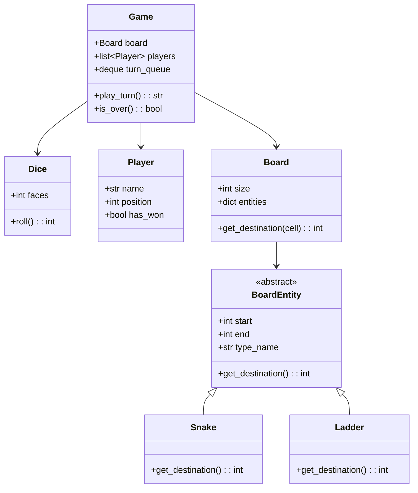

# 🐍🪜 SNAKE AND LADDERS — Complete LLD Guide
## The Definitive 17-Section Edition — V2.0

---

## 📖 Table of Contents
1. [🎯 Problem Statement & Context](#-1-problem-statement--context)
2. [🗣️ Requirement Gathering](#-2-requirement-gathering)
3. [✅ Requirements (FR + NFR)](#-3-requirements)
4. [🧠 Key Insight: Board Entities + Turn-Based Game Loop](#-4-key-insight)
5. [📐 Class Diagram & Entity Relationships](#-5-class-diagram)
6. [🔧 API Design (Public Interface)](#-6-api-design)
7. [🏗️ Complete Code Implementation](#-7-complete-code)
8. [📊 Data Structure Choices & Trade-offs](#-8-data-structure-choices)
9. [🔒 Concurrency & Thread Safety Deep Dive](#-9-concurrency-deep-dive)
10. [🧪 SOLID Principles Mapping](#-10-solid-principles)
11. [🎨 Design Patterns Used](#-11-design-patterns)
12. [💾 Database Schema (Production View)](#-12-database-schema)
13. [⚠️ Edge Cases & Error Handling](#-13-edge-cases)
14. [🎮 Full Working Demo](#-14-full-working-demo)
15. [🎤 Interviewer Follow-ups (15+)](#-15-interviewer-follow-ups)
16. [⏱️ Interview Strategy (45-min Plan)](#-16-interview-strategy)
17. [🧠 Quick Recall Cheat Sheet](#-17-quick-recall)

---

# 🎯 1. Problem Statement & Context

## What You're Designing

> Design a **Snake and Ladders** board game where N players take turns rolling a dice. The board has numbered cells (1–100) with snakes (go DOWN from head to tail) and ladders (go UP from bottom to top). A player wins by reaching exactly cell 100. If a roll would take them past 100, they stay in place. The game supports multiple players, configurable board, and tracks game state.

## Why Interviewers Love This Problem

| What They Test | How This Tests It |
|---------------|-------------------|
| **Board entity design** | Snake and Ladder as board entities with start→end mapping |
| **Turn-based game loop** | Player queue, dice roll, move, check win |
| **Entity hierarchy** | BoardEntity ABC → Snake, Ladder (polymorphism) |
| **Position calculation** | raw_position → check entity → final_position |
| **Game state** | IN_PROGRESS, COMPLETED, tracking winner |
| **Configurable board** | Variable snakes/ladders, board size |

---

# 🗣️ 2. Requirement Gathering

## Must-Ask Questions

| # | Question | WHY You Ask | Design Impact |
|---|----------|-------------|---------------|
| 1 | "Board size? Standard 100?" | Board configuration | Configurable: default 100, but could be any N² |
| 2 | "How many snakes and ladders?" | Board setup | Configurable list of (start, end) pairs |
| 3 | "Snake and Ladder: same entity or different?" | **ABC opportunity** | BoardEntity ABC → Snake (down), Ladder (up). Or unified with direction |
| 4 | "Number of players?" | Game size | 2–4 typical. Queue-based turn management |
| 5 | "Exact 100 to win, or >= 100?" | Win condition | Must land EXACTLY on 100. If roll goes past, stay in place |
| 6 | "Can a snake land you on a ladder?" | Cascading | Usually no cascading. One entity per cell max |
| 7 | "Dice: 1–6 standard?" | Dice configuration | Standard single die. Mention two-dice extension |
| 8 | "Multiple players on same cell?" | Collision | Allowed — no collision rule in standard game |

### 🎯 THE design insight

> "Snake and Ladder both have a `start` and `end` cell. The only difference is direction: Snake goes DOWN (start > end), Ladder goes UP (start < end). I can model this as a single mapping: `cell_number → destination_cell`."

---

# ✅ 3. Requirements

## Functional Requirements

| Priority | ID | Requirement | Complexity |
|----------|-----|-------------|-----------|
| **P0** | FR-1 | Board with cells 1–100 | Low |
| **P0** | FR-2 | Configurable **snakes** (head → tail, moves DOWN) | Low |
| **P0** | FR-3 | Configurable **ladders** (bottom → top, moves UP) | Low |
| **P0** | FR-4 | **Dice roll** (1–6 random) | Low |
| **P0** | FR-5 | **Turn-based** movement: roll → move → check entity → final position | High |
| **P0** | FR-6 | **Win condition**: exactly reach cell 100 | Medium |
| **P0** | FR-7 | Multiple players with turn queue | Medium |
| **P1** | FR-8 | Game state tracking (IN_PROGRESS, COMPLETED, winner) | Low |
| **P2** | FR-9 | Move history / game replay | Low |

---

# 🧠 4. Key Insight: Board Entities as Position Mapping

## 🤔 THINK: Player is at cell 14, rolls 3, lands on 17. Cell 17 has a snake head. What happens?

<details>
<summary>👀 Click to reveal — The movement pipeline</summary>

### The Movement Pipeline

```
Player at cell 14, rolls 3:

Step 1: Calculate raw position
  raw = 14 + 3 = 17

Step 2: Check bounds
  17 <= 100 → valid (if > 100, stay at 14)

Step 3: Check board entities at cell 17
  Cell 17 has SNAKE (head=17, tail=7)
  → Player slides DOWN to cell 7!

Step 4: Final position = 7

Trace: 14 → roll 3 → [17] → 🐍 snake! → 7
```

### Board Entity Mapping: The Clean Solution

```python
# The entire board can be represented as a DICT:
# cell_number → destination_cell

entities = {
    17: 7,    # Snake: 17 → 7 (go DOWN)
    54: 34,   # Snake: 54 → 34
    62: 19,   # Snake: 62 → 19
    4: 14,    # Ladder: 4 → 14 (go UP)
    9: 31,    # Ladder: 9 → 31
    21: 42,   # Ladder: 21 → 42
}

# Movement:
def move(current, dice_roll):
    new_pos = current + dice_roll
    if new_pos > 100:
        return current  # Stay — can't go past 100
    if new_pos in entities:
        return entities[new_pos]  # Snake or Ladder!
    return new_pos  # Normal move
```

### Why This is Elegant

```
Using a dict:
- O(1) check: "does this cell have a snake or ladder?"
- No class hierarchy needed for simple implementation
- But for LLD interview: use Snake/Ladder classes to show OOP

Using classes (for interview):
- BoardEntity ABC → Snake, Ladder
- Shows polymorphism, OCP
- Snake validates start > end, Ladder validates start < end
```

### The Turn Queue

```
Players: [Alice, Bob, Charlie]
Turn queue: deque([Alice, Bob, Charlie])

Round 1:
  Alice → roll 4 → move to 4 → LADDER to 14!
  Bob → roll 3 → move to 3 → normal
  Charlie → roll 6 → move to 6 → normal

Round 2:
  Alice → roll 5 → 14+5=19 → normal
  ...

Implementation: deque.popleft() → play → deque.append()
(Unless they win — then don't re-add)
```

</details>

---

# 📐 5. Class Diagram & Entity Relationships



---

# 🔧 6. API Design (Public Interface)

```python
class Game:
    """
    Game API — maps to board game actions.
    
    Setup: create board, add players
    Play: play_turn() → roll + move + result
    Status: current player, positions, winner
    """
    def play_turn(self) -> str:
        """Roll dice, move current player, check win. Returns description."""
    def is_over(self) -> bool:
        """Has someone won?"""
    def get_winner(self) -> Player:
        """Who won?"""
    def display_board(self) -> None:
        """Visual board with player positions."""
    def auto_play(self) -> Player:
        """Play entire game automatically. Returns winner."""
```

---

# 🏗️ 7. Complete Code Implementation

## Board Entities

```python
import random
from collections import deque
from abc import ABC, abstractmethod

class BoardEntity(ABC):
    """
    Abstract base for board entities (Snake, Ladder).
    
    Both have a start cell and an end cell.
    Difference: Snake goes DOWN (start > end), Ladder goes UP (start < end).
    
    WHY ABC? Interview wants to see polymorphism.
    In practice, a simple dict suffices, but the class design shows OOP.
    """
    def __init__(self, start: int, end: int):
        self.start = start
        self.end = end
        self._validate()
    
    @abstractmethod
    def _validate(self):
        """Ensure snake goes down and ladder goes up."""
        pass
    
    @property
    @abstractmethod
    def type_name(self) -> str:
        pass
    
    @property
    @abstractmethod
    def icon(self) -> str:
        pass
    
    def get_destination(self) -> int:
        return self.end
    
    def __str__(self):
        return f"{self.icon} {self.type_name}: {self.start} → {self.end}"


class Snake(BoardEntity):
    """Snake: start > end (you go DOWN)."""
    def _validate(self):
        if self.start <= self.end:
            raise ValueError(f"Snake must go DOWN! {self.start} → {self.end}")
    
    @property
    def type_name(self): return "Snake"
    @property
    def icon(self): return "🐍"


class Ladder(BoardEntity):
    """Ladder: start < end (you go UP)."""
    def _validate(self):
        if self.start >= self.end:
            raise ValueError(f"Ladder must go UP! {self.start} → {self.end}")
    
    @property
    def type_name(self): return "Ladder"
    @property
    def icon(self): return "🪜"
```

## Dice & Player

```python
class Dice:
    """
    Standard dice. Configurable faces.
    
    WHY a class? Supports extension:
    - Two dice (roll two, sum them)
    - Loaded dice (for testing)
    - Configurable faces for variant games
    """
    def __init__(self, faces: int = 6):
        self.faces = faces
    
    def roll(self) -> int:
        return random.randint(1, self.faces)


class Player:
    def __init__(self, name: str):
        self.name = name
        self.position = 0  # Start before the board
        self.has_won = False
        self.moves: list[tuple] = []  # (from, dice, to, entity)
    
    def __str__(self):
        return f"🎯 {self.name}: cell {self.position}"
```

## Board

```python
class Board:
    """
    The game board with cells and entities (snakes + ladders).
    
    Key design: entities stored as dict[cell → BoardEntity]
    - O(1) lookup: "does this cell have a snake/ladder?"
    - Validation: no two entities on same cell
    - No entity on cell 1 (start) or cell 100 (finish)
    """
    def __init__(self, size: int = 100):
        self.size = size
        self.entities: dict[int, BoardEntity] = {}
    
    def add_entity(self, entity: BoardEntity):
        if entity.start in self.entities:
            raise ValueError(f"Cell {entity.start} already has an entity!")
        if entity.start == 1 or entity.start == self.size:
            raise ValueError(f"Cannot place entity on start (1) or finish ({self.size})!")
        if entity.end < 1 or entity.end > self.size:
            raise ValueError(f"Entity destination {entity.end} is out of bounds!")
        self.entities[entity.start] = entity
    
    def add_snake(self, head: int, tail: int):
        self.add_entity(Snake(head, tail))
    
    def add_ladder(self, bottom: int, top: int):
        self.add_entity(Ladder(bottom, top))
    
    def get_final_position(self, position: int) -> tuple[int, BoardEntity | None]:
        """
        Check if position has an entity. Return (final_pos, entity or None).
        """
        entity = self.entities.get(position)
        if entity:
            return entity.get_destination(), entity
        return position, None
    
    def display(self, player_positions: dict[str, int] = None):
        """Visual board display — numbered grid with entities."""
        print(f"\n   ╔{'══════' * 10}╗")
        for row in range(self.size // 10 - 1, -1, -1):
            line = "   ║"
            for col in range(10):
                if row % 2 == 0:
                    cell = row * 10 + col + 1
                else:
                    cell = row * 10 + (9 - col) + 1
                
                # Check for players at this cell
                players_here = []
                if player_positions:
                    for name, pos in player_positions.items():
                        if pos == cell:
                            players_here.append(name[0])
                
                if players_here:
                    marker = "".join(players_here)
                    line += f" [{marker:>2}] "
                elif cell in self.entities:
                    e = self.entities[cell]
                    line += f" {e.icon}{cell:>2} "
                else:
                    line += f"  {cell:>2}  "
            line += "║"
            print(line)
        print(f"   ╚{'══════' * 10}╝")
```

## Game — Turn-Based Logic

```python
class Game:
    """
    The game orchestrator.
    
    Turn flow:
    1. Get current player from queue (deque.popleft)
    2. Roll dice
    3. Calculate new position: current + dice
    4. Check bounds: if > 100, stay in place
    5. Check entity: snake/ladder at new position
    6. Update player position
    7. Check win: position == 100?
    8. If not won: add player back to queue
    """
    def __init__(self, board: Board, players: list[Player]):
        self.board = board
        self.players = players
        self.dice = Dice()
        self.turn_queue = deque(players)
        self.winner: Player = None
        self.turn_count = 0
        self.game_log: list[str] = []
    
    @property
    def is_over(self) -> bool:
        return self.winner is not None
    
    @property
    def current_player(self) -> Player:
        return self.turn_queue[0] if self.turn_queue else None
    
    def play_turn(self) -> str:
        """
        Play one turn for the current player.
        Returns a description of what happened.
        """
        if self.is_over:
            return f"   ❌ Game is already over! Winner: {self.winner.name}"
        
        player = self.turn_queue.popleft()
        self.turn_count += 1
        dice_value = self.dice.roll()
        old_pos = player.position
        new_pos = old_pos + dice_value
        
        # Check bounds
        if new_pos > self.board.size:
            # Stay in place — can't go past 100
            player.moves.append((old_pos, dice_value, old_pos, None))
            self.turn_queue.append(player)
            msg = (f"   🎲 {player.name}: rolled {dice_value} | "
                   f"{old_pos} + {dice_value} = {new_pos} > 100 → STAYS at {old_pos}")
            self.game_log.append(msg)
            print(msg)
            return msg
        
        # Check for snake/ladder
        final_pos, entity = self.board.get_final_position(new_pos)
        player.position = final_pos
        player.moves.append((old_pos, dice_value, final_pos, entity))
        
        # Build message
        entity_msg = ""
        if entity:
            entity_msg = f" → {entity.icon} {entity.type_name}! → {final_pos}"
        msg = (f"   🎲 {player.name}: rolled {dice_value} | "
               f"{old_pos} → {new_pos}{entity_msg}")
        
        # Check win
        if final_pos == self.board.size:
            player.has_won = True
            self.winner = player
            msg += f" 🏆 WINS!"
        else:
            self.turn_queue.append(player)
        
        self.game_log.append(msg)
        print(msg)
        return msg
    
    def auto_play(self) -> Player:
        """Play entire game automatically. Returns winner."""
        print(f"\n   ═══ AUTO-PLAY ({len(self.players)} players) ═══")
        while not self.is_over:
            self.play_turn()
            if self.turn_count > 1000:
                print("   ⚠️ Game too long! Ending.")
                break
        if self.winner:
            print(f"\n   🏆 {self.winner.name} WINS in {self.turn_count} turns!")
        return self.winner
    
    def display_positions(self):
        print(f"\n   📊 Player Positions (Turn {self.turn_count}):")
        for p in self.players:
            status = "🏆 WINNER!" if p.has_won else f"cell {p.position}"
            print(f"      {p.name}: {status}")
```

---

# 📊 8. Data Structure Choices & Trade-offs

| Data Structure | Where | Why | Alternative | Why Not |
|---------------|-------|-----|-------------|---------|
| `dict[int, BoardEntity]` | Board.entities | O(1) cell lookup: "snake here?" | `list[BoardEntity]` | Need fast check per cell, not scan all entities |
| `deque` | Game.turn_queue | O(1) popleft + O(1) append. FIFO rotation | `list` | list.pop(0) is O(N). deque.popleft() is O(1) |
| `list[tuple]` | Player.moves | Ordered move history for replay | `dict` | Need chronological order |
| `int (0–100)` | Player.position | Simple integer. Cell numbers 1–100, 0=before board | Object | No benefit. Position is just a number |

### Why dict for entities, not a 100-element array?

```python
# ❌ Array: wastes space (96 cells are empty!)
board = [None] * 101  # 101 elements, 96 are None
board[17] = Snake(17, 7)
board[4] = Ladder(4, 14)

# ✅ Dict: only stores cells WITH entities (4-10 entries typically)
entities = {
    17: Snake(17, 7),
    4: Ladder(4, 14),
}
# Space: O(S + L) where S=snakes, L=ladders. Not O(100)
```

---

# 🔒 9. Concurrency & Thread Safety Deep Dive

## When Does Concurrency Matter?

Snake and Ladders is inherently **turn-based** — only one player moves at a time. No concurrency issues in the core game logic!

### Online Multiplayer: Where Concurrency Appears

```
Online Snake & Ladders:
- Player A's client sends "roll" request
- Server processes roll → updates board state
- Server broadcasts new state to all clients

Race condition: Player A and B both click "Roll" simultaneously
  → Who goes first?
  
Fix: Server maintains turn_queue. Only accepts roll from current_player.
     All other roll requests are rejected.
```

```python
# Multiplayer server
class GameServer:
    def __init__(self, game):
        self.game = game
        self._lock = threading.Lock()
    
    def handle_roll(self, player_id):
        with self._lock:
            current = self.game.current_player
            if current.name != player_id:
                return {"error": "Not your turn!"}
            self.game.play_turn()
            return {"state": self.get_state()}
```

---

# 🧪 10. SOLID Principles Mapping

| Principle | Where Applied | Explanation |
|-----------|--------------|-------------|
| **S** | Each class one job | Board = layout + entities. Dice = random roll. Player = position. Game = turn orchestration |
| **O** | BoardEntity ABC | New entity type (Teleporter, Trap) = new subclass. Zero change to Board or Game |
| **L** | Snake and Ladder substitutable | Board calls `entity.get_destination()` without knowing if it's a Snake or Ladder |
| **I** | Minimal entity interface | `get_destination()` only. No bloat |
| **D** | Board → BoardEntity abstraction | Board stores BoardEntity, not Snake/Ladder specifically |

---

# 🎨 11. Design Patterns Used

| Pattern | Where | Why |
|---------|-------|-----|
| **Strategy** | BoardEntity ABC | Snake and Ladder are different strategies for position change |
| **Template Method** | (Extension) Game variants | Customize win condition, turn rules, special cells |
| **Iterator** | Turn queue (deque rotation) | Round-robin player iteration |
| **Observer** | (Extension) UI updates | Board state change → refresh display |
| **Factory** | (Extension) BoardFactory | Pre-configured boards (easy, medium, hard) |

### Cross-Problem Game Comparison

| Game | Board Type | Turn Type | Win Condition |
|------|-----------|-----------|---------------|
| **Snake & Ladders** | 1D numbered grid (1–100) | Roll dice → move → check entity | Reach cell 100 |
| **Tic Tac Toe** | 3×3 grid | Place symbol → check win | 3 in a row |
| **Chess** | 8×8 grid | Move piece (complex rules) | Checkmate |

---

# 💾 12. Database Schema (Production View)

```sql
CREATE TABLE games (
    game_id     VARCHAR(20) PRIMARY KEY,
    board_size  INTEGER DEFAULT 100,
    status      VARCHAR(20) DEFAULT 'IN_PROGRESS',
    winner_id   INTEGER,
    turn_count  INTEGER DEFAULT 0,
    created_at  TIMESTAMP DEFAULT NOW()
);

CREATE TABLE game_entities (
    game_id     VARCHAR(20) REFERENCES games(game_id),
    start_cell  INTEGER NOT NULL,
    end_cell    INTEGER NOT NULL,
    entity_type VARCHAR(10),  -- 'SNAKE' or 'LADDER'
    PRIMARY KEY (game_id, start_cell)
);

CREATE TABLE game_moves (
    move_id     SERIAL PRIMARY KEY,
    game_id     VARCHAR(20) REFERENCES games(game_id),
    player_id   INTEGER,
    from_cell   INTEGER,
    dice_value  INTEGER,
    to_cell     INTEGER,
    entity_hit  VARCHAR(10),
    moved_at    TIMESTAMP DEFAULT NOW()
);
```

---

# ⚠️ 13. Edge Cases & Error Handling

| # | Edge Case | Fix |
|---|-----------|-----|
| 1 | **Roll would go past 100** | Stay in place. `if new_pos > 100: stay` |
| 2 | **Land exactly on 100** | WIN! Game over |
| 3 | **Snake on cell 99** | Valid. Player goes from 99 → tail. Must roll exactly to pass |
| 4 | **Ladder reaching exactly 100** | Player lands on ladder → goes to 100 → WINS! |
| 5 | **Snake head = Ladder bottom (same cell)** | Reject in add_entity: "cell already has entity" |
| 6 | **Entity on cell 1 or 100** | Reject: start must not have entity. 100 is finish |
| 7 | **Only 1 player** | Allowed but boring. Game ends when they reach 100 |
| 8 | **Snake at cell 2, tail at 1** | Valid. Player goes back to 1 (near start) |
| 9 | **All players stuck near end** | Normal. Keep rolling until someone hits 100 exactly |
| 10 | **Game takes too long** | Safety: max 1000 turns. Declare draw or closest wins |

---

# 🎮 14. Full Working Demo

```python
if __name__ == "__main__":
    print("=" * 65)
    print("     🐍🪜 SNAKE AND LADDERS — COMPLETE DEMO")
    print("=" * 65)
    
    # Setup board
    board = Board(100)
    
    # Add snakes
    board.add_snake(17, 7)
    board.add_snake(54, 34)
    board.add_snake(62, 19)
    board.add_snake(64, 60)
    board.add_snake(87, 24)
    board.add_snake(93, 73)
    board.add_snake(95, 75)
    board.add_snake(99, 78)
    
    # Add ladders
    board.add_ladder(4, 14)
    board.add_ladder(9, 31)
    board.add_ladder(21, 42)
    board.add_ladder(28, 84)
    board.add_ladder(51, 67)
    board.add_ladder(72, 91)
    board.add_ladder(80, 100)
    
    print("\n─── Board Entities ───")
    for cell, entity in sorted(board.entities.items()):
        print(f"   {entity}")
    
    # Create players
    alice = Player("Alice")
    bob = Player("Bob")
    
    # Create and run game
    game = Game(board, [alice, bob])
    
    # Manual play: first 5 turns
    print("\n─── Manual Play: First 5 Turns ───")
    for _ in range(5):
        game.play_turn()
    game.display_positions()
    
    # Auto-play remaining
    print("\n─── Auto-Play to Finish ───")
    random.seed(42)  # Reproducible
    game2 = Game(board, [Player("Charlie"), Player("Diana")])
    winner = game2.auto_play()
    
    # Test: Invalid entity
    print("\n─── Test: Invalid Entities ───")
    try:
        board.add_snake(5, 10)  # Snake must go DOWN!
    except ValueError as e:
        print(f"   ❌ {e}")
    
    try:
        board.add_ladder(17, 50)  # Cell 17 already has a snake!
    except ValueError as e:
        print(f"   ❌ {e}")
    
    print(f"\n{'='*65}")
    print("     ✅ ALL TESTS COMPLETE!")
    print(f"{'='*65}")
```

---

# 🎤 15. Interviewer Follow-ups (15+)

| Q | Question | Key Answer |
|---|----------|-----------|
| 1 | "Why dict for entities, not array?" | Only 4-10 entities out of 100 cells. Dict = O(S+L) space. Array = O(100) wasted |
| 2 | "Snake ABC vs just dict mapping?" | Dict is simpler (production). ABC shows OOP (interview). I implement both |
| 3 | "Why deque for turn queue?" | O(1) popleft + O(1) append. List.pop(0) is O(N) |
| 4 | "Cascading entities?" | Snake lands on ladder → ladder activates? Usually NO in standard rules. Design decision |
| 5 | "Two dice?" | Sum of two dice (2–12). Changes probability distribution. Harder to land exactly on 100 |
| 6 | "Extra turn on 6?" | If roll = 6, player gets another turn. Don't append to queue yet |
| 7 | "Online multiplayer?" | Server validates turn order. Lock on game state. Broadcast after each turn |
| 8 | "Board generation?" | Random snake/ladder placement with validation (no overlap, no cell 1/100) |
| 9 | "Undo last move?" | Pop from move history. Restore position. Useful for testing |
| 10 | "AI opponent?" | Dice is random — no strategy in standard game. With power-ups: simple heuristics |
| 11 | "Variable board size?" | Board(size=50) or Board(size=200). Adjust entity positions proportionally |
| 12 | "Power-ups?" | Special cells: double roll, skip turn, teleport. New BoardEntity subclasses |
| 13 | "Game replay?" | Store all moves. Replay by applying moves sequentially |
| 14 | "Statistics?" | Avg turns to win, most hit snake/ladder, win rate per starting position |
| 15 | "Compare with Chess?" | Both board games but Chess: complex piece rules, strategy. S&L: dice = pure luck |

---

# ⏱️ 16. Interview Strategy (45-min Plan)

| Time | Phase | What You Do |
|------|-------|-------------|
| **0–5** | Clarify | Board size, exact-100 win, snake/ladder count |
| **5–10** | Key Insight | Board entities as dict mapping. Movement pipeline: roll → check bounds → check entity → final pos |
| **10–15** | Class Diagram | BoardEntity (Snake, Ladder), Board, Dice, Player, Game |
| **15–28** | Code | Entities with validation, Board with entity dict, Game with turn queue (deque), play_turn() |
| **28–35** | Demo | Manual turns showing snake hit, ladder hit, overshoot, win |
| **35–40** | Edge Cases | Past 100, entity validation, cell overlap |
| **40–45** | Extensions | Two dice, extra turn on 6, online multiplayer, power-ups |

## Golden Sentences

> **Opening:** "I'll model the board entities as a dict mapping cell → destination. Snakes map down, ladders map up. The game loop is: roll → check bounds → check entity → update position."

> **Entity design:** "For interview I'll use BoardEntity ABC with Snake and Ladder subclasses. Snake validates start > end, Ladder validates start < end."

> **Win condition:** "Must land EXACTLY on 100. If roll goes past, player stays in place."

---

# 🧠 17. Quick Recall Cheat Sheet

## ⏱️ 30-Second Recall

> **Board:** dict[cell → BoardEntity]. Snake goes DOWN (start>end). Ladder goes UP (start<end). **Turn:** deque queue → popleft → roll dice → check bounds (>100 = stay) → check entity → update position → check win (==100) → append to queue. **Win:** exactly cell 100.

## ⏱️ 2-Minute Recall

Add:
> **Entities:** BoardEntity ABC → Snake, Ladder. Validation in __init__. O(1) entity lookup via dict.
> **deque** for turn queue: O(1) popleft + append (vs list.pop(0) = O(N)).
> **Board validation:** No two entities on same cell. No entity on cell 1 or 100.
> **Movement:** `new = old + dice`. If > 100: stay. If cell has entity: go to entity.end.

## ⏱️ 5-Minute Recall

Add:
> **SOLID:** OCP — new entity (Teleporter) = new subclass. Board unchanged. Polymorphism: board calls entity.get_destination().
> **Edge cases:** Past 100 (stay), ladder to 100 (WIN), snake at 99 (valid).
> **Online:** Server validates turn (only current_player can roll). Lock on game state.
> **Extensions:** Two dice, extra turn on 6, power-ups, board generation, game replay.
> **Compare:** S&L (1D, dice, luck) vs TicTacToe (2D, strategy, no luck) vs Chess (2D, complex rules, deep strategy).

---

## ✅ Pre-Implementation Checklist

- [ ] **BoardEntity** ABC (start, end, validate, get_destination)
- [ ] **Snake** (validates start > end) + **Ladder** (validates start < end)
- [ ] **Dice** (configurable faces, roll)
- [ ] **Player** (name, position=0, has_won, move history)
- [ ] **Board** (size, entities dict, add_entity with validation, get_final_position)
- [ ] **Game** (board, players, dice, turn_queue deque, turn_count, winner)
- [ ] **play_turn()** — popleft → roll → bounds check → entity check → update → win check → append
- [ ] **auto_play()** — loop play_turn until winner or max turns
- [ ] **Demo:** manual turns, snake/ladder hits, overshoot 100, win

---

*Version 2.0 — The Definitive 17-Section Edition (Gold Standard)*
